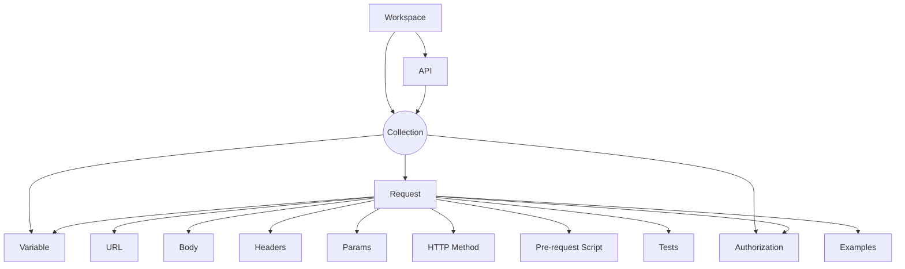

import { PlusButton } from "./assets/PlusButton"

Originally started off as a side project, Postman has become one of the best
tools for collaboratively building APIs. For the longest time I only saw Postman
as a slick tool for executing one-off HTTP requests. But if you dive deeper into
Postman's featureset, it provides amazing capabilities for testing all kinds of
behavior API behavior. Today engineers are using Postman to [run 2,700+ tests on 100's of
APIs on every deploy](https://www.postman.com/case-studies/youi/).  So we
created the <Gradient>ultimate</Gradient> guide on how to use Postman to test
your API. In this guide we will cover optimal workflows and useful features you
have to know to effectively test your API. By the end of this guide you will be
the official "Postman expert" on your team 😎.

 **Lets go!**

## Setup

Goes without being said but you should probably have the Postman app downloaded
[here](https://www.postman.com/downloads/) so you can follow along.

### Example API [Optional]

If you don't have your own API, you can run our toy API implementation to follow
the guide yourself—your welcome.

<details>
<summary>Setup Instructions for Example API</summary>
<div>
The [example API](https://github.com/konfig-dev/fastapi-example) is
written in Python using the [FastAPI](https://fastapi.tiangolo.com/) framework
so we can easily generate an [<Tooltip tip="OpenAPI Specification"
text="OAS"/>](https://swagger.io/specification/). It includes
<Tooltip tip="Create, read, update, and delete" text="CRUD"/> operations on a
fake User database.

<Admonition type="info" title="System Requirements">
    [Python 3.7+](https://www.python.org/downloads/) and
    [Poetry](https://python-poetry.org/docs/) are required to run the example
    API. Refer to the documentation for installation instructions on your
    system.
</Admonition>

To setup the example API run the following script.

```shell
# link[11:55] https://github.com/konfig-dev/fastapi-example
git clone https://github.com/konfig-dev/fastapi-example
cd fastapi-example
./start.sh
```

The example API has 5 operations.

1. `GET` List Users - returns a list of users
2. `GET` Get User - returns the details of a user by ID
3. `POST` Create User - inserts a user into the database
4. `PUT` Update User - updates a user in the database
5. `DELETE` Delete User - removes a user from the database
</div>

</details>

## The Anatomy of Postman

Postman's data model revolves around the concept of a [Collection](https://learning.postman.com/docs/collections/collections-overview/).

According to Postman:

> Postman Collections are a group of saved requests. Every request you send in
> Postman appears under the History tab of the sidebar. On a small scale, reusing
> requests through the history section is convenient. As your Postman usage grows,
> it can be time-consuming to find a particular request in your history. Instead
> of scrolling through your history section, you can save all your requests as a
> group for easier access.

Postman organizes Collections into a
[Workspace](https://learning.postman.com/docs/collaborating-in-postman/using-workspaces/managing-workspaces/)
or
[API](https://learning.postman.com/docs/designing-and-developing-your-api/the-api-workflow/)
as shown by the following diagram.



A collection contains requests and requests contains the URL, path parameters,
query parameters, headers, request body, and method for an HTTP request.

### Workspace

Workspace in a nutshell.

### API

### Collections

### Create a Collection

Click the <PlusButton/> button in the top-left corner to create a Collection.

<VideoPlayer autoplay url="/video/create-collection.mov" />

Collections don't just save your requests. Collections also contains dynamic
variables and authorization settings.

### Using Variables

#### `baseUrl` (Recommended <Flame/>)

We suggest that you always bootstrap your Collection with a variable named
`baseUrl`. Using a single `baseUrl` variable allows you to quickly change
environments and keep your requests <Tooltip tip="Don't Repeat Yourself" text="DRY"/>.

<VideoSection>

1. [Go to "Variables" tab](seek)
1. [Create a variable named "baseUrl"](seek)
1. [Add a request](seek)
1. [Use the curly brace syntax](seek)
1. [Click "Send"](seek)

<VideoPlayer playbackRate={1.2} autoplay url="/video/variables.mov"/>

</VideoSection>

#### What is `Initial value` vs. `Current value`?

You'll notice there is a ["Initial value" and "Current value"
column](https://learning.postman.com/docs/sending-requests/variables/#specifying-variable-detail)
under the "Variables" tab. Values in the `Initial value` are shared with your
Collection while `Current value` is not.

- Use the `Initial value` when storing helpful examples or commonly shared values.
- Use the `Current value` to construct ad-hoc requests.

Sometimes you want to persist

#### Curly Brace Syntax

You can use `{{variable}}` syntax to insert a variable anywhere in your Request.
This is helpful when you have entity IDs or common values that you want to
resuse within your Collection. For example you might be referencing the same
User ID across multiple requests and find yourself continuously copy-pasting it.

#### Scope

Variables have
["Scope"](https://learning.postman.com/docs/sending-requests/variables/#variable-scopes)
which also leads us to the concept of an environment.

### Authorization


## Testing

### Generate Collection from OAS (Bonus<Flame/>)

We recommend generating your collections from an OAS to save time. Postman will
automatically create a `baseUrl` variable and setup Authentication based on your
OAS. It will also bootstrap requests for every request based on the
[schemas](https://spec.openapis.org/oas/v3.1.0#schema-object) in your OAS.

<VideoSection>

1. [Make sure the APIs element is visible on the sidebar](seek) by configuring your sidebar
2. [Create an API and give it a name](seek)
3. [Import your OAS](seek)
4. [Generate a collection from your definition](seek)
4. [Done!](seek)

<VideoPlayer playbackRate={1.2} autoplay url="/video/generate-collection.mov"/>

</VideoSection>

<Admonition type="note">
The generated Collection will live in the "APIs" tab under your OAS definition.
</Admonition>

### Single Request

Often times you will just want to execute a request to test one-off operations.
We suggest that you create a new collection for these one-off operations so they
are separated from collections used for tests.

### Multiple Requests

### Test Scripts

### Idempotency

## Setup Postman and GitHub Actions


