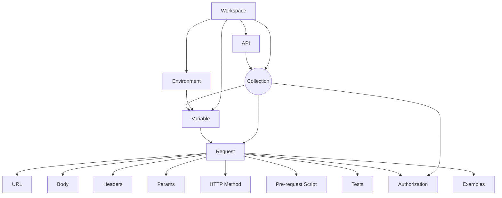
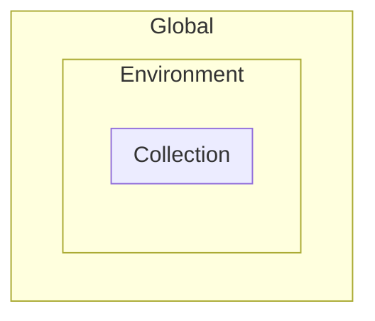
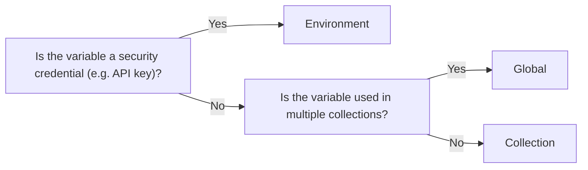
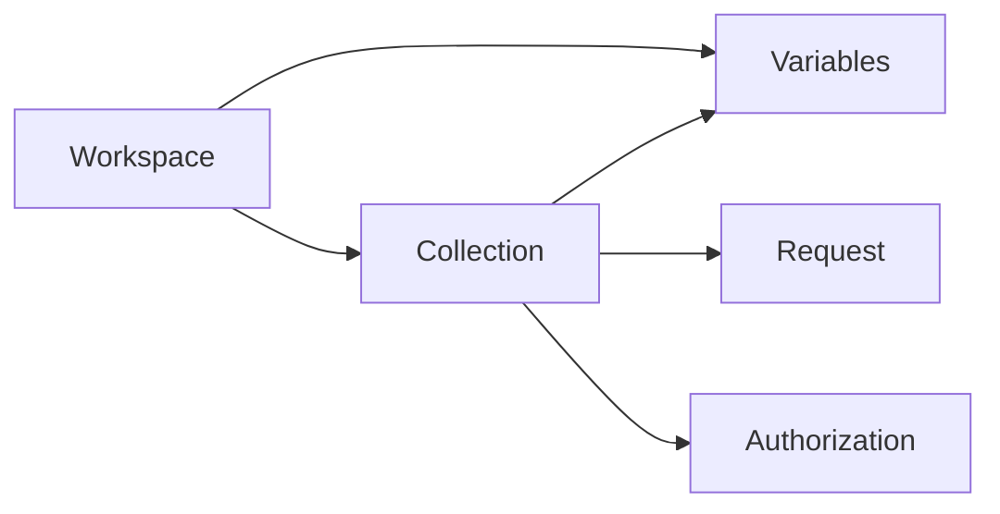

import { PlusButton } from "./assets/PlusButton"
import { DotsButton } from "./assets/DotsButton"

Originally started off as a side project, Postman has become one of the best
tools for collaboratively building APIs and especially provides amazing
capabilities for testing. If you are an organization with disparate engineering
teams looking to be API-first, its imperative that you organize your API design
work into a tool like Postman. Organizing design/testing of your APIs can save
thousands of engineering hours and unnecessary Slack messages.


<Admonition type="note">
There are alternatives to Postman like [Insomnia](https://insomnia.rest/) but
Postman seems to be the the most widely used tool in API-first organizations.
</Admonition>

Today engineers are using Postman to [run 2,700+ tests
on 100's of APIs on every deploy](https://www.postman.com/case-studies/youi/).
So we created the <Gradient>ultimate</Gradient> guide on using postman to test
your API. In this guide we will cover workflows and features you must know to
effectively test your API. By the end of this guide you will be the official
"Postman expert" on your team 😎.

 **Lets go!**

## Setup

Goes without being said but you should probably have the Postman app downloaded
[here](https://www.postman.com/downloads/) so you can follow along. There is a
web client for Postman but we suggest that you download the desktop application
as it feels snappier than the web client.

### Example API [Optional]

If you don't have your own API, you can locally run our simple API
implementation to follow the guide yourself. This guide does assume that you
have an API of basic CRUD complexity (i.e. you can execute read/write operations
to the API to modify state that is persisted in the backend).

<details>
<summary>Setup Instructions for Example API</summary>
<div>
The [example API](https://github.com/konfig-dev/fastapi-example) is
written in Python using the [FastAPI](https://fastapi.tiangolo.com/) framework
so we can easily generate an [<Tooltip tip="OpenAPI Specification"
text="OAS"/>](https://swagger.io/specification/). It includes
<Tooltip tip="Create, read, update, and delete" text="CRUD"/> operations on a
fake User database.

<Admonition type="info" title="System Requirements">
    [Python 3.7+](https://www.python.org/downloads/) and
    [Poetry](https://python-poetry.org/docs/) are required to run the example
    API. Refer to the documentation for installation instructions on your
    system.
</Admonition>

To setup the example API run the following script.

```shell
# link[11:55] https://github.com/konfig-dev/fastapi-example
git clone https://github.com/konfig-dev/fastapi-example
cd fastapi-example
./start.sh
```

The example API has 5 operations.

1. `GET` List Users - returns a list of users
2. `GET` Get User - returns the details of a user by ID
3. `POST` Create User - inserts a user into the database
4. `PUT` Update User - updates a user in the database
5. `DELETE` Delete User - removes a user from the database
</div>

</details>

## The Anatomy of Postman

Lets briefly overview how Postman is organized and go over the basics of making
an request to your API. Postman's data model revolves around the concept of a
[Collection](https://learning.postman.com/docs/collections/collections-overview/).

According to Postman:

> Postman Collections are a group of saved requests. Every request you send in
> Postman appears under the History tab of the sidebar. On a small scale, reusing
> requests through the history section is convenient. As your Postman usage grows,
> it can be time-consuming to find a particular request in your history. Instead
> of scrolling through your history section, you can save all your requests as a
> group for easier access.

This is a pretty high-level explanation of what a Collection. Postman has built
powerful automation features around this flexible and battle-tested data model
for organizing your API requests.

Collections live under a
[Workspace](https://learning.postman.com/docs/collaborating-in-postman/using-workspaces/managing-workspaces/).
A Collection contains requests and a request contains a URL, path parameters,
query parameters, headers, request body, and method for an HTTP request. Here is
a fairly comprehensive visualization of the data model that Postman prescribes.



Thats enough about Postman's data model, **lets jump into real examples.**

### Workspace

At the highest level a Workspace is where you can invite team members and save
your Collections. Create your Workspace to get started.

<VideoSection>
1. [Create a Workspace](seek)
1. [Give it a name and summary and click "Create Workspace"](seek)
1. [Invite a team member](seek) [optional]
<VideoPlayer playbackRate={1.2} autoplay url="/video/workspace.mov" />
</VideoSection>


### Create a Collection

Collections are where all the real work gets done. Click the <PlusButton/>
button in the top-left corner to create a Collection.

<VideoPlayer autoplay url="/video/create-collection.mov" />

### Using Variables

Collections not only save your requests but also store dynamic values called a
[Variable](https://learning.postman.com/docs/sending-requests/variables/).

#### Create a `baseUrl` Variable (Recommended <Flame/>)

Lets create our first variable.

We suggest that you always start out with a Variable named `baseUrl`. Using a
single `baseUrl` variable allows you to quickly configure API environments (e.g.
development, staging, production, etc.) and keep your requests <Tooltip tip="Don't Repeat Yourself"
text="DRY"/>.

<VideoSection>

1. [Go to "Variables" tab](seek)
1. [Create a variable named "baseUrl"](seek)
1. [Add a request](seek)
1. [Use the curly brace syntax](seek)
1. [Click "Send"](seek)

<VideoPlayer playbackRate={1.2} autoplay url="/video/variables.mov"/>

</VideoSection>

<Admonition type="info" title="Variables in Variables">
    Sometimes you need to parameterize your `baseUrl` which is possible using
    the curly brace syntax inside of the Variable's value. For example you might
    have domains based on a "provider" like `aws` or "region" like `us-east-1`.

    

    Its not obvious that this works but it does. But it allows for more powerful
    variables when you need it.
</Admonition>

#### What is "Initial value" vs. "Current value"?

You'll notice there is an "Initial value" and "Current value" column under the
"Variables" tab. This is a convenient feature from Postman that allows you to
save variable values for your teammates while allowing you to make ad-hoc
modifications for your own use-case.

<Figure src="/img/initial-current-value.png" caption="Initial and Current Value"/>

The "Initial value" is shared in your Workspace with collaborators while
"Current value" is kept local to your session.

- Use "Initial value" to store helpful examples (i.e. query example) or commonly
shared values (`baseUrl`)
- Edit the "Current value" for configuring temporary values

<VideoSection>

You can "reset" to set your current values to intial values. To reset all your
current values to initial values at once, [Click the `Reset all` button](seek)
on the right side. To reset a single variable, [Click the `Reset` button](seek).

<VideoPlayer autoplay url="/video/reset-variables.mov"/>

</VideoSection>

<VideoSection>

To persist your current values to initial values, [Click the `Persist all` button](seek)
on the right side. To persist a singel variable, [Click the `Persist` button](seek).

<VideoPlayer autoplay url="/video/persist-variables.mov"/>

</VideoSection>

#### Curly Brace Syntax

To use your variables, Postman provides its own syntax using curly braces. If
you are familiar with templating engines like
[Mustache](https://mustache.github.io/) or
[Handlebars](https://handlebarsjs.com/), this syntax should feel familiar.  Use
the curly brace syntax (e.g. `{{variable}}`) to insert a variable
**anywhere** in your Request.

For example in the URL.


Or as a parameter.


Variables save a lot of time when you have common values amongst multiple
requests in your Collection (e.g. you can quickly change a User ID used across
multiple requests). Try to use to using Variables to organize your values into
one place and allow for easy parameterization of your requests.

#### Scope



Variables live in a
[Scope](https://learning.postman.com/docs/sending-requests/variables/#variable-scopes).
In the last section we made a variable in the scope of a Collection. But
variables can also be added to `Global` and `Environment` scopes. Start adding
variables to the `Global` and `Environment` scope by opening the "Environments"
tab on the left-hand side.


Scopes help define where a Variable is available to use. In general we suggest
putting values used across Collections in the Global scope, security credentials
in the Environment scope, and other variables in the Collections scope.



<VideoSection>

1. [**Global** scope variables are available everywhere in your Workspace](seek)
1. [**Environment** scope variables are available when the environment is active](seek)
    1. [You can configure your Environment by selecting the menu in the top-right corner](seek)
1. [**Collection** scope variables are only available to a Collection](seek)

Here is a demonstration of adding variables to every type of scope.

<VideoPlayer playbackRate={1.4} autoplay url="/video/scope.mov"/>

</VideoSection>


### Authorization

If your API needs authorization you can configure it for your Collection by
going to the "Authorization" tab. **We strongly suggest putting authentication
credentials under an Environment so your teammates can reuse the authentication
credentials if necessary.** Otherwise you will have to keep adding the security
credentials to the Variables of every Collection which can be tedious.

<Admonition type="note">
If you want to avoid persisting credentials, you can leave the "Initial value"
column blank. This way you always set the variable by configuring the "Current
value" column.
</Admonition>

Here is a quick demonstration of configuring Authentication for a Collection.

<VideoSection>

1. [Go to the Collection's Authorization tab](seek)
1. [Configure the Authorization type](seek)
    1. In this case  we need to provide the `X-API-Key` header
1. [Create an Environment Variable for your credentials](seek)
1. [Set the Variable as `secret` so the value is masked on the screen](seek). Setting a variable to `secret` simply makes it masked in the UI.
1. [Ensure that your request is set to `Inherit auth from parent` (i.e. Collection)](seek)
1. [Click `Send` to test your credentials](seek)

<VideoPlayer autoplay url="/video/authorization.mov"/>

</VideoSection>

<Admonition type="info" title="Postman does not support your authentication scheme?">

#### Pre-request Script

If Postman does not natively support your Authorization type then you can use
the ["Pre-request
Script"](https://learning.postman.com/docs/writing-scripts/pre-request-scripts/)
tab to programatically set Environment Variables.

For example you can use the following script to add 3 header values from your
environment variables before any request in your Collection.


<details>
<summary>Copy Code</summary>
```javascript
pm.request.addHeader({ key: "client_id", value: pm.environment.get("CLIENT_ID") })
pm.request.addHeader({ key: "client_secret", value: pm.environment.get("CLIENT_SECRET") })
pm.request.addHeader({ key: "module_secret", value: pm.environment.get("MODULE_SECRET") })
```
</details>

</Admonition>

### Recap



We now understand how a Workspace, Collection, Variables, Authorization,
Pre-request Scripts, and Request are organized in Postman. Without Postman you
would be organizing all of this logic in code in ephemeral scripts that are
bound to get lost in the black hole of a codebase. Instead Postman does a great
job at prescribing how you organize your Requests and provides intuitive UX for
convenience. But Postman goes much farther than just prescribing a way to
organize your requests in the sake of DRYness.

Now that we know the basics lets jump into helpful workflows and features for
testing.

## Testing

Often times you will just want to execute a request to test one-off operations.
We suggest that you organize one-off requests into its own collection so they
are separated from collections used for testing. This way you have a place to
create ephemeral requests without affecting your test suite.

#### Generate Collection from OAS (Recommended<Flame/>)

Generating your collections from an OAS can save a lot of time in bootstrapping
your Collection of one-off requests. Postman will automatically create a
`baseUrl` variable and setup Authentication based on your OAS. It will also
bootstrap requests for every request based on the
[schemas](https://spec.openapis.org/oas/v3.1.0#schema-object) in your OAS. This
is especially helpful if your API is complicated.

<VideoSection>

1. [Make sure the APIs element is visible on the sidebar](seek) by configuring your sidebar
1. [Create an API and give it a name](seek)
1. [Import your OAS](seek)
    1. If you are using our example API then import `openapi.json` from the repository
1. [Generate a collection from your definition](seek)

<VideoPlayer playbackRate={1.2} autoplay url="/video/generate-collection.mov"/>

</VideoSection>

<Admonition type="note">
The generated Collection will live in the "APIs" tab under your OAS definition.
This is slightly confusing as it won't be visible under the "Collections" tab.

If you want you can copy the Collection from your API tab to the Collections tab
by clicking the <DotsButton/> button next to your Collection.
<VideoPlayer playbackRate={1.2} autoplay url="/video/copy-to-collections.mov"/>
</Admonition>

If you don't have an OAS then you can always manually create a Collection and
add requests to it.

### Test Script

By running one-off requests you can visually verify that the response returns
the expected value. This is super helpful for ad-hoc requests when debugging.
But it can be tough to verify a lot of requests at once so Postman allows you to
automate assertions through the use of scripts.

Say we always expect the `GET /users` endpoint to return an list JSON value
(i.e. `Array.isArray(response) == true`). We can write a test script for the
`GET /users` request but going to the `Test` tab and

### Collection Runner

Postman is not only amazing for one-off requests but also for running multiple
requests at once (i.e. a "test"). Postman makes it extremely simple by
organizing sequential requests into a Collection.

Lets create a Collection with sequential requests from scratch.  Using our
[example API](#example-api-optional) we can sequentially run `Get users`,
`Create user`, and `Get users`.

Follow these steps to create your first test suite.

<VideoSection>
1. [Create a new collection](seek) (in this case we are copying the generated collection from the API tab)
1. [Organize requests in the order you want them to be executed by drag and dropping](seek)
1. [Rename requests to something meaningful if you want](seek)
1. [Right click your collection and select "Run collection"](seek)
1. [Enable "Persist responses for a session" to inspect responses](seek)
1. [Click "Run ..."](seek)

<VideoPlayer autoplay playbackRate={1.2} url="/video/test-suite-1.mov"/>
</VideoSection>

##### Adding assertions

Say we want to add an assertion to ensure that after the `Create user` operation is run, the number of users is increased by 1 thereby

To add assertions we will use the "Tests" for a Request. On the right-hand side you will see

`pm.globals.set`


##### `postman.setNextRequest`

##### Looping Requests

#### Use Cases

##### Idempotency

##### Random Data

<Admonition type="info" title="Tip">
#### Console (Helpful<Flame/>)

<VideoSection>

Open the console at the bottom of the window to inspect your requests. This is
especially helpful for debugging <Tooltip tip="Using scripts to dynamically set
parameters" text="programmatic"/> or many requests.

<VideoPlayer autoplay url="/video/console.mov"/>

</VideoSection>
</Admonition>


## Setup Postman and GitHub Actions

### Postman API

### Export Collection

### Public Link

### Pointing to Preview Environment

### `newman`

### Reporters

### Debugging CI


