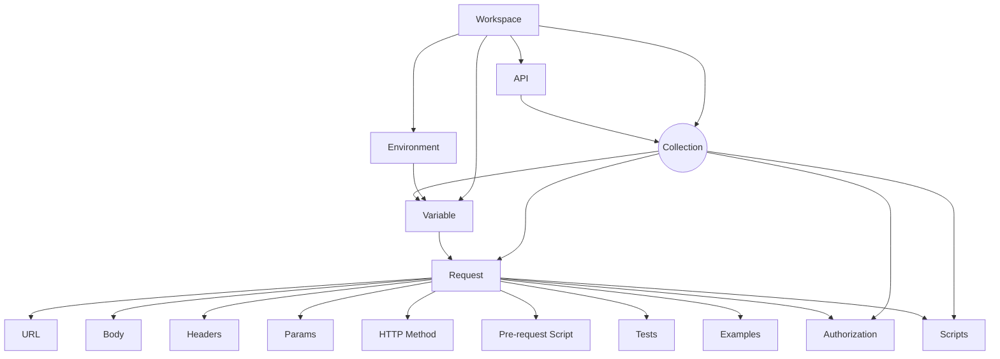

import { PlusButton } from "./assets/PlusButton"
import { DotsButton } from "./assets/DotsButton"

Originally started as a side project, Postman has become one of the best tools
for collaboratively building APIs with over [1.29 billion requests created in
the past
year](https://www.postman.com/state-of-api/api-global-growth/#growing-ecosystem).

[As organizations' investments of time and resources into APIs
increase](https://www.postman.com/state-of-api/outlook-for-apis-and-more/#api-investments-to-climb),
API-first organizations must leverage testing tools like Postman.  Adopting an
API tool is an effective way to save thousands of engineering hours.

<Admonition type="note">
There are alternatives to Postman like [Insomnia](https://insomnia.rest/) and
[Paw](https://paw.cloud/) but [Postman is still the most widely used tool by a
long
margin](https://www.postman.com/state-of-api/tooling-for-apis-and-development/#api-platforms-and-tools).
</Admonition>

Today enterprises like [Salesforce and WhatsApp use Postman to document their
API](https://www.postman.com/state-of-api/api-global-growth/#most-popular-apis)
and engineers are using Postman to [run 2,700+ tests on 100's of APIs on every
deployment](https://www.postman.com/case-studies/youi/).  So we created the
<Gradient>ultimate</Gradient> guide on using Postman to document and test your
API. In this guide, we will cover the fundamentals of Postman and dive into
techniques to effectively document and test your API. This guide also includes
how-tos and explanations in every section. By the end of this guide, you will be
the official "Postman expert" on your team 🦸‍♂️.

 **Lets go!**

## Setup

Goes without being said but you should probably have the Postman app downloaded
[here](https://www.postman.com/downloads/) so you can follow along. There is a
web client for Postman but we suggest downloading the desktop application
because it makes the application easily accessible and keeps you from burying
Postman in your sea of browser tabs.

### Access to an API

This guide is better followed with access to an API of basic <Tooltip tip="Create, read, update, and delete" text="CRUD"/> complexity.

### Example API [Optional]

If you don't have an API, you can locally run our example API implementation to
follow the guide yourself.

<details>
<summary>Setup Instructions for Example API</summary>
<div>
The [example API](https://github.com/konfig-dev/fastapi-example) is written in
Python using the [FastAPI](https://fastapi.tiangolo.com/) framework so we can
easily generate an [OpenAPI Specification](https://swagger.io/specification/).
It includes CRUD operations on a fake User database.

<Admonition type="info" title="System Requirements">
    [Python 3.7+](https://www.python.org/downloads/) and
    [Poetry](https://python-poetry.org/docs/) are required to run the example
    API. Refer to the documentation for installation instructions on your
    system.
</Admonition>

To set up the example API run the following script.

```shell
# link[11:55] https://github.com/konfig-dev/fastapi-example
git clone https://github.com/konfig-dev/fastapi-example
cd fastapi-example
./start.sh
```

The example API has 5 operations.

1. `GET` List Users - returns a list of users
2. `GET` Get User - returns the details of a user by ID
3. `POST` Create User - inserts a user into the database
4. `PUT` Update User - updates a user in the database
5. `DELETE` Delete User - removes a user from the database
</div>

</details>

## Postman Fundamentals

Postman's data model revolves around the concept of a
[tion](https://learning.postman.com/docs/collections/collections-overview/).

According to Postman:

> Postman Collections are a group of saved requests. Every request you send in
> Postman appears under the History tab of the sidebar. On a small scale, reusing
> requests through the history section is convenient. As your Postman usage grows,
> it can be time-consuming to find a particular request in your history. Instead
> of scrolling through your history section, you can save all your requests as a
> group for easier access.

We feel this description doesn't do justice to Collections. Collections are more
than just a place to store saved requests and history. Collections enable
Postman to build all the powerful automation features we will cover in this
guide, and you'll see why in this guide.

#### Anatomy of Postman

Collections live under a
[Workspace](https://learning.postman.com/docs/collaborating-in-postman/using-workspaces/managing-workspaces/).
A Collection contains Requests and a Request contains all the details of an HTTP
Request (e.g. a URL, path parameters, query parameters, headers, request body,
and HTTP method).

<Figure caption="Collection lives at the center of Postman's Data Model">

</Figure>

### Workspace

Every Postman Collection lives under a Workspace. You can invite team members to
a Workspace to collaborate. Create your Workspace to get started.

<VideoSection>
1. [Create a Workspace](seek)
1. [Give it a name and summary and click "Create Workspace"](seek)
1. [Invite a team member](seek) [optional]
<VideoPlayer playbackRate={1.2} autoplay url="/video/workspace.mov" />
</VideoSection>


### Create a Collection

To create a Collection, click the <PlusButton/> button in the top-left corner to
create a Collection.

<VideoPlayer autoplay url="/video/create-collection.mov" />

### Using Variables

Collections can store dynamic values called a
[Variable](https://learning.postman.com/docs/sending-requests/variables/) that
can be used when constructing a Request.  Variables save a lot of time when you
have common values across multiple requests in your Collection. Try to always
use Variables to organize your values into one place and allow for easy
parameterization of your requests.

<Figure src="/img/salesforce-platform-apis-variables.png" caption="The most popular API in the world (Salesforce Platform APIs) has 17 variables configured for convenience (source: https://www.postman.com/state-of-api/api-global-growth/#most-popular-apis)"/>


#### Always Create a `baseUrl` Variable (Recommended <Flame/>)

We suggest that you always start with a Variable named `baseUrl`. Using a
single `baseUrl` variable allows you to quickly configure API environments (e.g.
development, staging, production, etc.) and shorten the URL in your requests.

<VideoSection>

1. [Go to "Variables" tab](seek)
1. [Create a variable named "baseUrl"](seek)
1. [Add a request](seek)
1. [Use the curly brace syntax](seek) to shorten the URL
1. [Click "Send"](seek)

<VideoPlayer playbackRate={1.2} autoplay url="/video/variables.mov"/>

</VideoSection>

<Admonition type="info" title="Variables in Variables">
    Sometimes you need to parameterize your `baseUrl` which is possible using
    the curly brace syntax inside of the Variable's value. For example, you
    might have domains based on a "provider" like `aws` or "region" like
    `us-east-1`.

    

    It's not obvious that this works but it does. But it allows for more powerful
    variables when you need them.
</Admonition>

#### Curly Brace Syntax

You may have noticed that Postman provides a syntax for inserting variables
using curly braces. If you are familiar with templating engines like
[Mustache](https://mustache.github.io/) or
[Handlebars](https://handlebarsjs.com/), this syntax should feel familiar. You
can use the the curly brace syntax (e.g. `{{variable}}`) to insert a variable
**anywhere** in your Request.

For example in the URL.


Or as a path parameter.


#### What is "Initial value" vs. "Current value"?

You also may have noticed there is an "Initial value" and "Current value" column
under the "Variables" tab. This is a convenient feature from Postman that allows
you to save variable values for your teammates.

<Figure src="/img/initial-current-value.png" caption="Initial and Current Value Columns"/>

The "Initial value" is shared in your Workspace with collaborators while
"Current value" is kept local to your session.

- Use "Initial value" to store helpful examples (i.e. query example) or commonly
shared values (`baseUrl`)
- Edit the "Current value" for configuring temporary values

<VideoSection>

You can "reset" to set your current values to initial values. To reset all your
current values to initial values at once, [Click the `Reset all` button](seek)
on the right side. To reset a single variable, [Click the `Reset` button](seek).

<VideoPlayer autoplay url="/video/reset-variables.mov"/>

</VideoSection>

<VideoSection>

To persist your current values to initial values, [Click the `Persist all` button](seek)
on the right side. To persist a single variable, [Click the `Persist` button](seek).

<VideoPlayer autoplay url="/video/persist-variables.mov"/>

</VideoSection>


### Variable Scope


Variables live in a
[Scope](https://learning.postman.com/docs/sending-requests/variables/#variable-scopes).
In the last section, we made a variable in the scope of a Collection. But
variables can also be added to `Global` and `Environment` scopes.

<VideoSection>

Scopes help define where a Variable is available to use.

1. [**Global** scope variables are available everywhere in your Workspace](seek)
1. [**Environment** scope variables are available when the environment is active](seek)
    1. [You can configure your Environment by selecting the menu in the top-right corner](seek)
1. [**Collection** scope variables are only available to a Collection](seek)

<Figure caption="Demonstration of creating Variables in different Scopes">
    <VideoPlayer playbackRate={1.4} autoplay url="/video/scope.mov"/>
</Figure>

</VideoSection>

Generally, you should organize authorization variables in the Environment Scope
and API-specific variables in the Collection Scope. The Global Scope is mainly
used in scripting.

<Figure caption="Rule of thumb on which scope to organize your Variables">

</Figure>

### Authorization

If your API needs authorization you can configure it for your Collection by
going to the "Authorization" tab. **We strongly suggest putting authentication
credentials in an Environment Scope so your teammates can document authorization
requirements and reuse the authentication credentials.** Otherwise you will have
to tediously add the security credentials to the Variables of every Collection.

<Admonition type="note">
If you want to avoid persisting sensitive credentials, you can leave the
"Initial value" column blank. This way you always set the variable by
configuring the "Current value" column.

<Figure src="/img/salesforce-platform-apis-environment-variables.png" caption="Example empty Initial values in the Environment Variables Template for Salesforce Platform APIs"/>

</Admonition>

Here is a quick demonstration of configuring API key Authorization for a Collection.

<VideoSection>

1. [Go to the Collection's Authorization tab](seek)
1. [Configure the Authorization type](seek)
    1. In this case  we need to provide the `X-API-Key` header
1. [Create an Environment Variable for your credentials](seek)
1. [Set the Variable as `secret` so the value is masked on the screen](seek). Setting a variable to `secret` simply makes it masked in the UI.
1. [Ensure that your request is set to `Inherit auth from parent` (i.e. Collection)](seek)
1. [Click `Send` to test your credentials](seek)

<VideoPlayer autoplay url="/video/authorization.mov"/>

</VideoSection>

<Admonition type="info" title="Postman does not support your authentication scheme?">

#### Pre-request Script

If Postman does not natively support your Authorization type then you can use
the ["Pre-request
Script"](https://learning.postman.com/docs/writing-scripts/pre-request-scripts/)
tab under your Collection to programmatically set Environment Variables.

For example, you can use the following script to add 3 header values from your
environment variables. Postman runs the Pre-request script for your Collection
before every Request so these headers will be conveniently applied for every
request.


<details>
<summary>Copy Code</summary>
```javascript
pm.request.addHeader({ key: "client_id", value: pm.environment.get("CLIENT_ID") })
pm.request.addHeader({ key: "client_secret", value: pm.environment.get("CLIENT_SECRET") })
pm.request.addHeader({ key: "module_secret", value: pm.environment.get("MODULE_SECRET") })
```
</details>

</Admonition>

## Recap


Without Postman you would be organizing all of this logic in code in ephemeral
scripts that are bound to get lost in the black hole of a codebase.  Postman
does a great job at prescribing how you organize your Requests and provides an
intuitive UX for your convenience. But Postman goes much further than just
organizing your requests.

Now that we know the basics let's jump into helpful workflows and features for
documentation and testing in <Tooltip tip="Coming soon!" text="part 2"/>.
