import "./assets/openapi.css"

What exactly is an OpenAPI? In this article, we'll cover the problem that
OpenAPI solves and explore its importance in modern software architecture.

As software systems become more interconnected, OpenAPI has emerged as a vital
tool for promoting collaboration and enabling seamless integration between
different applications. Today large API-first companies like
[Stripe](https://github.com/stripe/openapi) and
[Plaid](https://github.com/plaid/plaid-openapi) use OpenAPI so it's no surprise
that OpenAPI is finding widespread adoption.

<Figure src="/img/openapi-google-trends.png" caption={"Google trend on \"openapi\" from 1/1/2017 to 7/10/2023"}/>

{/* TRUNCATE */}

## Understanding APIs

Imagine you're building an application and you need to incorporate services or
information from an external source, such as messaging, financial data, and
payment processing.

```mermaid
flowchart LR
    A[Application] <-.-> W["📱 Messaging?"]
    A <-.-> S["🏦 Financial data?"]
    A <-.-> P["💳 Payment processing?"]
```



How do we integrate these components into our application?  One option is to
build all of this data and payments infrastructure yourself, but that could take
years. Instead, let's leverage API providers like
[Twilio](https://www.twilio.com/en-us), [Plaid](https://plaid.com/), and
[Stripe](https://stripe.com/) to avoid building the infrastructure themselves.

```mermaid
flowchart LR
    A[Application] <--> W["📱 Twilio"]
    A <--> S["🏦 Plaid"]
    A <--> P["💳 Stripe"]
```



Suddenly, our application has access to the necessary data infrastructure and
payment processing capabilities! Developing our application now takes weeks
instead of years 🎉. But not so fast, now we need to integrate the APIs. Okay,
let's start reading the documentation...

Oh no! The APIs you need to integrate are complex and hard to use 😱.

## Introducing OpenAPI

OpenAPI standardizes APIs. It's a specification that provides a structured
approach for designing, building, and documenting APIs, ensuring clarity and
consistency throughout the entire lifecycle. Now that Twilio, Plaid, and Stripe
offer OpenAPI Specifications, developing integrations is a breeze. We are saved 😮‍💨!

```mermaid
flowchart LR
    A[Application] <-->|<a href="https://www.twilio.com/docs/openapi">OpenAPI</a>| W["📱 Twilio"]
    A <-->|<a href="https://github.com/plaid/plaid-openapi">OpenAPI</a>| S["🏦 Plaid"]
    A <-->|<a href="https://github.com/stripe/openapi">OpenAPI</a>| P["💳 Stripe"]
```



[OpenAPI](https://swagger.io/specification/) has come a long way since its
inception as [Swagger](https://swagger.io/specification/v2/). With each
iteration, it has evolved and refined its features, culminating in the latest
version, OpenAPI 3.1, which brings enhanced capabilities and improved support
for modern API design.

<Figure caption="History of versions for Swagger/OpenAPI">

</Figure>

## Key Features and Components of OpenAPI

<CH.Section>

At the core of OpenAPI is a specification that defines the various components
and details of an API, allowing developers to understand and interact with it
effectively. For example, the [title](focus://3), [description](focus://4:6),
[contact information](focus://7:10), [version](focus://11), and [API
URL](focus://12:13).

<Figure caption={<span>Snippet from <a target="_blank" href="https://github.com/stripe/openapi">Stripe's OpenAPI Specification</a></span>}>
<CH.Code>
```yaml stripe.yaml
# Example OpenAPI from Stripe
info:
  title: Stripe API
  description: >-
    The Stripe REST API. Please see https://stripe.com/docs/api for more
    details.
  contact:
    email: dev-platform@stripe.com
    name: Stripe Dev Platform Team
    url: 'https://stripe.com'
  version: '2022-11-15'
servers:
  - url: 'https://api.stripe.com/'
```
</CH.Code>
</Figure>

</CH.Section>

<CH.Section>
But most importantly, OpenAPI specifies [available endpoints and their
operations](focus://1:9), defines [input parameters](focus://10:44) and [expected responses](focus://45:64), includes [practical
examples for better understanding](focus://65:70), and [security requirements for authentication](focus://71:74).
<Figure caption={<span>Snippet from <a target="_blank" href="https://github.com/plaid/plaid-openapi">Plaid's OpenAPI Specification</a></span>}>
<CH.Code rows={25}>
```yaml plaid.yaml
# from ./assets/plaid.yaml
```
</CH.Code>
</Figure>
</CH.Section>

## Benefits and Use Cases of OpenAPI


Embracing OpenAPI brings numerous benefits, including standardized and
well-documented APIs, seamless integration with diverse systems, and automated
code generation, reducing development efforts, and enhancing collaboration.

<Admonition type="info" title="Checkout our code generation tool!">
At Konfig, we [code generate SDKs from OpenAPIs](https://konfigthis.com/) to
help developer integrate APIs even faster.
</Admonition>

OpenAPI has found its home in a wide range of use cases, including building
[scalable microservices
architectures](https://swagger.io/blog/consistent-kubernetes-microservices-with-openapi/),
enabling [generated API documentation](https://docs.readme.com/main/docs/openapi), and fueling the growth
of [API marketplaces](https://enterprise-docs.rapidapi.com/docs/adding-and-updating-openapi-documents) that empower developers with powerful APIs.

## OpenAPI Tools and Ecosystem

With [over 3.5k repositories on
GitHub](https://github.com/search?q=topic%3Aopenapi+&type=repositories) under
the topic `openapi`, the OpenAPI ecosystem is [bustling with handy tools and
frameworks](https://www.openapis.org/blog/2023/03/08/tools-that-support-openapi-specification)
like Swagger UI, ReDoc, and Insomnia, which provide interactive documentation
and API exploration, making API development and consumption a breeze.

<Figure caption="Landscape of popular tools for OpenAPI">

</Figure>

These tools bring OpenAPI documents to life by offering intuitive interfaces,
interactive exploration features, auto-generated documentation, and
auto-generated code, enabling developers to visualize and interact with APIs
effortlessly.

<Figure src="/img/swagger.png" caption="Screenshot of Swagger UI, a visual and interactive API documentation tool"/>

OpenAPI also synergizes with [JSON Schema](https://json-schema.org/), which allows
for detailed data validation and modeling, enhancing the capabilities of OpenAPI
for building robust and accurate APIs. At Konfig, we natively support request
validation in our generated SDKs based to ensure that data errors are caught
earlier in the development process.

## Best Practices for OpenAPI

To make the most of OpenAPI, follow best practices, such as adopting consistent
naming conventions, thoroughly documenting each aspect of your API, ensuring the
OpenAPI document's accuracy, leveraging reusable components, and implementing
robust security measures. To automatically enforce best practices, open-source
tools like [Spectral](https://github.com/stoplightio/spectral) allow you to
define your own rules that [integrates with
VSCode](https://marketplace.visualstudio.com/items?itemName=stoplight.spectral)
and [continuous
integration](https://docs.stoplight.io/docs/spectral/038632fdf0d1a-continuous-integration).

<Admonition type="info" title="Checkout our Linter">
To ensure your OpenAPI Specification is ready for generating high-quality SDKs,
we created a spectral-based [linter](https://konfigthis.com/docs/lint-rules)
with over 30 advanced rules.
</Admonition>

## Conclusion

OpenAPI plays a pivotal role in today's API landscape, bringing standardization,
clarity, and collaboration to API development, enabling developers to build
powerful and interoperable software systems.

For more information, check out the [official OpenAPI
documentation](https://swagger.io/specification/) and explore the [rich
ecosystem of
tools](https://github.com/search?q=topic%3Aopenapi+&type=repositories).

