{/* <Admonition type="danger" title="Strong Opinions incoming!">

This post highlights opinions with heavy vulgar 😳

</Admonition>

Ask any developer, do you prefer GraphQL or REST? It will likely spark an
opinionated conversation which can often devolve into vulgar opinions instead of
matter-of-facts. Developers often find themselves entangled in discussions about
the merits of each approach, but like any engineering decision, **there are no
one-size-fits-all solutions**. This post aims to dissect the coexistence of
GraphQL and REST, highlighting the practical tradeoffs that shape this dynamic
landscape.

To be "sciency", I reviewed thousands of discussions on YouTube, Reddit, Hacker
News, and Blog Posts. I then collected, categorized, and analyzed the top
discussions.  Here are my findings.

<Admonition type="note">
**For this post, I wanted to make 100% sure that the tone of this article
is neutral and unbiased. I am not trying to promote one over the other. At
Konfig, we use GraphQL in our internal APIs but also build on the REST-focused
OpenAPI and standards.**
</Admonition>

## Briefly about GraphQL and REST

[GraphQL](https://graphql.org/) and
[REST](https://en.wikipedia.org/wiki/Representational_state_transfer) are two
different approaches to building APIs. GraphQL is a query language for APIs and
a runtime for fulfilling those queries with your existing data. REST is an
architectural style for building APIs. REST is not a standard, but rather a set
of constraints that define how the server and client should communicate. REST is
often implemented using HTTP.

*/}

To understand the GraphQL vs. REST debate, I went to the places where developers
like to discuss these sorts of topics: YouTube, Reddit, Twitter, and Hacker
News. I parsed thousands of discussions and organized my findings in this
article. I did my best to make sure only to curate thought-provoking
discussions.

<Figure caption='Funnel for gathering through-provoking discussions'>
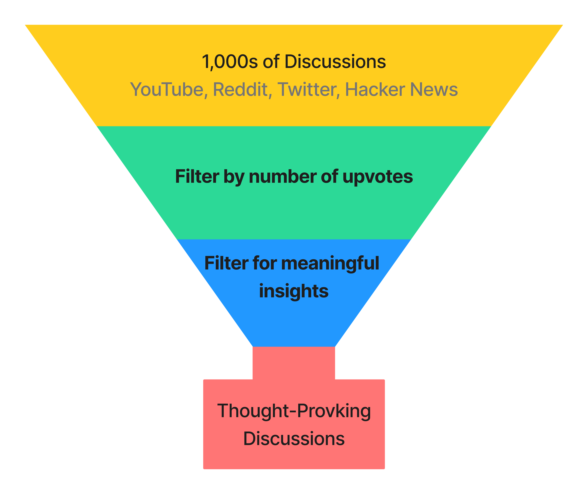
</Figure>

I then took the discussions to a whiteboard, categorized them into "Pro GraphQL", "Pro REST", or "Neutral", and clustered them into perspectives. Each
section in this post will highlight a perspective along with the relevant
discussions. Finally, I chose to highlight blog posts from GitHub and Shopify
that serve as useful case studies in this debate.

<Figure caption={
<a href="https://www.figma.com/figjam/">FigJam</a> I used to organize my discussion. Blue is "GraphQL", yellow is "REST", and green is "Neutral".
}>
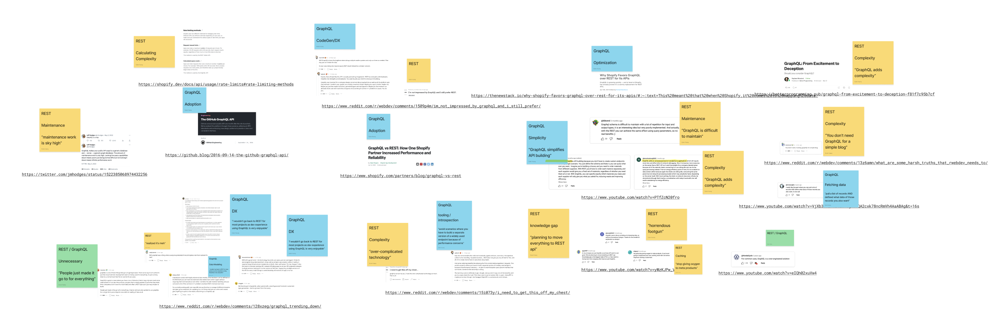
</Figure>

## Neutral Perspectives

To start, I think it's important to highlight the neutral perspectives. In my
opinion, these are the ones that hold the most truth in that they acknowledge
the tradeoffs of each approach. They are also the rarest opinions to find since
most developers are stubborn in their ways.

{/* TRUNCATE */}

### Perspective: GraphQL is great for some use cases, but not all

<Carousel.Wrapper>
    <Carousel.Slide>
        <Figure caption={Source: <a href="https://www.youtube.com/watch?v=eIQh02xuVw4">YouTube</a>}>
            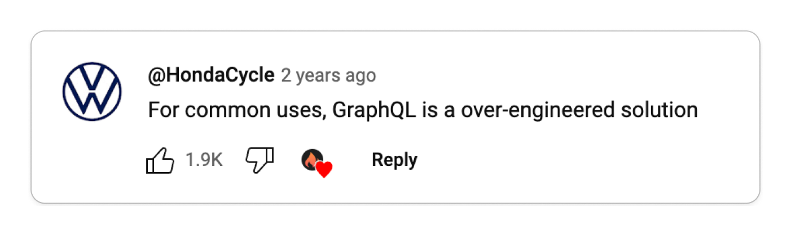
        </Figure>
    </Carousel.Slide>
    <Carousel.Slide>
        <Figure caption={Source: <a href="https://www.reddit.com/r/webdev/comments/128xzeg/graphql_trending_down/">Reddit</a>}>
            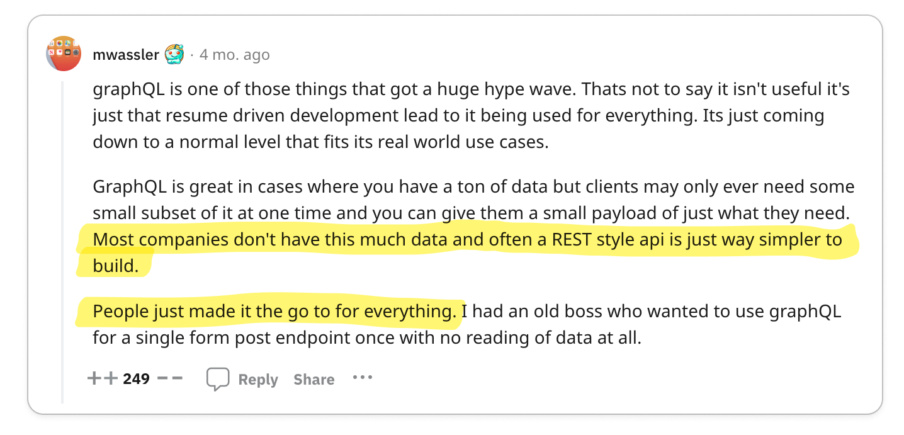
        </Figure>
    </Carousel.Slide>
    <Carousel.Slide>
        <Figure caption={Source: <a href="https://www.reddit.com/r/webdev/comments/1509p4m/im_not_impressed_by_graphql_and_i_still_prefer/">Reddit</a>}>
            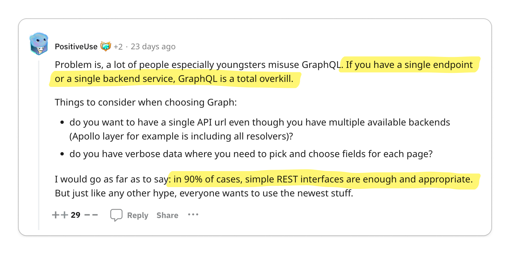
        </Figure>
    </Carousel.Slide>
</Carousel.Wrapper>

#### Key Takeaway 🔑

GraphQL is great for highly relational data models and large teams with enormous scaling problems, but it's not a silver bullet.

GraphQL was born out of the need to solve a specific problem at Facebook.
Specifically [the migration of Facebook's newsfeed functionality from the web to
mobile](https://engineering.fb.com/2015/09/14/core-data/graphql-a-data-query-language/).

Because Facebook has contributed [so many great projects to open
source](https://opensource.fb.com/), it's easy for engineers to blindly adopt
the latest and greatest from Facebook in hopes it will help you preemptively
solve scaling problems. But as always, you have to understand the problem you
are solving to make the right technical decision for your team or you risk
over-engineering your solution.

### Perspective: The benefits of GraphQL are great, but difficult to implement in practice

<Carousel.Wrapper>
    <Carousel.Slide>
        <Figure caption={Source: <a href="https://news.ycombinator.com/item?id=32366759">Hacker News</a>}>
            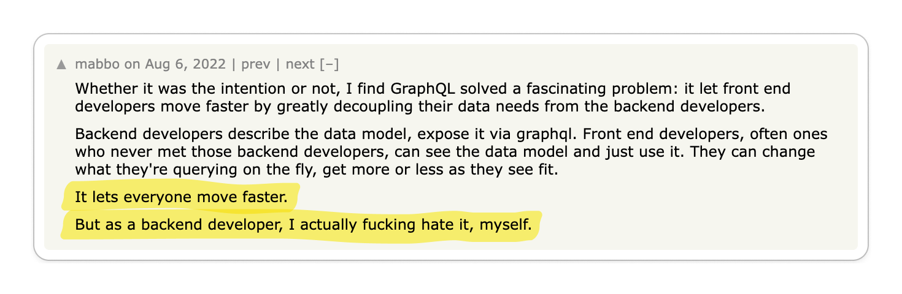
        </Figure>
    </Carousel.Slide>
    <Carousel.Slide>
        <Figure caption={Source: <a href="https://news.ycombinator.com/item?id=25014582">Hacker News</a>}>
            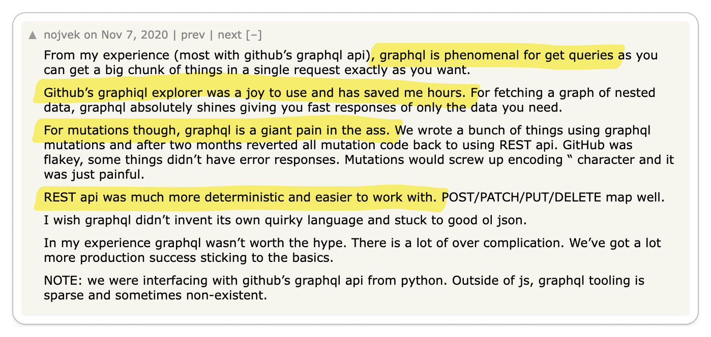
        </Figure>
    </Carousel.Slide>
    <Carousel.Slide>
        <Figure caption={Source: <a href="https://news.ycombinator.com/item?id=32366759">Hacker News</a>}>
            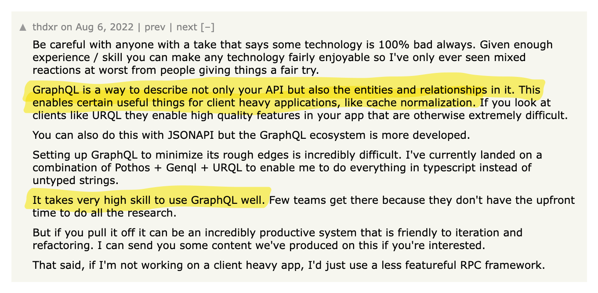
        </Figure>
    </Carousel.Slide>
    <Carousel.Slide>
        <Figure caption={Source: <a href="https://www.reddit.com/r/webdev/comments/128xzeg/graphql_trending_down/">Reddit</a>}>
            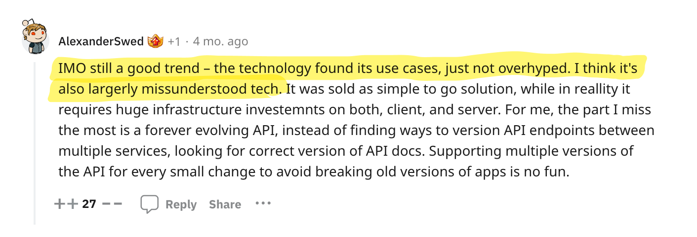
        </Figure>
    </Carousel.Slide>
    <Carousel.Slide>
        <Figure caption={Source: <a href="https://twitter.com/mattknox/status/1522641060341579776">Twitter</a>}>
            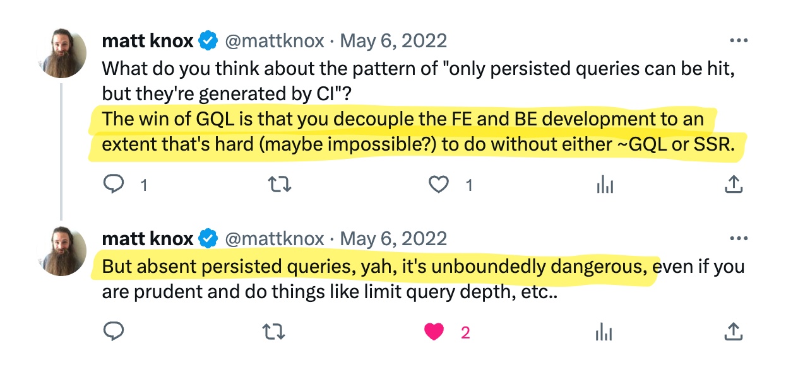
        </Figure>
    </Carousel.Slide>
</Carousel.Wrapper>

#### Key Takeaway 🔑

To successfully implement GraphQL at scale, a high level of skill is required to
ensure optimal performance.

In practice, GraphQL provides an exceptional
interface for frontend and API consumers, enabling them to query and explore the
API efficiently. However, it does shift a significant portion of complexity to
the backend. For instance, in the absence of [persisted
queries](https://www.apollographql.com/docs/apollo-server/performance/apq/),
GraphQL exposes an interface that can be potentially hazardous, allowing
unbounded query requests to your API. Have a public GraphQL API? Then you are forced to rate limit
by calculating [query complexity, like
Shopify](https://shopify.engineering/rate-limiting-graphql-apis-calculating-query-complexity).
Without access to skilled engineers and the resources for substantial
infrastructure investment, GraphQL can become a recipe for disaster when it
comes to scalability.

Nonetheless, when executed correctly, GraphQL can bring immense benefits to
client-heavy applications, offering tools like
[GraphiQL](https://github.com/graphql/graphiql) for interactive query
exploration, [cache normalization with
urql](https://formidable.com/open-source/urql/docs/) for efficient data
management, and the ability to create granular queries without much hassle.
Without GraphQL, incorporating these features would demand a significant amount
of effort.

REST doesn't share these scalability challenges to the same
extent, as backend developers can pinpoint performance issues to specific
endpoints. Developers can also rely on the mature and well-defined HTTP
specification that existing infrastructure is already equipped to handle.

## Pro REST Perspectives

REST APIs have been around for decades. Much of the world's networking
infrastructure is built on the HTTP standard, so it's no surprise that REST
enjoys substantial support. However, similar to how
[SOAP](https://en.wikipedia.org/wiki/SOAP) was eventually [overtaken by
REST](https://stackify.com/soap-vs-rest/#:~:text=SOAP%20was%20long%20the%20standard,primary%20differences%20between%20SOAP%20vs.),
GraphQL now poses a challenge to REST. As with any technological shift, there
will always be those who express skepticism.

### Perspective: GraphQL is not worth the complication

<Carousel.Wrapper>
    <Carousel.Slide>
    <Figure caption={Source: <a href="https://www.reddit.com/r/webdev/comments/13z6amn/what_are_some_harsh_truths_that_rwebdev_needs_to/">Reddit</a>}>
    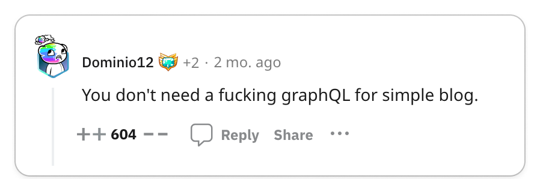
    </Figure>
    </Carousel.Slide>
    <Carousel.Slide>
    <Figure caption={Source: <a href="https://www.youtube.com/watch?v=PTfZcN20fro">YouTube</a>}>
    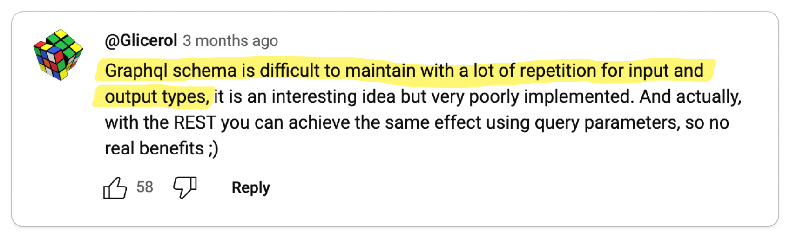
    </Figure>
    </Carousel.Slide>
    <Carousel.Slide>
    <Figure caption={Source: <a href="https://www.youtube.com/watch?v=yWzKJPw_VzM">YouTube</a>}>
    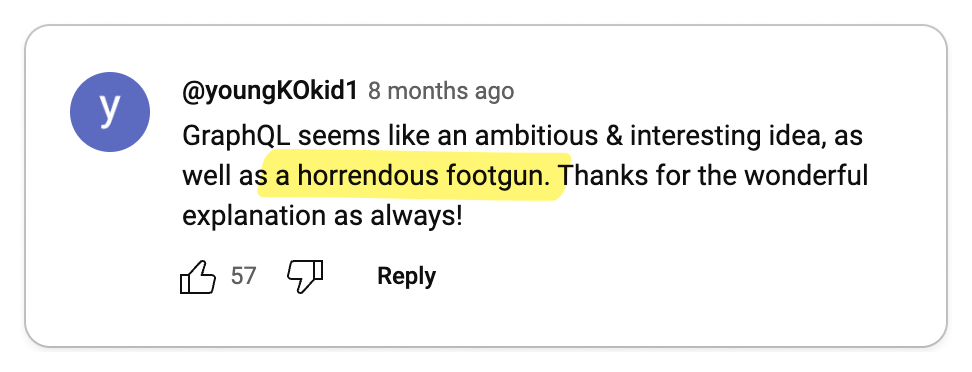
    </Figure>
    </Carousel.Slide>
    <Carousel.Slide>
    <Figure caption={Source: <a href="https://twitter.com/jmhodges/status/1522387231033335808">Twitter</a>}>
    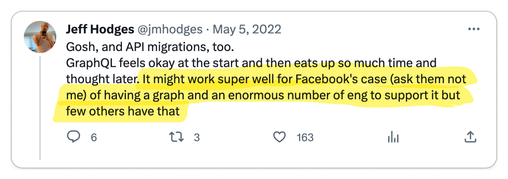
    </Figure>
    </Carousel.Slide>
    <Carousel.Slide>
    <Figure caption={Source: <a href="https://news.ycombinator.com/item?id=32366759">Hacker News</a>}>
    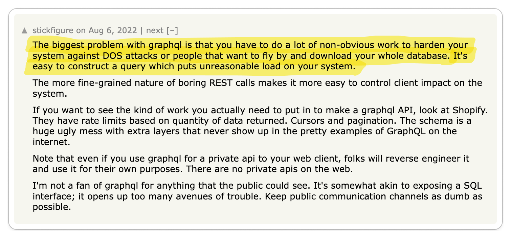
    </Figure>
    </Carousel.Slide>
    <Carousel.Slide>
    <Figure caption={Source: <a href="https://www.youtube.com/watch?v=yWzKJPw_VzM">YouTube</a>}>
    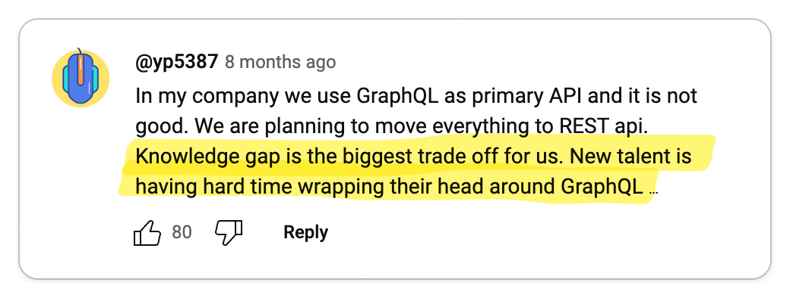
    </Figure>
    </Carousel.Slide>
    <Carousel.Slide>
    <Figure caption={Source: <a href="https://news.ycombinator.com/item?id=25014582">Hacker News</a>}>
    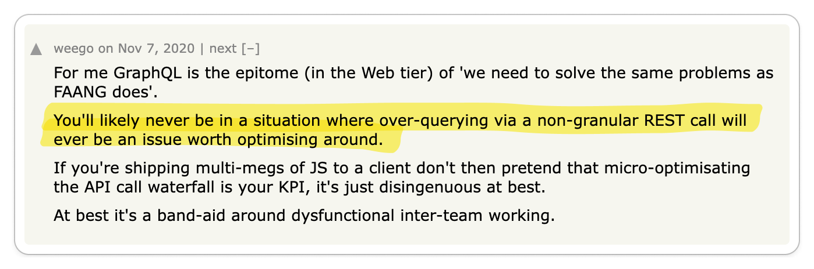
    </Figure>
    </Carousel.Slide>
    <Carousel.Slide>
    <Figure caption={Source: <a href="https://www.reddit.com/r/webdev/comments/15i073y/i_need_to_get_this_off_my_chest/">Reddit</a>}>
    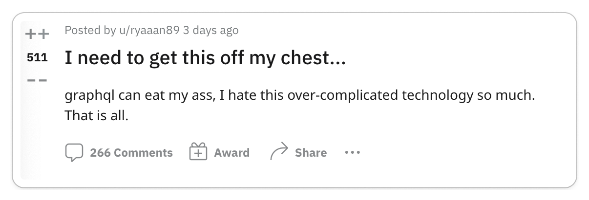
    </Figure>
    </Carousel.Slide>
    <Carousel.Slide>
    <Figure caption={Source: <a href="https://news.ycombinator.com/item?id=32366759">Hacker News</a>}>
    
    </Figure>
    </Carousel.Slide>
    <Carousel.Slide>
    <Figure caption={Source: <a href="https://news.ycombinator.com/item?id=19147742">Hacker News</a>}>
    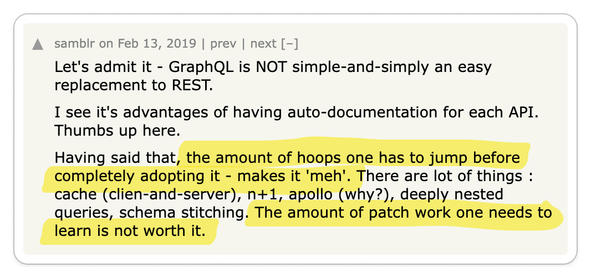
    </Figure>
    </Carousel.Slide>
    <Carousel.Slide>
    <Figure caption={Source: <a href="https://www.reddit.com/r/webdev/comments/128xzeg/graphql_trending_down/">Reddit</a>}>
    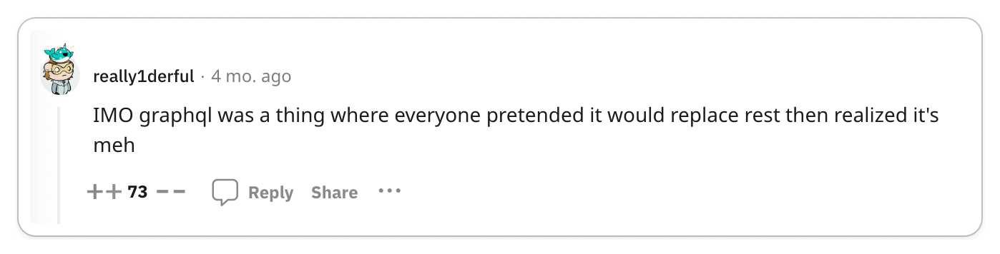
    </Figure>
    </Carousel.Slide>
    <Carousel.Slide>
    <Figure caption={Source: <a href="https://www.youtube.com/watch?v=PTfZcN20fro">YouTube</a>}>
    
    </Figure>
    </Carousel.Slide>
</Carousel.Wrapper>

#### Key Takeaway 🔑

GraphQL is complicated.

A few features that are simple to implement with REST instantly become a huge
pain with GraphQL:

- Access control
- Rate limiting
- Caching
- [DOS](https://en.wikipedia.org/wiki/Denial-of-service_attack) protection
- Using Maps/Tables/Dictionaries
- [N + 1 Problem](https://stackoverflow.com/questions/97197/what-is-the-n1-selects-problem-in-orm-object-relational-mapping)

The complexity that arises from adopting GraphQL can sometimes outweigh its benefits for most engineering teams.
Does your organization have a substantial budget allocated for engineers?
Is your data model extremely relational? Is
your API catering to a vast user base? Do all your engineers possess a proficient understanding of GraphQL? If not, you probably shouldn't be adopting
GraphQL for its flexible query language.

Entire companies like [Stellate](https://stellate.co/) and
[Apollo](https://www.apollographql.com/) were born out of the need to solve these arguably over-complicated characteristics of GraphQL.

### Perspective: GraphQL is not an optimization

<Carousel.Wrapper>
    <Carousel.Slide>
    <Figure caption={Source: <a href="https://twitter.com/jmhodges/status/1522385068974432256">Twitter</a>}>
    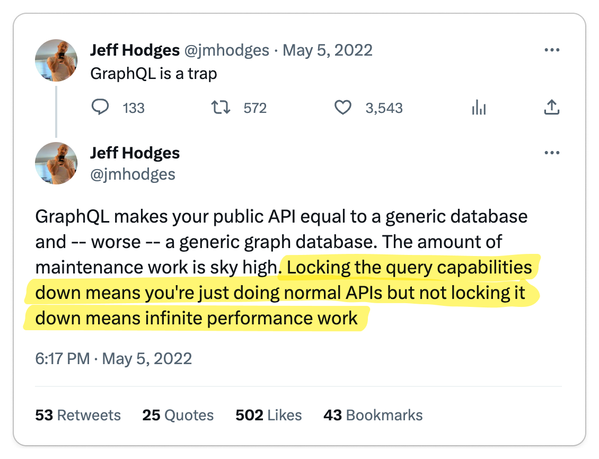
    </Figure>
    </Carousel.Slide>
    <Carousel.Slide>
    <Figure caption={Source: <a href="https://betterprogramming.pub/graphql-from-excitement-to-deception-f81f7c95b7cf">betterprogramming.hub</a>}>
    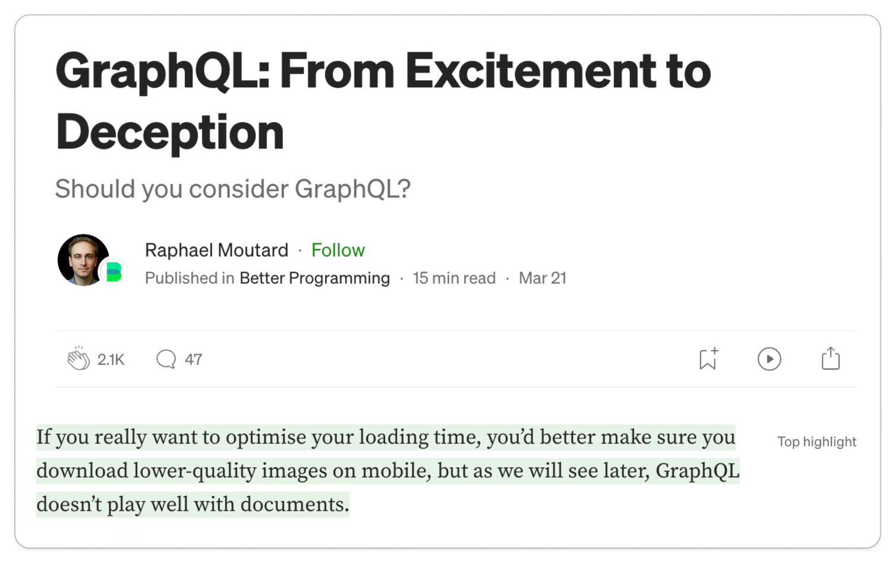
    </Figure>
    </Carousel.Slide>
    <Carousel.Slide>
    <Figure caption={Source: <a href="https://news.ycombinator.com/item?id=32366759">Hacker News</a>}>
    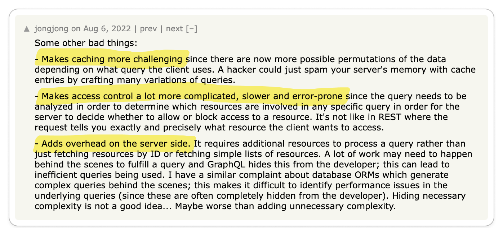
    </Figure>
    </Carousel.Slide>
    <Carousel.Slide>
    <Figure caption={Source: <a href="https://www.youtube.com/watch?v=yWzKJPw_VzM">YouTube</a>}>
    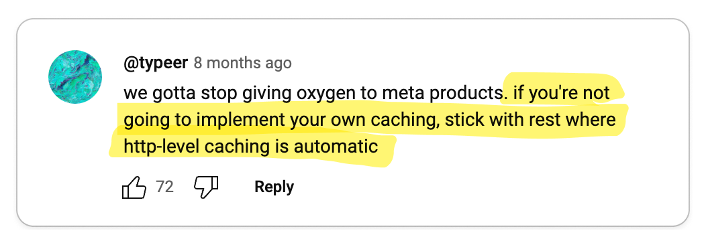
    </Figure>
    </Carousel.Slide>
</Carousel.Wrapper>

#### Key Takeaway 🔑

GraphQL is not an automatic performance optimization.

If your team faces similar challenges as Facebook, feel free to focus on
optimizing your API layer. Otherwise, there are likely other optimizations you
can implement for your application beyond the query layer.

Despite its flexible query language, GraphQL can become a performance
bottleneck. Writing a query that slows down your API is quite easy. Even
seemingly simple tasks like optimized DB queries, precise access control, query complexity analysis, and HTTP-level caching are not only complex to implement
but also introduce additional overhead to your server.

GraphQL does not inherently enhance the speed of your API. The responsibility to
optimize your API performance still rests on your shoulders.

## Pro GraphQL Perspectives

Despite the naysayers, GraphQL has still captured the workflows of thousands of
developers. The experiences of using GraphQL are undeniable, and it's easy to
see why so many developers are excited about it.

### Perspective: GraphQL has an amazing developer experience

<Carousel.Wrapper>
    <Carousel.Slide>
    <Figure caption={Source: <a href="https://news.ycombinator.com/item?id=32366759">Hacker News</a>}>
    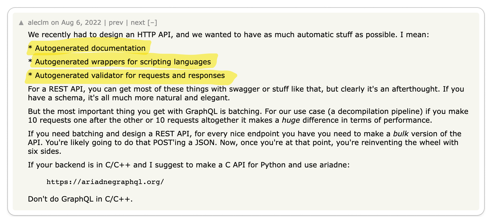
    </Figure>
    </Carousel.Slide>
    <Carousel.Slide>
    <Figure caption={Source: <a href="https://www.youtube.com/watch?v=PTfZcN20fro">YouTube</a>}>
    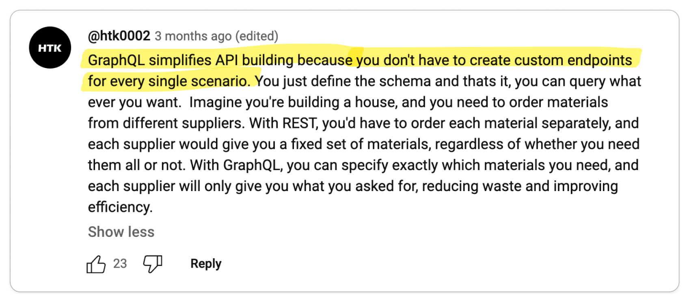
    </Figure>
    </Carousel.Slide>
    <Carousel.Slide>
    <Figure caption={Source: <a href="https://news.ycombinator.com/item?id=19147742">Hacker News</a>}>
    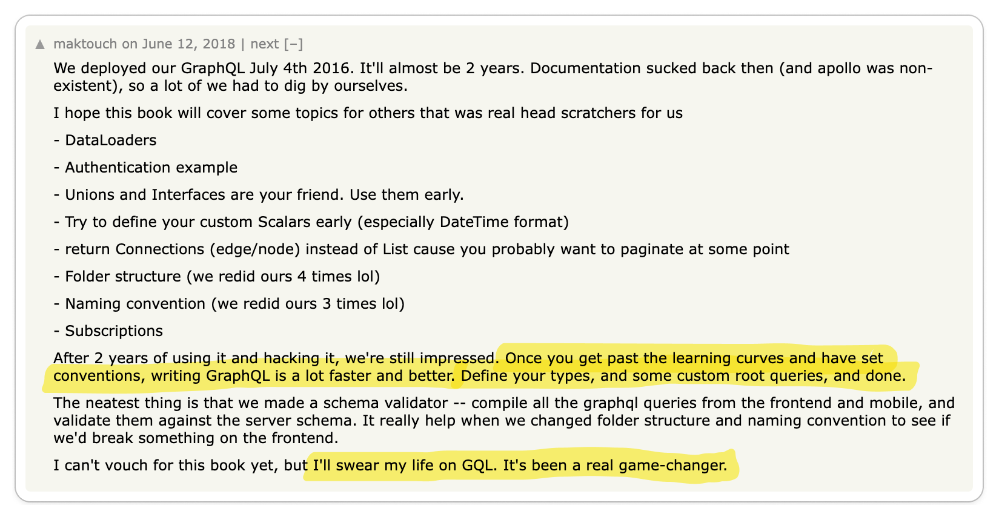
    </Figure>
    </Carousel.Slide>
    <Carousel.Slide>
    <Figure caption={Source: <a href="https://news.ycombinator.com/item?id=25014582">Hacker News</a>}>
    
    </Figure>
    </Carousel.Slide>
    <Carousel.Slide>
    <Figure caption={Source: <a href="https://www.reddit.com/r/webdev/comments/128xzeg/graphql_trending_down/">Reddit</a>}>
    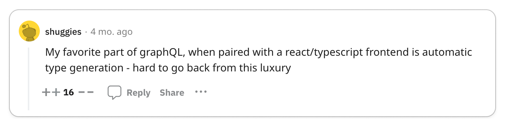
    </Figure>
    </Carousel.Slide>
    <Carousel.Slide>
    <Figure caption={Source: <a href="https://www.youtube.com/watch?v=VjXb3PRL9WI&lc=UgxvVQA2cxk78ncRmVh4AaABAg">YouTube</a>}>
    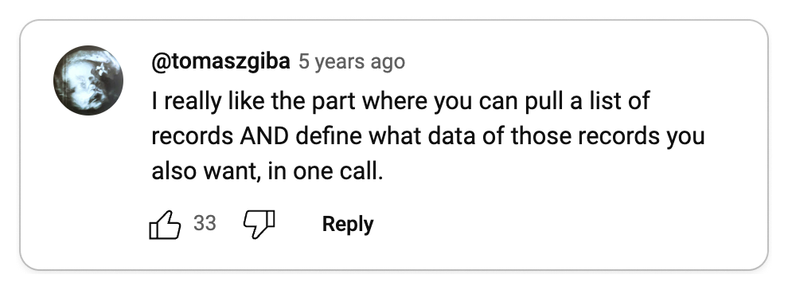
    </Figure>
    </Carousel.Slide>
    <Carousel.Slide>
    <Figure caption={Source: <a href="https://www.reddit.com/r/webdev/comments/1509p4m/im_not_impressed_by_graphql_and_i_still_prefer/">Reddit</a>}>
    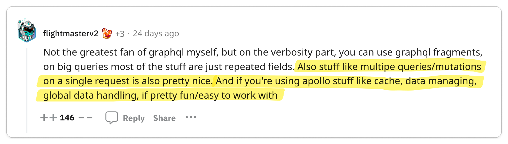
    </Figure>
    </Carousel.Slide>
    <Carousel.Slide>
    <Figure caption={Source: <a href="https://www.reddit.com/r/webdev/comments/128xzeg/graphql_trending_down/jemy0ig/?context=3">Reddit</a>}>
    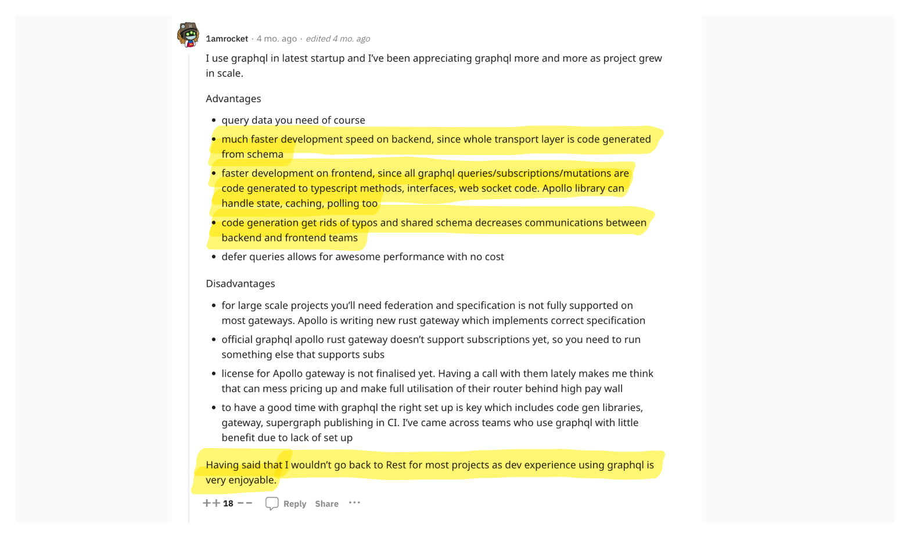
    </Figure>
    </Carousel.Slide>
    <Carousel.Slide>
    <Figure caption={Source: <a href="https://www.reddit.com/r/webdev/comments/128xzeg/graphql_trending_down/">Reddit</a>}>
    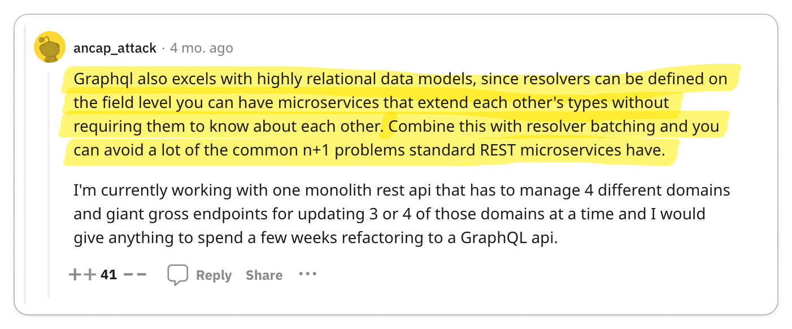
    </Figure>
    </Carousel.Slide>
</Carousel.Wrapper>

#### Key Takeaway 🔑

Developers prioritize developer experience.

Ask any developer you know; developer experience is the key to unlocking
productivity. The GraphQL community has undoubtedly prioritized developer
experience for users. Check out the [abundant and growing ecosystem of
tools](https://graphql.org/code/) available for free. I'm impressed with [The
Guild](https://the-guild.dev/) and their work on building a comprehensive
GraphQL suite of tools.

From documentation and client generators to data validation, server
implementations, and API gateways, mature open-source projects cover it all. The
caveat is that Node.js/JavaScript is the most popular language for GraphQL,
resulting in differing levels of support for other languages. However, this
situation is rapidly changing.

Because GraphQL mandates the creation of an API schema, unlike REST, code
generation stands out as a prominent feature among most GraphQL technology
stacks. This significantly benefits developers by reducing the amount of
boilerplate code they need to write. The ability to generate code from "front to
back" is a game-changer for rapid development. While the REST ecosystem is
progressing, it took a back seat for many years until [OpenAPI](/blog/openapi)
emerged.

Whether in small or large-scale software systems, GraphQL addresses a crucial
aspect of the developer experience problem like never before. Personally, I
believe this is a significant factor contributing to GraphQL's current traction.
The compelling developer experience offered by GraphQL often leads people to
overlook the tradeoffs.

### Perspective: GraphQL has proven itself in the largest organizations

<Carousel.Wrapper>
</Carousel.Wrapper>

You can't ignore the use of GraphQL in hyper-scale organizations like Facebook,
GitHub, and Shopify.

There are clear case studies for GraphQL in some of the largest engineering organizations in the world.

## Conclusion

In most cases, for GraphQL to effectively address the problems it was originally
designed to solve, a team should ideally possess a considerable number of
developers, and their API should handle traffic at a "unicorn scale." Most
likely it's not necessary to overly concern yourself with such extensive
scalability, as the complexity involved might not be justified. Notable giants
like Twilio and Stripe, for instance, have not yet integrated GraphQL into their
public APIs despite being well beyond unicorn status.

Nevertheless, if you have a workflow that takes advantage of the remarkable
developer experience offered by GraphQL, then by all means, embrace it! Just
ensure that you are fully aware of the tradeoffs involved. Ultimately, the most
suitable choice for most teams is whatever enables faster development.

I would avoid the complications of GraphQL and take advantage of the
[growing OpenAPI ecosystem](/blog/openapi#openapi-tools-and-ecosystem).