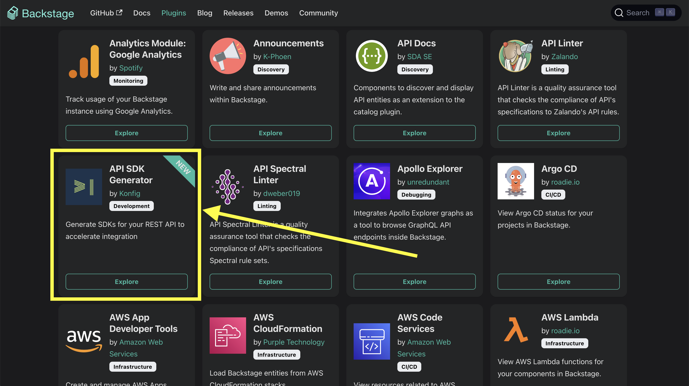
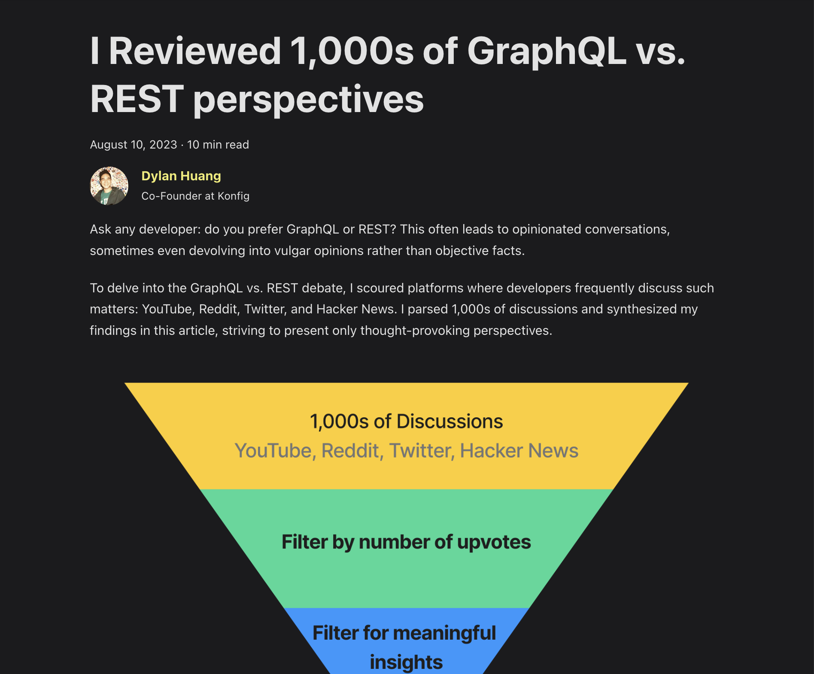

Last week we merged our plugin into [Backstage](https://backstage.io/) ([Pull
Request](https://github.com/backstage/backstage/pull/19261)) to generate SDKs
for internal services. For those that love to follow and discuss technology, we
also published a [blog post](/blog/graphql-vs-rest) where Dylan reviewed 1,000s
of GraphQL vs. REST perspectives. We also made a lot of improvements to our
Python, TypeScript, and PHP SDK generators.

### Backstage Plugin

SDKs help onboard external developers but we know that the same problem exists
inside organizations when integrating APIs from different teams owning different
services. [Backstage](https://backstage.io/) is a developer portal for
centralizing your infrastructure and enabling product teams to quickly ship
high-quality code. So we created a Backstage plugin to auto-generate SDKs for
internal API services. If you are interested in generating SDKs for your
internal APIs [please reach out to us and we would love to
talk](https://calendly.com/dylan-konfig/meet). Check out our official plugin
[here](https://github.com/konfig-dev/backstage-plugin-konfig/tree/main/plugins/backstage-plugin-konfig)!

<Figure caption="Backstage Plugin Marketplace with our official SDK generation plugin">

</Figure>

### Blog Post: I Reviewed 1,000s of GraphQL vs. REST Perspectives

Ask any developer: do you prefer GraphQL or REST? This often leads to
opinionated conversations, sometimes even devolving into vulgar opinions rather
than objective facts. To delve into the GraphQL vs. REST debate, I scoured
platforms where developers frequently discuss such matters: YouTube, Reddit,
Twitter, and Hacker News. I parsed 1,000s of discussions and synthesized my
findings in this blog post, striving to present only thought-provoking
perspectives. Read more [here](/blog/graphql-vs-rest)!

<Figure caption="I reviewed 1,000s of GraphQL vs. REST Perspectives in our latest blog post Improvements and Fixes (there are lots of them this past two weeks!)">

</Figure>

Improvements and Fixes

 - Konfig CLI now gives a warning to update to the latest version
 - Added ["changeset"](https://www.npmjs.com/package/konfig-cli#konfig-changeset) command for Konfig CLI to automate SDK generation using GitHub actions
 - When running "konfig generate", if "specInputPath" is set then "konfig fix" is also executed
 - Fix generated documentation referring to non-existent response variable in Python SDK
 - Konfig CLI now always runs a mock server when running "konfig test"
 - Custom package.json scripts can be added to TypeScript SDK using konfig.yaml
 - Fix bug in Python SDK where unexpected keyword argument error is thrown when attaching extra properties to request bodies inside a customized SDK
 - Add label to top-level README to differentiate SDKs that have PHP 7+ or PHP 8+ support (see SDK table in [example README](https://github.com/passiv/snaptrade-sdks))
 - Reference OpenAPI "tag" instead of "class" inside operation table in generated TypeScript SDK README
 - Add flag "useDescriptionInOperationTableDocumentation" to konfig.yaml for TypeScript SDK to use "description" instead of "summary" field from operation in generated operation table for README.md
 - Fix "ReadableStream" not defined in TypeScript SDK when API error is encountered in Node.js
 - Improve PHP 7+ support option
 - Error is now thrown if "topLevelOperations" references an operation ID that does not exist in the OAS
 - Fix bug where required path parameter causes syntax issue in Python SDK
 - Fix bug where dictionaries in generated Python SDK documentation was using "=" instead of ":" for dict values
 - Add ["konfig published"](https://www.npmjs.com/package/konfig-cli#konfig-published) command for listing all currently published SDKs
 - Add ["konfig lint-python"](https://www.npmjs.com/package/konfig-cli#konfig-lint-python) command to run Ruff linter on Python SDK
 - Fix bug in Python SDK where "_headers" is undefined
 - Handle generators listed under "additionalGenerators" when using "konfig bump"

