import Head from '@docusaurus/Head';

<Head>
  <title>I Reviewed 1,000s of Opinions on Serverless</title>
  <meta property="og:title" content="I Reviewed 1,000s of Opinions on Serverless"/>
</Head>

From DHH [shunning
serverless](https://world.hey.com/dhh/don-t-be-fooled-by-serverless-776cd730),
Ahrefs [saving millions by using a cloud
provider at all](https://tech.ahrefs.com/how-ahrefs-saved-us-400m-in-3-years-by-not-going-to-the-cloud-8939dd930af8),
to Amazon [raining fire on their own serverless
product](https://www.primevideotech.com/video-streaming/scaling-up-the-prime-video-audio-video-monitoring-service-and-reducing-costs-by-90),
serverless has recently faced significant scrutiny.

But still, everyone and their pet goldfish seem to be creating a serverless runtime (see
[Bun](https://oven.sh/), [Deno](https://deno.com/deploy),
[Pydantic](https://pydantic.dev/announcement/#2-the-plan),
[Cloudflare](https://workers.cloudflare.com/),
[Vercel](https://vercel.com/features/edge-functions),
[Serverless](https://www.serverless.com), [Neon](https://neon.tech/),
[Planetscale](https://planetscale.com/), [Xata](https://xata.io/),
[FaunaDB](https://fauna.com/), [Convex](https://www.convex.dev/),
[Supabase](https://supabase.com/edge-functions), [Hasura](https://hasura.io/), [Banana](https://www.banana.dev/),
and literally hundreds more). One research paper from Berkeley even claimed:

> Serverless computing will become the default computing paradigm of the Cloud Era, largely
> replacing serverful computing and thereby bringing closure to the Client-Server Era.
>
> -- [Cloud Programming Simplified: A Berkeley View on Serverless Computing](https://www2.eecs.berkeley.edu/Pubs/TechRpts/2019/EECS-2019-3.pdf)

Is it all hype? Is there real 100% objective merit to it? Where
does serverless excel? Where do the trade-offs make sense?

To understand how developers are receiving serverless, I went to where
developers live: Reddit, Twitter, Hacker News, and YouTube. I parsed 1,000s of
discussions and synthesized my findings in this article, striving to present
only thought-provoking opinions.

<Figure caption='Funnel for gathering through-provoking opinions'>
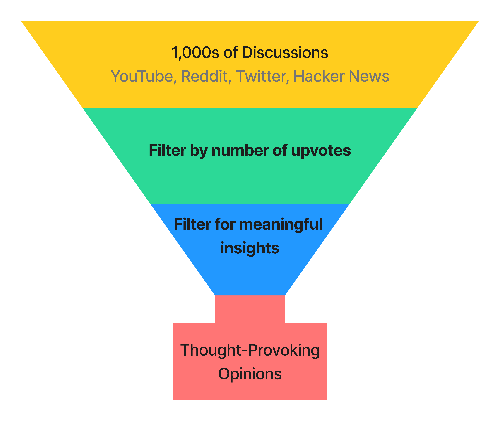
</Figure>

Next, I transcribed these discussions onto a whiteboard, organizing them into
"Pro Serverless," "Anti Serverless," or "Neutral" categories, and then
clustering them into distinct opinions. Each section in this post showcases
an opinion while referencing pertinent discussions.

<Figure caption={
<a href="https://www.figma.com/figjam/">FigJam</a> I used to organize perspectives
}>
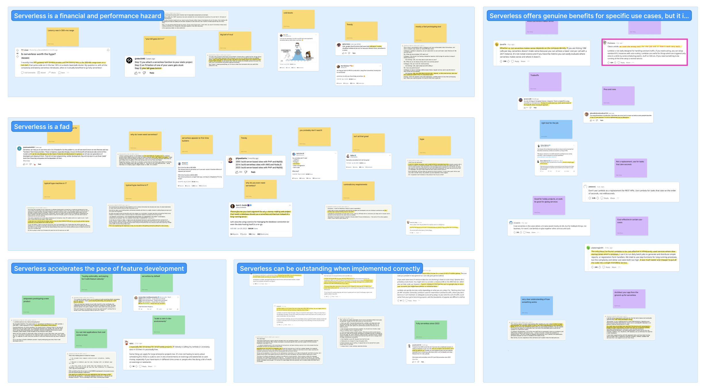
</Figure>

{/* TRUNCATE */}

## Anti-Serverless Opinions

Giant software companies such as Shopify, GitHub, and Stack Overflow have
achieved new heights using tried-and-true frameworks like Ruby on Rails.
However, serverless presents an intriguing new paradigm that promises to reduce
costs, accelerate development, and eliminate the need for maintenance. And as with
any technological shift, there will always be skeptics.

### Opinion: Serverless is a performance and financial hazard

<Carousel.Wrapper>
  <Carousel.Slide>
      <Figure caption={Source: <a href="https://twitter.com/VicVijayakumar/status/1644711481177456644">Twitter</a>}>
  
  </Figure>
  </Carousel.Slide>
  <Carousel.Slide>
      <Figure caption={Source: <a href="https://www.youtube.com/watch?v=W_VV2Fx32_Y&lc=Ugxb0ODqBd78lWf_UiB4AaABAg">YouTube</a>}>
  
  </Figure>
  </Carousel.Slide>
    <Carousel.Slide>
        <Figure caption={Source: <a href="https://www.reddit.com/r/aws/comments/14noh28/is_serverless_worth_the_hype/">Reddit</a>}>
            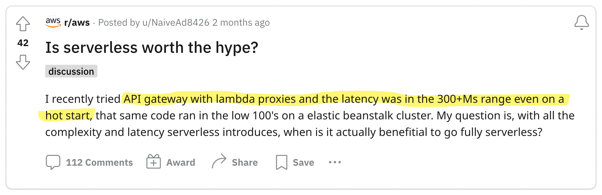
        </Figure>
    </Carousel.Slide>
    <Carousel.Slide>
      <Figure caption={Source: <a href="https://news.ycombinator.com/item?id=17949694">Hacker News</a>}>
      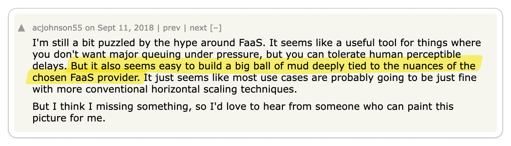
      </Figure>
    </Carousel.Slide>
  <Carousel.Slide>
      <Figure caption={Source: <a href="https://www.youtube.com/watch?v=AuMeockiuLs&lc=Ugx3lwCCM6Qd-XBVDwB4AaABAg">YouTube</a>}>
  
  </Figure>
  </Carousel.Slide>
  <Carousel.Slide>
      <Figure caption={Source: <a href="https://news.ycombinator.com/item?id=21046547">Hacker News</a>}>
  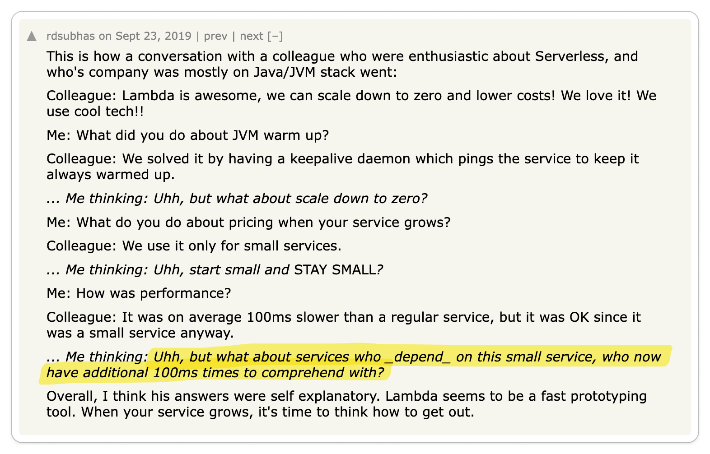
  </Figure>
  </Carousel.Slide>
  <Carousel.Slide>
      <Figure caption={Source: <a href="https://twitter.com/peer_rich/status/1644437521210769408">Twitter</a>}>
  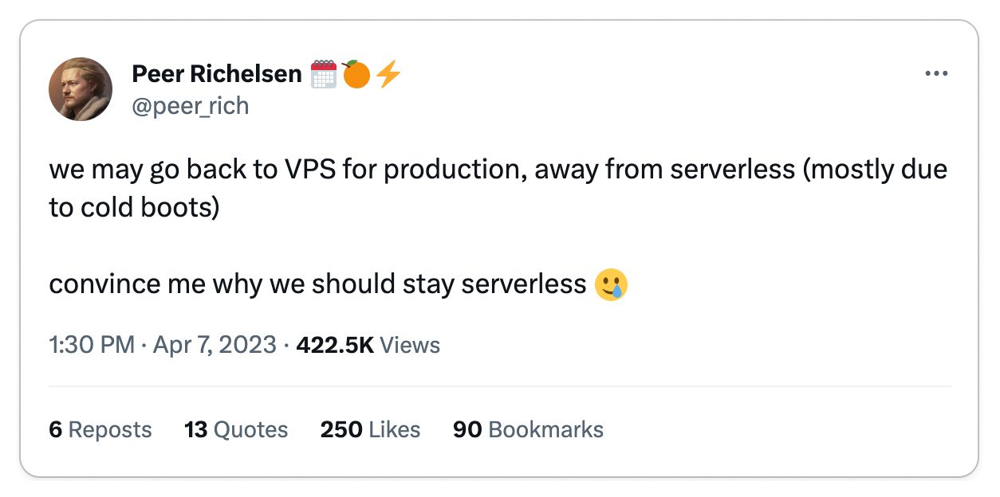
  </Figure>
  </Carousel.Slide>
</Carousel.Wrapper>

#### Key Takeaway 🔑

One of the most vocal criticisms of serverless computing is the unpredictability
of its costs and the latency associated with cold starts. While cloud providers
[have made significant improvements in optimizing serverless runtimes](https://blog.cloudflare.com/eliminating-cold-starts-with-cloudflare-workers/) over time,
these issues remain a significant concern for many developers.

Additionally, serverless introduces a new paradigm that brings its own set of
challenges when building complex applications, particularly those requiring
multiple services to communicate with each other. This is already a common
problem with microservices, but serverless further complicates the issue by
forcing developers to work within a stateless and I/O-bound compute model.

These latencies can have real financial consequences; [Amazon found that every
100ms of latency cost them 1% in
sales](https://www.gigaspaces.com/blog/amazon-found-every-100ms-of-latency-cost-them-1-in-sales).
Moreover, without proper billing safeguards in place, serverless costs can
spiral out of control, potentially leading to the infamous situation of a
[startup sinking under its cloud bill](https://news.ycombinator.com/item?id=22719573).

Encountering any of these issues could understandably leave a sour impression
and be a compelling reason to abandon serverless in favor of a traditional VPS.

### Opinion: Serverless is a fad

<Carousel.Wrapper>
  <Carousel.Slide>
    <Figure caption={Source: <a href="https://www.youtube.com/watch?v=qQk94CjRvIs&lc=UgzjXQaG0emfA-W85dR4AaABAg">YouTube</a>}>
      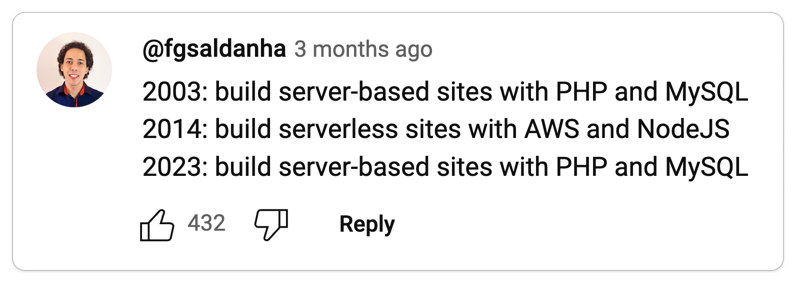
    </Figure>
  </Carousel.Slide>
  <Carousel.Slide>
    <Figure caption={Source: <a href="https://twitter.com/kentcdodds/status/1619679730634219520">Twitter</a>}>
      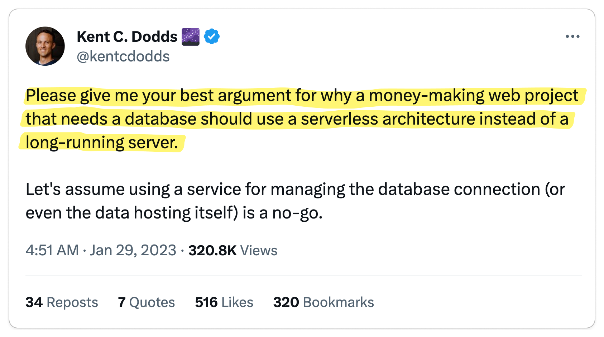
    </Figure>
  </Carousel.Slide>
  <Carousel.Slide>
    <Figure caption={Source: <a href="https://twitter.com/ImSh4yy/status/1662549053815635969">Twitter</a>}>
      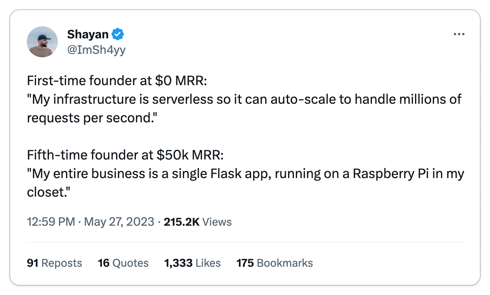
    </Figure>
  </Carousel.Slide>
  <Carousel.Slide>
    <Figure caption={Source: <a href="https://www.youtube.com/watch?v=Fx3ZGy-mbV4&lc=UgwK6tpyGWJ5jxeLazB4AaABAg">YouTube</a>}>
      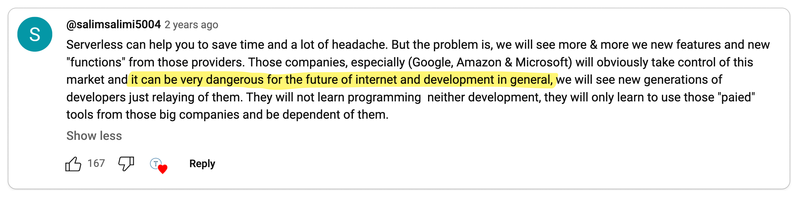
    </Figure>
  </Carousel.Slide>
  <Carousel.Slide>
    <Figure caption={Source: <a href="https://twitter.com/jacobmparis/status/1658919169805496320">Twitter</a>}>
      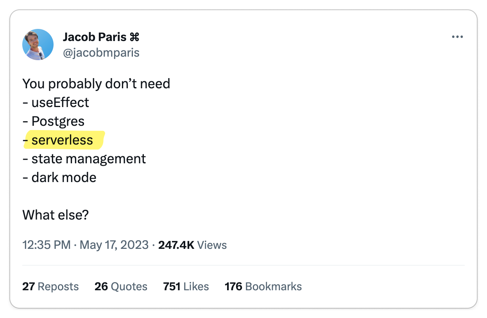
    </Figure>
  </Carousel.Slide>
  <Carousel.Slide>
    <Figure caption={Source: <a href="https://www.reddit.com/r/ProgrammerHumor/comments/kvbaq3/comment/giz0irb/?utm_source=share&utm_medium=web2x&context=3">Reddit</a>}>
      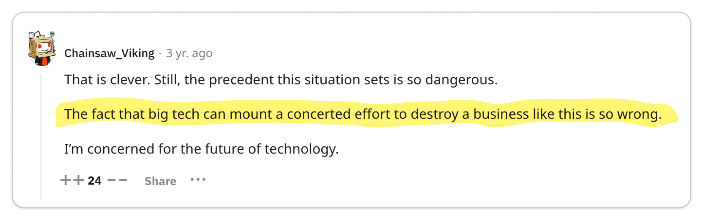
    </Figure>
  </Carousel.Slide>
  <Carousel.Slide>
    <Figure caption={Source: <a href="https://news.ycombinator.com/item?id=24758772">Hacker News</a>}>
      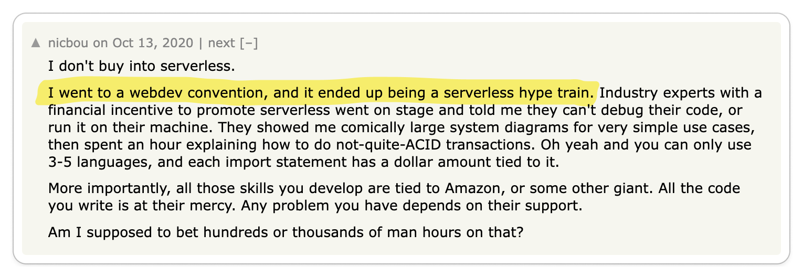
    </Figure>
  </Carousel.Slide>
  <Carousel.Slide>
    <Figure caption={Source: <a href="https://news.ycombinator.com/item?id=21046547">Hacker News</a>}>
      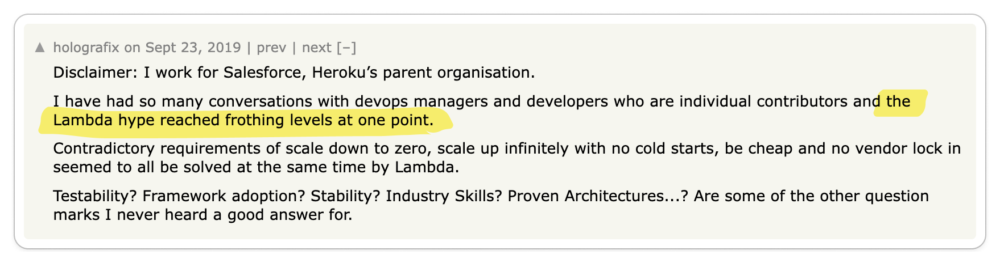
    </Figure>
  </Carousel.Slide>
  <Carousel.Slide>
    <Figure caption={Source: <a href="https://twitter.com/MelkeyDev/status/1673395056072605696">Twitter</a>}>
      
    </Figure>
  </Carousel.Slide>
  <Carousel.Slide>
    <Figure caption={Source: <a href="https://news.ycombinator.com/item?id=25482410">Hacker News</a>}>
      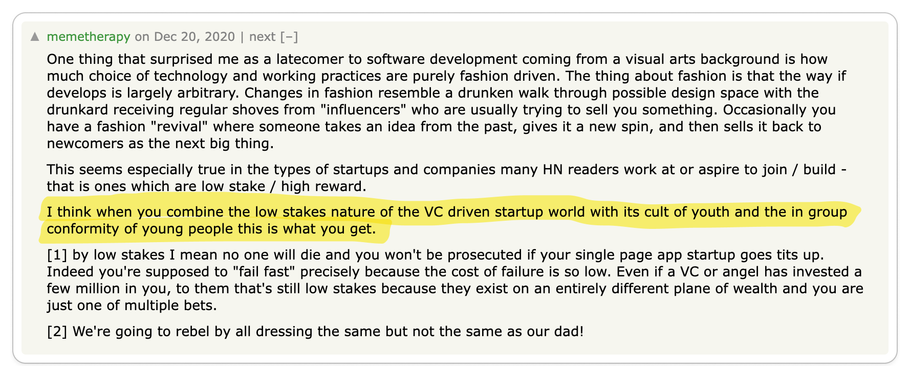
    </Figure>
  </Carousel.Slide>
  <Carousel.Slide>
    <Figure caption={Source: <a href="https://news.ycombinator.com/item?id=21046547f">Hacker News</a>}>
      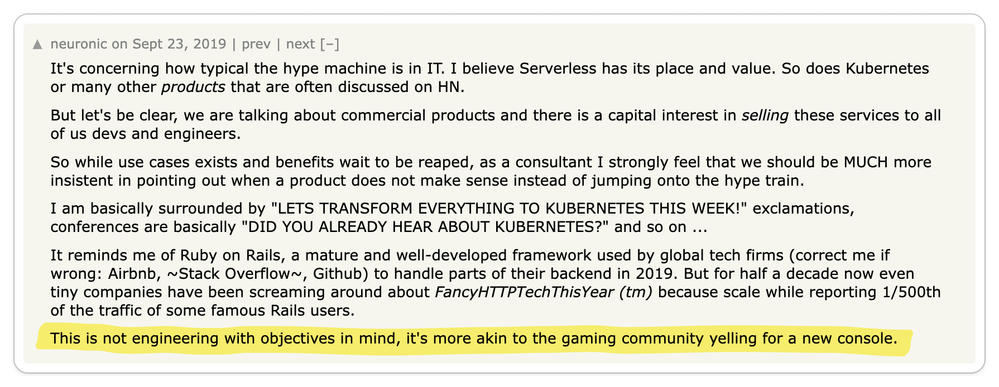
    </Figure>
  </Carousel.Slide>
  <Carousel.Slide>
    <Figure caption={Source: <a href="https://news.ycombinator.com/item?id=25100397">Hacker News</a>}>
      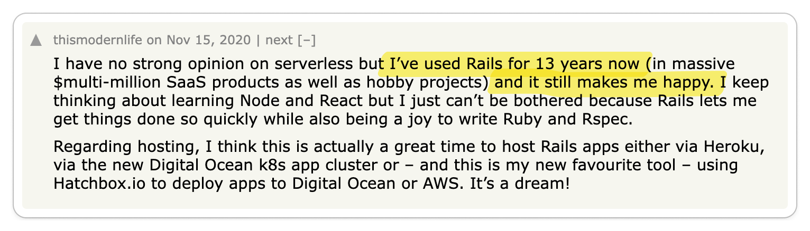
    </Figure>
  </Carousel.Slide>
</Carousel.Wrapper>

#### Key Takeaway 🔑

Serverless is a fad, and the hype will fade.

Kudos to AWS's marketing team, as they successfully persuaded thousands of
CTOs to stake their entire technology stack on a contentious new paradigm
for building applications.

Some even go as far as to say serverless is "dangerous" or "wrong". In some
ways, this viewpoint is not exaggerated. If cloud providers were not
striving to lock everyone into their products to capture market share and boost
revenue, what kind of corporate entities would they be?

Early adopters and evangelists did a great job at highlighting 10x features and
pushing the cloud computing agenda.  But always be weary of a
technology that necessitates developers to acquire a new set of skills and
tools, [potentially wasting developer's time in a low-demand technology](https://www.reddit.com/r/FlutterDev/comments/15njq61/i_feel_like_i_mad_a_mistake_investing/).
Engineering teams should exercise caution when betting the farm on serverless as
it may lead to vendor lock-in.  When things go wrong, good luck with
troubleshooting and refactoring!

At the end of the day, serverless represents a substantial investment that could
arguably be better allocated to other aspects of the business. Why not utilize
long-running servers that were already [deployable and maintainable in the late
2000s](https://www.google.com/search?q=when+was+heroku+founded&sca_esv=557804163&ei=a1beZJLcDLiWkPIPpa2UiAQ&ved=0ahUKEwjSvZXRmeSAAxU4C0QIHaUWBUEQ4dUDCBA&uact=5&oq=when+was+heroku+founded&gs_lp=Egxnd3Mtd2l6LXNlcnAiF3doZW4gd2FzIGhlcm9rdSBmb3VuZGVkMgUQIRigATIFECEYoAEyBRAhGKABSPIUUABYlxRwBHgAkAEBmAFxoAGFEKoBBDE4Lja4AQPIAQD4AQHCAg4QABiKBRixAxiDARiRAsICDhAuGIoFGLEDGIMBGJECwgIREC4YgAQYsQMYgwEYxwEY0QPCAgsQLhiDARixAxiABMICBRAuGIAEwgIIEAAYgAQYsQPCAgsQABiABBixAxiDAcICCxAuGIAEGMcBGNEDwgIHEAAYigUYQ8ICCBAAGIoFGJECwgINEAAYigUYsQMYgwEYQ8ICDhAuGIAEGLEDGMcBGNEDwgILEC4YigUYsQMYgwHCAgUQABiABMICCBAuGIAEGLEDwgIIEAAYgAQYyQPCAggQABiKBRiSA8ICDRAAGIoFGJECGEYY-wHCAg4QABiKBRixAxiDARjJA8ICBxAuGIAEGArCAgcQABiABBgKwgIWEC4YgAQYChiXBRjcBBjeBBjgBNgBAcICChAAGIAEGEYY-wHCAgoQABiABBixAxgKwgIGEAAYFhgewgIIEAAYigUYhgPiAwQYACBBiAYBugYGCAEQARgU&sclient=gws-wiz-serp).

So, does serverless really solve your problems, or are you just succumbing to the hype?

## Pro Serverless Opinions

Technologies that catch on usually have something good going for them, and
serverless is no exception. Despite all the buzz and marketing blitz, there's
some real enthusiasm for it. Some companies are saving time and money with
serverless, making it a win-win. Some devs think serverless is the new must-have
tool in the toolbox.

### Opinion: Serverless accelerates the pace of feature development

<Carousel.Wrapper>
  <Carousel.Slide>
    <Figure caption={Source: <a href="https://news.ycombinator.com/item?id=31536827">Hacker News</a>}>
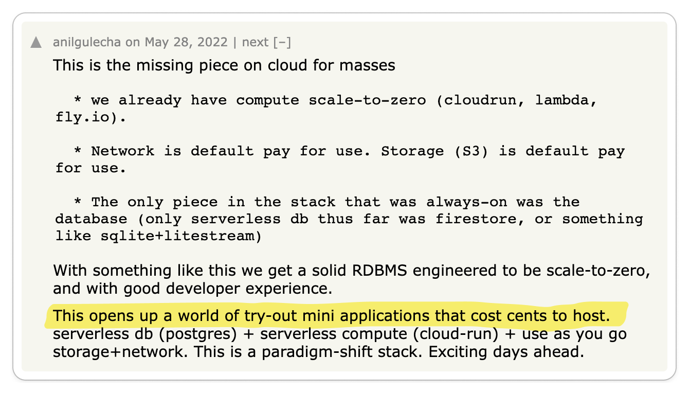
    </Figure>
  </Carousel.Slide>

  <Carousel.Slide>
    <Figure caption={Source: <a href="https://news.ycombinator.com/item?id=21046547">Hacker News</a>}>
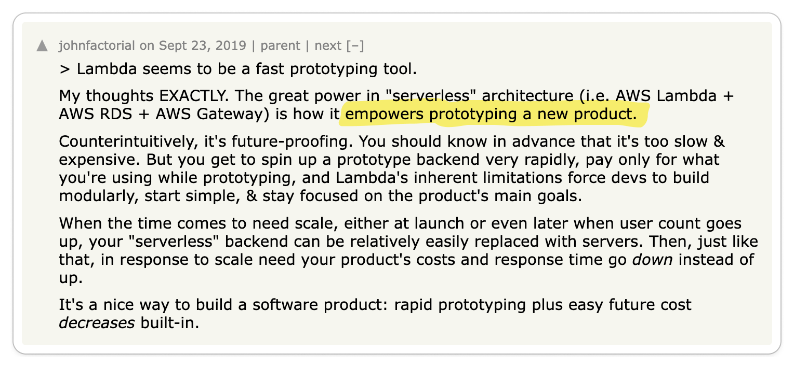
    </Figure>
  </Carousel.Slide>

  <Carousel.Slide>
    <Figure caption={Source: <a href="https://www.reddit.com/r/aws/comments/14noh28/comment/jq8kmld/?utm_source=share&utm_medium=web2x&context=3">Reddit</a>}>
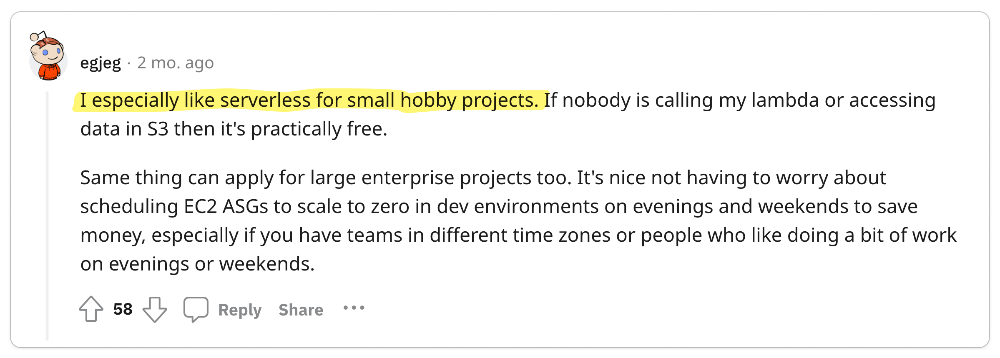
    </Figure>
  </Carousel.Slide>

  <Carousel.Slide>
    <Figure caption={Source: <a href="https://news.ycombinator.com/item?id=19080875">Hacker News</a>}>
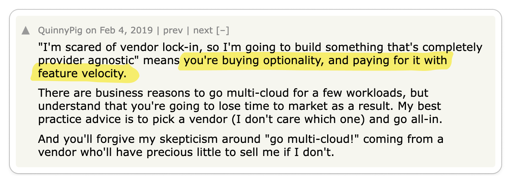
    </Figure>
  </Carousel.Slide>

  <Carousel.Slide>
    <Figure caption={Source: <a href="https://twitter.com/jeremy_daly/status/1655661095942496256">Twitter</a>}>
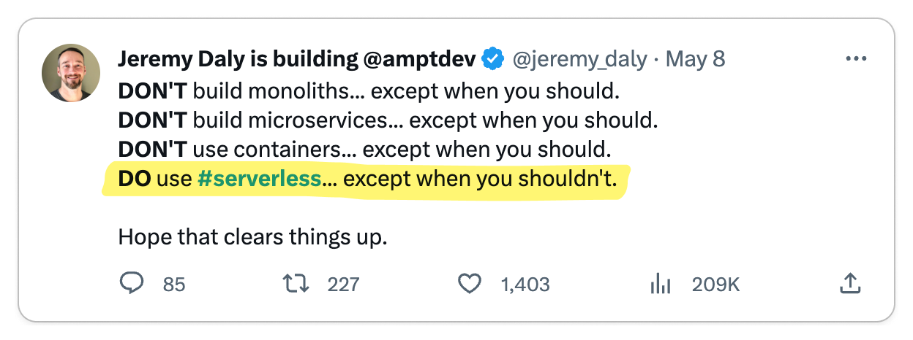
    </Figure>
  </Carousel.Slide>

</Carousel.Wrapper>

#### Key Takeaway 🔑

Counter-intuitively, an interesting aspect of serverless computing is that it appeals
more to early product development than to enterprise products is the speed at
which features can be developed. The virtually negligible time and cost required
to provision cloud computing resources make serverless computing particularly
attractive to hobbyists for their projects.

During the early stages of building a product, the most critical factor to
consider when designing your system is the pace of development. Concerns about
scalability fall far behind developer experience, as they are not yet relevant
issues. In this context, serverless computing provides a compelling value proposition.

In light of this, why would anyone waste time setting up their own server?
Starting with serverless computing is a logical choice. If cost or speed issues
arise, other options can be considered at that time.

### Opinion: Serverless can be outstanding when implemented correctly

<Carousel.Wrapper>

  <Carousel.Slide>
    <Figure caption={Source: <a href="https://www.youtube.com/watch?v=qQk94CjRvIs&lc=UgywChu1lNVk2InuS2J4AaABAg">YouTube</a>}>
  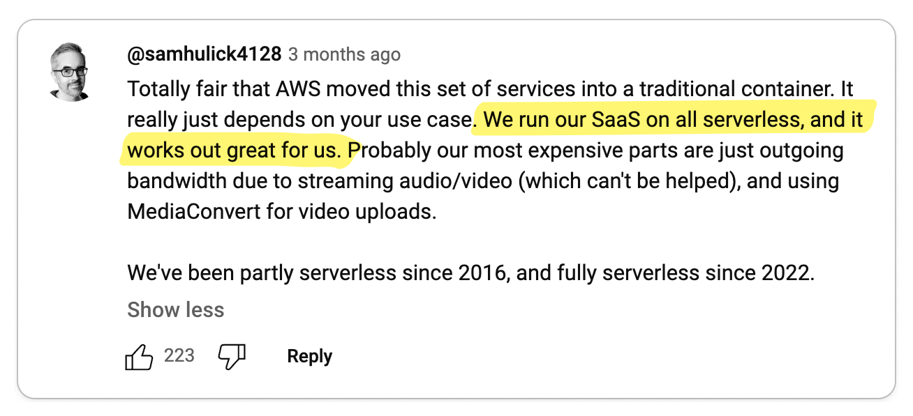
      </Figure>
    </Carousel.Slide>

  <Carousel.Slide>
    <Figure caption={Source: <a href="https://www.reddit.com/r/aws/comments/yxyyk3/comment/iwre3t9/?utm_source=share&utm_medium=web2x&context=3">Reddit</a>}>
  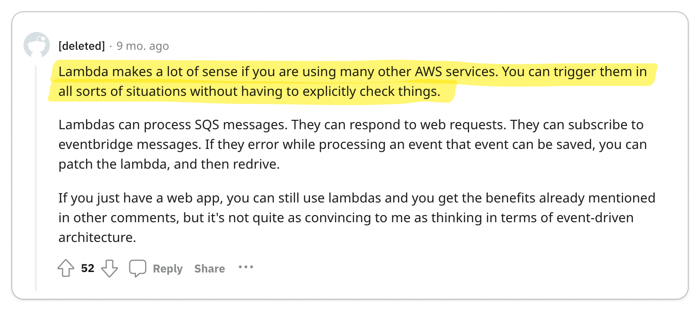
      </Figure>
    </Carousel.Slide>

  <Carousel.Slide>
    <Figure caption={Source: <a href="https://www.reddit.com/r/gamedev/comments/10jmr5x/comment/j5lrak2/?utm_source=share&utm_medium=web2x&context=3">Reddit</a>}>
  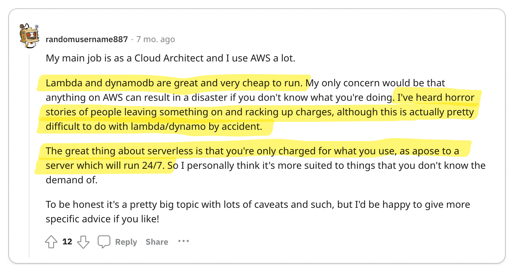
      </Figure>
    </Carousel.Slide>

  <Carousel.Slide>
    <Figure caption={Source: <a href="https://www.reddit.com/r/gamedev/comments/10jmr5x/comment/j5leyum/?utm_source=share&utm_medium=web2x&context=3">Reddit</a>}>
  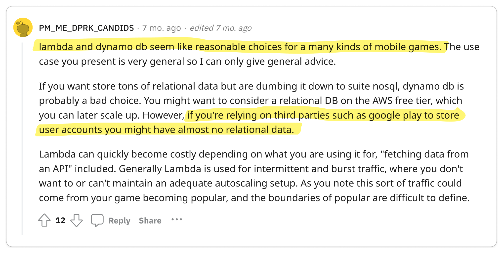
      </Figure>
    </Carousel.Slide>

  <Carousel.Slide>
    <Figure caption={Source: <a href="https://news.ycombinator.com/item?id=24758772">Hacker News</a>}>
  
      </Figure>
    </Carousel.Slide>

  <Carousel.Slide>
    <Figure caption={Source: <a href="https://www.reddit.com/r/aws/comments/yxyyk3/comment/iwrc7bn/?utm_source=share&utm_medium=web2x&context=3">Reddit</a>}>
  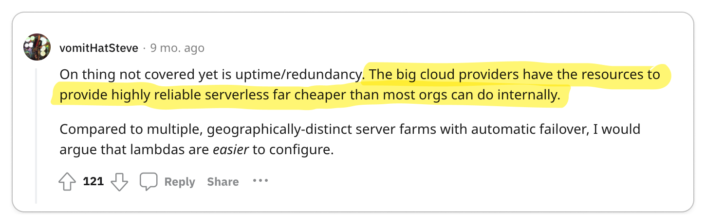
      </Figure>
    </Carousel.Slide>

  <Carousel.Slide>
    <Figure caption={Source: <a href="https://news.ycombinator.com/item?id=21046547">Hacker News</a>}>
  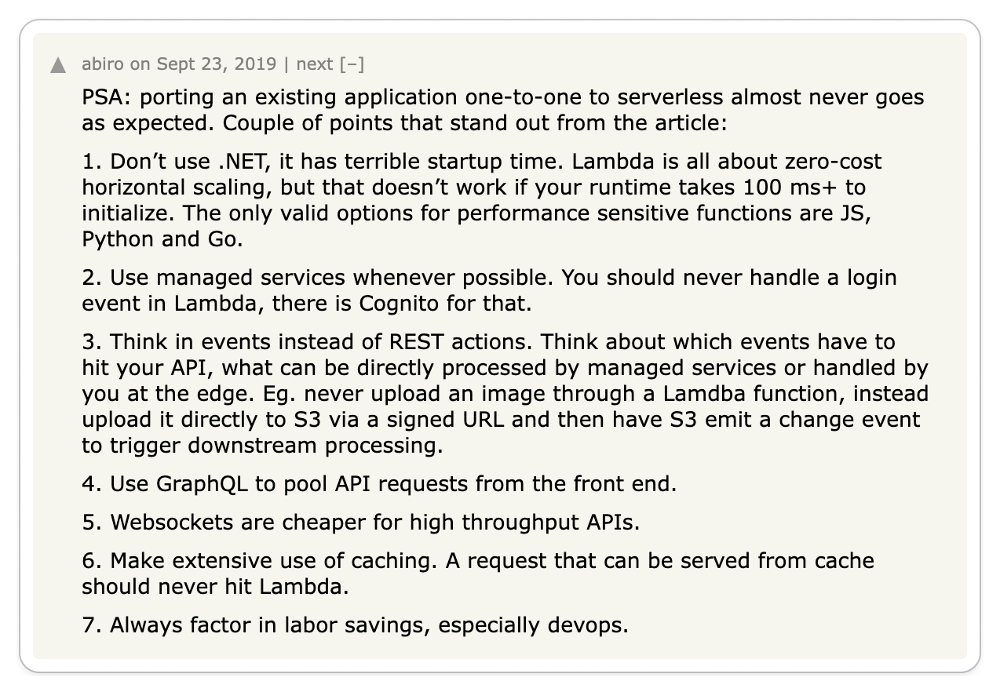
      </Figure>
    </Carousel.Slide>

</Carousel.Wrapper>

#### Key Takeaway 🔑

For those who have successfully adopted serverless and lived to share their
experiences, the enthusiasm is palpable.

It appears that building on serverless from first principles can yield
outstanding results. Beyond the marketing hype, the true benefits of serverless
become evident. Maybe as the Berkeley researchers predicted, maintaining your own
server is becoming a thing of the past. With serverless, you can save money,
reduce development time, and cut maintenance costs—a triple win.

Moreover, as serverless offerings like storage, background jobs, and databases
continue to improve, the ecosystem will support the construction of increasingly
complex apps, while still upholding the promise of serverless.

If you can navigate the downsides of serverless, you can create a product with
an infrastructure that feels almost effortless. Perhaps the naysayers' tales are
louder than the truth.

## Neutral Opinions

I believe it is crucial to emphasize neutral viewpoints. In my view, these tend
to be the most truthful because they recognize the advantages and disadvantages
of each approach. They are also the opinions least commonly expressed, as many
developers tend to be set in their ways.

### Opinion: Serverless offers genuine benefits for specific use cases, but it is often misused or applied inappropriately

<Carousel.Wrapper>

  <Carousel.Slide>
    <Figure caption={Source: <a href="https://twitter.com/kelseyhightower/status/1654098279116992513">Twitter</a>}>
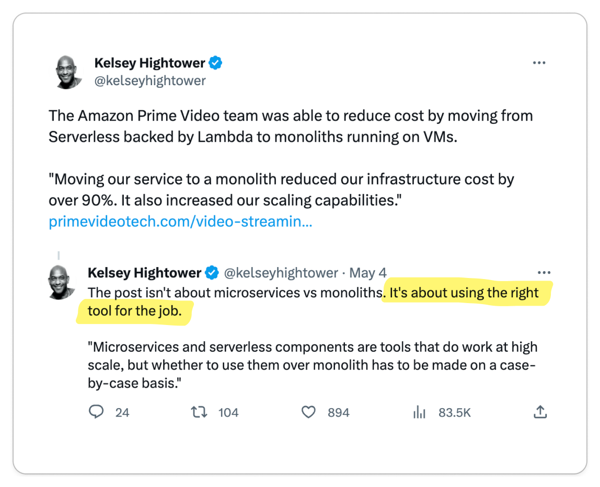
    </Figure>
  </Carousel.Slide>

  <Carousel.Slide>
    <Figure caption={Source: <a href="https://www.youtube.com/watch?v=AuMeockiuLs&lc=Ugw9wmbmTotFmMrs57t4AaABAg">YouTube</a>}>

    </Figure>
  </Carousel.Slide>

  <Carousel.Slide>
    <Figure caption={Source: <a href="https://www.reddit.com/r/programming/comments/d85z8l/comment/f17nldn/?utm_source=share&utm_medium=web2x&context=3">Reddit</a>}>
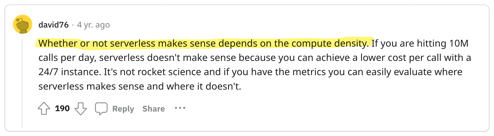
    </Figure>
  </Carousel.Slide>

  <Carousel.Slide>
    <Figure caption={Source: <a href="https://news.ycombinator.com/item?id=21046547">Hacker News</a>}>
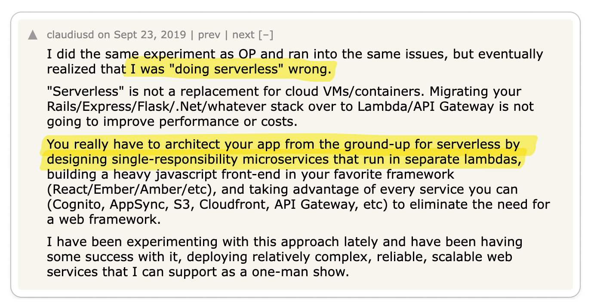
    </Figure>
  </Carousel.Slide>

  <Carousel.Slide>
    <Figure caption={Source: <a href="https://www.reddit.com/r/programming/comments/d85z8l/comment/f17i7lo/?utm_source=share&utm_medium=web2x&context=3">Reddit</a>}>
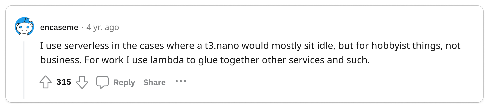
    </Figure>
  </Carousel.Slide>

  <Carousel.Slide>
    <Figure caption={Source: <a href="https://www.reddit.com/r/programming/comments/d85z8l/comment/f17lueo/?utm_source=share&utm_medium=web2x&context=3">Reddit</a>}>

    </Figure>
  </Carousel.Slide>

  <Carousel.Slide>
    <Figure caption={Source: <a href="https://www.reddit.com/r/programming/comments/137alxn/comment/jitax50/?utm_source=share&utm_medium=web2x&context=3">Reddit</a>}>
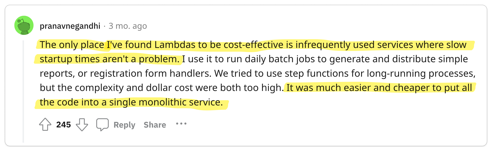
    </Figure>
  </Carousel.Slide>

  <Carousel.Slide>
    <Figure caption={Source: <a href="https://www.youtube.com/watch?v=qQk94CjRvIs&lc=Ugy6LVMTFLlyTqqIo5d4AaABAg&t=1s">YouTube</a>}>

    </Figure>
  </Carousel.Slide>

  <Carousel.Slide>
    <Figure caption={Source: <a href="https://news.ycombinator.com/item?id=19080875">Hacker News</a>}>
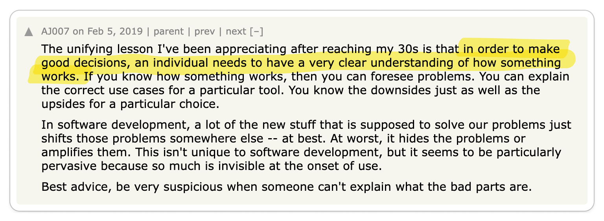
    </Figure>
  </Carousel.Slide>

  <Carousel.Slide>
    <Figure caption={Source: <a href="https://www.reddit.com/r/programming/comments/d85z8l/comment/f17nwlj/?utm_source=share&utm_medium=web2x&context=3">Reddit</a>}>
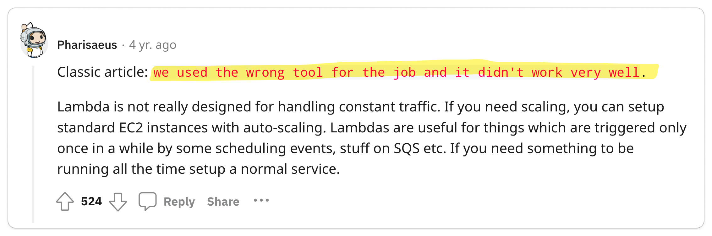
    </Figure>
  </Carousel.Slide>

</Carousel.Wrapper>

#### Key Takeaway 🔑

No technology is a silver bullet, and serverless is no exception.

Every technological decision is about choosing the right tool for the job.
Serverless has some distinct trade-offs that need to be understood before it's
adopted. Conduct thorough research on compute density, single-responsibility
microservices, and performance requirements. Once you do, you'll see that
serverless can offer immediate and tangible value. Recognize that serverless is
not a replacement, but an alternative.

Whenever you hear someone criticize serverless, be wary of the problems they
encountered. Were they design problems? Were there clear misuses of serverless?
Serverless is not a panacea.

## Conclusion

The anticlimactic conclusion? As always, it depends.

Though, I am more convinced that developers should strongly consider using
serverless during the early stages of their SDLC. I previously built
an application exclusively using serverless but was burned by lop-sided unit
economics[^burned]. In retrospect, I can attribute that failure to not
considering the downsides of serverless before adopting it.

That being said, I have also grown accustomed to [Render](https://render.com/)
for fast-paced development, and so far, I have no complaints. However, as I am
always striving to become a 10x engineer, I will consider adding serverless to
my toolbox.

[^burned]: I built a [Shopify App](https://github.com/dphuang2/browser-record-app) that gave shop owners pixel-perfect replays of
customers navigating their online store. I stored session data (using
[rrweb](https://www.rrweb.io/)) in S3 and processed events using lambda.
I ended up operating at a loss until I shut it down.