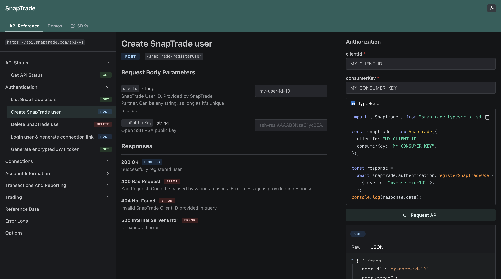

We are excited to announce the launch of our newest product at Konfig!

## Introducing: API Reference <Flame/>

### The Problem

The next step after generating SDKs is adding them to your docs. But as soon as
you do, something feels off. Your API reference is not integrated with your SDKs
and you have to maintain two separate pages. You manually copy-paste code
snippets from your SDKs to your docs and you have to update them every time your
API changes. So we created a better way.

### The Solution

Introducing API Reference by Konfig. It's a single page that combines your API
reference and SDKs. It's automatically generated from your OpenAPI spec and
SDKs. It's always up-to-date and it's always in sync with your API. It allows
you to dynamically generate code snippets for your SDKs and make API requests
directly from your docs. It's a single source of truth for your API.

<Figure caption={<a href="https://demo.konfigthis.com/passiv/snaptrade-sdks/reference/API%20Status/ApiStatus_check">Live API Reference Page for SnapTrade</a>}>

</Figure>

Currently, we are deploying with a few early customers. If you are
interested in trying it out, please reach out to dylan@konfigthis.com.

Improvements and Fixes

- Allow for configuration of a specific operation in SDK README.md files
- Remove quotes from strings when copying in demo portal
- Added "konfig versions" command to CLI to query currently published SDKs
- Add a one-time deprecation warning for deprecated operations in Python SDK

