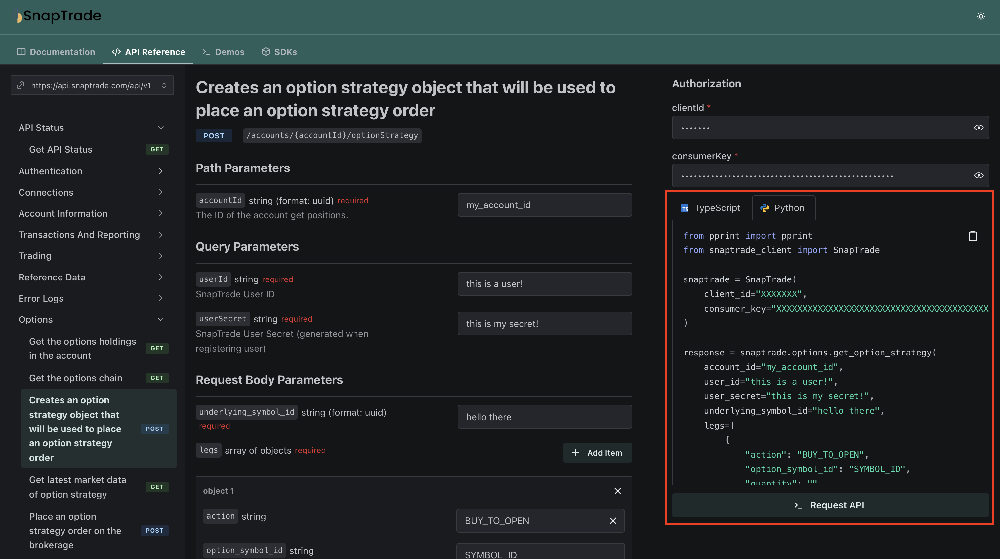
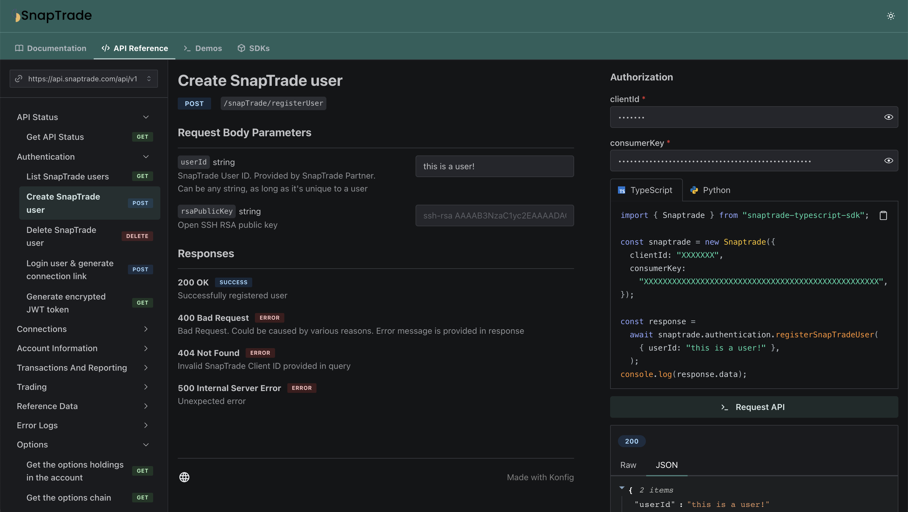
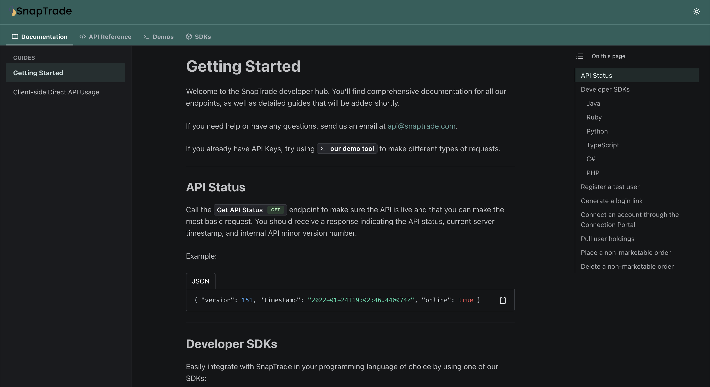

## Dart

Konfig now supports Dart! This means that you can now use Konfig in your Flutter
applications.

## Generated Python Snippets

Konfig's API Portal now seamlessly integrates your Python SDK into the API
Reference Page. This means that you can dynamically generate Python code
snippets that can be easily copy-pasted for lighting fast integration in Python.
This is the first of many SDK languages that we will be integrating into Konfig.

<Figure caption={<a href="https://snaptrade.onkonfig.com/reference">Example Generated Python Snippet</a> for <a href="https://snaptrade.com">SnapTrade</a>}>

</Figure>

## Improved API Portal Styling

We made improvements to the styling of the API Portal. The API portal now has
rounder edges and denser styling to make it easier to read and navigate.  We
also made the navbar on the left side smaller to give more room for the core
content on the page.

<Figure caption={<a href="https://snaptrade.onkonfig.com/reference">Example API Reference Page</a> in dark mode for <a href="https://snaptrade.com">SnapTrade</a>}>

</Figure>

<Figure caption={<a href="https://snaptrade.onkonfig.com/docs">Example API Markdown Page</a> in dark mode for <a href="https://snaptrade.com">SnapTrade</a>}>

</Figure>

Improvements and Fixes

- Eliminated dependency security vulnerabilities in Python and TypeScript SDKs
- Add `removeKonfigBranding` configuration to Go SDK
- Improved generated testing and documentation for Go SDKs
- Created `konfig pr-merge` and `konfig-pr-create` commands for GitHub automation
- Fixed Git repository tagging for Go publishing to properly be indexed by [pkg.go.dev](https://pkg.go.dev/)
- Support submodules for Go SDK
- Created [new lint rule](/docs/lint-rules#invalid-required-property-syntax) to catch potentially invalid required syntax
- Created `konfig list-sdk-submodules` to be used in automation
- Support submodules in the automation pipeline
- Added client state validation in Ruby to catch invalid client state when SDK is instantiated
- Validate UUID parameters in the API Reference Page
- Created [documentation](/docs/portal/tutorials/creating-markdown-pages) for setting up API Portal with custom markdown pages
- Added `--tolerate-republish` flag to `konfig publish` to allow for gracefully publishing of existing versions
- Support `multipart/form-data` input for `konfig mock` server
- Fix bug with `.yaml` files not being properly pulled in `konfig pull`

