## Improved API Portal Design <Flame/>

We completely refactored the design and look of our API Portal to be more
modern, sleek, and intuitive. Take a look at the screenshots below to see the
changes. We also added generated response examples and ergonomic improvements
when navigating between pages in the portal. See a full list of changes in the
"Improvements and Fixes" section below.

<Carousel.Wrapper>
    <Carousel.Slide>
    <Figure caption="Improved API Portal Design">
    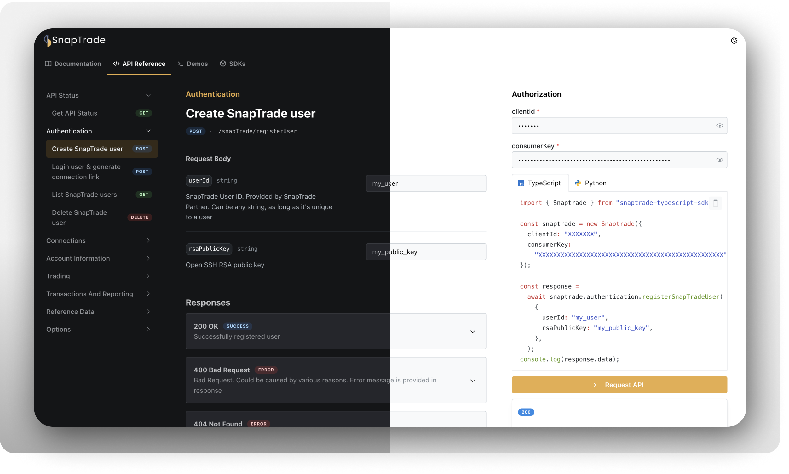
    </Figure>
    </Carousel.Slide>
    <Carousel.Slide>
    <Figure caption="Markdown Documentation (dark)">
    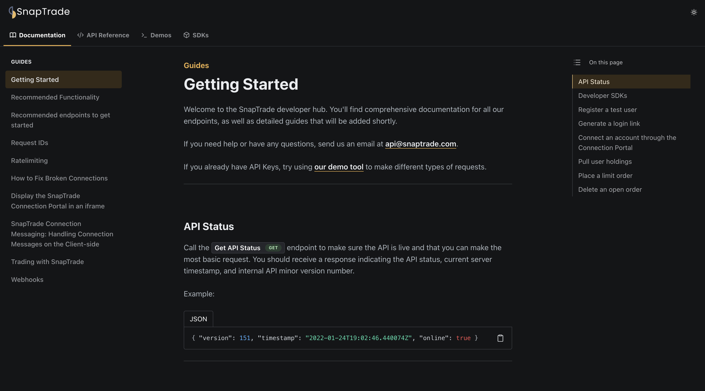
    </Figure>
    </Carousel.Slide>
    <Carousel.Slide>
    <Figure caption="Markdown Documentation (light)">
    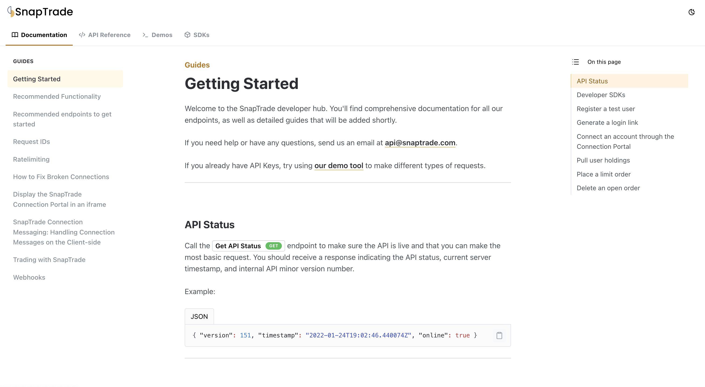
    </Figure>
    </Carousel.Slide>
    <Carousel.Slide>
    <Figure caption="Markdown Documentation (with brand color header in dark mode)">
    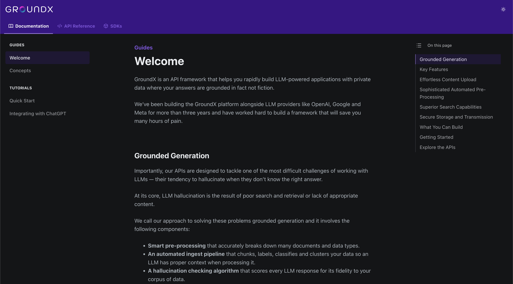
    </Figure>
    </Carousel.Slide>
    <Carousel.Slide>
    <Figure caption="Markdown Documentation (with brand color header in light mode)">
    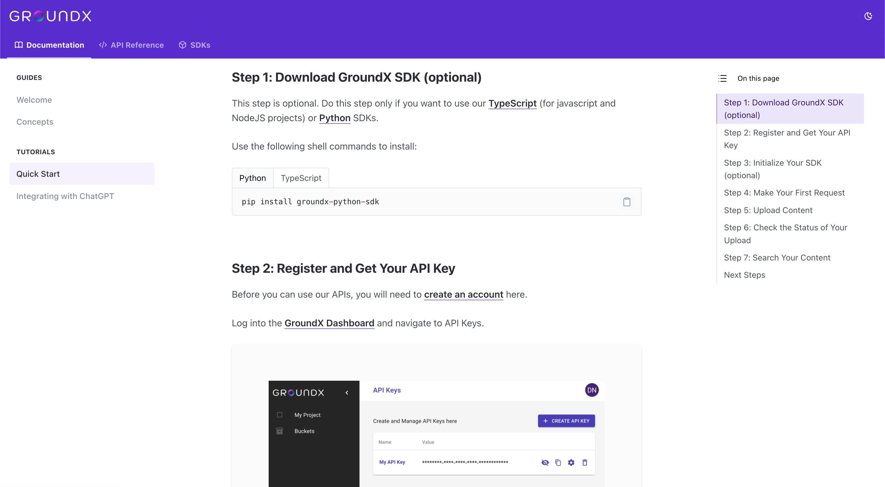
    </Figure>
    </Carousel.Slide>
    <Carousel.Slide>
    <Figure caption="API Reference (dark)">
    
    </Figure>
    </Carousel.Slide>
    <Carousel.Slide>
    <Figure caption="API Reference (light)">
    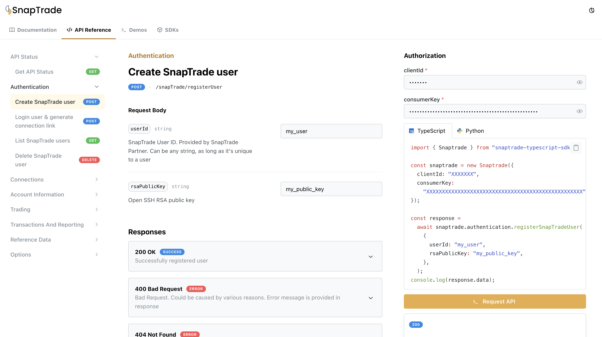
    </Figure>
    </Carousel.Slide>
    <Carousel.Slide>
    <Figure caption="API Demos (dark)">
    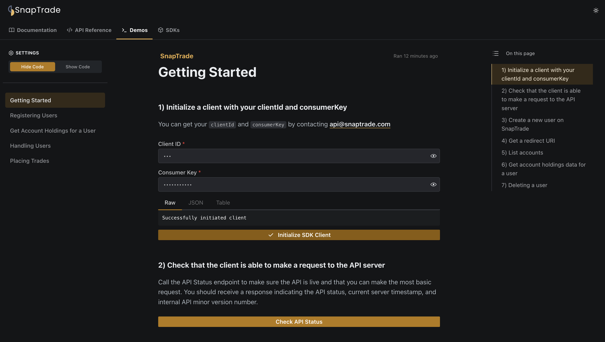
    </Figure>
    </Carousel.Slide>
    <Carousel.Slide>
    <Figure caption="API Demos (light)">
    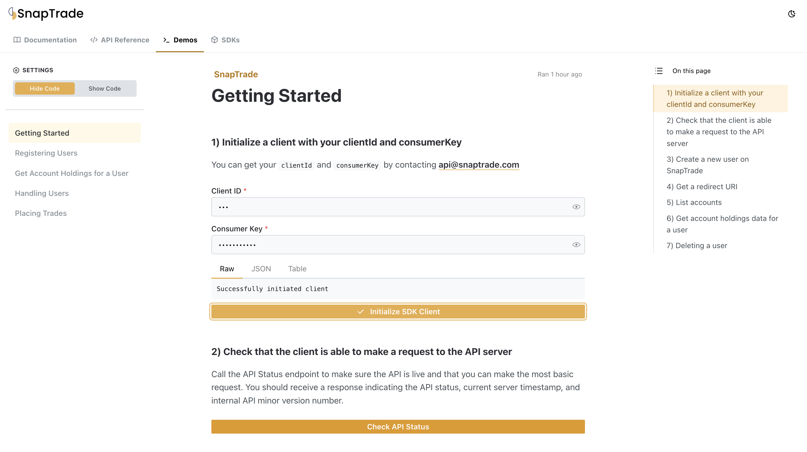
    </Figure>
    </Carousel.Slide>
</Carousel.Wrapper>

## Refactored SDK Documentation

We now allow you to brand your `README.md` with a banner image using the new
`readmeHeader` property in your `konfig.yaml` file like so:

```yaml konfig.yaml
readmeHeader:
  title: Acme
  image: header.png
  url: https://acme.com
```

This generates READMEs with your image and title at the top of the file like
so:

<Figure caption="Example TypeScript SDK README.md file">

</Figure>

We completely overhauled the generated documentation for Python and TypeScript
to be easier to read and find what you're looking for.

<Carousel.Wrapper>
    <Carousel.Slide>
    <Figure caption="Table of Contents">
    
    </Figure>
    </Carousel.Slide>
    <Carousel.Slide>
    <Figure caption="Usage (TypeScript)">
    
    </Figure>
    </Carousel.Slide>
    <Carousel.Slide>
    <Figure caption="Usage (TypeScript)">
    
    </Figure>
    </Carousel.Slide>
    <Carousel.Slide>
    <Figure caption="Usage (Python)">
    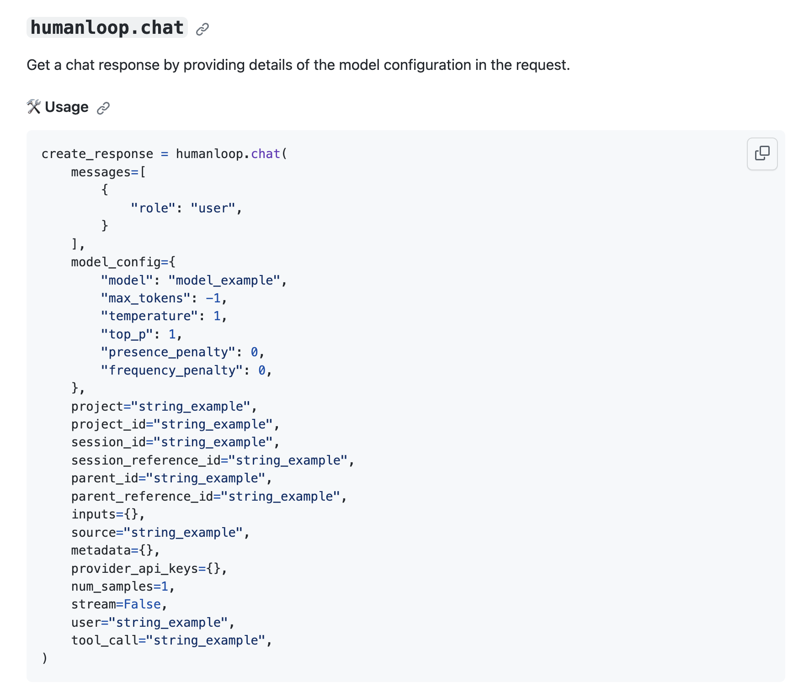
    </Figure>
    </Carousel.Slide>
    <Carousel.Slide>
    <Figure caption="Parameters and Response (TypeScript)">
    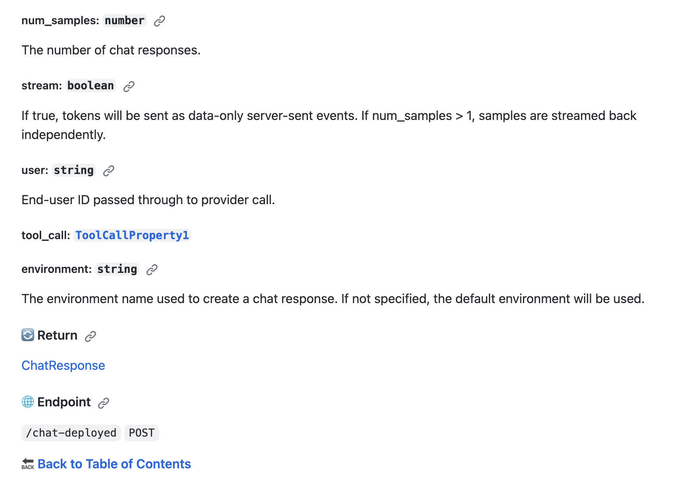
    </Figure>
    </Carousel.Slide>
    <Carousel.Slide>
    <Figure caption="Parameters and Response (Python)">
    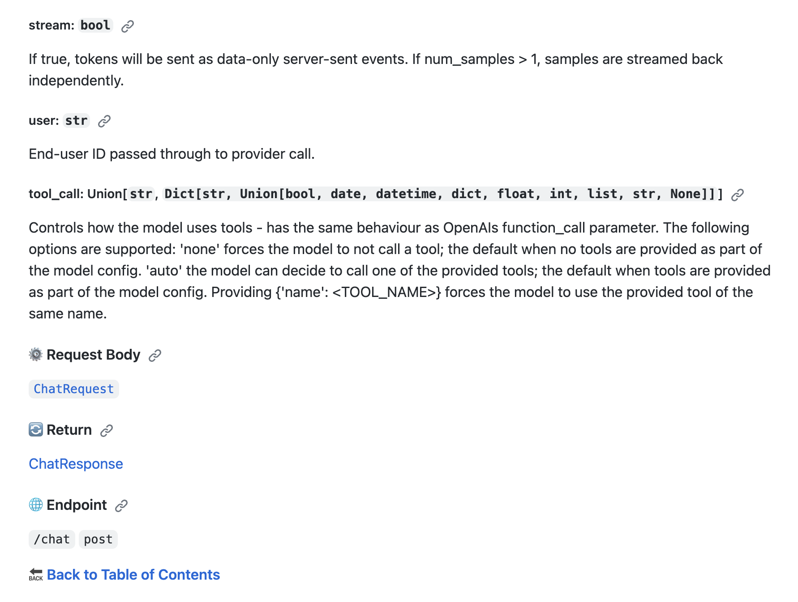
    </Figure>
    </Carousel.Slide>
</Carousel.Wrapper>


We also plan to improve the generated documentation for other SDKs.

<details>
<summary>Improvements and Fixes</summary>
- API Portal now preserves scroll position when navigating between pages
- Clicking the logo in the top-left corner brings you back to homepage
- Implemented light/dark logo theme for API Portal
- Added `-x` to not start a mock server in `konfig test`
- Fix table rendering width larger than viewport in API Portal
- Fix table from causing horizontal scroll on small screens
- Fixed handling of non-`Blob` type values in TypeScript SDK for `multipart/form-data`
- Handle `array` type schemas in request body for API Portal
- Support `bash`, `JavaScript`, and many more languages as code blocks in API Portal
- Point top-level API Portal domain to documentation if documentation is configured
- Remove nested documentation in Python SDK
- Embed all documentation into neatly organized `README.md` for Python SDK
- Removed nested documentation for TypeScript SDK
- Embed all documentation into neatly organized `README.md` for TypeScript SDK
- Added ability to [order endpoints](/docs/portal/tutorials/configuring-api-reference#how-to-order-operations-in-api-reference) in the API Reference page
- Fixed scrollbar blocking header on Windows for API Portal
- Fixed bug in `konfig fix` where fixing operation IDs fail because `await` wasn't used
- Fix invalid links in top-level `README.md` in SDK repository
- Show example values and schema in API Portal for operations
</details>