import Head from '@docusaurus/Head';

<Head>
  <title>I Reviewed 1,000s of Opinions on GitHub Copilot</title>
  <meta property="og:title" content="I Reviewed 1,000s of Opinions on Github Copilot"/>
</Head>

GitHub Copilot has recently taken the software engineering world by storm,
hitting a milestone of $100M ARR. This achievement alone qualifies it to be a
publicly listed company. Meanwhile, funding continues to flow into code-focused
LLM use cases.

<Carousel.Wrapper>
  <Carousel.Slide>
      <Figure caption={<a href="https://twitter.com/swyx/status/1711792178031460618?s=46&t=3D8YW9UxdZo4eiYzLsOALw">GitHub Copilot crosses 100M ARR Milestone</a>}>
        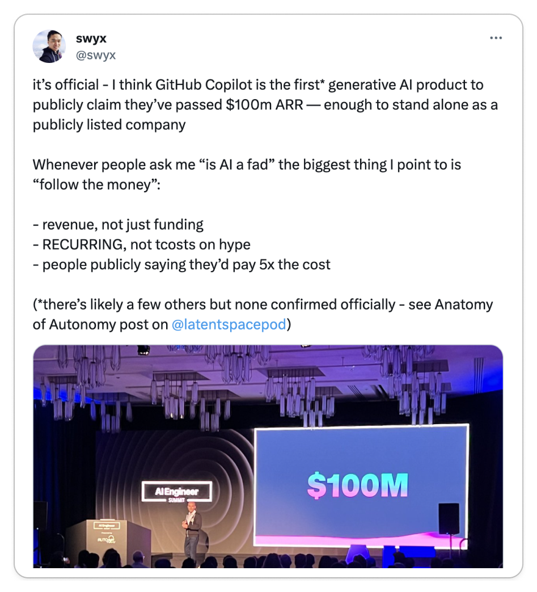
      </Figure>
  </Carousel.Slide>
  <Carousel.Slide>
      <Figure caption={<a href="https://tabby.tabbyml.com/blog/2023/10/14/seed-round-release-0-3-0-RAG/">TabbyML Raising 3.2M for an open-source GitHub Copilot</a>}>
        
      </Figure>
  </Carousel.Slide>
  <Carousel.Slide>
      <Figure caption={<a href="https://techcrunch.com/2022/06/15/tabnine-raises-15-5m-for-ai-that-autocompletes-code/?guccounter=1">Tabnine raises $15.5M for AI that autocompletes code</a>}>
        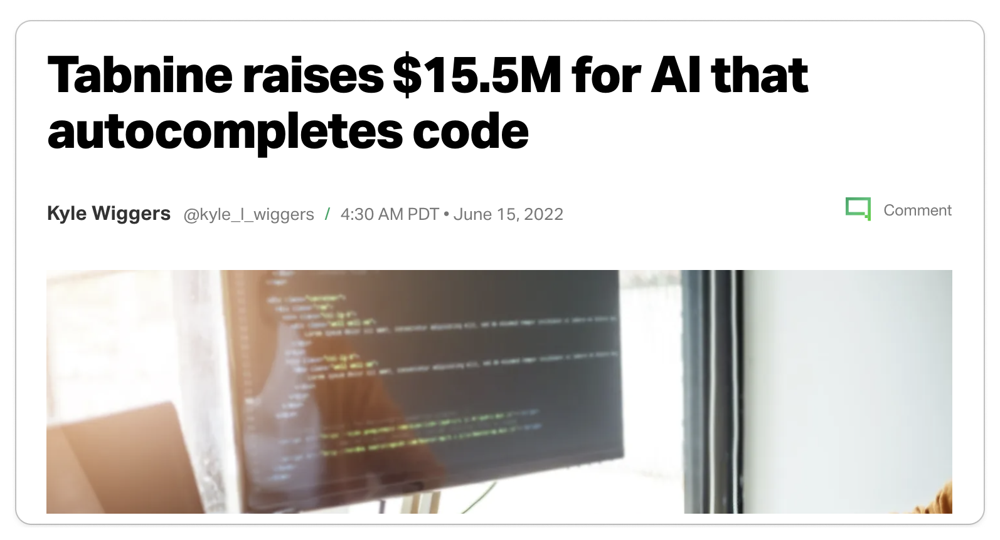
      </Figure>
  </Carousel.Slide>
  <Carousel.Slide>
      <Figure caption={<a href="https://techcrunch.com/2023/10/11/anysphere-raises-8m-from-openai-to-build-an-ai-powered-ide/">Anysphere raises $8M from OpenAI to build an AI-powered IDE</a>}>
        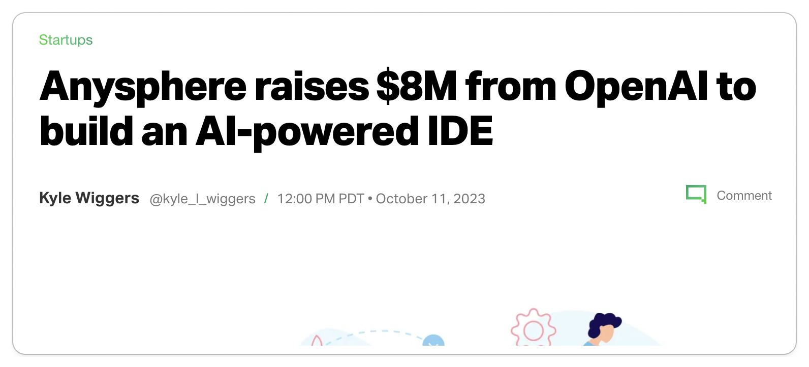
      </Figure>
  </Carousel.Slide>
  <Carousel.Slide>
      <Figure caption={<a href="https://www.codium.ai/blog/codiumai-powered-by-testgpt-accounces-beta-and-raised-11m/">CodiumAI raises $11M</a>}>
        
      </Figure>
  </Carousel.Slide>
</Carousel.Wrapper>

{/* TRUNCATE */}

LLMs are causing a stir in the software engineering community, with some
developers praising the technology and others fearing it. The controversy
surrounding LLMs is so intense that it has even led to a lawsuit against GitHub
Copilot.

<Figure caption={<a href="https://githubcopilotlitigation.com/">Lawsuit against GitHub Copilot</a>}>
  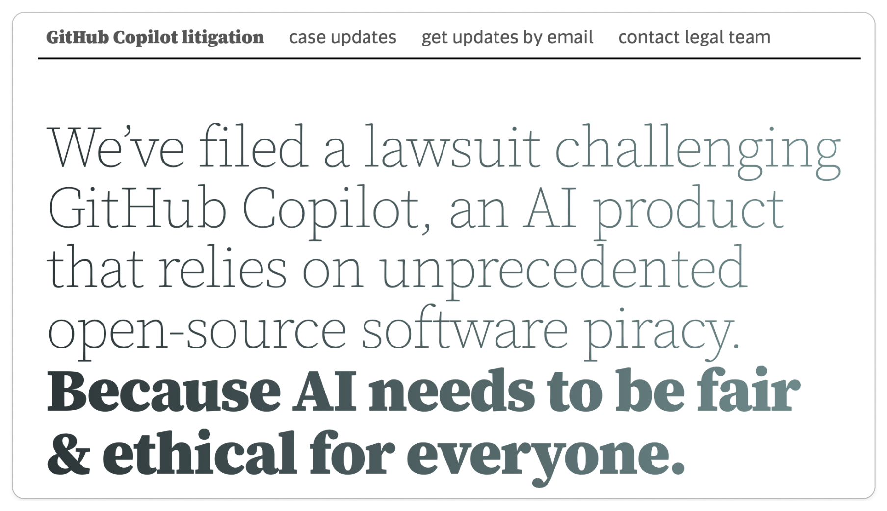
</Figure>

To understand how developers are receiving Copilot, I went to where
developers live: Reddit, Twitter, Hacker News, and YouTube. I parsed 1,000s of
discussions and synthesized my findings in this article, striving to present
only thought-provoking opinions.

<Figure caption='Funnel for gathering through-provoking opinions'>

</Figure>

Next, I transcribed these discussions onto a whiteboard, organizing them into
"Anti-Copilot" (👎), "Pro-Copilot" (👍), or "Neutral" (🧐) categories, and then clustering them
into distinct opinions. Each section in this post showcases an opinion while
referencing pertinent discussions.

<Figure caption='Whiteboard of opinions'>
  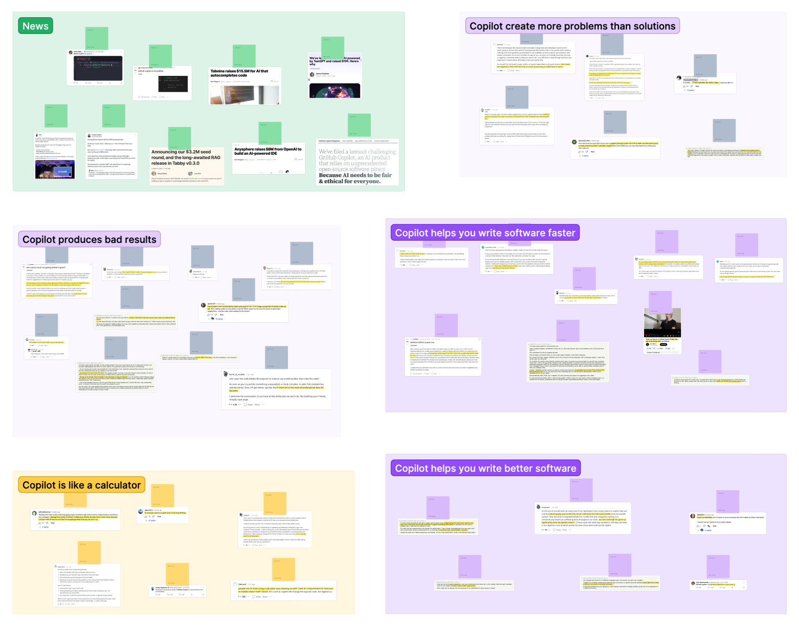
</Figure>

## 👎 Copilot produces bad results

LLMs operate as probabilistic models, implying they aren't always correct. This
is especially true for Copilot, which is trained on a corpus of code that may
not be representative of the code that a developer writes. As a result, Copilot
can
produce consistently bad results.

<Carousel.Wrapper>
  <Carousel.Slide>
      <Figure caption={<a href="https://www.reddit.com/r/ProgrammerHumor/comments/15h0rpl/comment/julph3k/?utm_source=share&utm_medium=web2x&context=3">Reddit</a>}>
        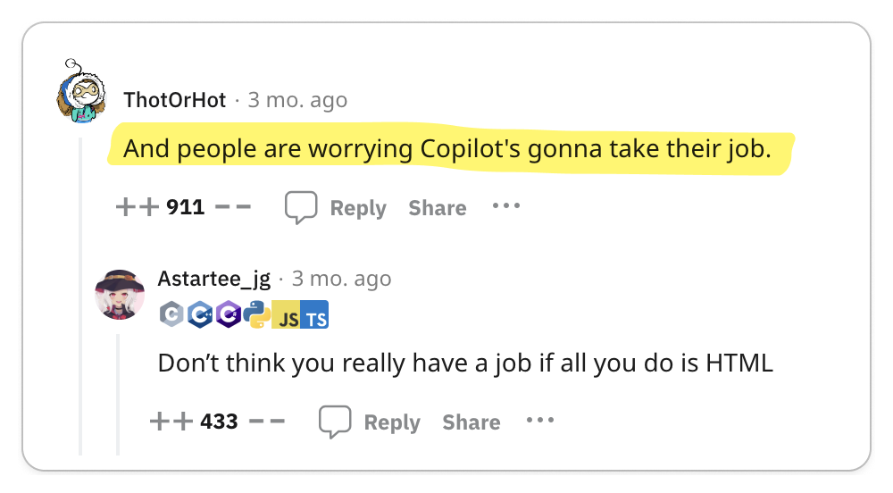
      </Figure>
  </Carousel.Slide>
  <Carousel.Slide>
      <Figure caption={<a href="https://www.reddit.com/r/programming/comments/vhnvlm/comment/id90t4a/?utm_source=share&utm_medium=web2x&context=3">Reddit</a>}>
        
      </Figure>
  </Carousel.Slide>
  <Carousel.Slide>
      <Figure caption={<a href="https://news.ycombinator.com/item?id=31827065">Hacker News</a>}>
        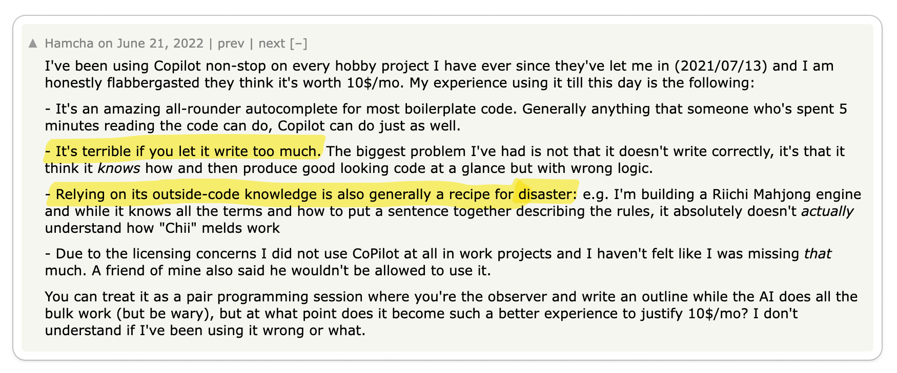
      </Figure>
  </Carousel.Slide>
  <Carousel.Slide>
      <Figure caption={<a href="https://www.reddit.com/r/webdev/comments/xk8lal/comment/ipcgmex/?utm_source=share&utm_medium=web2x&context=3">Reddit</a>}>
        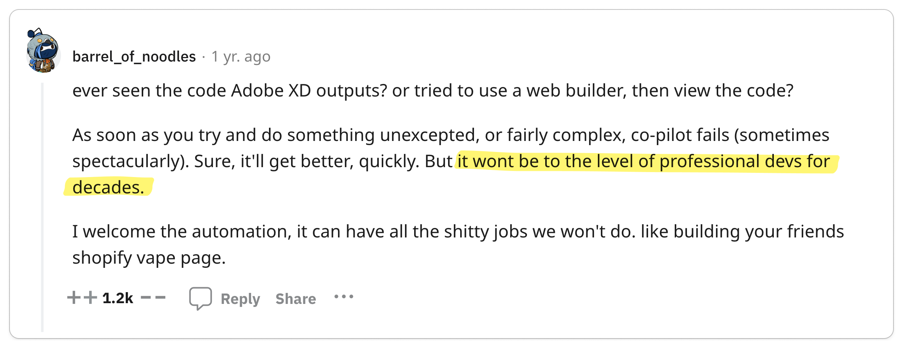
      </Figure>
  </Carousel.Slide>
  <Carousel.Slide>
      <Figure caption={<a href="https://www.youtube.com/watch?v=RDd71IUIgpg&lc=UgwVzIvvMrJ4c_01xsd4AaABAg">YouTube</a>}>
        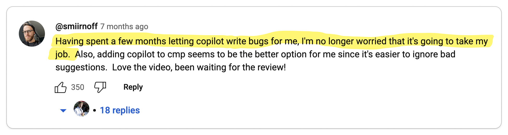
      </Figure>
  </Carousel.Slide>
  <Carousel.Slide>
      <Figure caption={<a href="https://www.reddit.com/r/webdev/comments/14lylhu/comment/jpyu6gy/?utm_source=share&utm_medium=web2x&context=3">Reddit</a>}>
        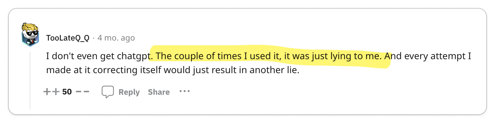
      </Figure>
  </Carousel.Slide>
  <Carousel.Slide>
      <Figure caption={<a href="https://news.ycombinator.com/item?id=31827656">Hacker News</a>}>
        
      </Figure>
  </Carousel.Slide>
  <Carousel.Slide>
      <Figure caption={<a href="https://www.reddit.com/r/webdev/comments/14lylhu/am_i_alone_in_just_not_getting_github_copilot/">Reddit</a>}>
        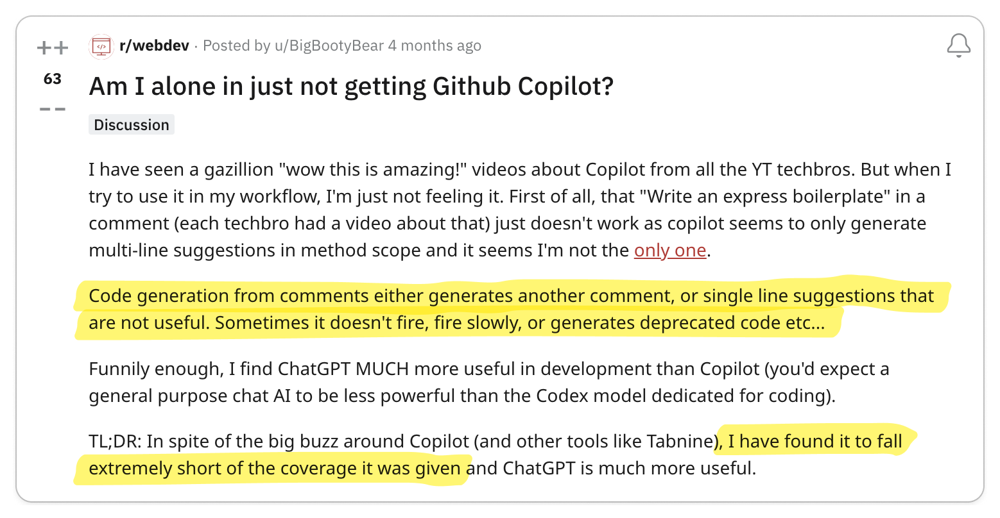
      </Figure>
  </Carousel.Slide>
  <Carousel.Slide>
      <Figure caption={<a href="https://www.reddit.com/r/Unity3D/comments/16ww6rd/comment/k2z87ms/?utm_source=share&utm_medium=web2x&context=3">Reddit</a>}>
        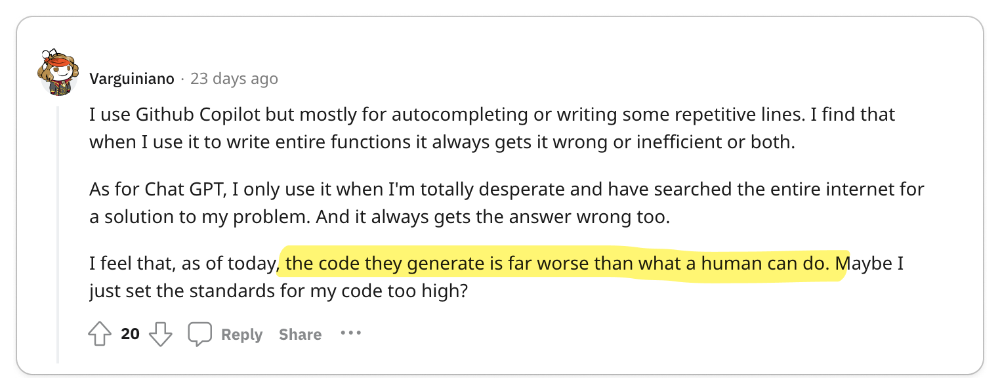
      </Figure>
  </Carousel.Slide>
  <Carousel.Slide>
      <Figure caption={<a href="https://news.ycombinator.com/item?id=31827556">Hacker News</a>}>
        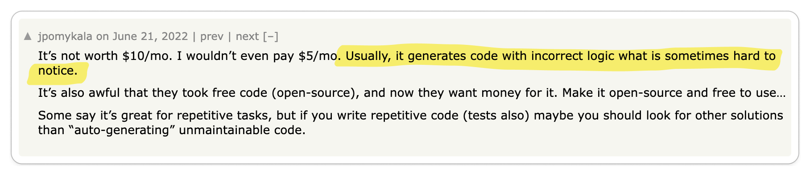
      </Figure>
  </Carousel.Slide>
</Carousel.Wrapper>

#### Key Takeaway 🔑

Developers expect reliability from their tools.

Copilot is not reliable, and therefore, certain developers have a tough time
wrestling with its output. Copilot lies or produces bad results for a vast
majority of the time. This can be exceedingly frustrating for developers who are
expecting Copilot to deliver on its promise of writing code for you. After some
bad experiences, some developers have even stopped using Copilot altogether.

For people who worry about job security, fear nothing, because Copilot is not
going to replace you anytime soon.

## 👎 Copilot creates more problems than solutions

Copilot is a tool that is supposed to help developers write code. However, its
unreliable results creates more problems than solutions.

<Carousel.Wrapper>
  <Carousel.Slide>
      <Figure caption={<a href="https://www.youtube.com/watch?v=RDd71IUIgpg&lc=UgwnC6wQIW_0R3jVRgJ4AaABAg">YouTube</a>}>
        
      </Figure>
  </Carousel.Slide>
  <Carousel.Slide>
      <Figure caption={<a href="https://www.reddit.com/r/webdev/comments/11hmsqp/comment/jav6ncb/?utm_source=share&utm_medium=web2x&context=3">Reddit</a>}>
        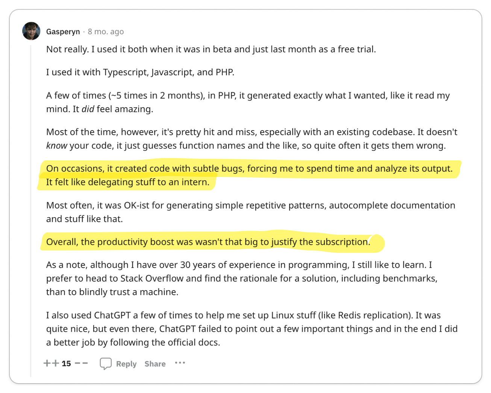
      </Figure>
  </Carousel.Slide>
  <Carousel.Slide>
      <Figure caption={<a href="https://www.reddit.com/r/webdev/comments/xk8lal/comment/ipcgrah/?utm_source=share&utm_medium=web2x&context=3">Reddit</a>}>
        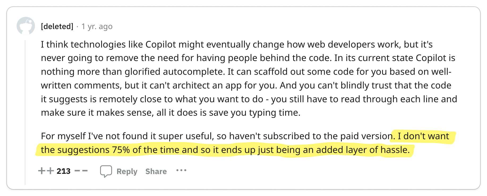
      </Figure>
  </Carousel.Slide>
  <Carousel.Slide>
      <Figure caption={<a href="https://news.ycombinator.com/item?id=31828276">Hacker News</a>}>
        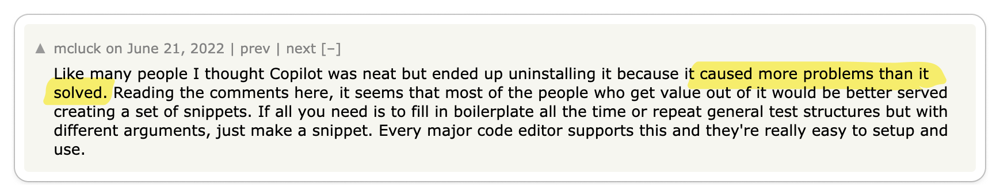
      </Figure>
  </Carousel.Slide>
  <Carousel.Slide>
      <Figure caption={<a href="https://www.reddit.com/r/webdev/comments/zc726g/comment/iyw1u5a/?utm_source=share&utm_medium=web2x&context=3">Reddit</a>}>
        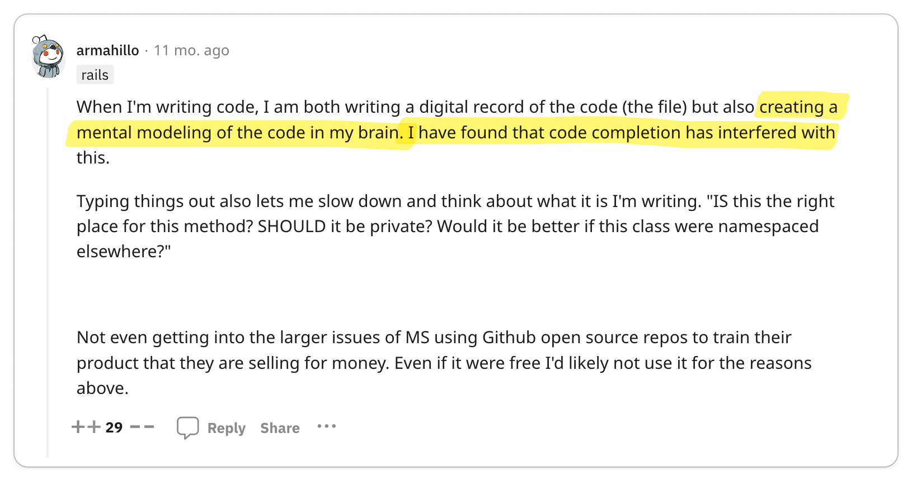
      </Figure>
  </Carousel.Slide>
  <Carousel.Slide>
      <Figure caption={<a href="https://www.youtube.com/watch?v=RDd71IUIgpg&lc=UgwVzIvvMrJ4c_01xsd4AaABAg">YouTube</a>}>
        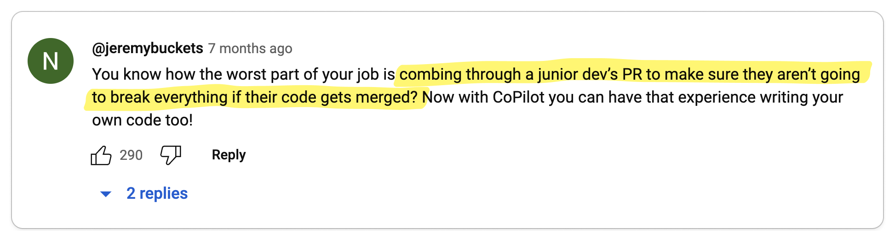
      </Figure>
  </Carousel.Slide>
</Carousel.Wrapper>

#### Key Takeaway 🔑

Copilot can waste your time.

 Code requires 100% accuracy, and inaccuracy can lead you down a rabbit hole of
 debugging. Often wasting time or flat out breaking your code.  In some cases,
 this is frustrating enough for developers to stop using Copilot altogether.
 Just like managing a junior developer, Copilot requires a lot of oversight.
 Sometimes subtle bugs can take more time to debug and fix than writing the code
 yourself. For some developers who find the output to be too inaccurate, Copilot
 becomes an interference and ultimately doesn't save them any time.

## 👍 Copilot helps you write software faster

Despite the inaccuracy of LLMs, if you treat Copilot as a tool that can help
take care of the boring stuff, it can be a powerful tool.

<Carousel.Wrapper>
  <Carousel.Slide>
      <Figure caption={<a href="https://www.reddit.com/r/webdev/comments/zc726g/comment/iyv62x3/?utm_source=share&utm_medium=web2x&context=3">Reddit</a>}>
        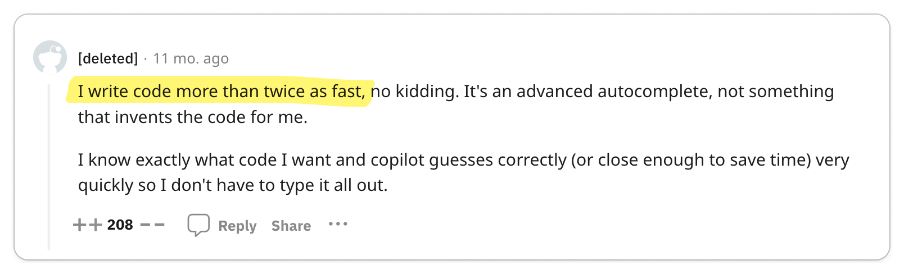
      </Figure>
  </Carousel.Slide>
  <Carousel.Slide>
      <Figure caption={<a href="https://news.ycombinator.com/item?id=31826614">Hacker News</a>}>
        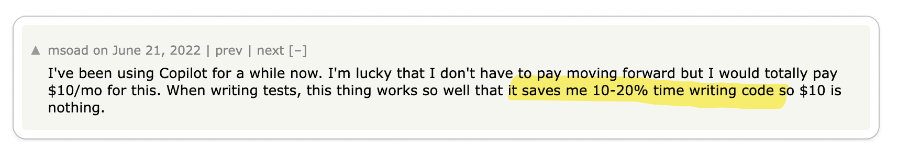
      </Figure>
  </Carousel.Slide>
  <Carousel.Slide>
      <Figure caption={<a href="https://www.reddit.com/r/webdev/comments/11hmsqp/comment/jau80h8/?utm_source=share&utm_medium=web2x&context=3">Reddit</a>}>
        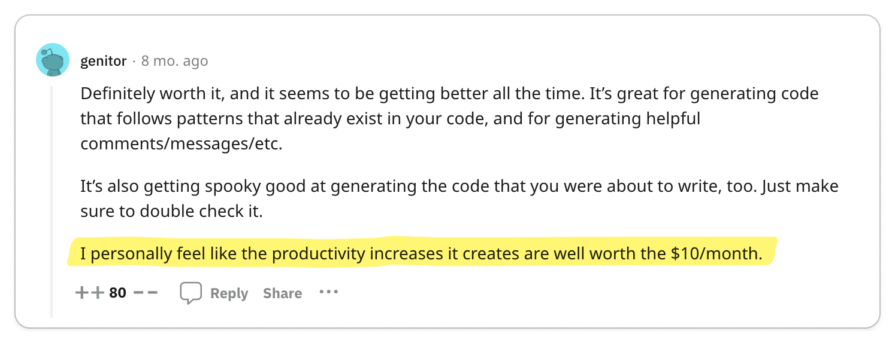
      </Figure>
  </Carousel.Slide>
  <Carousel.Slide>
      <Figure caption={<a href="https://www.reddit.com/r/webdev/comments/11hmsqp/comment/jaueocf/?utm_source=share&utm_medium=web2x&context=3">Reddit</a>}>
        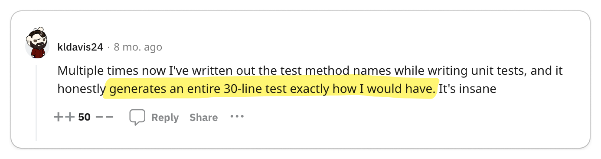
      </Figure>
  </Carousel.Slide>
  <Carousel.Slide>
      <Figure caption={<a href="https://www.youtube.com/watch?v=_KjSkGgaJ1k">YouTube</a>}>
        
      </Figure>
  </Carousel.Slide>
  <Carousel.Slide>
      <Figure caption={<a href="https://news.ycombinator.com/item?id=31826890">Hacker News</a>}>
        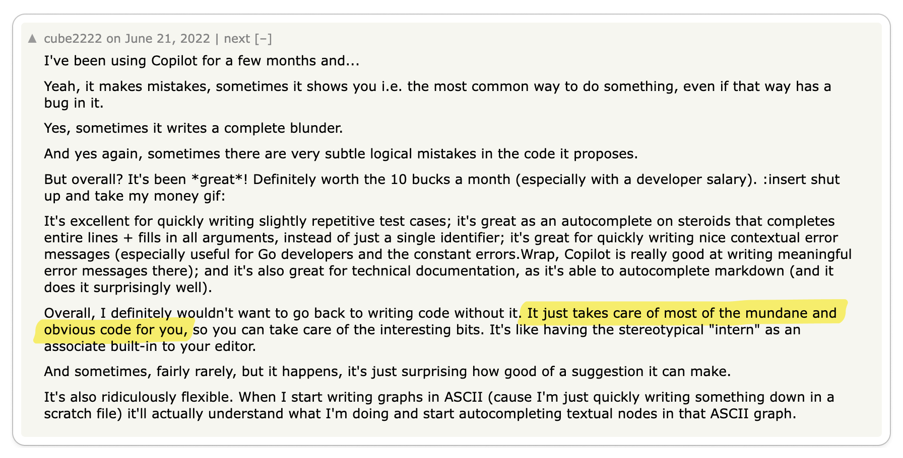
      </Figure>
  </Carousel.Slide>
  <Carousel.Slide>
      <Figure caption={<a href="https://www.reddit.com/r/webdev/comments/14lylhu/comment/jpyu6pq/?utm_source=share&utm_medium=web2x&context=3">Reddit</a>}>
        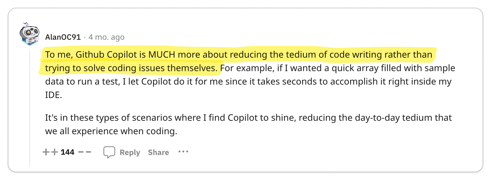
      </Figure>
  </Carousel.Slide>
  <Carousel.Slide>
      <Figure caption={<a href="https://www.reddit.com/r/webdev/comments/zc726g/comment/iyvlk2m/?utm_source=share&utm_medium=web2x&context=3">Reddit</a>}>
        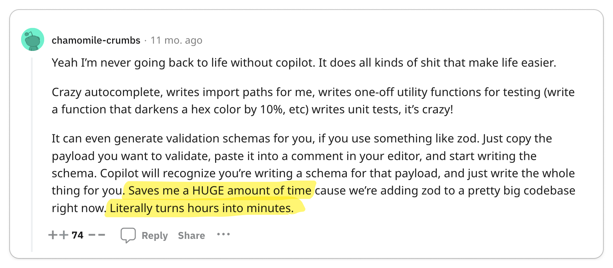
      </Figure>
  </Carousel.Slide>
  <Carousel.Slide>
      <Figure caption={<a href="https://www.reddit.com/r/webdev/comments/xk8lal/github_copilot_scares_me/">Reddit</a>}>
        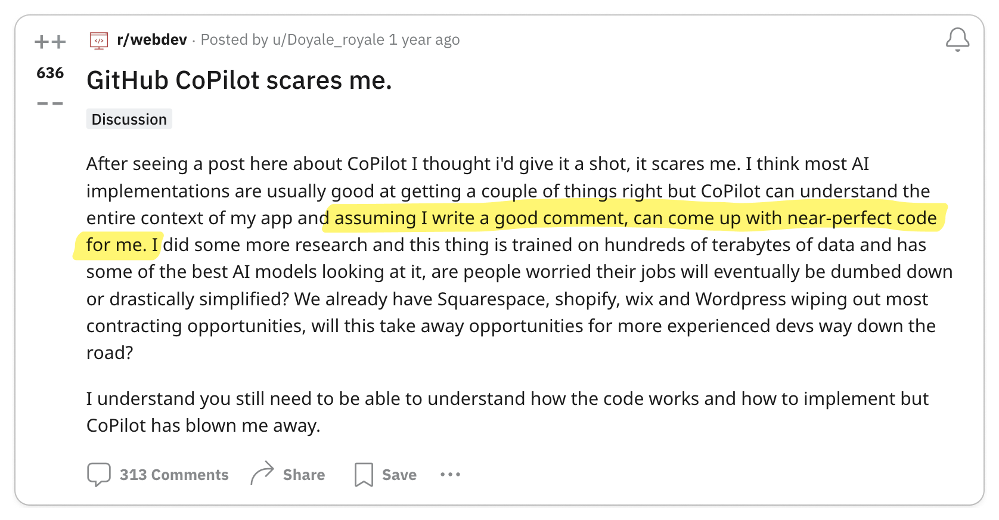
      </Figure>
  </Carousel.Slide>
</Carousel.Wrapper>

#### Key Takeaway 🔑

Copilot increases productivity.

Often, developers face mundane and repetitive tasks. Given enough context,
Copilot can do these tasks for you with sufficient accuracy. For some
developers, these tasks can be a significant time sink, and Copilot can help you
get that time back.

Based on the mentioned 10-20% increase in productivity, such an improvement is
substantial. For the sake of a conservative analysis, let's consider the lower
bound: if we assume an engineer is paid $100k/yr and becomes just 5% more
productive (half of the 10% reference), then with a yearly cost of
[$100](https://github.com/features/copilot#pricing) for Copilot, the tool brings
in an added value of $4900 for the company.

## 👍 Copilot helps you write better software

Copilot can be a great learning tool for junior developers, giving tech leads
more time to focus on higher-level tasks. Ultimately leading to better software
and happier developers.

<Carousel.Wrapper>
  <Carousel.Slide>
      <Figure caption={<a href="https://news.ycombinator.com/item?id=27676845">Hacker News</a>}>
        
      </Figure>
  </Carousel.Slide>
  <Carousel.Slide>
      <Figure caption={<a href="https://www.reddit.com/r/webdev/comments/xk8lal/comment/ipcybk8/?utm_source=share&utm_medium=web2x&context=3">Reddit</a>}>
        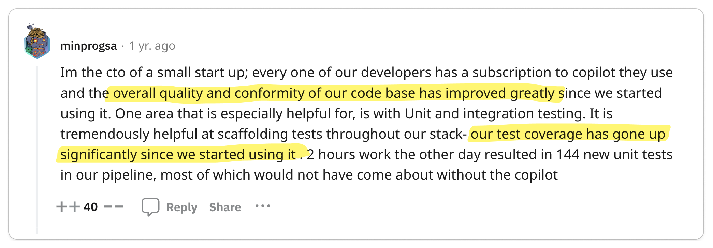
      </Figure>
  </Carousel.Slide>
  <Carousel.Slide>
      <Figure caption={<a href="https://news.ycombinator.com/item?id=31830789">Hacker News</a>}>
        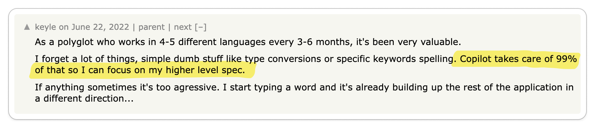
      </Figure>
  </Carousel.Slide>
  <Carousel.Slide>
      <Figure caption={<a href="https://news.ycombinator.com/item?id=31826524">Hacker News</a>}>
        
      </Figure>
  </Carousel.Slide>
  <Carousel.Slide>
      <Figure caption={<a href="https://x.com/scoumbourdis/status/1532613467567423492?s=20">x.com</a>}>
        
      </Figure>
  </Carousel.Slide>
  <Carousel.Slide>
      <Figure caption={<a href="https://www.youtube.com/watch?v=IavOJI5OV7g&lc=UgxLwkWPAAYQvBcak7J4AaABAg">YouTube</a>}>
        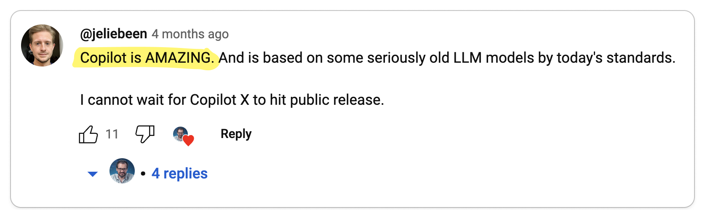
      </Figure>
  </Carousel.Slide>
</Carousel.Wrapper>

#### Key Takeaway 🔑

Copilot has enough intelligence to help you write better software.

This holds especially true for junior developers still learning the ropes.  It
can drastically make mundane tasks like documentation and testing easier, giving
developers more time to focus on the bigger picture while maintaining a high
standard of code quality. Multiplying this effect across an engineering team
leads to a higher quality codebase—the ultimate dream for engineering leaders.

## 🧐 Copilot is like a calculator

Copilot is a tool that can help you solve problems faster, but it is not a
replacement for your brain. You still need to know how to solve problems, and
you still need to know how to write code.

<Carousel.Wrapper>
  <Carousel.Slide>
      <Figure caption={<a href="https://www.reddit.com/r/webdev/comments/zc726g/comment/iyv3b6e/?utm_source=share&utm_medium=web2x&context=3">Reddit</a>}>
        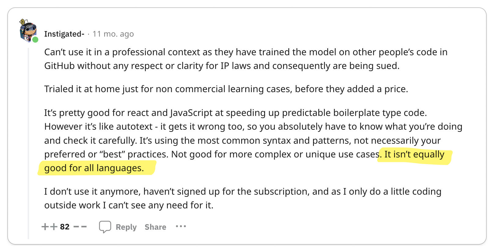
      </Figure>
  </Carousel.Slide>
  <Carousel.Slide>
      <Figure caption={<a href="https://www.reddit.com/r/webdev/comments/xk8lal/comment/ipcrmg5/?utm_source=share&utm_medium=web2x&context=3">Reddit</a>}>
        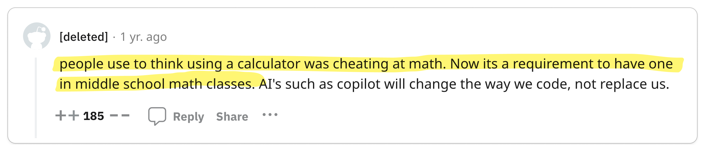
      </Figure>
  </Carousel.Slide>
  <Carousel.Slide>
      <Figure caption={<a href="https://www.youtube.com/watch?v=RDd71IUIgpg&lc=Ugzyhhcfmliu0fZbngR4AaABAg">YouTube</a>}>
        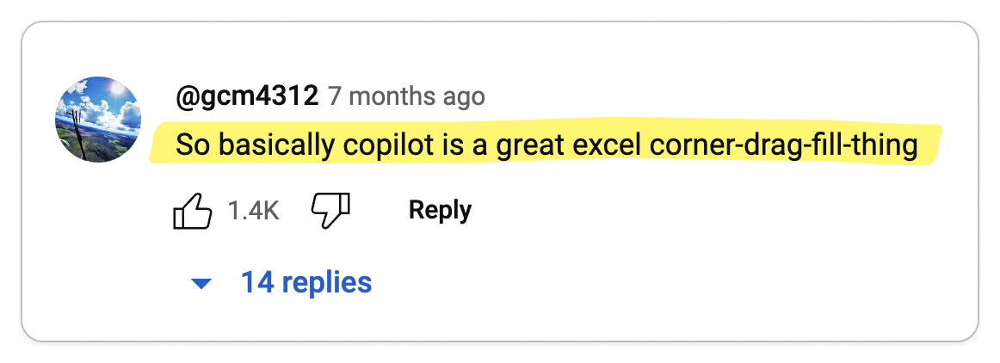
      </Figure>
  </Carousel.Slide>
  <Carousel.Slide>
      <Figure caption={<a href="https://www.youtube.com/watch?v=RDd71IUIgpg&lc=UgzLBXWrgjrk9U-gdB14AaABAg">YouTube</a>}>
        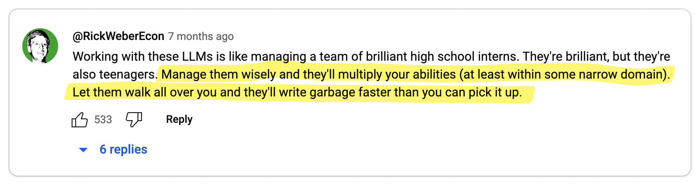
      </Figure>
  </Carousel.Slide>
  <Carousel.Slide>
      <Figure caption={<a href="https://x.com/kelseyhightower/status/1412855977452490755?s=20">x.com</a>}>
        
      </Figure>
  </Carousel.Slide>
  <Carousel.Slide>
      <Figure caption={<a href="https://www.reddit.com/r/programming/comments/156s33l/comment/jt1erb4/?utm_source=share&utm_medium=web2x&context=3">Reddit</a>}>
        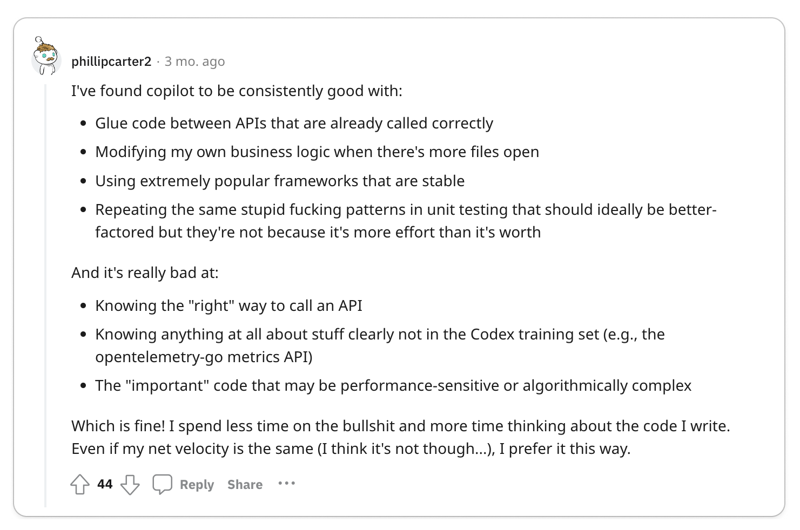
      </Figure>
  </Carousel.Slide>
</Carousel.Wrapper>

#### Key Takeaway 🔑

Just as calculators enable mathematicians to solve problems more quickly,
Copilot spares developers from focusing on repetitive tasks.

However, just like calculators, Copilot does not help you make sense of the
problem. You still need to know how to solve problems, and you still need to
know how to write code.

# Conclusion

Opinions on Copilot vary; some see it as a blessing, while others regard it as a
curse. For its proponents, Copilot is a valuable tool that enhances coding speed
and quality. However, critics argue it introduces more issues than it resolves.

I suspect that the complexity of a task makes a big difference in the quality of
output. Working on tasks that require more context will inevitably lead to worse
results. Yet, when viewed simply as a tool to handle the mundane aspects of
coding, Copilot reveals its potential.

<Admonition type="info" title="Our opinion">
At [Konfig](https://konfigthis.com), we use Copilot and ChatGPT daily and have
found them to be incredibly useful. We are excited to see what the future holds
for LLMs and are looking forward to using more tools that help developers write
better. We would be very disappointed if we could not use Copilot anymore.
</Admonition>