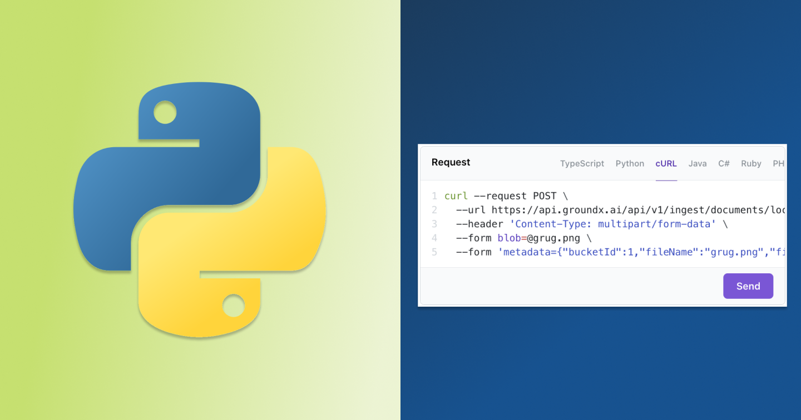
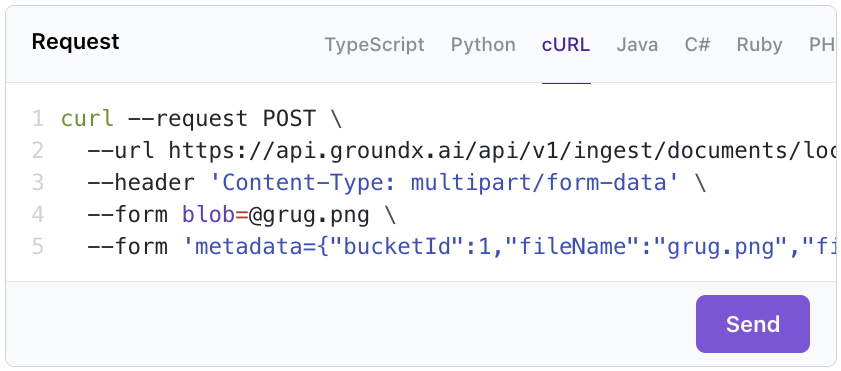

## Python SDK Refactor

We've refactored the Python SDK to return Pydantic-based response values which
allows for using the
[__getattr__](https://docs.python.org/3/reference/datamodel.html#object.__getattr__).
This is slightly more concise than the previous version, which used the
[`__getitem__`](https://docs.python.org/3/reference/datamodel.html#object.__getitem__)
syntax to access response values.

### Before

Previously, you had to use the `[]` syntax to access response values

```python
response = client.store.place_order(quantity=1000)
print(response.body["order_id"])
```

### After

With Pydantic-based response values, you can use the `.` syntax to access

```python
response = client.store.place_order(quantity=1000)
print(response.order_id)
```

Notice how there is also no need to use the `body` attribute to access the
response body. All new Python SDKs will be using this new syntax.

We will not be updating previously generated Python SDKs to use this new syntax
to ensure backwards compatibility.

## Non-SDK Snippets in API Portal

<Figure caption="Example of generated snippet for using cURL">

</Figure>

The API Reference page now generates non-SDK code snippets such as cURL or
languages that do not have an SDK. This allows you to quickly copy and paste
code snippets regardless of whether or not there is an SDK for your language.

{/* TRUNCATE */}

<details>
<summary>Improvements and Fixes</summary>
- Redesigned our landing page https://konfigthis.com
- Fix bug in TypeScript SDK
- Add `filterPaths` configuration which allows you to automatically filter out paths from the generated SDKs
- Allowed configuration of port for mock server
- Restyled our documentation to be more consistent with our website
- Add `--skipDirtyGitCheck` in `konfig publish`
- Fixed OAuth Authentication Flow Java SDK
- Allow configuration of token URL in Java SDK
- Fixed generated tests in C# SDK
- Fixed bug in TypeScript SDK when no models are specified in the OAS
- Fixed `apiKey` being unnecessarily typed as `required` in TypeScript
- Fixed reference links in Python SDK for https://pypi.org
- Add option to force use Twine credentials for publishing in `konfig publish`
- Fix dependency vulnerability in Python SDK
- Fix dependency vulnerability in TypeScript SDK
- Fixed scrollbar shifting layout in Windows for API Portal
- Removed dependency on the `validators` package in Python SDK
- `konfig fix` now removes trailing slash from server URLs
- Internally: testing pipeline improvements to increase stability and quality of our SDKs (Blog post incoming!)
</details>