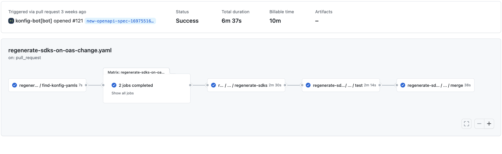

import Head from "@docusaurus/Head";

<Head>
  <title>Konfig vs. Open Source</title>
  <meta property="og:title" content="Konfig vs. Open Source" />
  <style type="text/css">
  {`
  @media (min-width: 996px) {
    .col--7 {
    --ifm-col-width: calc(9 / 12 * 100%);
    }
  }
  `}
  </style>
</Head>


Konfig offers numerous benefits when generating SDKs from OpenAPI compared to
utilizing an open-source library or crafting them manually. These benefits
significantly impact your engineers and business in a positive manner. In this
article, we will outline these crucial advantages.

{/* TRUNCATE */}

## Key Advantages

Konfig offers **3 key advantages** over the [most popular open source library
for generating SDKs from OpenAPI](https://openapi-generator.tech/).

### Linting

<Figure caption={<span>Example output of Konfig's Linter catching errors regarding <a href="/docs/tutorials/naming-operation-ids">Operation IDs</a></span>}>
```shell
~/acme-sdks
❯ konfig lint api.yaml

/Users/dylanhuang/Git/konfig/customers/acme/acme-sdks/api.yaml
48:20 warning operationId-pattern Does not match regex: "/^[a-zA-Z0-9]+\_[a-zA-Z0-9]+$/g". Prefix operation IDs with "Tag_" (https://docs.konfigthis.com/tutorials/naming-operation-ids)  paths./pet.post.operationId
  72:20  warning  operationId-pattern   Does not match regex: "/^[a-zA-Z0-9]+\_[a-zA-Z0-9]+$/g". Prefix operation IDs with "Tag*" (https://docs.konfigthis.com/tutorials/naming-operation-ids) paths./pet.put.operationId
101:20 warning operationId-pattern Does not match regex: "/^[a-zA-Z0-9]+\_[a-zA-Z0-9]+$/g". Prefix operation IDs with "Tag*" (https://docs.konfigthis.com/tutorials/naming-operation-ids) paths./pet/findByStatus.get.operationId

```
</Figure>

Code generators are [garbage in, garbage
out](https://en.wikipedia.org/wiki/Garbage_in,_garbage_out).

So if you provide a generator (even ours) with an OpenAPI specification that is low-quality,
its impossible for any tool to guarantee a high quality output.

To solve this, Konfig provides you a hand-crafted [linter](/docs/lint-rules)
specifically designed to ensure that you always produce high quality SDKs. When
using the open source solution you are on your own to ensure that your OpenAPI
specification is high-quality. **This can take weeks of continuous engineering
time to get right.**

### Higher Quality Output

The Open Source library that we mentioned above does a great job of supporting
[many languages and frameworks](https://openapi-generator.tech/docs/generators),
but it does not provide the same level of quality as Konfig. When publishing
SDKs for your customers to write code against, quality is paramount. Lets take a
look at a comparison in between the Open Source library and Konfig.

#### Example Snippet Comparison

To compare the quality of the output, we will look at a snippet of code from the
Python SDK generated by the Open Source library and Konfig.

<CH.Scrollycoding>

First, lets examine a snippet that makes a simple API call using a Python SDK
generated by the Open Source library. Note that this snippet is automatically generated and placed in the `README.md` of the
Python SDK under a section called "Getting Started".

The first thing to notice here is there are **43** lines to make a simple request.

```python
# from ./roi-assets/open_source.py
```

---


**16** are dedicated to imports, some of which are not even used.

```python focus=1:16
```

---


**12** are dedicated to instantiating a `Configuration` object.


```python focus=17:29
```

---

**10** are dedicated to instantiating an `ApiClient` object and
making the API call.

```python focus=33:43
```

---

In particular, the code for calling an API is redundant and non-ergonomic.

1. This is redundant.

`
installment_plan_api.InstallmentPlanApi(api_client)
`

2. This is not ergonomic.

`
api_response = api_instance.cancel(installment_plan_number, x_splitit_idempotency_key)
`

```python focus=35:40
```

---

**With Konfig**, you can delete out all of the unnecessary code and get right to the
point of instantiating the SDK and making the API call.


In total, using Konfig only takes **15** lines of code 🤩.

```python
# from ./roi-assets/konfig.py
```

---

There is no need for a long list of imports. Just import the ergonomically named
SDK.

```python focus=1
```

----

No need for instantiating a `Configuration` or `ApiClient` object. Just instantiate
SDK directly.

```python focus=3:10
```

---

Making the API call is ergonomic and easy to read.

```python focus=12:16
```

</CH.Scrollycoding>

### Automation

<Figure caption="GitHub Actions UI for a workflow that automates the regeneration of SDKs">

</Figure>

Once you've generated your SDKs, you need to publish them to your customers.
For every API update, you need to regenerate the SDKs and publish them again.
The open source solution is only a generator, not an automation framework.
This means that you are on your own to figure out how to automate the process
of generating and publishing SDKs. This can take months of engineering time to
get right.

Konfig is a full SDK automation framework. This means that you can automate
the entire process of generating and publishing SDKs. This includes:

1. [Testing](/docs/tutorials/automate-sdk-updates#how-it-works)
1. [Versioning & Publishing](/docs/tutorials/automate-sdk-updates#versioning-and-publishing)
1. [Manual & Automated updates](/docs/tutorials/automate-sdk-updates#how-it-works)
1. [GitHub Actions](https://github.com/konfig-dev/automation/tree/5f0ce6b13681a7c8a313533e45e81287d9d42d6a)
1. [Submodule Support](/docs/tutorials/automate-sdk-updates#additional-setup-for-submodules)
1. [Polling](/docs/tutorials/automate-sdk-updates#polling)
1. [Breaking Change Detection](/docs/tutorials/setup-breaking-change-detection)
1. [Linting in CI](/docs/tutorials/setup-linting#github-action-setup)

To build the tooling that can do all of this would take months of engineering
time. With Konfig, you can get started in minutes.

## The Impact of Konfig on Your Business

Now that you have an understanding of the advantages of using Konfig for your
customers, let's discuss the impact on the dollars and cents of your business.
From a cost savings perspective, it's no secret that engineers are very
expensive and SDKs are hard and time consuming to create. Even large companies
like Twilio are devoting 2 or more engineer's time to update their SDKs after
every API update, so by using Konfig, you can save on the cost of 1 or 2 full
time engineers or roughly a $200k+ per year annual cost saving.

From a revenue generation perspective, easier onboarding with SDKs in all major
languages means more customers can evaluate your product and if they buy, they
can integrate your API and start paying you faster. While the exact dollar
amount of revenue gained by using Konfig depends on your contract size, our case
study with SnapTrade shows how they were able to double the number of prospects
evaluating their product, increase customer conversion of those prospects, and
significantly reduce onboarding time by using Konfig.

Any way you look at it, the ROI of using Konfig is significant. If you are
interested in learning more, you can check out our documentation or book a demo
with us. We would love to hear from you!

Please [book a demo](/schedule-demo) with us to learn more about how Konfig can
help your business.