[OpenAPI](/blog/openapi) makes it really easy to generate documentation for your API. There are a
number of open source and paid solutions that make it easy to generate
documentation for your API. To determine the best solution for your needs, we
researched and compared the best open source and paid OpenAPI documentation
generators.

At the end, we give our opinion on which solution is best for you depending on
your requirements and current setup.

{/* TRUNCATE */}

## Open Source

If you have the bandwidth to set up and maintain your own OpenAPI documentation
generator, then you should consider using one of the following open source
solutions. Open Source solutions are always free and usually highly
customizable.

### [Slate](https://github.com/slatedocs/slate)

<Figure caption={<a href="https://slatedocs.github.io/slate/#introduction">Demo of Slate</a>}>
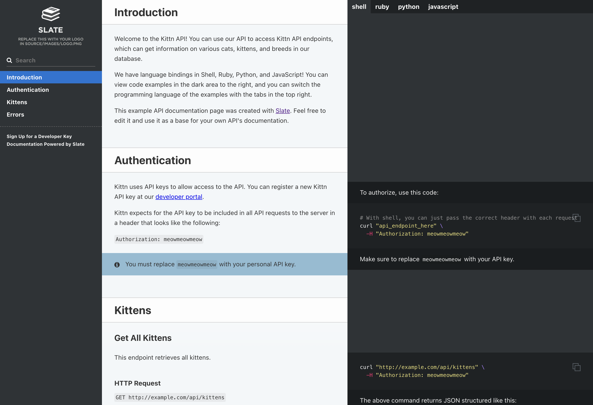
</Figure>

| GitHub | Docker |
| --- | --- |
|  | 

Slate has the most GitHub stars out of documentation generators for OpenAPI.
Its UI/UX is unique in that it puts everything on a single page.

#### Pros

- Git-based
- Free and open-source
- Great community support with large number of GitHub stars
- Generates static code Snippets for making API requests
- Supports custom documentation with Markdown
- Supports custom code snippets

#### Cons

- Requires technical resources for installation and maintenance
- Support for custom layout is limited
- Compared to other solutions, the feature set is limited and design is less
modern

### [Swagger UI](https://github.com/swagger-api/swagger-ui)

<Figure caption={<a href="https://petstore.swagger.io/">Demo of Swagger UI</a>}>
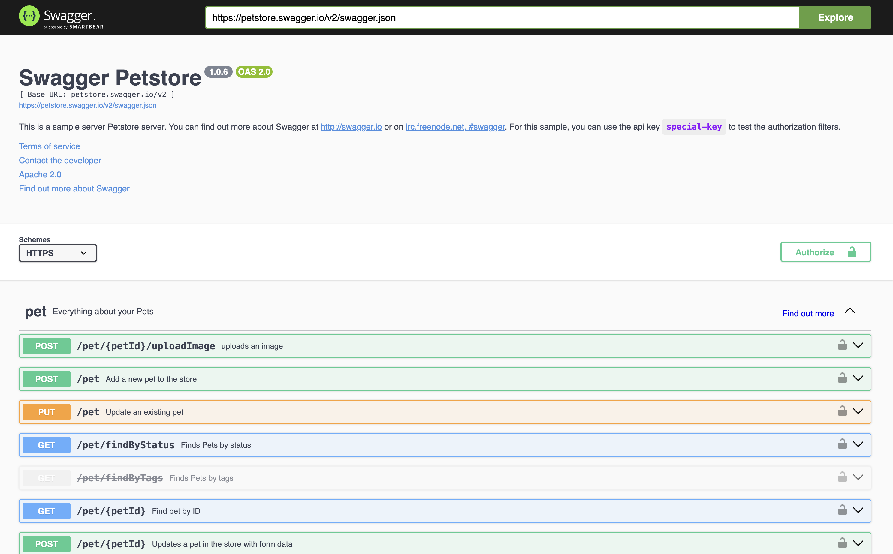
</Figure>

| GitHub | NPM |
|  --- | --- |
|  |  |

Swagger UI is one of the earliest and most well-known OpenAPI documentation generators. OpenAPI
(formerly known as Swagger), is open-sourced by
[SmartBear](https://smartbear.com/) and is the most popular OpenAPI
documentation generator.

#### Pros

- Integrates with SwaggerHub
- [Integrates with Spring Boot](https://www.baeldung.com/spring-rest-openapi-documentation)
- [Integrates with Express.js](https://www.npmjs.com/package/swagger-ui-express)
- Great community support with large number of GitHub stars
- Interactive API requests in the browser

#### Cons

- UI/UX is a little out-dated
- Does not support custom documentation

### [Redoc](https://github.com/Redocly/redoc)

<Figure caption={<a href="https://redocly.github.io/redoc/">Demo of Redoc</a>}>
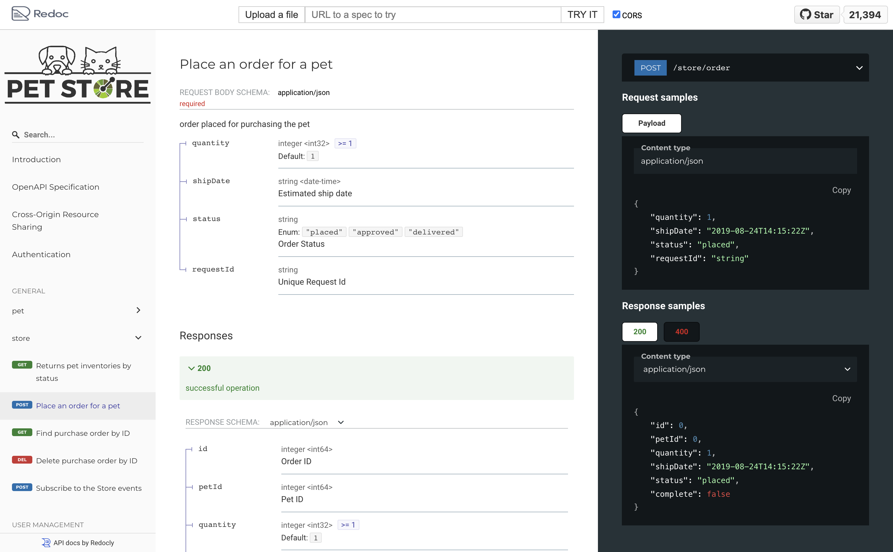
</Figure>

| GitHub | NPM |
|  --- | --- |
|  |  |

Redoc is another beautiful static documentation generator for OpenAPI open-sourced by [Redocly](https://redocly.com/).

#### Pros

- Supports OAS 3.1 Webhooks
- Git-based
- Can be integrated into your existing website
- Supports custom code samples through a vendor extension
- Lots of [configuration options](https://redocly.com/docs/redoc/config/)
- Helpful customization options through [various vendor extensions](https://redocly.com/)

#### Cons

- UI/UX is a little clunky looking
- Does not support custom documentation
- Does not support making API requests from the browser
- Limited feature set compared to the paid version (see differences [here](https://redocly.com/redoc-vs-reference/))

### [Elements](https://github.com/stoplightio/elements)

<Figure caption={<a href="https://elements-demo.stoplight.io/#/operations/post-todos">Demo of Elements</a>}>
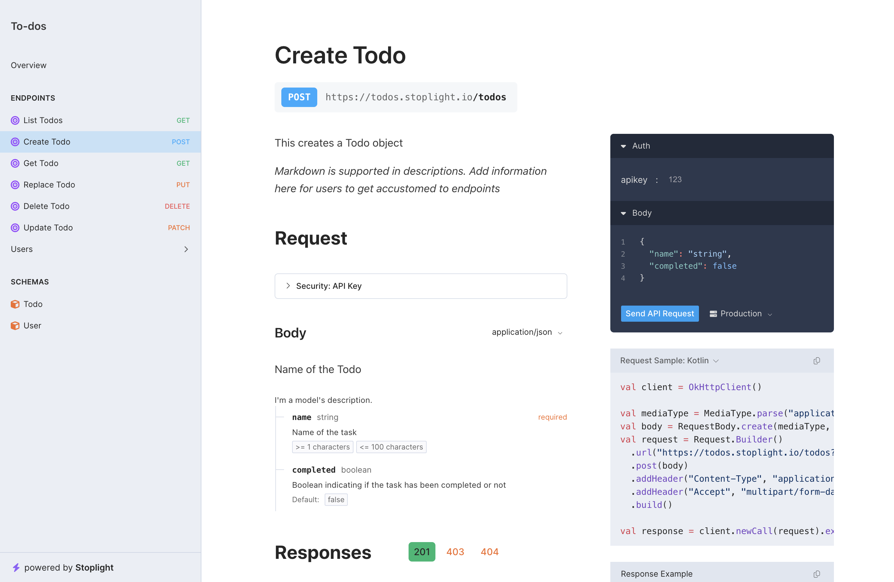
</Figure>

| GitHub | NPM |
|  --- | --- |
|  |  |

Elements is a documentation generator for OpenAPI open-sourced by [Stoplight](https://stoplight.io/).

#### Pros

- The best UI/UX of open source OpenAPI documentation generator
- Generates documentation for schemas
- Automatically generates code samples for making API requests
- Can be integrated into your existing website
- Allows for custom documentation
- Supports making API requests from the browser
- Integrates with [Stoplight Platform](https://stoplight.io/solutions)

#### Cons

- Not as popular as other open source solutions
- Requires technical resources for installation and maintenance
- Support for custom layout is limited

### Plugins for Docusaurus

<Figure caption="Documentation for Docusaurus">
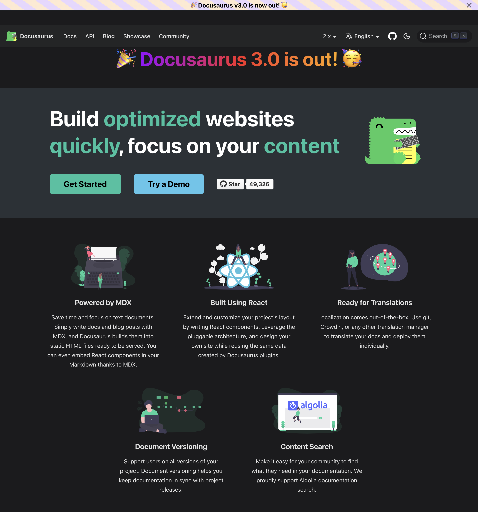
</Figure>

| Plugin | GitHub | NPM |
| --- | --- | --- |
| [docusaurus-openapi](https://github.com/cloud-annotations/docusaurus-openapi) |  |  |
| [docusaurus-openapi-docs](https://github.com/PaloAltoNetworks/docusaurus-openapi-docs) |  |  |

[Docusaurus](https://docusaurus.io/) is an open-source, static site generator developed by Facebook's
team, built on React, and suitable for teams publishing documentation.

If you are already using Docusaurus, there are two plugins for Docusaurus for generating OpenAPI documentation:

<Carousel.Wrapper>
<Carousel.Slide>
    <Figure caption="docusaurus-openapi">
    
    </Figure>
</Carousel.Slide>
<Carousel.Slide>
    <Figure caption="docusaurus-openapi-docs">
    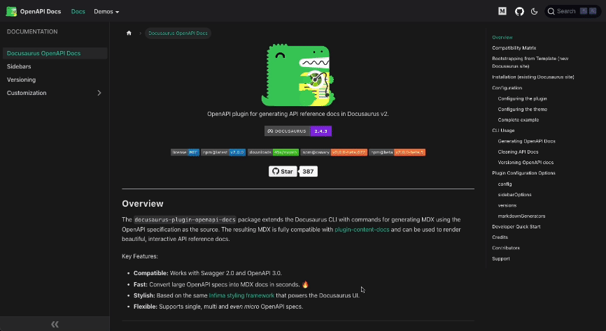
    </Figure>
</Carousel.Slide>
</Carousel.Wrapper>

Both plugins are nearly equivalent in terms of feature set. We personally like
the UI/UX of `docusaurus-openapi-docs` better but `docusaurus-openapi` has more
stars on GitHub. We suggest you try both and see which one you like better or simply works
better for your OpenAPI specification.

#### Pros

- Git-based
- Free and open-source
- Highly customizable
- Configurable layout/navigation
- SEO optimized
- Supports blog posts
- Supports MDX and JSX.
- Generates static code Snippets for making API requests
- Great search integrations with Algolia or offline search
- Rich Plugin Ecosystem
- Supports multiple versions of your API
- Supports custom documentation with Markdown

#### Cons

- Requires technical resources for installation and maintenance.
- Can be costly in terms of technical expertise to setup and maintain
- UI/UX for OpenAPI plugins is not as polished as paid solutions
- Needs a secure proxy to enable interactive requests in the browser

## Paid (Monthly Fee)

If the open source solutions are not suitable for your needs, then you should
consider using one of the following paid solutions. Paid solutions are usually
hosted and maintained by the company that created them. This means that you
don't have to worry about installation and maintenance. Paid solutions are
usually more feature rich and have better UI/UX than open source solutions.

### [Redocly](https://redocly.com/)

<Figure caption={<a href="https://redocly.com">Redocly Landing Page</a>}>
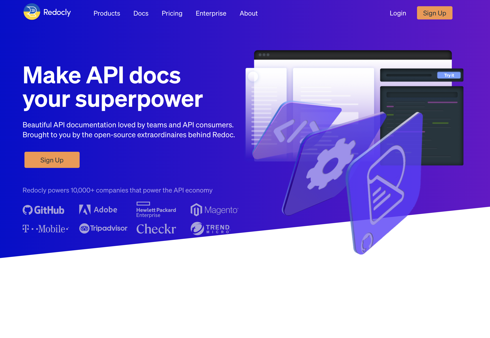
</Figure>

Redocly is a paid solution for generating OpenAPI documentation. Redocly is
developed by the same company that open-sourced [Redoc](#redoc).

#### Pros

- Managed solution
- Great search capabilities
- Allows making API requests from the browser
- Great UI/UX
- [Integrates with GitHub](https://redocly.com/docs/workflows/sources/github/#github)
- Embeddable into your existing website
- Supports custom documentation with [extended Markdown features](https://redocly.com/docs/developer-portal/guides/markdown/)
- Supports [step-by-step tutorials](https://redocly.com/docs/developer-portal/guides/step-by-step/) with embedded API request examples
- No per-user monthly fee

#### Cons

- Basic plan is limited
- Expensive if you just want a custom domain

#### Pricing

<Figure caption={<a href="https://redocly.com/pricing/">Redocly Pricing Page</a>}>
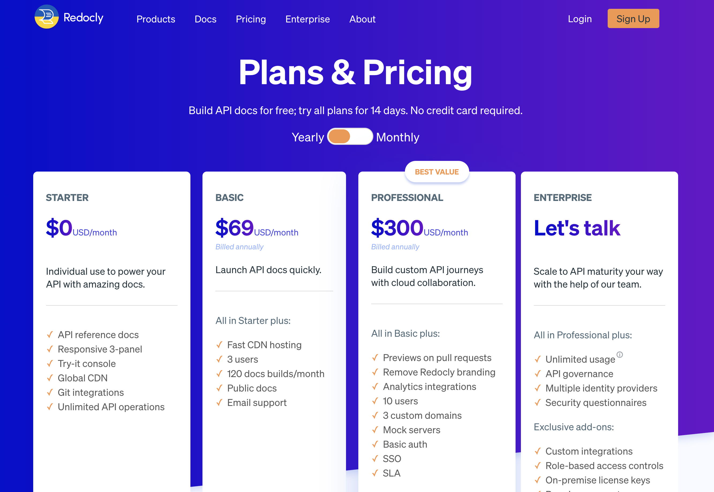
</Figure>

### Stoplight

<Figure caption={<a href="https://stoplight.io/">Stoplight Landing Page</a>}>
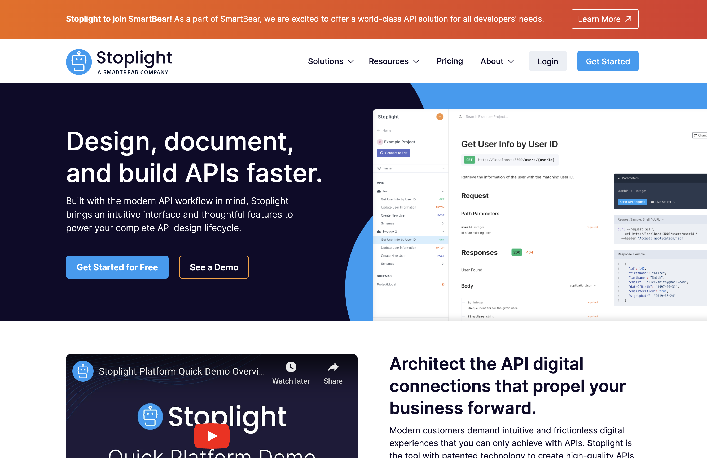
</Figure>

Stoplight is developed by the same company that open-sourced
[Elements](#elements). It is a much more comprehensive solution than Elements in
that includes a number of other tools for API developers to design and build
APIs together.

#### Pros

- Interactive API Documentation
- Managed solution
- Custom domains
- Code generated snippets for making API requests
- Custom documentation with Markdown
- Can make API requests from the browser
- Git-based
- Custom theming
- Search capabilities
- Great UI/UX
- Decent Basic/Startup Tier Pricing
- Google Analytics integration

##### Other Pros

Stoplight is not just a documentation generator, it is a full suite of tools for
API developers so we are listing some of the other pros here.

- SSO
- Collaboration features
- Great API Editor
- Mock servers powered by their open source [Prism](https://stoplight.io/open-source/prism) tool
- OAS validation powered by their open source [Spectral](https://stoplight.io/open-source/spectral) tool

#### Cons

- Can be pricy if you have a large team

#### Pricing

<Figure caption={<a href="https://stoplight.io/pricing/">Stoplight Pricing Page</a>}>
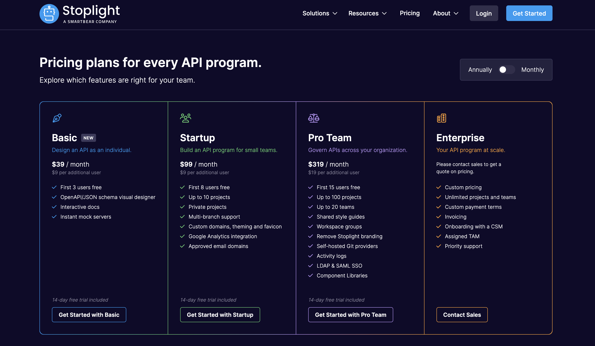
</Figure>

### [ReadMe](https://readme.com/)

<Figure caption={<a href="https://readme.com/">Readme.com API Documentation</a>}>
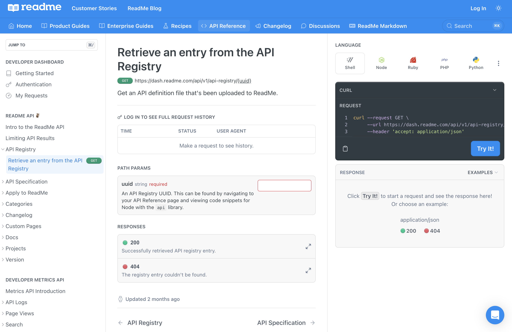
</Figure>

We have personally seen a lot of companies use ReadMe for their API
documentation. They seem to be the most mature documentation provider with more
of a focus on general public documentation rather than just API documentation.

#### Pros

- Mature solution
- Can make API requests from the browser
- Managed solution
- WYSIWYG editor
- Custom domains
- Code generated snippets for making API requests
- Startup tier is good for most use cases
- Analytics Support
- AI search capabilities
- Lots of features for making APIs easy to consume
  - API Key Dashboard
  - API Versions
  - Changelogs
  - Recipes
- GitHub action support for CD of OpenAPI documentation

#### Cons

- Expensive
- WYSIWYG editor can be limiting for advanced users
- No Git-based workflow for custom documentation

#### Pricing

<Figure caption={<a href="https://readme.com/pricing/">ReadMe Pricing Page</a>}>
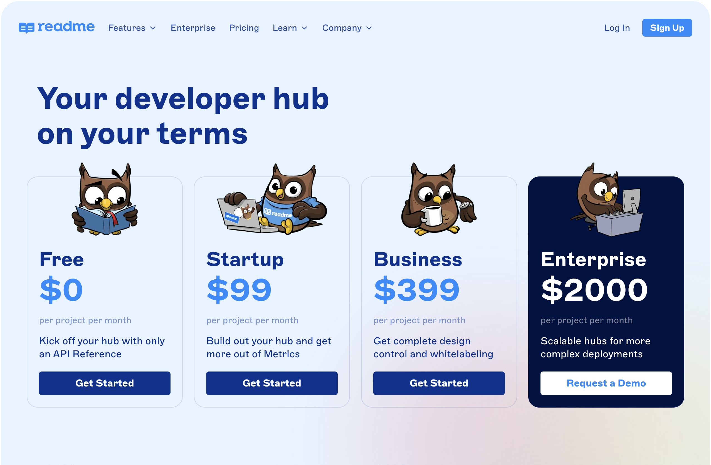
</Figure>

### [Konfig](https://konfigthis.com/#docs)

<Admonition type="info" title="Full disclosure">
As the developers of Konfig, we are excited to include our product in this list
to showcase its capabilities and benefits.
</Admonition>

<Figure caption={<a href="https://konfigthis.com/#docs">Konfig Landing Page</a>}>
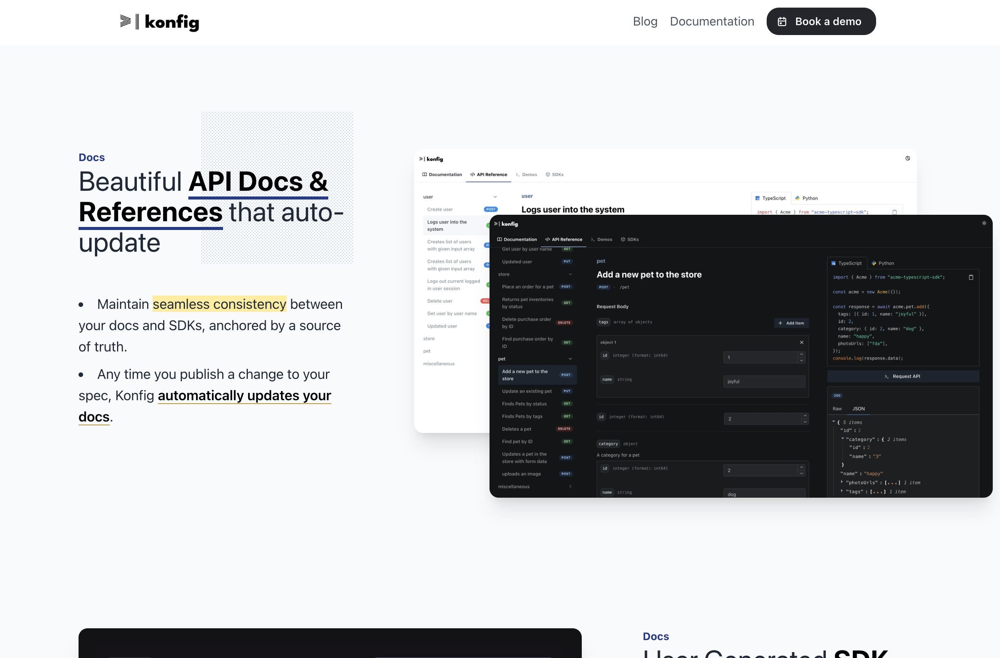
</Figure>

[Konfig](https://konfigthis.com/#docs) makes it easy to generate beautiful and interactive OpenAPI
documentation for your API. Konfig also generates SDKs for your API to make it
easy for your users to consume your API.

We believe that Konfig offers a compelling advantage over other solutions for
API developers by also [generating SDKs](https://konfigthis.com/#sdks) that
natively integrate into your API documentation.

#### Pros

- Also generates SDKs that natively integrate into your API documentation
- Beautiful UI/UX for OpenAPI documentation
- Can make API requests from the browser
- Managed solution
- Custom domains
- Fast client-side search
- Code generated snippets for making API requests
- Google Analytics Support
- GitHub action support for CD of OpenAPI documentation
- Configuration for styling
- Git-based workflow

#### Cons

- No WYSIWYG editor for custom documentation
- Immature relative to other solutions

#### Pricing

To learn more, you can schedule a demo [here](/schedule-demo) and we will be
happy to walk you through the product and answer any questions you may have
about the product and pricing.

## Other Paid Solutions

Here are other paid solutions that we did not include in this comparison.

- [Bump.sh](https://bump.sh/)
- [Document360](https://document360.com/)
- [Fern](https://buildwithfern.com)
- [Doctave](https://www.doctave.com/)
- [Gitbook](https://www.gitbook.com/)
- [Theneo](https://www.theneo.io/)
- [Scalar](https://scalar.com/)

## Our Opinion

**If you are looking for a free and open source solution and are open to using a
newer solution**, then we recommend using
[Elements](https://github.com/stoplightio/elements) as it has the best UI/UX and
is the most feature rich of the open source solutions. Its also open-sourced by
[Stoplight](https://stoplight.io/) which is a company that has built a lot of
other great tools for API developers such as
[Prism](https://stoplight.io/open-source/prism) and
[Spectral](https://stoplight.io/open-source/spectral).

**If you are already
using a server framework like [Spring
Boot](https://spring.io/projects/spring-boot) or
[Express](https://expressjs.com/)**, then you should consider using [Swagger
UI](https://github.com/swagger-api/swagger-ui) as there are already integrations
for these frameworks.

**If you are already using [Docusaurus](https://docusaurus.io/)**, then you should consider using one of the two
[plugins](#plugins-for-docusaurus).

**If you are in the market for a paid solution, we suggest
[ReadMe](https://readme.com/)** as they seem to be the most mature and have the
more comprehensive feature set for API documentation.

**If you are also looking for a suite of tools for API development**, then you
should consider [Stoplight](https://stoplight.io/). We personally love
[Prism](https://stoplight.io/open-source/prism) and
[Spectral](https://stoplight.io/open-source/spectral) and use them in our own
projects.

**If you are looking for a paid solution that also generates SDKs for your API**,
then you should consider [Konfig](https://konfigthis.com/). We work really hard
to ensure that the documentation looks and feels extremely polished and is easy
to use. And our native integration with SDKs makes it easy for your users to
consume your API and get started quickly.

### Should I use a paid or open source solution?

In our opinion, you should initially explore an open source solution and see if it
fits your needs. If it does, then you should use it. Also, if your API does not
update frequently, then you should consider using an open source solution as
they are usually free and you don't have to worry about maintenance.

If you are an API-first company whose sole product is an API, then you should
consider using a paid solution as they are usually more feature rich and have
better UI/UX than open source solutions. Also, if your API updates frequently,
paid solutions usually have better support for automatically updating your
documentation.