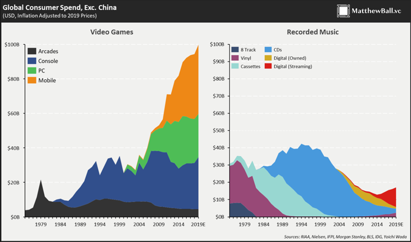
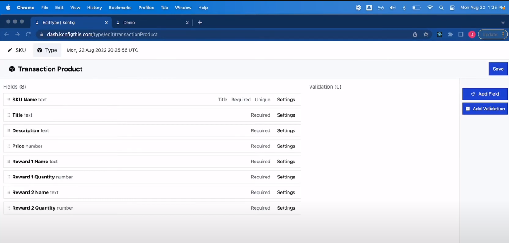

<Admonition type="info" title="summary">
- Even though the gaming TAM looks large on paper, gaming companies have diverse needs. There are nuances that shrink the TAM depending on what types of gaming companies have the hair on fire problem that your product solves
- Based on our ideal customer profile, we had to adopt an enterprise go to market motion which was challenging to get initial traction for
- We needed to truly be 10x better off the bat since we were looking to replace a core function for gaming companies and we couldn't get there
</Admonition>

A startup is a long and difficult journey, one that I was wholly unprepared for
despite having a decade of work experience in finance and tech. Learnings from
one failed startup influence the next startup attempt, so to take a step back
and discuss why I got into the gaming space in the first place, I have to talk
about my first [startup](https://www.ycombinator.com/companies/tai), an investment app that helped people learn about and
construct portfolios of ETFs, that I co-founded in 2021.

In this startup, my cofounder and I made every single mistake in the book due to
a lack of experience as first time founders. Everything went wrong and when we
were just about to quit, we applied to Y Combinator on a whim (our response to
why do you want to join YC was “We don't know if we really want to”) and
surprisingly, we got in to the Winter 2022 batch. YC was an amazing experience
where I learned a ton about how to navigate the tumultuous pre-product market
fit stage of a startup.  However, we were unable to find product market fit, and
the company was acquired in August 2022, leaving me determined to try again
using everything I learned in YC.

## Why We Chose to Build in Gaming

When deciding what to build next, I had 3 principles in mind:

- B2B is a lot easier on average than B2C because there is a more obvious, tried and true go-to-market motion (outbound sales)
- To pick a space that I was or could be an expert in. This would allow for a better understanding of problems potential customers faced as well as a network to find our first customers
- To pick a space with a large TAM and some evidence that similar-ish companies had previously been successful

Gaming was a perfect fit for these principles because 1) gaming companies use a
lot of tools to build and operate their products 2) I am a huge gamer and
previously worked as a product manager at Scopely, one of the largest Western
mobile gaming publishers, so I was intimately familiar with problems gaming
companies face and had strong founder market fit and 3) gaming was a huge ($100B
TAM excluding China) and fast growing market with some previously successful B2B
companies like Unity and AppLovin.

<Figure caption={Source: <a href="https://matthewball.vc">matthewball.vc</a>}>

</Figure>

## What We Built

Now that I knew what sector I wanted to focus on, the next thing to figure out
was what type of product to build. Here I drew on my experience working as a
product manager running live operations at Scopely.

Live operations is a style of game management that treats a game as a live
service and continually delivers new features, updates, sales, in-game events,
and improvements to a launched game to improve the experience for players. Most
successful free-to-play games, including heavyweights such as Clash of Clans,
Genshin Impact, and Call of Duty Mobile, rely on live operations as a crucial
component to their business strategy for monetizing and retaining users over a
long period of time.

The key to successful live operations is having tools that allow non-engineers
to quickly push different event types, such as in-app purchases (IAPs),
tournaments, new campaigns, etc, to production. I knew from firsthand experience
that these tools were always built in-house and were very difficult and
time-consuming to build properly and maintain. Furthermore, poor tooling
prevents a game's live operations team from being able to operate at the speed
required to successfully hit revenue and retention targets as well as making
their lives absolutely miserable. This was the number 1 pain point I had running
a live operations team at Scopely (live operations staff would actually quit
because they got fed up using our tool) and at many other mobile gaming
companies.

Our vision then was an out-of-the-box live operations tool. We built a
specialized headless Content Management System (CMS) that allowed live
operations teams to quickly configure and push events to production via a single
API. Using Konfig, a game team could create data models representing different
types of events (or use ones pre-built by us), populate those models with
validated data, and push those events to a single endpoint where the game's
frontend could pick those events up and display them in any way they want with
any logic that they want.

<Figure caption="Konfig's Live Operations Tool">

</Figure>

We even had advanced features such as segmentation that would allow games to
customize experiences for certain groups of players.

All in all, I felt that what we had built would have solved my problems as a
product manager and, with such a large market, could solve a lot of other
people's problems as well.

## What Went Wrong

Except that's now quite how things turned out. It turns out that we made three
key assumptions that turned out to be false and made it difficult for us to get
traction.

### TAM is Smaller Than We Thought

$100B TAM with over half of it utilizing some sort of Live Ops strategy seems
really large but when we dove in, we realized two things. First, a large part of
the TAM was in Asia, and we were not equipped language- or culture-wise to sell
to Asian companies. Western gamers in general prefer console games, while Asian
gamers were much bigger into PC and mobile games. Given these dynamics, Western
game developers chose to focus more on console games, and we found less than 700
total gaming studios outside of China, South Korea, and Japan - not a very
promising market to sell into.

The second problem was that not every genre of game wants to run an intense
enough of a live operations strategy where they would need strong tooling. For
example, hypercasual games like [Cat Snack
Bar](https://play.google.com/store/apps/details?id=com.tree.idle.catsnackbar&hl=en_US&gl=US)
don't expect to retain users for more than 30 days and try to make their money
off ads instead of IAPs, so their business model doesn't require live
operations. Unfortunately for us, hypercasual and casual games are more popular
in the West, while games that would require strong live operations tooling (like
RPGs) are more popular in Asia, making our TAM of 700 gaming studios even
smaller.

### Sales Motion is Enterprise

It is my personal opinion that for most startups it's easier to sell to other
startups than to enterprise companies. Hence the meme of YC companies selling to
other YC companies to get off the ground.

<Figure caption="A live view of YC Companies selling to other YC Companies">

</Figure>

This is because as a startup you have zero credibility and because the
enterprise sales motion is very long and requires buy-in from multiple
stakeholders, any of which can kill the deal. So ideally, I wanted to sell
Konfig to startups, and I originally assumed there would be many to sell to.
From the TAM section, we knew our ideal customer profile was Western developers
of more hardcore mobile games, but we found out that most of these games were
developed by enterprise sized companies because their development and user
acquisition costs were higher than more casual games. This meant that we had to
go through an enterprise sales motion to get our original customers.

Although I had some connections to large mobile gaming companies due to my time
in the industry and many of the game teams themselves wanted to buy our product,
getting in buy-in from the corporate team was much more difficult than we
anticipated due to misaligned incentives. This was because many enterprise
companies have a central internal tools team that jealously guards their fiefdom
even if the product teams complain that the tools don't work well for them. We
didn't understand when we started that these misaligned incentives were an
organizational reason why the poor live operations tooling problem wasn't being
solved.

### It's Harder to Convince Companies to Outsource a Core Function

Before starting Konfig, I didn't think too much about whether companies would be
more likely to use a third party tool for a core or an ancillary function, but
this turned out to be an assumption we should have spent more time thinking
about. Through our sales calls, it became clear to us that live operations was
considered a very core function that developers wanted to own, so their
willingness to outsource it to a third party (much less a startup) was low. We
had to be even more than 10x better than any solutions that they could build
themselves, and we just weren't able to convince potential customers that we
were.

## What We Learned

After spending a month and a half building the product, we spent another two
months trying to sell it. We got interest from multiple game teams, but the
sales cycle bogged down. We realized it was because the people that wanted our
tool (live operations teams) didn't have the decision-making power to buy it
themselves, and we had to help them convince the corporate teams that were the
real key decision makers. This started us down an enterprise sales motion that
we were just never quite able to figure out and we were unable to close any
deals.

Obviously, something wasn't working, so I sat down with my co-founder to discuss
what we should do next. I strongly felt that as a startup with no funding, we
had to get initial traction quickly. Our lack of traction meant that it would be
very hard to raise venture capital and, more importantly, made me lose
conviction that this was a hair on fire problem (if it was, surely someone would
want to buy the product even in its MVP form). The relatively small number of
potential customers also meant that at scale, we would not be a very big
business either unless we had very large contracts, which seemed unlikely to me
given that even [Unity has pricing power problems](https://www.axios.com/2023/09/13/unity-runtime-fee-policy-marc-whitten). Not finding enough customers
is probably the most boring way for a startup to fail, but it's also the most
common. And once that happens, I feel it's best to move on quickly and find
something better to work on.

Thus, we made the decision to hard pivot out of gaming, and we went looking for
an industry that had the opposite characteristics of the gaming industry, i.e.
more startups, a larger TAM, and a service that we could provide that was an
ancillary part of a business. We eventually settled on making developer tools
for API companies to help them easily onboard customers. This time, we got off
to a much quicker start, signing our first deal before we had even built the
product, and we've continued to be able to grow and raised our pre-seed round
over the last year. It's hard to tell where this new line of business will lead
in the future, but the biggest learning I've had is that it's hard to know
whether your assumptions are true or false a priori because there's a lot of
nuance in every industry that you just won't know about until you try to build a
business. So the best thing to do is to launch fast and let traction and growth
guide your decision on if you need to pivot or not.