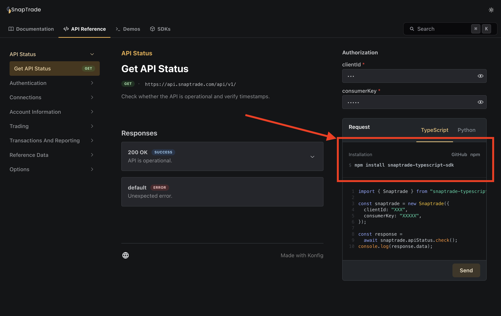

## Docs Search <Flame/>

<Figure caption="Demo of Search Functionality">
<VideoPlayer autoplay url="/video/docs-search.mov"/>
</Figure>

We've added a lightning fast search bar to the docs that allows you to quickly
search for your docs. The search bar is available on the top right of the docs
and has a shortcut of `Ctrl + K` to quickly focus on it (on Mac it's `Cmd + K`).

## Inline SDK Installation Instructions



We've added a new installation instructions section to the docs that allows you
to quickly copy the SDK installation instructions for a language. This makes it
easier for developers to get started with your SDKs by reducing the friction of
finding the SDK installation instructions.


## Google Analytics Support

<Figure caption="Sample configuration for Google Analytics">
<CH.Code rows={20}>
```yaml konfig.yaml focus=4,10
outputDirectory: /tmp/acme-sdks-out
specInputPath: api.yaml
specPath: api-fixed.yaml
portal:
  title: Acme
  primaryColor: "#1f334e"
  logo:
    light: portal-logo-light.png
    dark: portal-logo-dark.png
  googleAnalyticsId: G-XXXXXXXXXX
  documentation:
    sidebar:
      sections:
        - label: Guides
          links:
            - id: getting-started
              path: docs/getting-started.md
            - id: client-side-direct-api-usage
              path: docs/client-side-direct-api-usage.md
  demos:
    - id: getting-started
      path: demos/getting-started.md
generators:
  python:
    version: 1.0.0
    packageName: acme_client
    projectName: acme-python-sdk
    outputDirectory: python
    clientName: Acme
    git:
      userId: konfig-dev
      repoId: acme-sdks/tree/main/python
```
</CH.Code>
</Figure>

You can now add your Google Analytics ID to your docs configuration and we'll
automatically add the Google Analytics script to your docs. See the full instructions for
adding Google Analytics to your docs [here](/docs/portal/tutorials/configuring-google-analytics).

{/* TRUNCATE */}

<details>
<summary>Improvements and Fixes</summary>
- Lots of quality assurance improvements for our SDK generators (blog post incoming regarding our testing infrastructure)
- Fix `defaultChangesetBumpType` bug
- Remove dependency on existence of `konfig.yaml` when running `konfig lint`
- Handle submodules for Swift SDK
- Throw helpful error message when `konfig.yaml` is not configured when revalidating portal
- Fix some return models not being generated in documentation for TypeScript SDK
- Fix backward incompatibility in Python SDK when using new Pydantic models
- Allow default timeout to be configurable for async Python SDK usage
- Fix UI in scroll area for Docs
- Fix styling of search button mobile screens
- Fix conflict between records with same ID in search index
- Fix bug in generation of cURL command in API reference page
- Fix TypeScript SDK to work with file uploads in Node 18+
- Allow for configuration of bump type for automation at the generator level
- Add logging before error regarding dirty git repository in `konfig publish`
- Fix issue with poetry.lock causing automation to fail
- Add ability to render custom snippet at the top of Python SDK `README.md`
- More testing and reliability of latest Pydantic response models in Python SDK
- Show full URL of endpoint in API Reference page
</details>