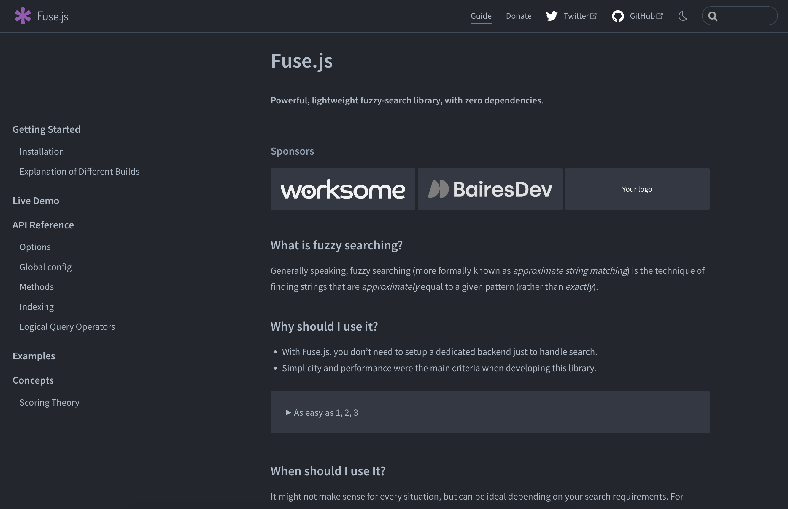

<Admonition type="info">
This article teaches you how to implement free, fast, and local search using
Fuse.js in Next.js with SSR. If you are looking for an API docs provider with great
out-of-the-box search functionality, consider using [Konfig](/#docs) to host
your API docs.
</Admonition>

## The Problem

Most websites worth its salt have a search bar. It's a great way to help users
find the content they need quickly. To migrate one of our customers at
[Konfig](https://konfigthis.com) from [ReadMe](https://readme.com/) to our [Docs
product](/#docs), we needed to reach feature parity with ReadMe's product, which
meant adding search functionality.

{/* TRUNCATE */}

## What we built

A fast, and local-first search bar with fuzzy search, highlighting. Oh, and it's
**free** to host and **depends on 0 external services** making the experience
**fast**.

**[Try it out for yourself at our customer SnapTrade's
Docs](https://docs.snaptrade.com).**

<Figure caption="Demo of Slick Search Functionality">
<VideoPlayer autoplay url="/video/docs-search.mov"/>
</Figure>

## How did we do this?

We used a neat open-source library called [Fuse.js](https://fusejs.io/). It's a
lightweight library that allows you to implement fuzzy search in your app.

<Figure caption="The Fuse.js Docs">

</Figure>

Fuse.js has a lot of stars and a decent amount of downloads on NPM. It's also
actively maintained. Great library, I highly recommend it.

| GitHub | NPM |
|  --- | --- |
| [](https://github.com/krisk/fuse) | [](https://www.npmjs.com/package/fuse.js) |

### Why use Fuse.js instead of Algolia?

In our case, the requirements were as follows:

1. Cheap/free
1. Simple, preferably local-first/no external dependency
1. Fast, it should feel snappy
1. Error-prone, typos should be handled gracefully
1. Supports custom indexing of markdown files and JSON data (for OpenAPI generated docs)
1. Supports isolated indexing of docs for each customer as each of our customers has their own domain connected to our docs product
1. Works with [SSR](https://nextjs.org/docs/pages/building-your-application/rendering/server-side-rendering) (in our case we are using Incremental Static Regeneration) in Next.js

Algolia could have solved our problem and it's a great service, but it's free
tier is a little limited and I was a little worried about the cost of scaling it
up at $0.50 per 1,000 search requests.

<Figure caption="Seems like a small free-tier and potentially expensive scale up">

</Figure>

It's also not local-first. This means that you have to send your data to Algolia
and then query it. This is fine, but it's not ideal. Furthermore, by just
connecting a few dots, it was easy enough to build search functionality for our
docs product so we decided to go with Fuse.js.

We also have one important characteristic to our search problem: **the size of
all indexed content can comfortably fit in the browser**. This made it an even
easier decision to go with Fuse.js.

## How to implement search functionality using Fuse.js with Next.js SSR

<Admonition type="info" title="Before you read">
Note that this tutorial assumes a couple things:

1. You have some familiarity with Next.js and React
1. A little TypeScript Proficiency
1. You are using Next.js using the [pages router](https://nextjs.org/docs/pages) as opposed to the new [app
router](https://nextjs.org/docs/app). If you are using the new app router, you will need to modify the code in
this tutorial.
1. You are using [SSR](https://nextjs.org/docs/pages/building-your-application/rendering/server-side-rendering) to generate your pages at runtime

The code in this tutorial is a pseudo-code implementation of the search
functionality we built for our [Docs product](/#docs). It is not a copy-paste
solution. **You should use the provided code as a guide but will need to modify the
code to fit your application.**

</Admonition>

Search functionality can be broken down into three main parts:

1. **Aggregate** the content to index
1. **Index** the content for fast queries
1. **Render** a UI to make queries on the index

#### Adding Fuse.js to your Next.js project

First, ensure Fuse.js is installed in your project.

<CH.Code>

```bash yarn
yarn add fuse.js
```

```bash npm
npm install fuse.js
```

```bash pnpm
pnpm add fuse.js
```

</CH.Code>

<CH.Scrollycoding>

### Create an SSR page in Next.js

Create a page in Next.js that uses SSR to generate the page at runtime. Here is a simple example
of a page that uses ISR to generate the page at runtime.

The following SSR page includes the entire implementation for this tutorial and
in subsequent sections, we will break down the implementation step-by-step.

```tsx pages/[myPage].tsx
// from ./implementing-search-assets/page.tsx
```

---

### Create a data structure to represent the content to index

In our case, it was enough to simply create a type that included:

- `id` - the unique subpath for this record
- `content` - the content to index
- `title` - the title of the content

For an explanation of indexing different types of data structures,
take a look at the [Fuse.js docs](https://www.fusejs.io/examples.html).

```tsx pages/[myPage].tsx focus=15:23
```

---

### Aggregate the content to index

While generating props for your page, aggregate all the content you want to
index for searching in `getStaticProps` / `getServerSideProps`. For your application, you will need to decide what
content you want to aggregate for searching. In our case, we wanted to index the
following content:

1. Markdown files
1. JSON files that represent [OpenAPI Specifications](https://swagger.io/specification/)

The returned content should contain information from pages other than the
currently rendered page. For example, if you are on the page `/foo`, you will
want to aggregate the content from `/bar` and `/baz` as well.

Once you decide what to index, you should pull that information from whatever
data source you are using. In our case, we are using the file system to store
our content. In our particular case, we used the GitHub API as our Docs product
uses GitHub as a CMS.

Once you have indexed your content, you can pass your `SearchRecord[]`
along as a prop to your page.

```tsx pages/[myPage].tsx focus=25:43,59
```

---

### Index the content for fast queries

Let Fuse.js do the heavy lifting here.

Since all the content necessary for searching is already available in the
browser, we can index the content in the browser. This is a great way to
implement search functionality without having to rely on external services.

If your content is too large to pass as a part of the initial page load, you can
index the content on the server and then send the index to the browser after the
page loads to unblock a fast page load. If the content is too large to index on
the browser, then it is worth reconsidering using an external service like
Algolia.

It's incredibly easy to index content using Fuse.js. All you need to do is
instantiate a new `Fuse` object with the content you want to index and the
options you want to use for searching.

```tsx pages/[myPage].tsx focus=45:55
```

---

### Options we used for Fuse.js

See the [Fuse.js docs](https://fusejs.io/api/options.html) for a full list of
its options and explanations. For our product, these settings yielded the most
intuitive search experience as the `content` property could be lengthy (hence `ignoreLocation: true`) and matching
the `title` was important (hence `fieldNormWeight: 2`).

```tsx pages/[myPage].tsx focus=47:53
```

---

### Render a UI to make queries on the index

Now that we have indexed the content, we need to render a UI to make queries on
the index. This is the fun part. You can use Fuse.js to make queries on the
index and then render the results however you want.

We used [Mantine's Spotlight Component](https://mantine.dev/others/spotlight/)
which made it incredibly easy to create a good-looking search bar. We added some
extra functionality for highlighting exact substring search matches as you type
and configuring the CMD + K and CTRL + K keyboard shortcuts.

```tsx pages/[myPage].tsx focus=57:69
```

</CH.Scrollycoding>

### Wrapping up

In this tutorial, we learned how to implement free, fast, and local search using
Fuse.js with Next.js SSR. We did this by following three main steps:

1. Aggregating all content to search
1. Indexing the content
1. Rendering a UI to make queries on the index.

Let us know what you think of this tutorial and if you have any questions or
comments, feel free to reach out to me at
[dylan@konfigthis.com](mailto:dylan@konfigthis.com).