import Head from '@docusaurus/Head';

<Head>
  <title>I Reviewed 1,000s of Opinions on gRPC</title>
  <meta property="og:title" content="I Reviewed 1,000s of Opinions on gRPC"/>
</Head>

<Figure caption="What do developers really think about gRPC?">
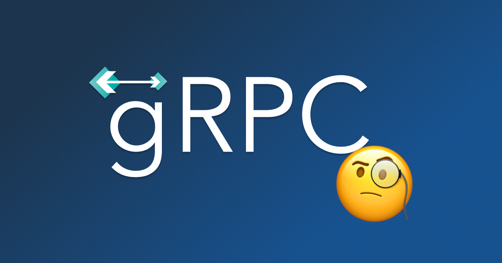
</Figure>

It is no secret that [gRPC](https://grpc.io/about/) is widely adopted in large
software companies. Google originally developed
[Stubby](https://cloud.google.com/blog/products/gcp/grpc-a-true-internet-scale-rpc-framework-is-now-1-and-ready-for-production-deployments)
in 2010 as an internal RPC protocol. In 2015, Google decided to open source
Stubby and rename it to gRPC.
[Uber](https://www.uber.com/blog/ubers-next-gen-push-platform-on-grpc/) and
[Netflix](https://netflixtechblog.com/practical-api-design-at-netflix-part-1-using-protobuf-fieldmask-35cfdc606518),
both of which are heavily oriented toward microservices, have extensively
embraced gRPC. While I haven't personally used gRPC, I have colleagues who adore
it. **However, what is the true sentiment among developers regarding gRPC?**

To find out, I went to where developers live: Reddit, Twitter, Hacker News, and
YouTube. I parsed 1,000s of discussions and synthesized my findings in this
article, striving to present only thought-provoking opinions.

<Figure caption='Funnel for gathering through-provoking opinions'>

</Figure>

{/* TRUNCATE */}

Next, I transcribed these discussions onto a whiteboard, organizing them into
"Pro-gRPC" (👍), "Anti-gRPC" (👎), or "Neutral" (🧐) categories, and then
clustering them into distinct opinions. Each section in this post showcases an
opinion while referencing pertinent discussions.

<Figure caption='Whiteboard of opinions'>
  
</Figure>

## 👍 gPRC's Tooling Makes It Great for Service-to-Service Communication

The most significant praise for gRPC centers on its exceptional code generation
tools and efficient data exchange format, which together enhance
service-to-service developer experience and performance remarkably.

<Carousel.Wrapper>
  <Carousel.Slide>
      <Figure caption={<a href="https://news.ycombinator.com/item?id=35751347">Hacker News</a>}>
        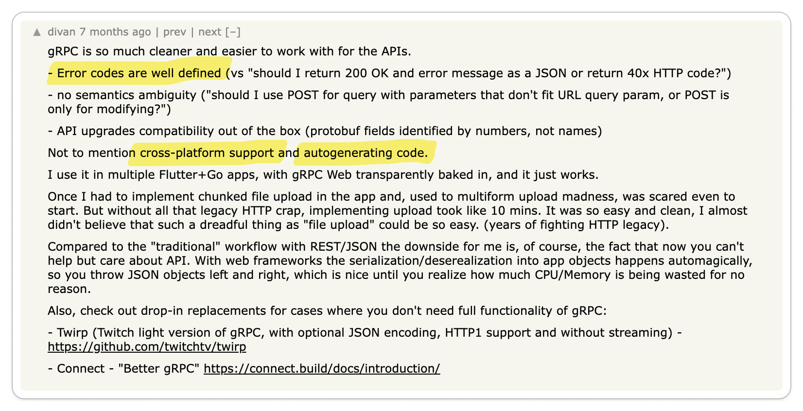
      </Figure>
  </Carousel.Slide>
  <Carousel.Slide>
      <Figure caption={<a href="https://www.reddit.com/r/node/comments/18151z8/comment/kaa8jmo/?utm_source=share&utm_medium=web3x&utm_name=web3xcss&utm_term=1&utm_content=share_button">Reddit</a>}>
        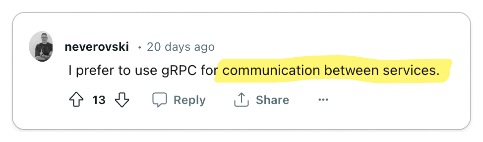
      </Figure>
  </Carousel.Slide>
  <Carousel.Slide>
      <Figure caption={<a href="https://news.ycombinator.com/item?id=16612816">Hacker News</a>}>
        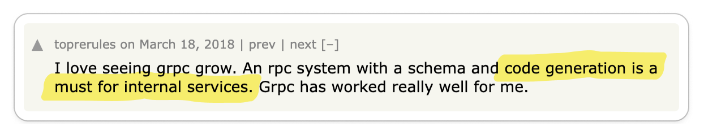
      </Figure>
  </Carousel.Slide>
  <Carousel.Slide>
      <Figure caption={<a href="https://www.reddit.com/r/golang/comments/br4awi/comment/eoa25ar/?utm_source=share&utm_medium=web3x&utm_name=web3xcss&utm_term=1&utm_content=share_button">Reddit</a>}>
        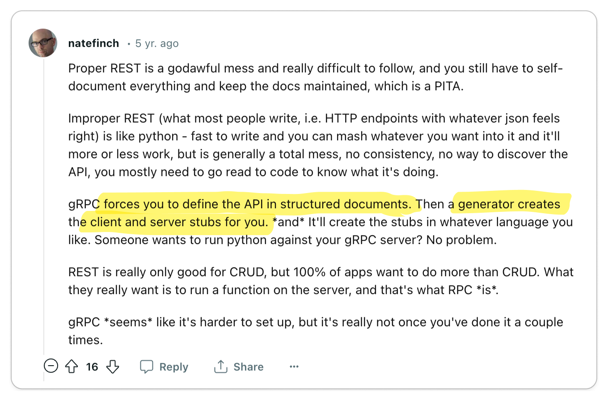
      </Figure>
  </Carousel.Slide>
  <Carousel.Slide>
      <Figure caption={<a href="https://www.youtube.com/watch?v=hVrwuMnCtok&lc=UgxIxKRw5mrXXYFGL854AaABAg">YouTube</a>}>
        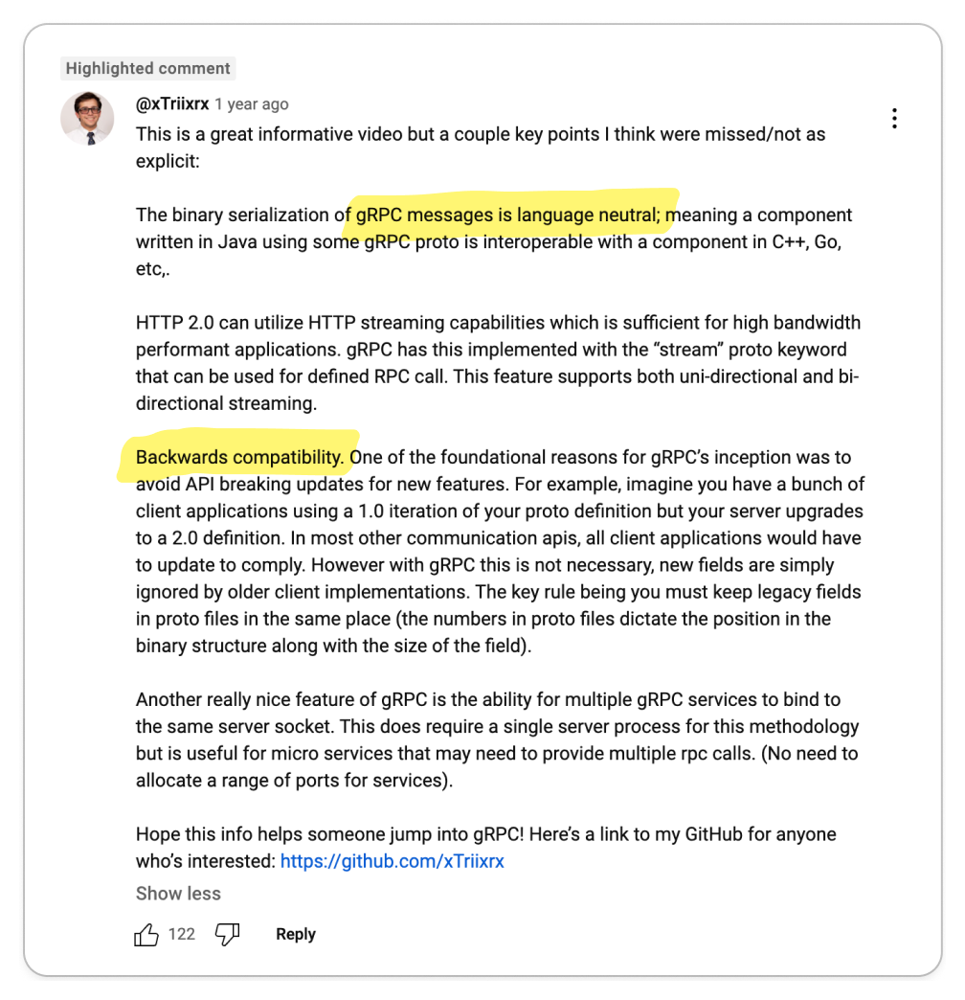
      </Figure>
  </Carousel.Slide>
  <Carousel.Slide>
      <Figure caption={<a href="https://news.ycombinator.com/item?id=26466902">Hacker News</a>}>
        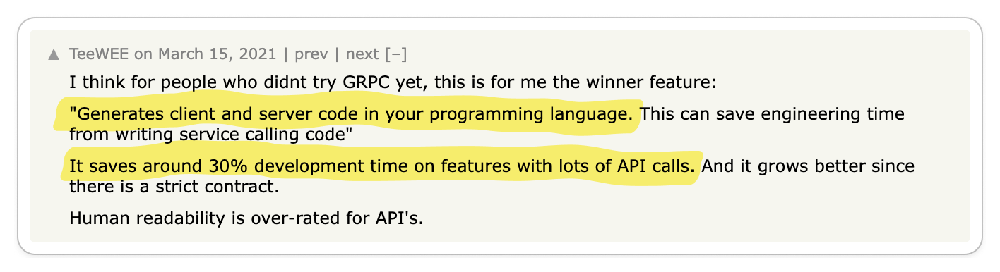
      </Figure>
  </Carousel.Slide>
  <Carousel.Slide>
      <Figure caption={<a href="https://www.reddit.com/r/golang/comments/br4awi/comment/eoa0m1g/?utm_source=share&utm_medium=web3x&utm_name=web3xcss&utm_term=1&utm_content=share_button">Reddit</a>}>
        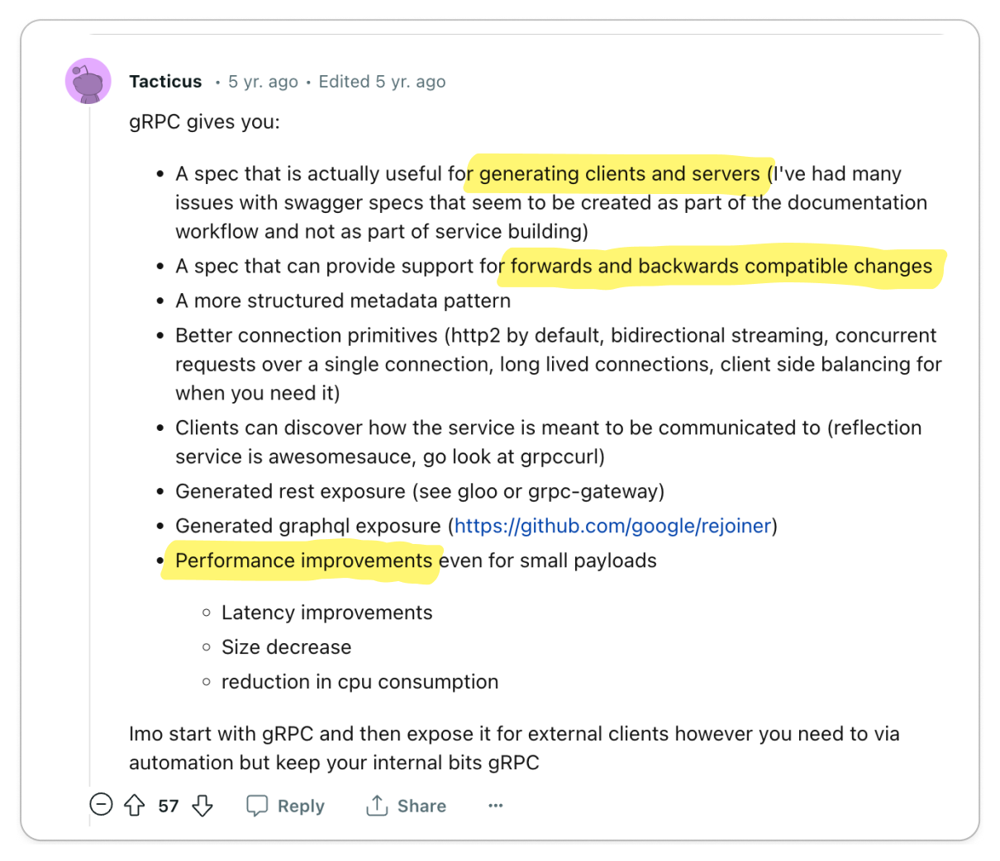
      </Figure>
  </Carousel.Slide>
  <Carousel.Slide>
      <Figure caption={<a href="https://www.reddit.com/r/golang/comments/133lyna/comment/jiav9ys/?utm_source=share&utm_medium=web3x&utm_name=web3xcss&utm_term=1&utm_content=share_button">Reddit</a>}>
        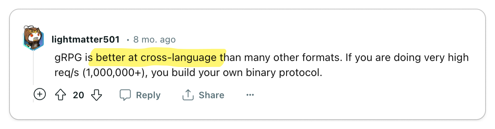
      </Figure>
  </Carousel.Slide>
  <Carousel.Slide>
      <Figure caption={<a href="https://www.reddit.com/r/golang/comments/133lyna/comment/jiajdxi/?utm_source=share&utm_medium=web3x&utm_name=web3xcss&utm_term=1&utm_content=share_button">Reddit</a>}>
        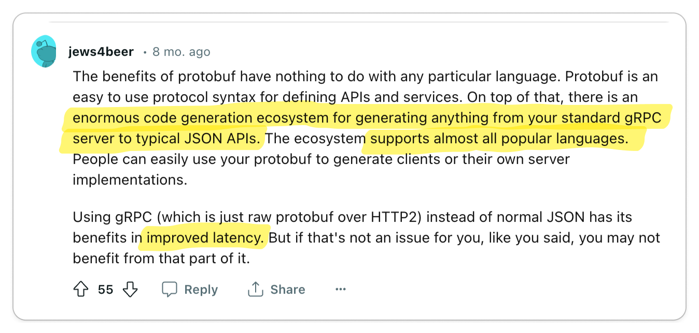
      </Figure>
  </Carousel.Slide>
  <Carousel.Slide>
      <Figure caption={<a href="https://www.reddit.com/r/golang/comments/133lyna/comment/jiayabf/?utm_source=share&utm_medium=web3x&utm_name=web3xcss&utm_term=1&utm_content=share_button">Reddit</a>}>
        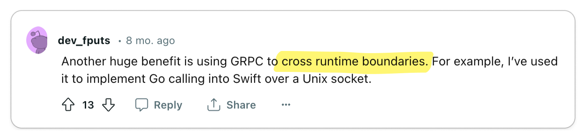
      </Figure>
  </Carousel.Slide>
  <Carousel.Slide>
      <Figure caption={<a href="https://news.ycombinator.com/item?id=24944697">Hacker News</a>}>
        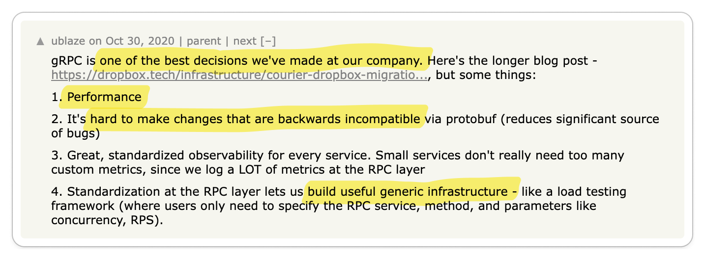
      </Figure>
  </Carousel.Slide>
  <Carousel.Slide>
      <Figure caption={<a href="https://www.reddit.com/r/golang/comments/133lyna/comment/jibcznf/?utm_source=share&utm_medium=web3x&utm_name=web3xcss&utm_term=1&utm_content=share_button">Reddit</a>}>
        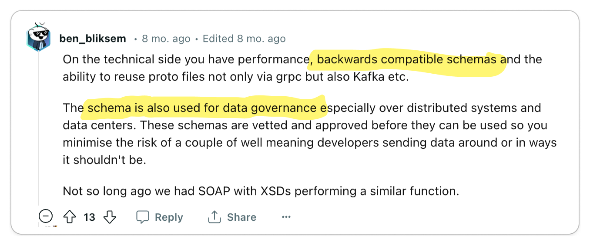
      </Figure>
  </Carousel.Slide>
</Carousel.Wrapper>

#### Key Takeaway 🔑

Engineering teams are often responsible for managing multiple services while
also interacting with services managed by other teams. Code generation tools
empower developers to expedite their development process and create more
reliable services. The adoption of [Protocol Buffers](https://protobuf.dev/)
encourages engineers to focus primarily on the interfaces and data models they
expose to other teams, promoting a uniform workflow across various groups.

The key benefits of gRPC mentioned were:

- Client and server stub code generation tooling
- Data governance
- Language-agnostic architecture
- Runtime Performance
- Well-defined error codes

If your organization is developing a multitude of internal microservices, gRPC
could be an excellent option to consider.

## 👍 Compared to the straightforward nature of gRPC, REST can be relatively confusing

To properly build applications in REST, you need to understand the underlying
protocol, HTTP. gRPC, on the other hand, abstracts HTTP away, making it less
confusing for quickly building applications.

<Carousel.Wrapper>
  <Carousel.Slide>
      <Figure caption={<a href="https://twitter.com/luke_pighetti/status/1732108363490615594">Twitter</a>}>
        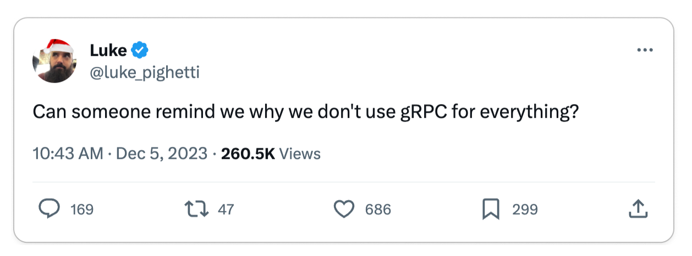
      </Figure>
  </Carousel.Slide>
  <Carousel.Slide>
      <Figure caption={<a href="https://news.ycombinator.com/item?id=24944714">Hacker News</a>}>
        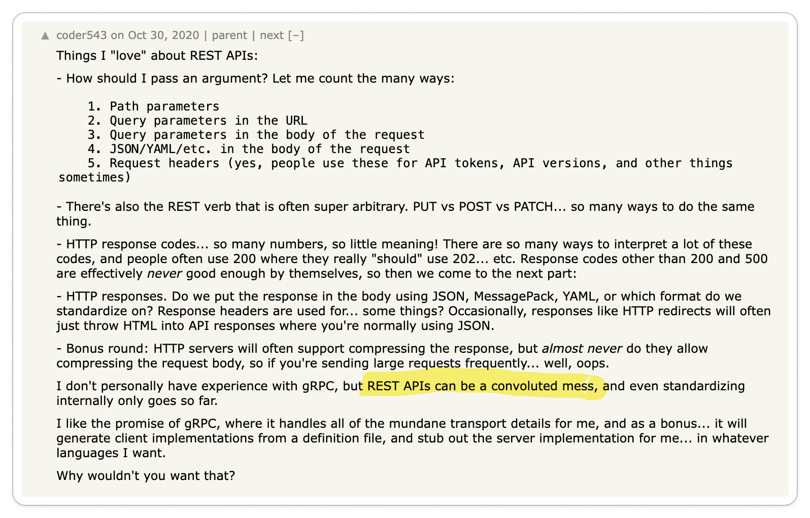
      </Figure>
  </Carousel.Slide>
  <Carousel.Slide>
      <Figure caption={<a href="https://www.reddit.com/r/golang/comments/br4awi/comment/eoaggs7/?utm_source=share&utm_medium=web3x&utm_name=web3xcss&utm_term=1&utm_content=share_button">Reddit</a>}>
        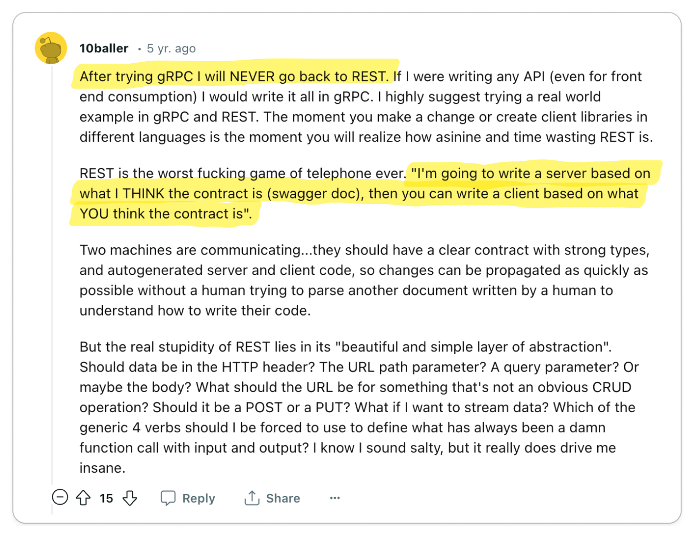
      </Figure>
  </Carousel.Slide>
  <Carousel.Slide>
      <Figure caption={<a href="https://www.reddit.com/r/dotnet/comments/r2ekfj/comment/hm4idc8/?utm_source=share&utm_medium=web3x&utm_name=web3xcss&utm_term=1&utm_content=share_button">Reddit</a>}>
        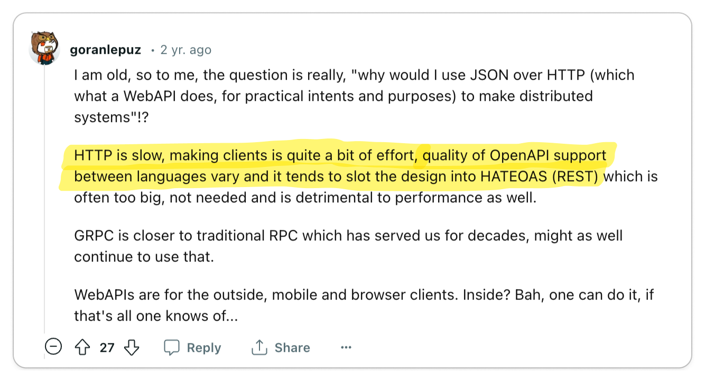
      </Figure>
  </Carousel.Slide>
</Carousel.Wrapper>

#### Key Takeaway 🔑

REST often leaves considerable scope for errors and confusion in defining and
consuming APIs.

In contrast, gRPC is designed with the complexities of large-scale software
systems in mind. This focus has led to an emphasis on robust code generation and
stringent data governance. REST, on the other hand, is fundamentally a [software
architectural style](https://en.wikipedia.org/wiki/REST) oriented towards web
services, where aspects like code generation and data governance were not
primary considerations. The most widely used standard for designing REST APIs,
OpenAPI (formerly Swagger), is essentially a specification that the underlying
protocol does not enforce. This leads to situations where the API consumer might
not receive the anticipated data model, resulting in a loosely coupled
relationship between the API definition and the underlying protocol. This
disconnect can be a significant source of confusion and frustration for
developers. Hence, it raises a critical question: why opt for REST when gRPC
offers a more cohesive and reliable alternative?

## 👎 gRPC complicates important things

Important functionalities like load balancing, caching, debugging,
authentication and browser support are complicated by gRPC.

<Carousel.Wrapper>
  <Carousel.Slide>
      <Figure caption={<a href="https://www.reddit.com/r/node/comments/10u9xqu/why_are_grpc_and_nodejs_so_difficult/?utm_source=share&utm_medium=web3x&utm_name=web3xcss&utm_term=1&utm_content=share_button">Reddit</a>}>
        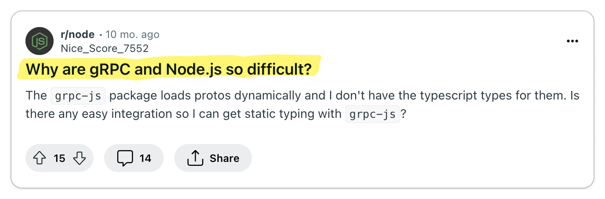
      </Figure>
  </Carousel.Slide>
  <Carousel.Slide>
      <Figure caption={<a href="https://news.ycombinator.com/item?id=27143960">Hacker News</a>}>
        
      </Figure>
  </Carousel.Slide>
  <Carousel.Slide>
      <Figure caption={<a href="https://www.reddit.com/r/node/comments/18151z8/comment/kaa53ts/?utm_source=share&utm_medium=web3x&utm_name=web3xcss&utm_term=1&utm_content=share_button">Reddit</a>}>
        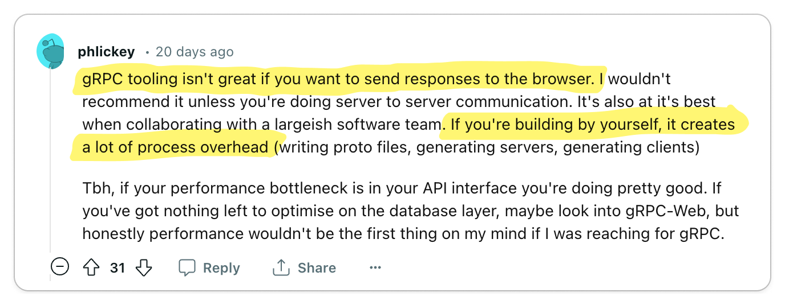
      </Figure>
  </Carousel.Slide>
  <Carousel.Slide>
      <Figure caption={<a href="https://www.youtube.com/watch?v=_4TPM6clQjM&lc=Ugzk_w16aQI0XZVd2Gd4AaABAg">YouTube</a>}>
        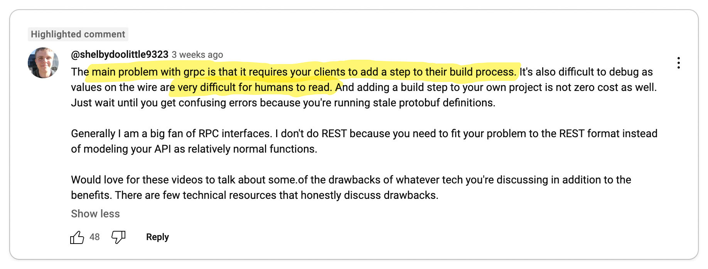
      </Figure>
  </Carousel.Slide>
  <Carousel.Slide>
      <Figure caption={<a href="https://news.ycombinator.com/item?id=28634236">Hacker News</a>}>
        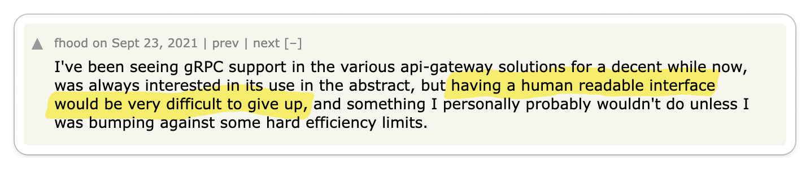
      </Figure>
  </Carousel.Slide>
  <Carousel.Slide>
      <Figure caption={<a href="https://www.youtube.com/watch?v=gnchfOojMk4&lc=Ugxb8XMt6nPoxbpWdjN4AaABAg">YouTube</a>}>
        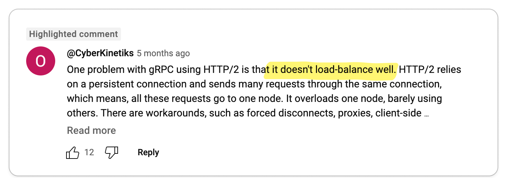
      </Figure>
  </Carousel.Slide>
  <Carousel.Slide>
      <Figure caption={<a href="https://news.ycombinator.com/item?id=26488538">Hacker News</a>}>
        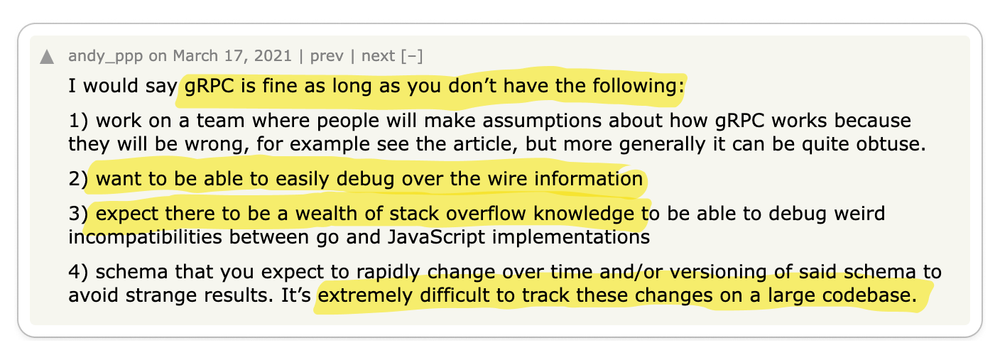
      </Figure>
  </Carousel.Slide>
  <Carousel.Slide>
      <Figure caption={<a href="https://news.ycombinator.com/item?id=20024680">Hacker News</a>}>
        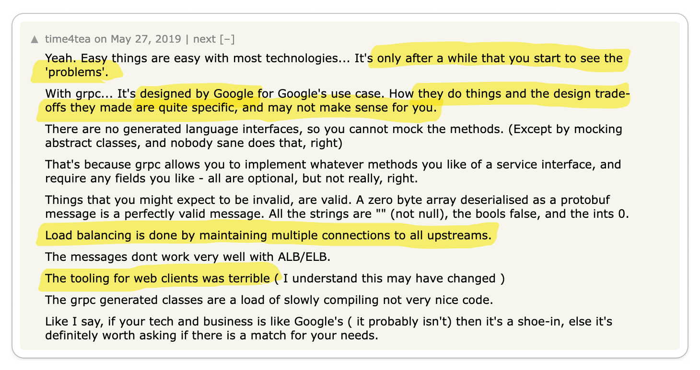
      </Figure>
  </Carousel.Slide>
  <Carousel.Slide>
      <Figure caption={<a href="https://news.ycombinator.com/item?id=26467124">Hacker News</a>}>
        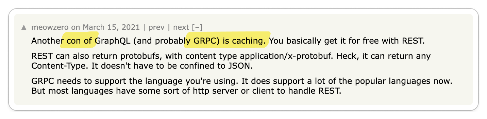
      </Figure>
  </Carousel.Slide>
  <Carousel.Slide>
      <Figure caption={<a href="https://www.reddit.com/r/csharp/comments/17ckf3b/comment/k5qo9ri/?utm_source=share&utm_medium=web3x&utm_name=web3xcss&utm_term=1&utm_content=share_button">Reddit</a>}>
        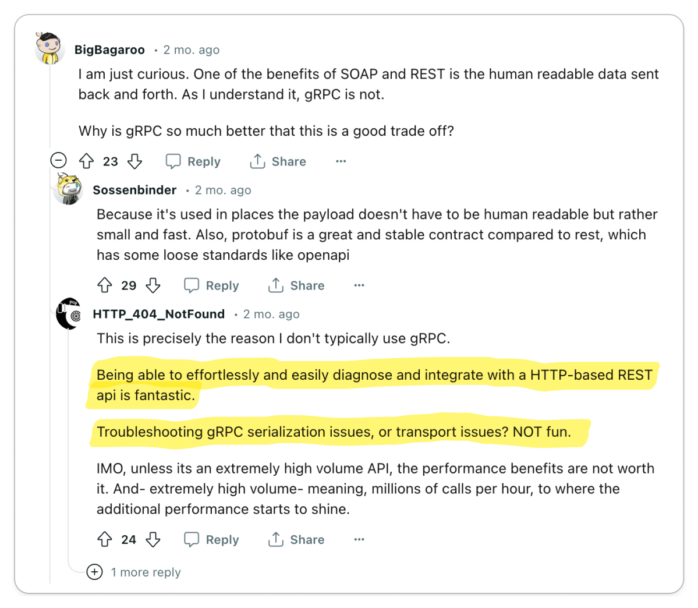
      </Figure>
  </Carousel.Slide>
  <Carousel.Slide>
      <Figure caption={<a href="https://x.com/evitable_cnflct/status/1732121868369526800?s=20">x.com</a>}>
        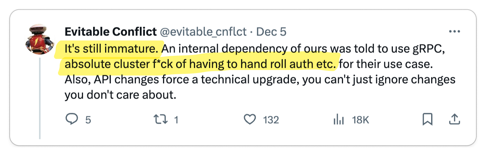
      </Figure>
  </Carousel.Slide>
  <Carousel.Slide>
      <Figure caption={<a href="https://news.ycombinator.com/item?id=16234819">Hacker News</a>}>
        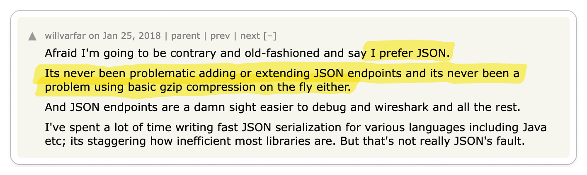
      </Figure>
  </Carousel.Slide>
</Carousel.Wrapper>

#### Key Takeaway 🔑

On the surface, gRPC appears to be a great solution for building high-quality
APIs. But as with any technology, the problems start to show when you begin to
use it. In particular, by adding an RPC layer, you have effectively introduced a
dependency in a core part of your system. So when it comes to certain
functionalities that an API is expected to provide, you are at the mercy of
gRPC.

Soon, you'll start to find yourself asking questions like:

- How do I load balance gRPC services?
- How do I cache gRPC services?
- How do I debug gRPC services?
- How do I authenticate gRPC services?
- How do I support gRPC in the browser?

The list goes on. Shortly after, you'll be wondering: "Why didn't I just build a
REST API?"

## 👎 REST is standard, use it

The world is built on standards and REST is no exception.

<Carousel.Wrapper>
  <Carousel.Slide>
      <Figure caption={<a href="https://www.reddit.com/r/node/comments/18151z8/comment/kaac9vl/?utm_source=share&utm_medium=web3x&utm_name=web3xcss&utm_term=1&utm_content=share_button">Reddit</a>}>
        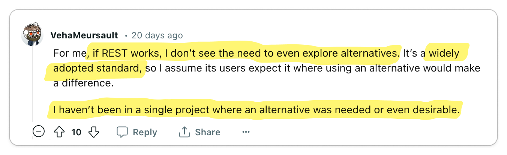
      </Figure>
  </Carousel.Slide>
  <Carousel.Slide>
      <Figure caption={<a href="https://www.reddit.com/r/node/comments/10u9xqu/comment/j7b6e9y/?utm_source=share&utm_medium=web3x&utm_name=web3xcss&utm_term=1&utm_content=share_button">Reddit</a>}>
        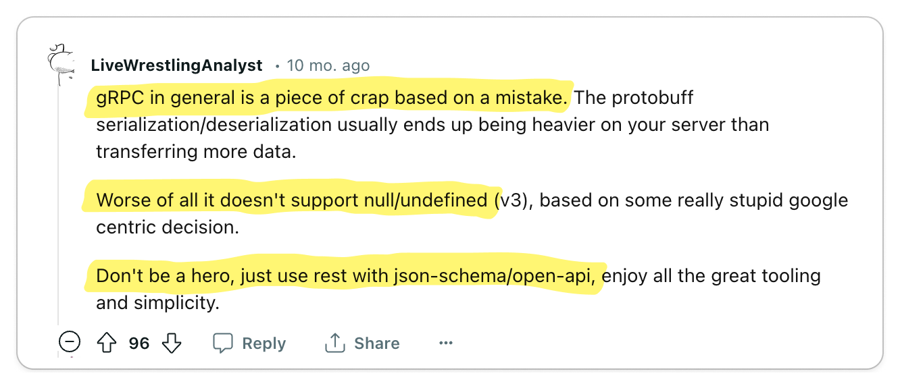
      </Figure>
  </Carousel.Slide>
  <Carousel.Slide>
      <Figure caption={<a href="https://x.com/ibuildthecloud/status/1732221302193447243?s=20">x.com</a>}>
        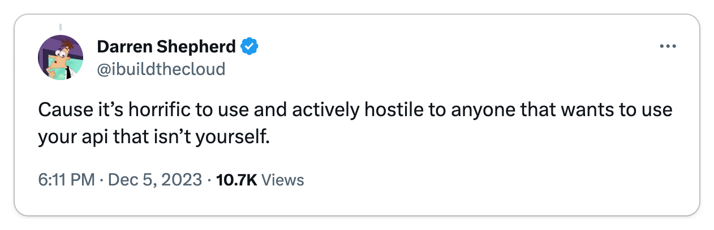
      </Figure>
  </Carousel.Slide>
  <Carousel.Slide>
      <Figure caption={<a href="https://www.youtube.com/watch?v=hVrwuMnCtok&lc=UgyTvAWhoRJf6FclrDR4AaABAg">YouTube</a>}>
        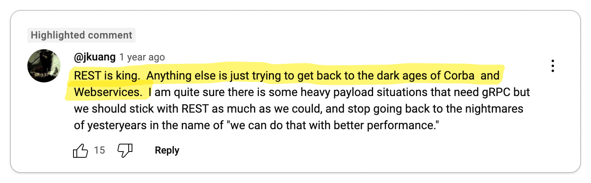
      </Figure>
  </Carousel.Slide>
  <Carousel.Slide>
      <Figure caption={<a href="https://www.reddit.com/r/node/comments/18151z8/comment/kaawa9d/?utm_source=share&utm_medium=web3x&utm_name=web3xcss&utm_term=1&utm_content=share_button">Reddit</a>}>
        
      </Figure>
  </Carousel.Slide>
  <Carousel.Slide>
      <Figure caption={<a href="https://www.reddit.com/r/java/comments/ucu1uh/comment/i6czwdq/?utm_source=share&utm_medium=web3x&utm_name=web3xcss&utm_term=1&utm_content=share_button">Reddit</a>}>
        
      </Figure>
  </Carousel.Slide>
  <Carousel.Slide>
      <Figure caption={<a href="https://news.ycombinator.com/item?id=20024212">Hacker News</a>}>
        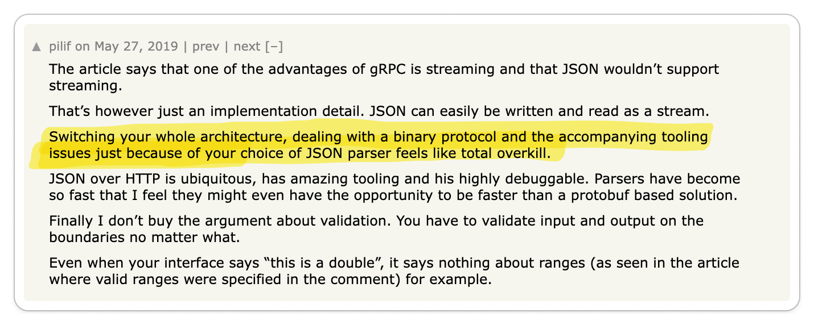
      </Figure>
  </Carousel.Slide>
</Carousel.Wrapper>

#### Key Takeaway 🔑

Don't be a hero, use REST.

Recall that gRPC was born out of Google's need to build a high-performance
service-to-service communication protocol. So practically speaking, if you are
not Google, you probably don't need gRPC. Engineers often overengineer
[complexity](https://grugbrain.dev/#grug-on-complexity) into their systems and
gRPC seems like a shiny new toy that engineers want to play with. But as with
any new technology, you need to consider the long-term maintenance costs.

You don't want to be the one responsible for introducing new technology into
your organization which becomes a burden to maintain. REST is battle-tested, so
by using REST, you get all of the benefits of a standard such as tooling and
infrastructure without the burden of maintaining it. Most engineers are also
familiar with REST, so it's easy to onboard new developers to your team.

## 🧐 Use gRPC for internal services, REST for external services

gRPC significantly enhances the developer experience and performance for
internal services. Nonetheless, it may not be the ideal choice for external
services.

<Carousel.Wrapper>
  <Carousel.Slide>
      <Figure caption={<a href="https://www.reddit.com/r/golang/comments/ieh8f0/comment/g2gyb00/?utm_source=share&utm_medium=web3x&utm_name=web3xcss&utm_term=1&utm_content=share_button">Reddit</a>}>
        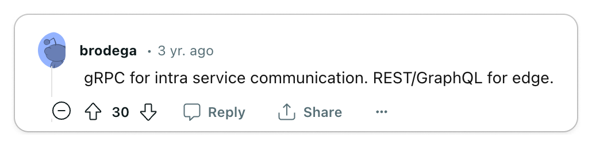
      </Figure>
  </Carousel.Slide>
  <Carousel.Slide>
      <Figure caption={<a href="https://www.youtube.com/watch?v=4SuFtQV8RCk&lc=Ugzra8_WnyqIB1rqki94AaABAg">YouTube</a>}>
        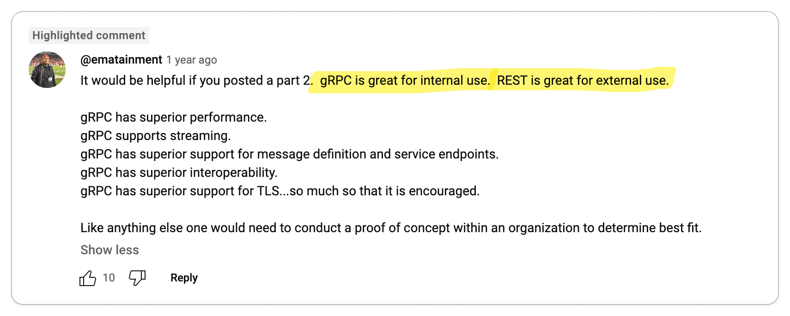
      </Figure>
  </Carousel.Slide>
  <Carousel.Slide>
      <Figure caption={<a href="https://www.reddit.com/r/dotnet/comments/r2ekfj/comment/hm4galp/?utm_source=share&utm_medium=web3x&utm_name=web3xcss&utm_term=1&utm_content=share_button">Reddit</a>}>
        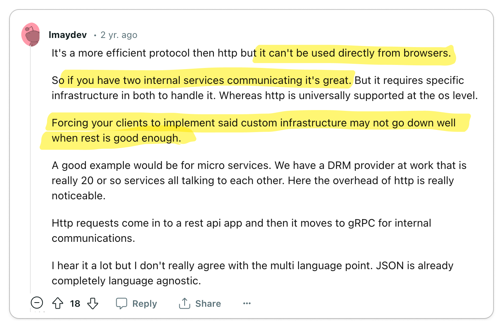
      </Figure>
  </Carousel.Slide>
</Carousel.Wrapper>

#### Key Takeaway 🔑

gRPC truly excels in internal service-to-service communication, offering
developers remarkable tools for code generation and efficient data exchange.
Disregarding the tangible benefits to developer experience that gRPC provides
can be shortsighted, especially since many organizations could greatly benefit
from its adoption.

However, it's important to note that browser support wasn't a primary focus in
gRPC's design. This oversight necessitates an additional component,
[grpc-web](https://github.com/grpc/grpc-web), for browser accessibility.
Furthermore, external services often have specific needs like caching and load
balancing, which are not directly catered to by gRPC. Adopting gRPC for external
services might require bespoke solutions to support these features.

Recognizing that not every technology fits all scenarios is crucial. Using gRPC
for external services can be akin to trying to fit a square peg into a round
hole, highlighting the importance of choosing the right tool for the right job.

## 🧐 gRPC is immature

gRPC was only [open sourced in
2015](https://grpc.io/about/#:~:text=In%20March%202015%2C%20Google%20decided,%2C%20and%20Internet%20of%20Things)
when Google decided to standardize its internal RPC protocol so there is still a
lot of open source tooling that needs to be built.

<Carousel.Wrapper>
  <Carousel.Slide>
      <Figure caption={<a href="https://www.youtube.com/watch?v=_4TPM6clQjM&lc=UgxHFWhF5N5MXdo6jzt4AaABAg">YouTube</a>}>
        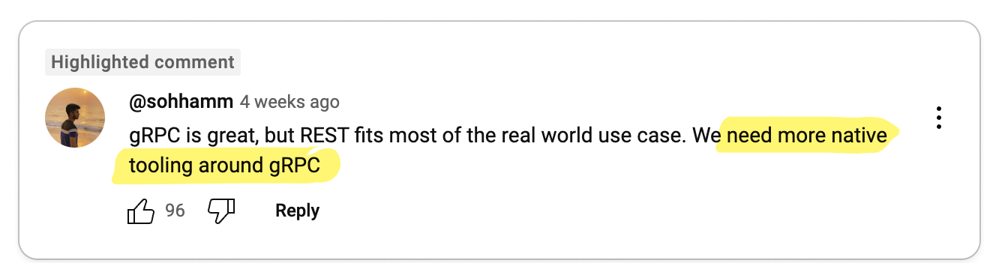
      </Figure>
  </Carousel.Slide>
  <Carousel.Slide>
      <Figure caption={<a href="https://news.ycombinator.com/item?id=14825904">Hacker News</a>}>
        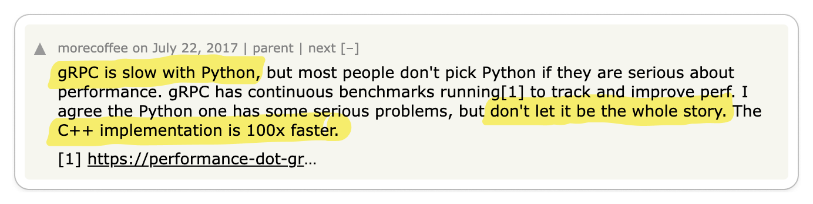
      </Figure>
  </Carousel.Slide>
  <Carousel.Slide>
      <Figure caption={<a href="https://www.reddit.com/r/golang/comments/7lhfau/comment/drmmn8p/?utm_source=share&utm_medium=web3x&utm_name=web3xcss&utm_term=1&utm_content=share_button">Reddit</a>}>
        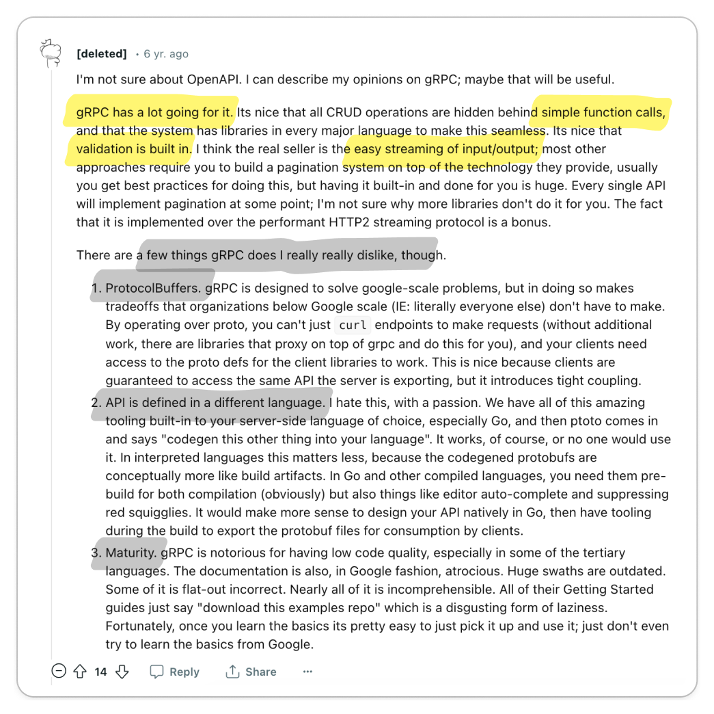
      </Figure>
  </Carousel.Slide>
</Carousel.Wrapper>

#### Key Takeaway 🔑

REST APIs are supported by a rich variety of tools, from `cURL` to Postman,
known for their maturity and thorough documentation. In contrast, gRPC is
comparatively younger. Although it has some tools available, they aren't as
developed or as well-documented as those for REST.

However, the gRPC ecosystem is witnessing rapid advancements with its increasing
popularity. The development of open-source tools such as
[grpcurl](https://github.com/fullstorydev/grpcurl) and
[grpcui](https://github.com/fullstorydev/grpcui) is a testament to this growth.
Additionally, companies like [Buf](https://buf.build/) are actively contributing
to this evolution by creating advanced tools that enhance the gRPC developer
experience.

## Conclusion

gRPC undeniably stands as a polarizing technology. It excels in enhancing
developer experience and performance for internal service-to-service
communications, yet some developers remain unconvinced of its advantages over
REST.

In our case, we employ REST for our external API and a combination of
REST/GraphQL for internal services. Currently, we see no pressing need to
integrate gRPC into our workflow. However, the fervent support it garners from
certain segments of the developer community is quite fascinating. It will be
interesting to observe the evolution and expansion of the gRPC ecosystem in the
coming years.

#### Similar Articles

If you are interested in reading articles like this one, checkout these:

- [I Reviewed 1,000s of Opinions on GitHub Copilot](/blog/github-copilot)
- [I Reviewed 1,000s of Opinions on Serverless](/blog/serverless)
- [I Reviewed 1,000s of Opinions on GraphQL vs. REST](/blog/graphql-vs-rest)

<Admonition type="info" title="Looking to onboard customers to your api?">
This article focuses a lot on gRPC but if you are building an external REST API
and need docs and SDKs for it, consider using [Konfig](/). We make it effortless
to generate docs and SDKs for your API so external developers can easily
integrate your API.
</Admonition>
