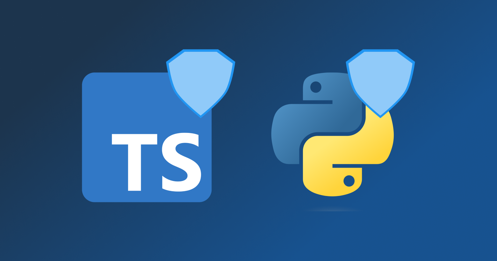

Happy New Year 🎉! We are super excited to bring you Konfig Changelog #9. We have made some
improvements to the Docs Portal, fixed some security vulnerabilities and improved the Python SDK.

## Docs Portal Support for iframes

We've added support for embedding an `iframe` from sites such as YouTube,
allowing you to embed videos, maps, and more into your portal.

## Security Fixes

We fixed a security vulnerability in our Python and TypeScript SDKs:

1. Upgraded `aiohttp` from `3.8.4` to `3.9.1` in Python SDK
2. Upgraded `axios` from `0.27.2` to `1.6.4` in TypeScript SDK

Note that both these changes are backward incompatible so if you already have
SDKs with Konfig, we have put these upgrades behind a feature flag so you can
upgrade at your own pace.

## Improved Python SDK Type Hints

<Figure caption="Screenshot of response type hint being inferred inside of VSCode">

</Figure>

Type hints in Python used to only previously work in PyCharm but now they work in VSCode as well.

## Check Out Our New Blog Posts!

We published two new blog posts:

1. [I Reviewed 1,000s of Opinions on gRPC](/blog/grpc)

<Figure caption="A fun read!">

</Figure>

These are always fun to write because I get to learn more about the general
sentiment of technology and deepen my understanding of different technologies.

2. [How To Implement Free, Fast, Local Search Using Fuse.js with Next.js SSR](/blog/how-to-implement-free-fast-local-search-with-fuse-js-with-next-js-ssr)

<Figure caption="A technical read!">

</Figure>

To implement search functionality in Konfig's Docs Portal, we had to solve a
really interesting problem around how to implement search in a Next.js app that
is statically generated. This blog post goes into detail on how we solved this
problem.

{/* TRUNCATE */}

Improvements and Fixes

- Stop Konfig automation workflows from running concurrently to avoid no-op PRs
- Added retry logic to automation to improve reliability in case of transient errors
- Fix request body array not being populated when navigating in Docs Portal
- Remove the "Last Commit" badge from the generated `README.md` since it was buggy and not useful
- Fix broken "Documentation" link in top-level `README.md` in SDK repo
- Add more documentation of each property for adding markdown pages to docs
- Support passing response as a parameter in Python SDK
- Fix Go SDK not being published due to missing command in `konfig publish`
- Added rule to catch duplicate method names under a tag in OpenAPI spec
- Fix the `summary` property in OpenAPI spec causing a layout shift in the navbar
- Change the icon of the parent section button from the burger menu to arrows to make it look more clickable
- Fix the iframe width in the docs portal
- For array request bodies in the docs portal, populate the first element by default
to show all the documentation for the array item schema
- Update `prism` dependency for `konfig mock`

