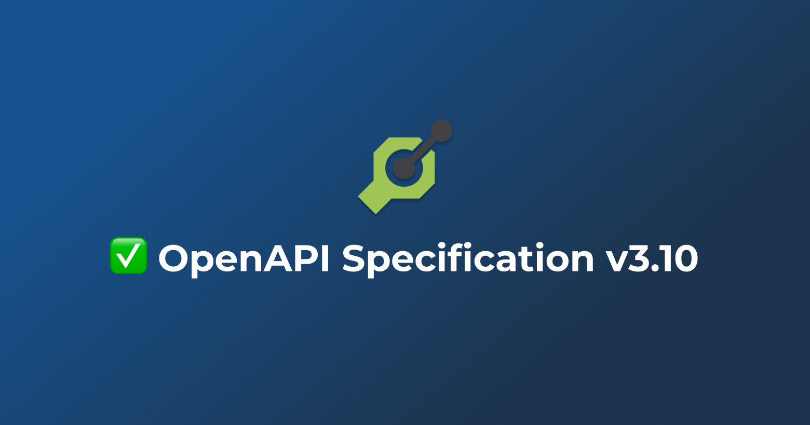

It's been a fast start to the year and we are excited to bring you some new
features and improvements to Konfig.

## AI-Generated Operation IDs

[`konfig fix`](https://www.npmjs.com/package/konfig-cli#konfig-fix) now has a new option `--useAIForOperationID` that
allows you to use AI to generate meaningful operation IDs for your OpenAPI
specification.

As part of ensuring your OpenAPI specification is high-quality, it is important
to write meaningful [operation
IDs](https://swagger.io/specification/#operationId).  Operation IDs are used as
method names in the generated SDKs. Konfig follows a [strict convention for
naming your operation ID](/docs/tutorials/naming-operation-ids). However, we
understand that it can be a bit of a hassle to come up with these names.
Furthermore, if you have a large OpenAPI spec, it can be a time-consuming task
to name each operation ID. Now you can use AI to automate this process.

## OpenAPI Specification 3.1 Support

Konfig now supports OpenAPI Specification 3.1 🎉!

OpenAPI Specification 3.1 is the latest version of the OpenAPI Specification. It
brought a few new features and improvements over the previous version, 3.0.x,
but also introduced some breaking changes.

Particularly in 3.1, you can specify `nullable` by specifying the `null` keyword
in the `type` field. This is a breaking change from 3.0.x where `nullable` was a
separate field.

{/* TRUNCATE */}

Improvements and Fixes

- Allow mocking of methods using [Moq](https://github.com/devlooped/moq) in C#
- Render markdown for operation description in docs portal
- Support use of `requests` library in snippet generator instead of Python SDK in docs portal
- Improve styling of `README.md` in Java SDK
- Allow use of `konfig fix` without a `konfig.yaml`
- Fix handling of discriminated unions in Python SDK
- Fix TypeScript SDK snippet generation when non-object type request body parameter and non-request body parameters exists
- Fix namespace naming in generated TypeScript SDK snippet in docs portal
- Fix request body array not being validated in docs portal
- Fix response dropdowns not opening in docs portal
- Fix array "add item" button not working in some case in docs portal
- Fix request body parameter not being generated for snippets besides TypeScript and Python in docs portal
- Fix search bar not working when markdown documentation is not configured in docs portal
- Fix JSON input to strictly validate JSON values in docs portal. JSON type inputs previously accepted any value that passed `JSON.parse` which includes numbers, strings, and booleans.
- Fix request body property not being validated in docs portal
- Fix client-side validation for UUID parameters in docs portal

