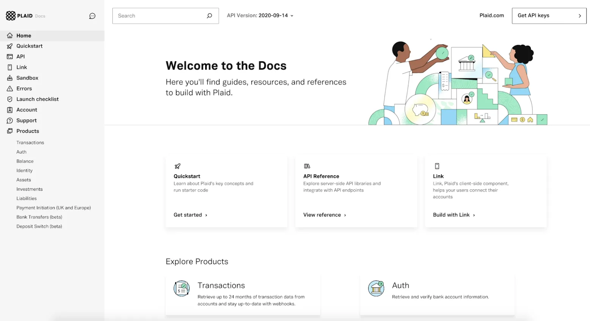
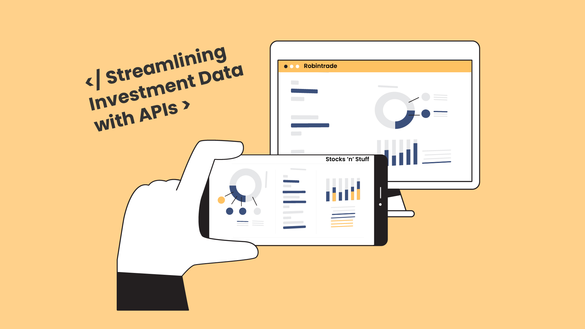
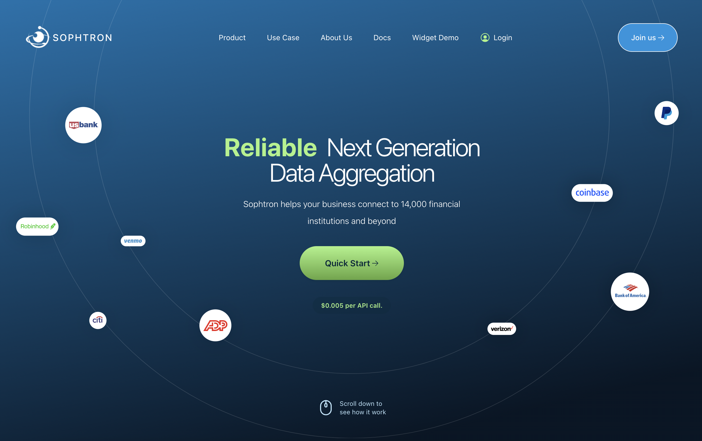
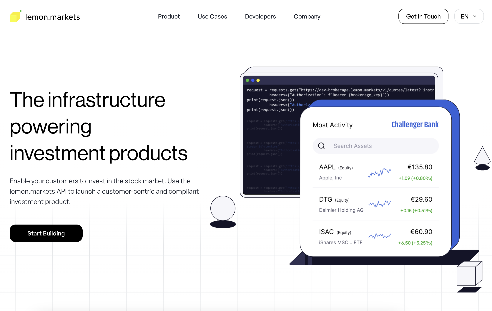
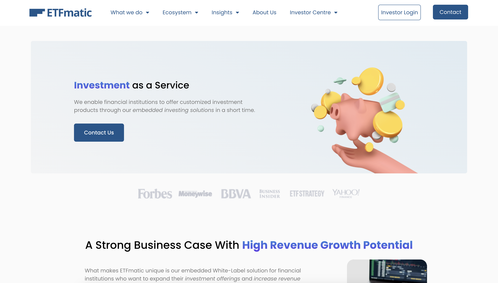

# The 6 Best Universal Brokerage Integration APIs in 2024

:::note
APIs are the present and future of how every tech company will create products
because it's a significantly faster and cheaper way to build. But whether you're
a solo developer working on a side project, an engineer at a company, or an
investor, it's hard to know what kind of APIs are out there that you might be
able to use. This is the first in a series of articles where we explore the API
landscape and discover APIs that could be helpful for each use case.
:::

Universal brokerage APIs are a topic near and dear to my heart. In my last
startup, TAI, we wanted to give users key insights into their stock portfolios
via our app and then allow them to trade on those insights.To do this, we first
looked into becoming a brokerage ourselves but that's a very slow and expensive
process. Then we thought about connecting users' existing brokerage accounts to
our app but was this even possible? It turns out that it was - enter universal
brokerage integration APIs!

## What are Universal Brokerage Integration APIs?

Universal brokerage integration APIs allow you to connect your app or website to
multiple brokerage APIs via a single connection.

## Why are Universal Brokerage Integration APIs useful?

On a broader level, universal APIs are useful because they allow a developer to
easily connect to many different data sources through a single interface and
data model. Using the universal brokerage API as an example, that means that a
developer can write code to integrate the single universal API (i.e. Plaid)
instead of having to write code to integrate every single broker API (i.e.
Fidelity, E-Trade, etc), saving a lot of time. It also means that the format the
developer receives the data in from each broker API is standardized, so for
example if the developer needs to pull stock tickers from a user's Fidelity and
E-Trade account, it won't matter if Fidelity and E-Trade have different key
names (i.e. it could be called `"symbol"` for Fidelity and `"ticker"` for E-Trade).
This reduces code complexity and the risk of bugs. You can learn more about the
value of Universal APIs [here](https://runalloy.com/blog/what-is-a-unified-api/#:~:text=With%20Universal%20APIs%2C%20you%20can,customers%20across%20the%20various%20platforms).

More specifically for universal brokerage APIs, a developer can save development
time by using these products if they are looking to:
 - Build trading into their app or website without having to become a broker themselves
 - Provide an aggregated portfolio view and analytics across a user's investments
 - Get information about users' past trades

## The Best Universal Brokerage Integration APIs of 2024

### [Plaid](https://plaid.com/)

Plaid is the largest universal financial services integration API and provides a wide coverage of institutions from brokers, retirement plan providers, crypto exchanges and more and investment account types. One potential downside of using Plaid is that they only allow read access (i.e. you can only get information from a brokerage account, you can't make any changes like posting a trade) and the data only updates once a day (so if you make a trade, the information won't be reflected until the end of day). Plaid allows you to receive data on stocks, ETFs, crypto, and options.

### [SnapTrade](https://snaptrade.com/)

Snaptrade focuses on retail brokerages and offers coverage from 22 companies
from Fidelity to Robinhood to Coinbase. Snaptrade allows read and write access
(i.e. you can make changes to an account like posting a trade in addition to
getting information like holdings data) and the data updates in near real time.
Snaptrade allows you to trade stocks, ETFs, crypto, and options.

### [Sophtron](https://sophtron.com/index)

Sophtron allows you to connect to 14,000 financial institutions from banks to
credit card companies to brokerages to crypto exchanges and receive data. Like
Plaid, Sophtron only allows read access and not write access, so your users
won't be able to trade. Sophtron is able to offer the widest coverage of
financial institutions because they have a sophisticated AI engine that allows
them to parse new financial institutions websites and build new integrations
without involving a human 95% of the time.

### [Upvest](https://upvest.co/)

Upvest is a licensed financial broker focused on the European market. While not
technically a universal brokerage integration API, Upvest has similar
functionality in that it allows you to offer trading and get information about a
user's portfolio without having to become a broker yourself. Upvest allows you
to trade stocks, ETFs, and crypto. The upside to using Upvest is that if a user
doesn't have an account, they can open one using Upvest but the downside is if
they have an account at another broker, they would have to move their account to
Upvest or open a new one.

Upvest also allows you to open up a savings plan for customers.

### [Lemon Markets](https://www.lemon.markets/)

Lemon Markets is also a licensed financial broker focused on the European market
that allows you to offer account creation and trading and get information about
a user's portfolio. Lemon Markets allows you to trade stocks and ETFs and also
allows you to open up a savings plan for customers.

### [ETFmatic](https://etfmatic.com/)

ETFmatic offers a white-label European robo-advisor API and widget. While
technically not a universal brokerage API, ETFmatic allows for a similar
functionality. ETFmatic also allows you to offer account creation and trading
and get information about a user's portfolio. As a robo-advisor, ETFmatic also
offers portfolio management services such as individualized portfolio
construction and rebalancing.

## Final Thoughts

If you're looking to introduce financial brokerage services into your app, then it's important to choose a provider that serves your needs. Some important things to consider are:

- What kind of institutional coverage do I need, both in terms of number of banks, brokerages, etc and types of institutions?
- What kind of functionality do I need? Do you need to just receive data or do you also want to trade? Do you want to allow users to create a new account or to connect an existing account?
- How often do I need my user's data to update?
- What geography do I want to operate in?

If I missed a favorite universal brokerage or asset management API or you have
any request for other API categories / use cases, please let me know at
founders@konfigthis.com and I will add it to the list! If you want to start
integrating one of these APIs, you can check out our database of [SDKs for
Public APIs](https://konfigthis.com/sdk/category/all) to help you get started
and reduce development time!
