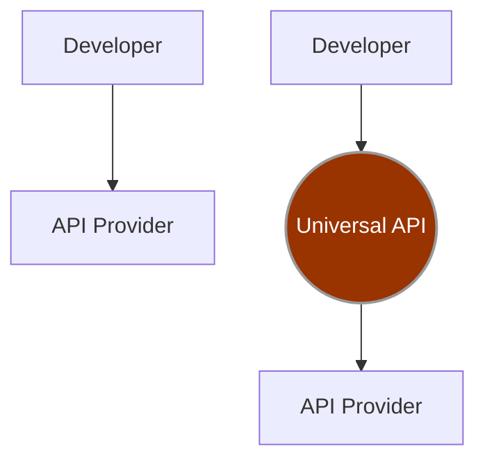

import { SdkSignupForm } from "@site/src/components/SdkSignupForm"

# Introducing Our New Product: Konfig SDKs

Exciting news for developers! We're thrilled to introduce Konfig SDKs, a
collection of SDKs designed to streamline and enhance your software development
process. Konfig SDKs will transform how you integrate external APIs, making your
development faster, your code cleaner, and your integrations more robust.

## Why?

```mermaid
graph BT
  D[Developers 😤] --> D1{API #1}
  D --> D2[API #2]
  D --> D3((API #3))
  style D1 fill:#f9f,stroke:#333
  style D2 fill:#f96,stroke:#666
  style D3 fill:#f99,stroke:#999
```

Developers often grapple with the challenges of integrating multiple external
APIs. The inconsistencies in documentation, the need for continuous updates, and
the tedious task of translating these documents into usable SDKs consume
valuable time and resources.

```mermaid
graph BT
  D[Developers 🤩] --> S1[SDK #1] --> D1{API #1}
  D --> S2[SDK #2] --> D2[API #2]
  D --> S3[SDK #3] --> D3((API #3))
  style D1 fill:#f9f,stroke:#333
  style D2 fill:#f96,stroke:#666
  style D3 fill:#f99,stroke:#999
```

With Konfig, you let us do the parsing and translation to SDKs, so you can focus
on core business logic.

## Features and Benefits

- **Faster Integration with Less Code:** Konfig SDKs allow you to integrate APIs
swiftly, erasing the need to write boilerplate code.
- **Always Up-to-Date:** Stay ahead with SDKs that are automatically updated in
alignment with API changes.
- **Change Notifications:** Receive alerts when an API you depend on undergoes
changes, ensuring your projects stay up-to-date.
- **Unmatched Efficiency:** Build software at an accelerated pace, maintain less
code, and expand your app's capabilities with more external integrations.

## How does it work?

1. We maintain the [highest quality collection of OpenAPI Specifications
on the internet](https://github.com/konfig-sdks/openapi-examples). This collection
is open and MIT-licensed so you can use it freely.
2. Generate SDKs from the OpenAPI Specifications.
3. Distribute the SDKs to you through standard package managers

Finally, whenever an SDK is updated, we will notify you.

By signing up, you will receive an access token that grants you access to our
SDKs. You can then use the SDKs to integrate the APIs you need into your
projects.

## Konfig SDKs vs. Universal API Solutions

Konfig SDKs offer three key advantages over universal API solutions: **pricing,
security, and comprehensiveness**.

### Pricing

Unlike costly universal API solutions that charge $100s per connected account
per month, Konfig SDKs offer a transparent and affordable pricing model. At just
[$50 per month](/sdk/#pricing), you get unlimited access to our SDKs, ensuring
your projects stay within budget.

### Security

Universal API solutions introduce potential security concerns for data-sensitive
applications. By adding a universal API layer to your infrastructure, you
introduce a potential security risk to your data by passing sensitive
information through the provider's infrastructure, possibly leaking information
in-transit. Konfig SDKs, on the other hand, ensure your data remains secure and
private by connecting you directly to the API provider's infrastructure.

### Comprehensiveness

We simply offer connections to more APIs than universal API solutions.

<Figure caption={<a href="/sdk/category/all">Checkout our selection of SDKs</a>}>

</Figure>

## What if I cancel my subscription?

If you cancel your subscription, you will no longer have access to updates. But
we offer a way to export your SDKs so your applications can continue to operate
without a subscription.

## The Future

At the core of Konfig SDKs is our extensive experience in generating SDKs for
REST APIs from OpenAPI specifications. We understand the developer's plight and
have crafted Konfig SDKs to alleviate these challenges.

We plan to expand
[openapi-examples](https://github.com/konfig-sdks/openapi-examples) and further
refine Konfig SDKs, ensuring you write and maintain less code.

Don't miss out on the opportunity to transform your development workflow. Sign
up below to be among the first to leverage the power of Konfig SDKs.

<SdkSignupForm/>