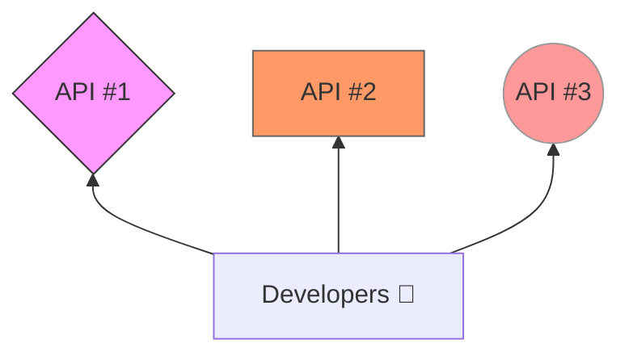
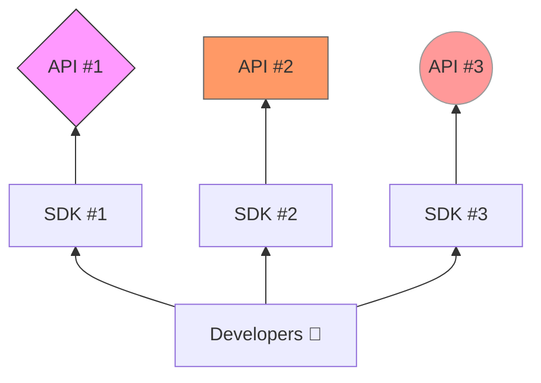
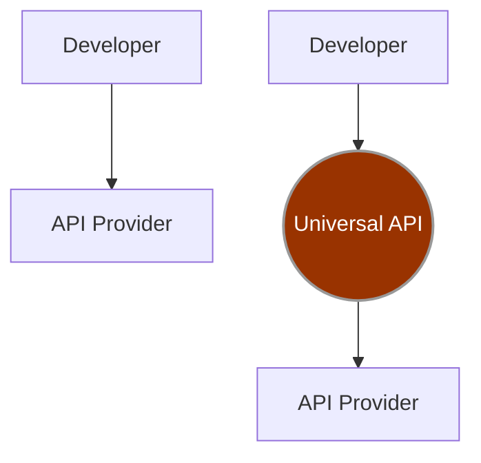
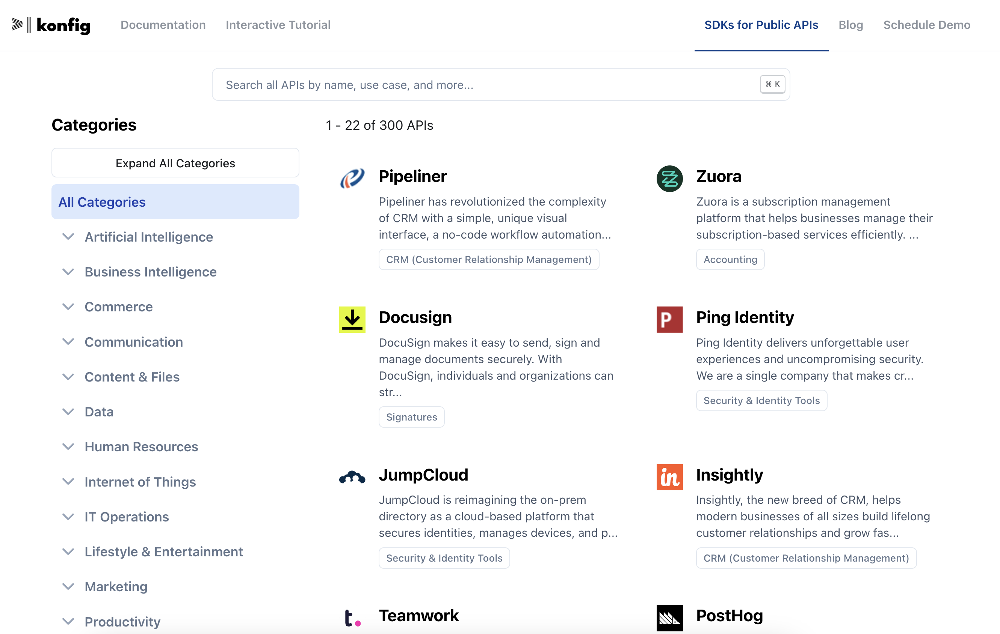

import { SdkSignupForm } from "@site/src/components/SdkSignupForm"
import { SdksLink } from "@site/src/components/SdksLink"


# Introducing Our New Product: Konfig SDKs

Exciting news for developers! We're thrilled to introduce Konfig SDKs, a
collection of SDKs designed to streamline and enhance your software development
process. Konfig SDKs will transform how you integrate external APIs, making your
development faster, your code cleaner, and your integrations more robust.

<SdksLink />

## Why?



Developers often struggle with the challenges of integrating multiple external
APIs. The inconsistencies in documentation, the need for continuous updates, and
the tedious task of translating these documents into usable SDKs consume
valuable time and resources.



With Konfig, you let us do the tedious work of parsing and translating to SDKs,
so you can focus on core business logic.

## Features and Benefits

- **Faster Integration with Less Code:** Konfig SDKs allow you to integrate APIs
swiftly, erasing the need to write boilerplate code.
- **Always Up-to-Date:** Stay ahead with SDKs that are automatically updated in
alignment with API changes.
- **Change Notifications:** Receive alerts when an API you depend on undergoes
changes, ensuring your projects stay up-to-date.
- **Unmatched Efficiency:** Build software at an accelerated pace, maintain less
code, and expand your app's capabilities with more external integrations.

## How does it work?


1. We maintain the [highest quality collection of OpenAPI Specifications
on the internet](https://github.com/konfig-sdks/openapi-examples). This collection
is open and MIT-licensed so you can use it freely.
2. Generate [AI-Augmented SDKs](/sdk/category/all) from the OpenAPI
Specifications in TypeScript, Python, Java, C#, PHP, Ruby, Go, Swift, and Dart.
AI helps us ensure that the SDKs feel natural to use and are well-documented.
3. Distribute the SDKs to you through standard package managers

Finally, whenever an SDK is updated, we will notify you.

By signing up, you will receive an access token that grants you access to our
SDKs. You can then use the SDKs to integrate the APIs you need into your
projects. Then you can add SDKs to your project using your favorite package
manager:

```shell CLI
pnpm install @konfig/{API}
```

## Konfig SDKs vs. Universal API Solutions

Konfig SDKs offer two key advantages over universal API solutions: **security
and comprehensiveness**.

### Security



Universal API solutions introduce potential security concerns for data-sensitive
applications. By adding a universal API layer to your infrastructure, you
introduce a potential security risk to your data by passing sensitive
information through the provider's infrastructure, possibly leaking information
in-transit. Konfig SDKs, on the other hand, ensure your data remains secure and
private by connecting you directly to the API provider's infrastructure.

### Comprehensiveness

We offer connections to more APIs than universal API solutions. Moreover, we do
not prescribe a common data model for all APIs, ensuring you have full access to
all of the API's capabilities.

<Figure caption={<a href="/sdk/category/all">Checkout our selection of SDKs</a>}>

</Figure>

## Use Cases

Konfig SDKs can be used in a variety of scenarios. Here are a few examples:

1. [**E-commerce Integration**](/sdk/category/e-commerce): Use Konfig SDKs to integrate with e-commerce platforms and streamline your sales process.
1. [**Financial Services**](/sdk/category/finance): Integrate with financial services APIs to manage transactions and accounts.
1. [**Human Resources**](/sdk/category/human-resources): Integrate with human resources APIs to manage employee data and schedules.
1. [**Sales**](/sdk/category/sales-crm): Integrate with sales platforms to manage sales, orders, and customer data.
1. [**Productivity**](/sdk/category/productivity): Use AI to enhance your productivity in your current productivity tools. Integrate with productivity platforms to manage tasks, projects, and documents.

## The Future

At the core of Konfig SDKs is our extensive experience in generating SDKs for
REST APIs from OpenAPI specifications. We understand the developer's plight and
have crafted Konfig SDKs to alleviate these challenges.

We plan to add more APIs to
[openapi-examples](https://github.com/konfig-sdks/openapi-examples) and further
refine Konfig SDKs, ensuring you write and maintain less code.

Don't miss out on the opportunity to transform your development workflow. Sign
up below to be among the first to leverage the power of Konfig SDKs.

<SdkSignupForm/>

If you have a request for an SDK for a particular API, please reach out at
founders@konfigthis.com or join our [Discord server](https://discord.gg/WbSSH4B3).