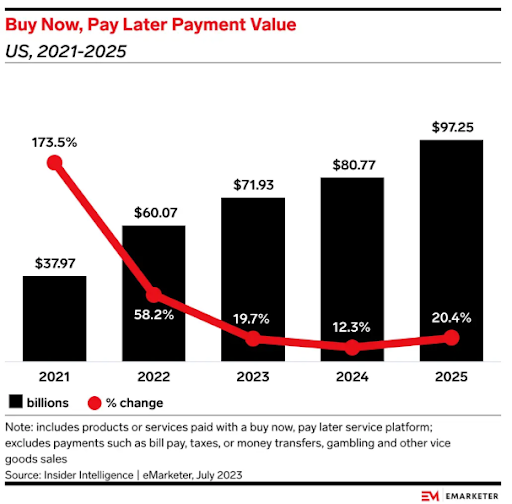
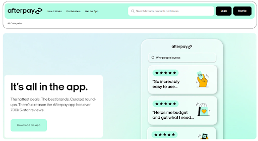
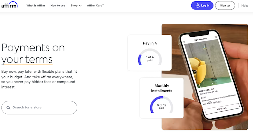
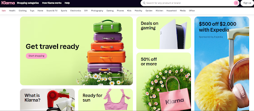
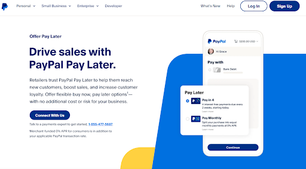
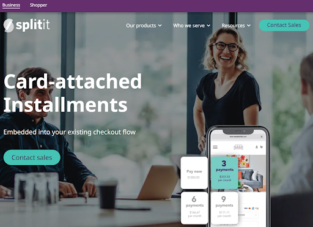
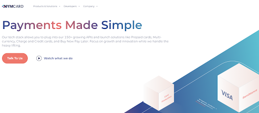
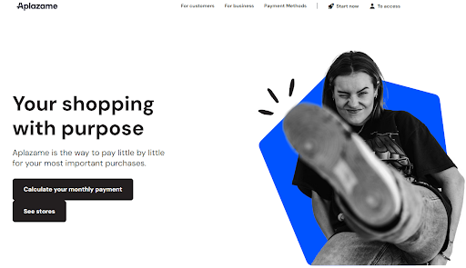
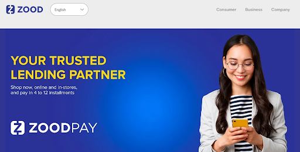

# The 10 Best Buy Now Pay Later APIs in 2024

Buy Now Pay Later (BNPL) seemed to explode out of nowhere during COVID, as consumers flushed with cash and with nothing to do made a lot of big ticket purchases online. In the years since, BNPL continued to grow at a healthy clip and is projected to power almost $100 billion of transactions in the US in 2025. If you want to incorporate BNPL into your product, you can easily do it via API!

## What are BNPL APIs?

BNPL allows consumers to pay for their online and in-store purchases in installments. The typical terms are 4 installments charged bi-weekly. So if you purchase a $2,000 laptop, instead of paying $2,000 upfront with cash or a credit card, you can split the purchase into 4 bi-weekly, automated payments of $500 each. A BNPL API allows you to connect your e-commerce app or website to other parts of the payment ecosystem (issuers, processors, networks, etc) and set up and maintain buy now pay later installment plans using the network.

## Why are BNPL APIs useful?

BNPL APIs are useful because they are another option to allow consumers to fund purchases of big ticket items if they don’t have the money to pay for them right now. BNPL can be a better way for customers to pay versus credit cards because certain BNPL plans are interest-free. The downside versus credit cards is that using a BNPL plan means you don’t build your credit score, you don’t get points or other perks, and you have to pay back the purchase in a shorter time period than a credit card if you don’t want to pay interest.

## The Best BNPL APIs of 2024

### [Afterpay](https://www.afterpay.com/en-US)

Afterpay offers BNPL products to both retailers and consumers. On the retailer side, Afterpay allows businesses to offer BNPL functionality in the checkout flow via an API or pre-built integrations with Shopify, Woo Commerce, Stripe, and more. On the consumer side, Afterpay allows consumers to shop via the Afterpay app and keep track of their purchases and payments. Afterpay has over 1,000 major retailers in their network. 

Afterpay was acquired by Block (formerly Square) and can be used anywhere where Square accepts payments in the US and Australia. The company was founded in Australia and is the market leader there.

### [Affirm](https://www.affirm.com/)

Affirm works similarly to Afterpay and offers BNPL products to both retailers and consumers. Affirm has an equally large network of retailers compared to Affirm and has an exclusive deal with Amazon and is Shopify’s official BNPL partner.

Affirm was founded in the US and only operates in the US and Canada, but is looking to enter the European market in 2024.

### [Klarna](https://www.klarna.com/)

Klarna works similarly to Afterpay and Affirm and offers BNPL products to both retailers and consumers. Klarna was founded in Europe and is by far the [largest](https://explodingtopics.com/blog/bnpl-stats) exclusively BNPL-focused provider in the world in terms of number of users.

### [Paypal](https://www.paypal.com/us/enterprise/payment-processing/accept-pay-later)

Paypal is a large provider of payment services, including BNPL. Paypal’s BNPL solution works similarly to Afterpay, Affirm, and Klarna and offers BNPL products to both retailers and consumers. Paypal is the largest BNPL provider in the US.

### [SplitIt](https://www.splitit.com/)

SplitIt is a white-label BNPL provider focused on only businesses, including both business to consumer and business to business payments. Afterpay, Affirm, and Klarna force retailers to use their branded BNPL option (i.e. Klarna Pay) at checkout while SplitIt is more flexible and allows the retailer to put their own brand name on the BNPL option. By allowing the merchant to keep their own brand, SplitIt claims they have the highest checkout conversion and credit approval rates in the industry. SplitIt powers payments for many large companies, including AliExpress and Google.

### [NymCard](https://nymcard.com/)

NymCard is a provider of white-label payment services including pre-paid cards, multi-currency payments, credit cards, and BNPL. The BNPL portion of their services works similarly to SplitIt. 

### [Acima](https://www.acima.com/)

Acima has a slightly different take on the BNPL concept in that they are lease to own. This means that instead of you buying an item from Amazon using BNPL, Acima actually buys the product on your behalf and then leases it to you until you finish making payments. After you finish making lease payments you own the item. Functionally, it works similarly to BNPL in that consumers split payments for purchases into installments without the use of credit, except that Acima has more stringent requirements on who can use the service (must have an active checking account and $750 monthly income) and the lease payments will always end up being more expensive than the interest-free BNPL option. The advantage of using Acima vs. BNPL is that they work with more local merchants and providers of expensive goods (such as tires). 

### [Credova](https://credova.com/)

Credova works similarly to Afterpay but is specifically focused on BNPL for outdoor gear including hiking, hunting, fishing, and motor and water sports gear. 

### [Aplazame](https://aplazame.com/)

Aplazame works similarly to Afterpay. It is based in Spain and is one of the largest BNPL providers in the country. 

### [ZoodPay](https://www.zood.biz/pay)

ZoodPay works similarly to Afterpay and is focused on serving 4,000 small and medium sized businesses in Uzbekistan, Lebanon, and Pakistan. The maximum purchase amount for the interest-free plan is US$500 and the maximum for the interest plan is US$2,000. 

## Final Thoughts

If you’re looking to introduce BNPL services into your product, then it’s important to choose a provider that serves your needs. Some important things to consider are:

- What types of products do I sell? Different BNPL providers can have different customer bases, so pick the one that has the most customers that you are targeting.
- Do I want to have my own brand on the BNPL checkout page or do I want a third party brand?
- What geography do I operate in?
- Do I want to offer other payment services and if so do I want to have the same provider as my BNPL provider?

If I missed a favorite BNPL API or you have
any request for other API categories / use cases, please let me know at
founders@konfigthis.com and I will add it to the list! If you want to start
integrating one of these APIs, you can check out our database of [SDKs for
Public APIs](https://konfigthis.com/sdk/category/all) to help you get started
and reduce development time!
