# The 10 Best LLM Ops APIs in 2024

With the emergence of Generative AI, kick-started by OpenAI with the public launch of ChatGPT in 2022, it didn’t take long for Generative AI to penetrate numerous industries across the globe. Generative AI refers to AI algorithms which can generate media such as text, audio, or video content. A Large Language Model, or LLM, is a type of Generative AI which is trained on a massive corpus of data and can interpret and generate text. As LLMs became more widespread and companies scrambled to utilize their potential, the need arose for tools which help develop, deploy, and maintain LLM applications; this is referred to as LLM Ops. Large growth is projected for LLMs in the coming years, meaning LLM Ops will become an important part of the developer ecosystem for companies wanting to incorporate LLMs into their operations. Many LLM Ops companies offer an API to integrate their services into your company’s workflows.

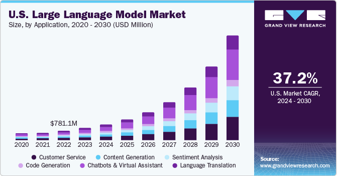

## What are LLM Ops APIs?

Even before the meteoric rise of LLMs a few years ago, MLOps (Machine Learning Operations) was a familiar term referring to tools which manage the lifecycle of ML applications. LLMOps is the natural successor to MLOps, giving developers instruments to deploy, tune, and monitor LLM applications. LLM Ops APIs give companies a broad suite of tools to evaluate LLM performance, increase observability, orchestrate complex tasks, test accuracy and bias, benchmark, deploy updates, ingest data, and more.

## Why are LLM Ops APIs useful?

LLM Ops APIs are the essential channel for businesses to tap into the potential of Large Language Models. By abstracting the complexities of model deployment and management, these APIs streamline development workflows, enabling rapid prototyping and deployment of Generative AI models for businesses. They also provide a standard interface for accessing a wide range of monitoring and analytics tools, allowing developers to use LLM technologies with minimal overhead. For companies wanting to integrate LLM capabilities into their enterprise, there is no substitute for the essential mechanisms provided by LLM Ops APIs. 

## The Best LLM Ops APIs of 2024

### [Monster API](https://monsterapi.ai/)

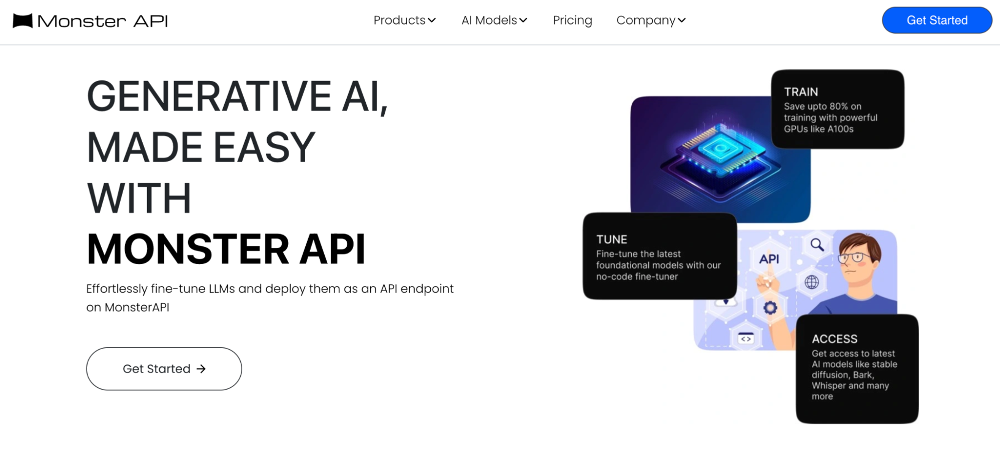

Monster API offers a single cost-efficient API abstraction over numerous Generative AI models, allowing developers to easily build ML applications for their business. Monster also provides no-code LLM fine-tuning, deployment, and scaling tools. 

### [Pulze.ai](http://Pulze.ai)

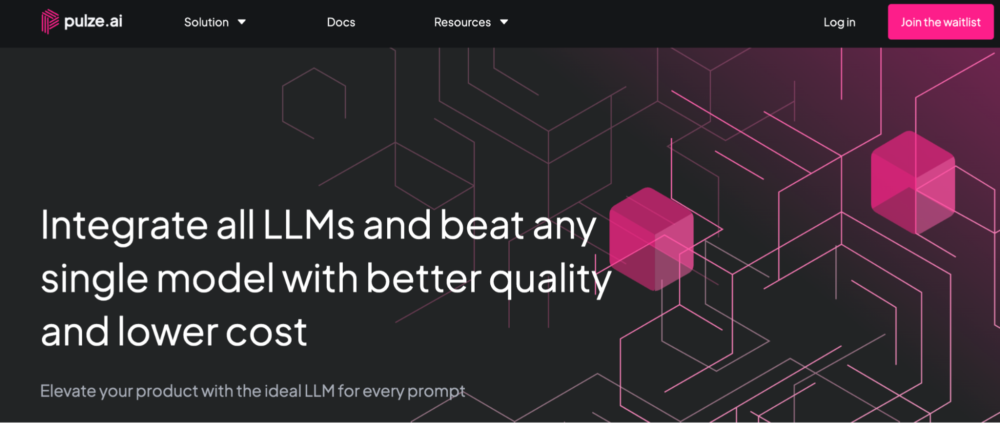

Pulze AI boasts a single API that can route between different LLM providers to optimize for maximum quality and minimal cost. The company also offers a suite of management and tuning implements, allowing you to upload data, customize and fine-tune prompts, deploy applications, measure analytics, and benchmark results.  

### [Context.ai](http://Context.ai)

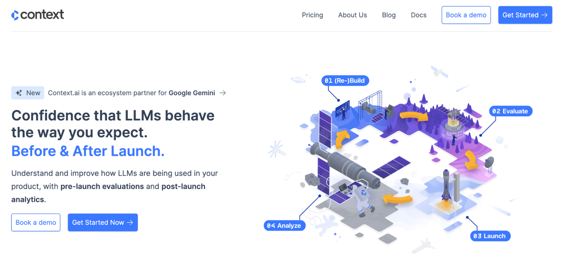

Context AI’s API focuses on the performance monitoring aspect of LLM Ops, giving developers tools to evaluate and test models for accuracy and bias prior to deployment, then monitor deployments with data-driven analytics from real users to understand and improve user experience in production.

### [Carbon](https://carbon.ai/)

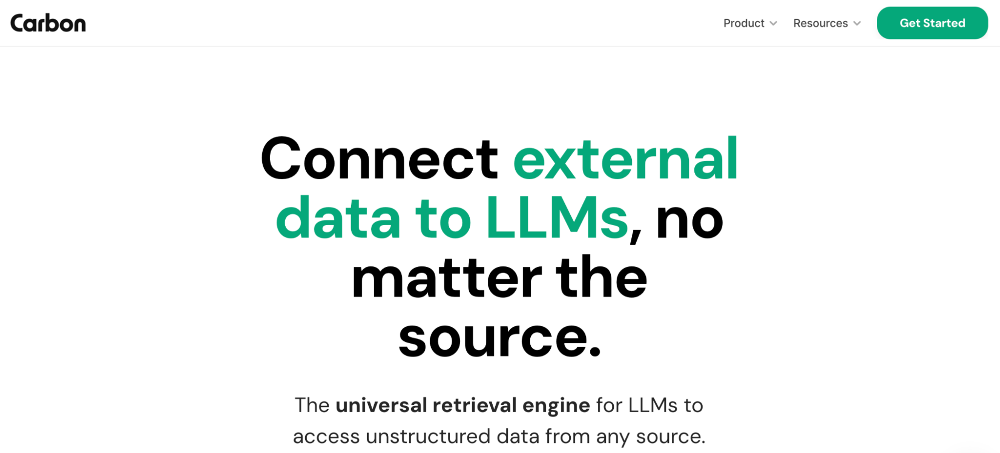

Carbon offers an LLM Ops API primarily focused on ingesting external data into LLM ecosystems. They offer ready-made components and data connectors, allowing easy integration of external unstructured data from a variety of sources, such as Google Drive, Dropbox, and Sharepoint. 

### [Humanloop](https://humanloop.com/)

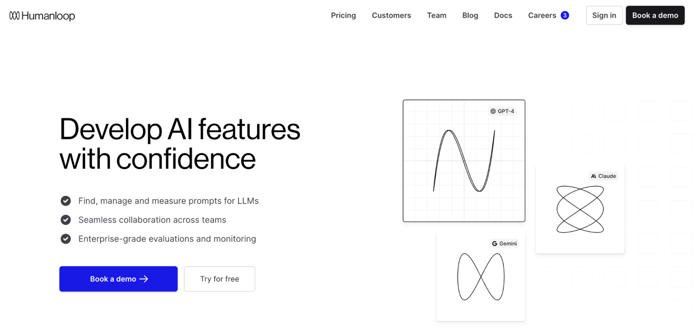

Humanloop API offers a variety of LLM Ops tools including an evaluation and monitoring suite, fine-tuning and optimization tools, and prompt management. Humanloop also provides a unique collaborative, version-controlled playground to manage and iterate prompts. 

### [Langfuse](https://langfuse.com/)

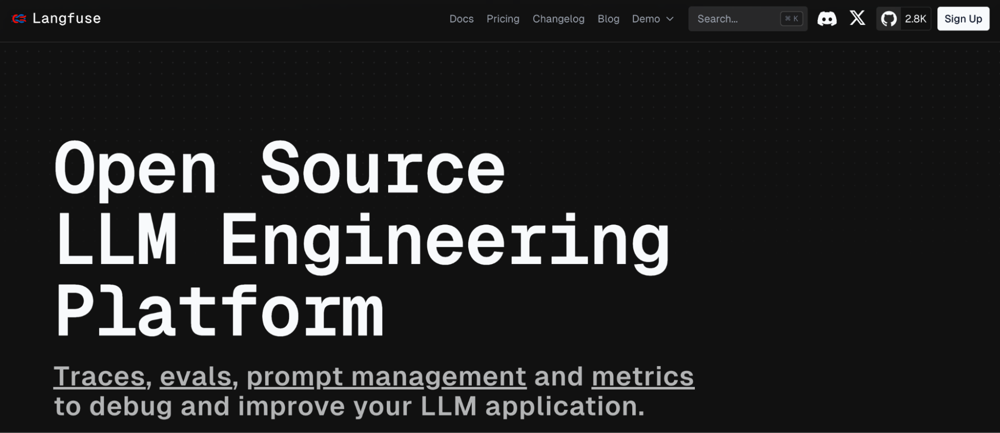

Langfuse API offers a variety of LLM Ops tools for managing the entire lifecycle of LLM applications, including prompt management, tracings, evaluation, and metrics. Langfuse is uniquely open source, and can also be self-hosted or even run locally. 

### [Graphlit](https://www.graphlit.com/)

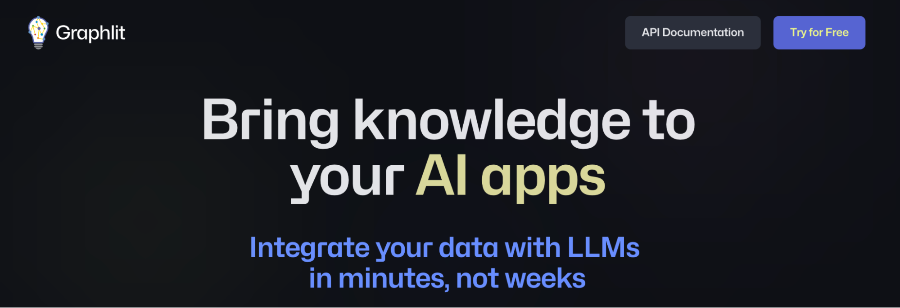

Similar to Carbon, the primary offering of Graphlit’s API is a powerful data ingestion tool, allowing you to easily connect data from different sources into your LLM applications. The data can come from websites, cloud storage, applications such as Jira and Slack, or be unstructured data such as documents, images, or videos.

### [DataRobot](https://www.datarobot.com/)

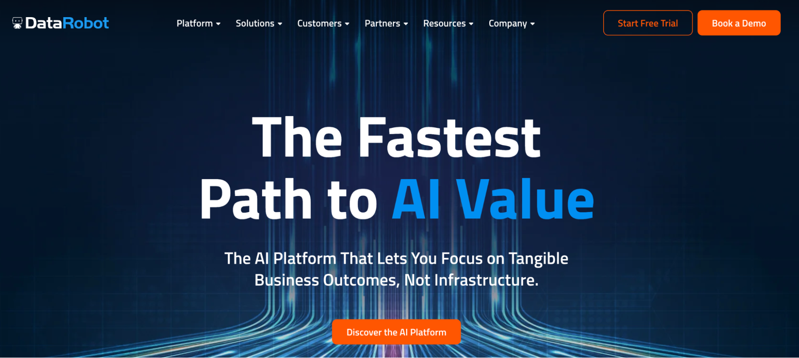

DataRobot boasts a comprehensive platform for building and operating LLM applications. Their API offers data ingestion tools, business application connectors, and native integrations which lets you choose different Gen AI components that best fit your business’s use case, as well as a model deployment and monitoring suite.

### [OpenPipe](https://openpipe.ai/)

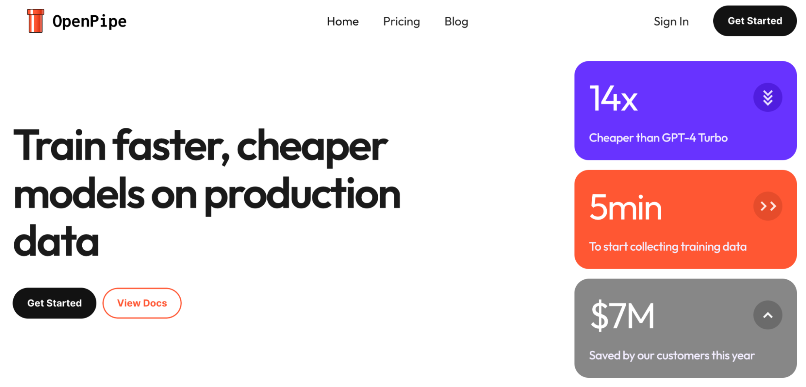

OpenPipe is a YC startup focused on training, deployment, fine-tuning, and evaluation of LLM models. They also boast flexible custom pricing plans that can slash the cost of a typical deployment.

### [Autoblocks](https://www.autoblocks.ai/)

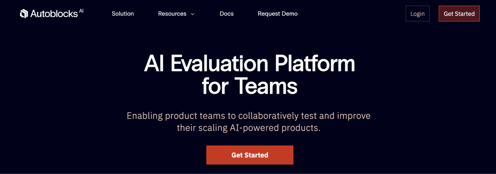

Autoblocks is a platform focused on LLM evaluation: monitoring, testing, debugging, analytics, and other post-deployment tools. Autoblocks has flexible integrations that work with any codebase or tech stack, which avoids locking developers into any particular technology. 

## Final Thoughts

If you’re looking to introduce LLM Ops services into your product, then it’s important to choose a provider that serves your needs. Some important things to consider are:

- What kind of tools you are looking for: LLM Ops is a broad term, and different companies focus on different aspects, from data ingestion to model deployment to monitoring and analytics, or all of the above. 
- What pricing model fits your use case the best: different companies offer different pricing plans for their services, from per-token plans to completely custom pricing models.
- How rigid is the tech stack: Some services might lock you in to a particular technology or LLM provider, where others might be more flexible. 

If I missed a favorite LLM Ops API or you have any request for other API categories / use cases, please let me know at founders@konfigthis.com and I will add it to the list! If you want to start integrating one of these APIs, you can check out our database of SDKs for Public APIs to help you get started and reduce development time!
