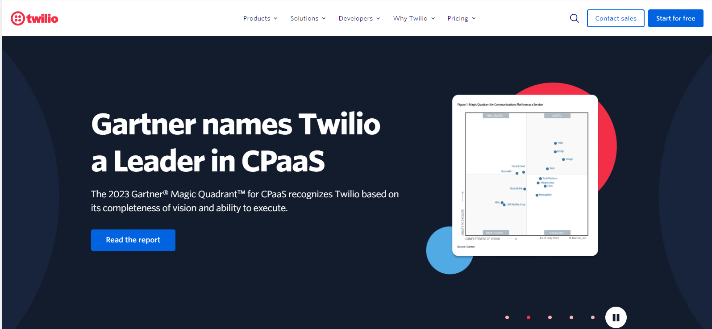
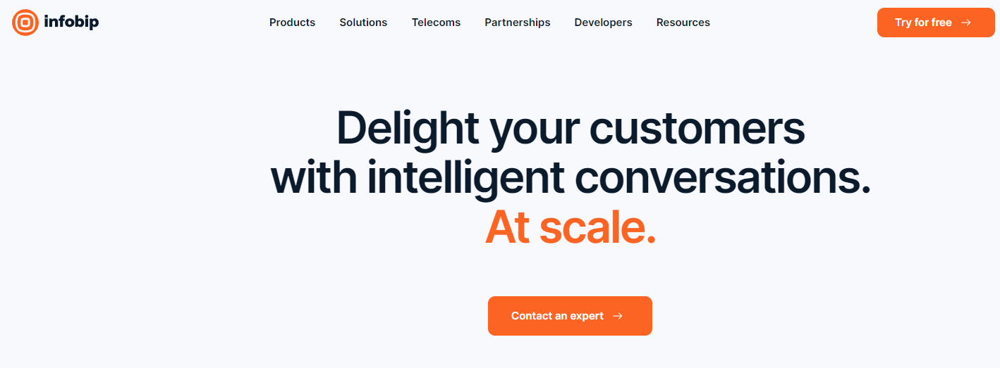
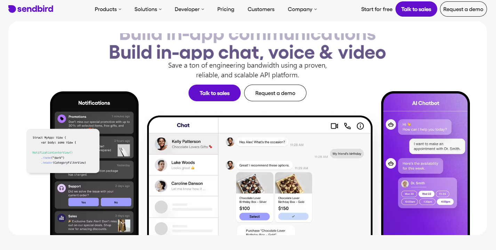
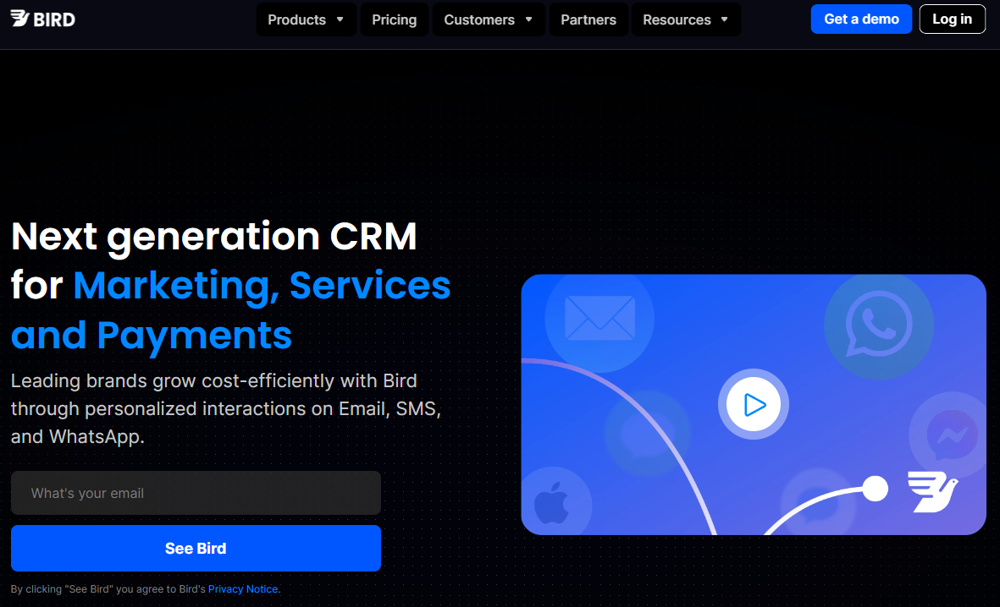
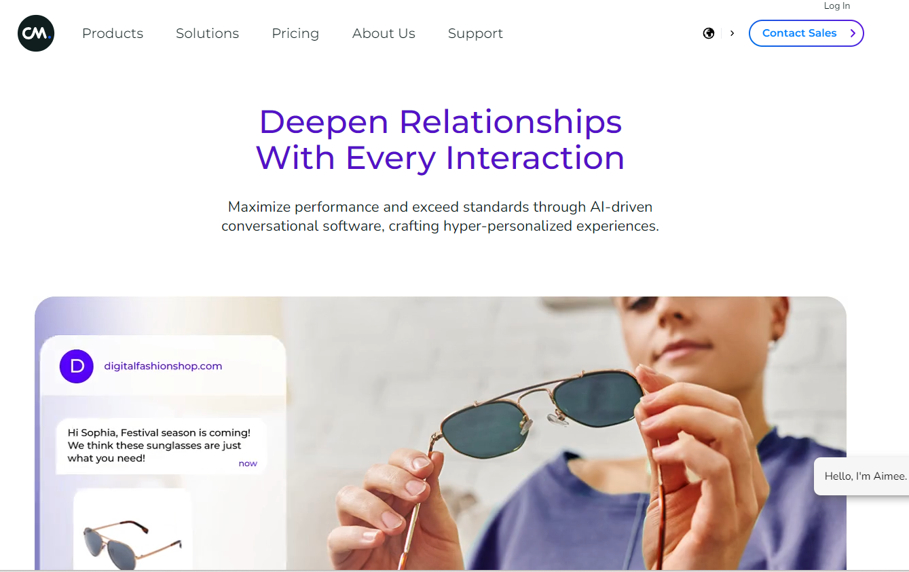
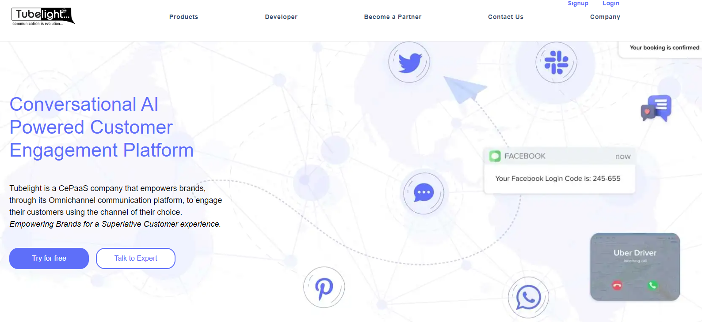

# The 9 Best Messagings APIs in 2024

Photo by [Christian Wiediger](https://unsplash.com/@christianw?utm_content=creditCopyText&utm_medium=referral&utm_source=unsplash) on [Unsplash](https://unsplash.com/photos/person-using-smartphone-GWkioAj5aB4?utm_content=creditCopyText&utm_medium=referral&utm_source=unsplash)

Our mobile phones are a ubiquitous part of our lives, so it’s no surprise that companies find them useful when they want to send us messages from PIN codes to verify our identity to marketing messages to food delivery updates. As more companies (tech and otherwise) want to send us messages, messaging APIs have popped up to make adding this feature as easy and seamless as possible. 

## What are Messaging APIs?

Messaging APIs allow companies to automatically or manually send messages to their customers via SMS, MMS, Whatsapp, push notifications, etc. In addition to just sending messages, messaging APIs also offer other services like analytics to help companies understand their users and optimize their messages.

## Why are Messaging APIs useful?

Messaging APIs are useful because they allow companies to reach users at scale in a way that will be noticed. Messages that can cut through the noise of everyday life are very useful in driving business outcomes, e.g. getting a notification about a sale can drive conversion for an e-commerce business. Some common use cases for messaging APIs include:
- Identity verification whether through sending one time passwords to users who forgot their password, PIN codes for two factor authorization, etc. Identity verification helps users conveniently manage their accounts and helps companies avoid fraud.
- Programmable messages whether marketing messages, promotions, notifications (food delivery, flights), etc. 
- Conversational messages (e.g. chatbots) for customer support. 

## The Best Messaging APIs of 2024

### [Twilio](https://www.twilio.com/en-us)

Twilio is the market leader for messaging APIs, powering companies such as Toyota, IBM, and AirBnB. Twilio offers messaging APIs that can do identity verification, programmable messages, and conversational messages as well as other communication services including voice and e-mail. Twilio allows companies to reach consumers in 180+ countries and 1,500+ global mobile network carriers through SMS, MMS, Whatsapp, etc 

### [Infobip](https://www.infobip.com/)

Infobip’s messaging API works similarly to Twilio’s, offering identity verification, programmable messages, and conversational messages to companies such as Uber, Meta, and Samsung. Infobip is focused more on conversational messaging services and offers a Gen AI powered chatbot. Infobip is a global company and is directly connected to 800 global mobile network carriers.

### [Retarus](https://www.retarus.com/)

Retarus provides fax, e-mail, and SMS messaging services for enterprise companies including Adidas and Avis via API. Retarus’ SMS service reaches 99% of all global mobile networks and messages are reliably delivered irrespective of the recipient’s internet connection and even in remote regions where GSM is the only service available.

### [Sendbird](https://sendbird.com/)

Sendbird’s API platform allows companies including Hinge, Redbull, and DHL to build AI powered chatbots and send programmable messages. Sendbird is an omniplatform messaging service, meaning they take a unified and integrated approach to communications that allows companies to engage with their customers across multiple channels seamlessly.

### [Bird](https://bird.com/)

Bird offers a messaging API focused on marketing messages and customer support via SMS, MMS, Whatsapp, e-mail etc. Bird’s customers include the New York Times, Facebook, and Zillow. Bird integrates with other systems including Shopify, Stripe, and Salesforce so that messages can be enriched and personalized with data, improving conversion rates. 

### [Attentive](https://www.attentive.com/)

Attentive focuses on providing hyper-personalized SMS and e-mail messages to customers including Neiman Marcus, Crate & Barrel, and H&M. Attentive is much more focused on serving the marketing needs of retailers and consumer companies than general messaging services like Twilio. Attentive allows companies to collect e-mails and phone numbers through web, social, and in-store channels, dynamically build the right audience to send specific messages to, and trigger messages based on specific user actions. 

### [CM](https://www.cm.com/)

CM, similar to Sendbird, is an omnichannel delivery platform with a focus on the marketing, delivery, payments, and ticketing industries. CM’s customers include BMW, Coca Cola, and Domino’s. CM’s platform can send messages via SMS, Whatsapp, voice, and more.

### [Tubelight](https://tubelightcommunications.com/)

Tubelight’s messaging API works similarly to Twilio’s, offering identity verification and programmable messages services. Tubelight is focused on the Indian market though it does have relationships with 200+ global mobile network carriers. Tubelight can deliver messages via SMS, MMS, Whatsapp, and RCS. 

### [Textgrid](https://textgrid.com/)

Textgrid works similarly to Twilio and offers messaging services in over 190 countries. Textgrid’s main selling point is that they are half of the cost of using Twilio. 

## Final Thoughts

If you’re looking to introduce messaging services into your product, then it’s important to choose a provider that serves your needs. Some important things to consider are:
- What use cases do I have for messaging (identity verification vs. marketing vs. delivery, etc)? 
- What geographies and carriers do I need access to?
- What level of message customization and targeting do I need?
- Are there other ancillary messaging and communication services I want to provide and do I want to use the same provider?

If I missed a favorite messaging API or you have  any request for other API categories / use cases, please let me know at
founders@konfigthis.com and I will add it to the list! If you want to start
integrating one of these APIs, you can check out our database of [SDKs for
Public APIs](https://konfigthis.com/sdk/category/all) to help you get started
and reduce development time!
