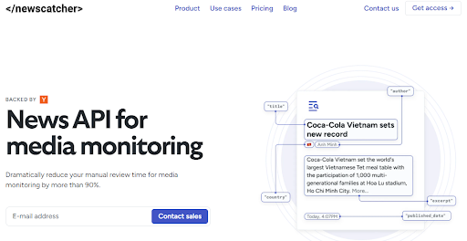
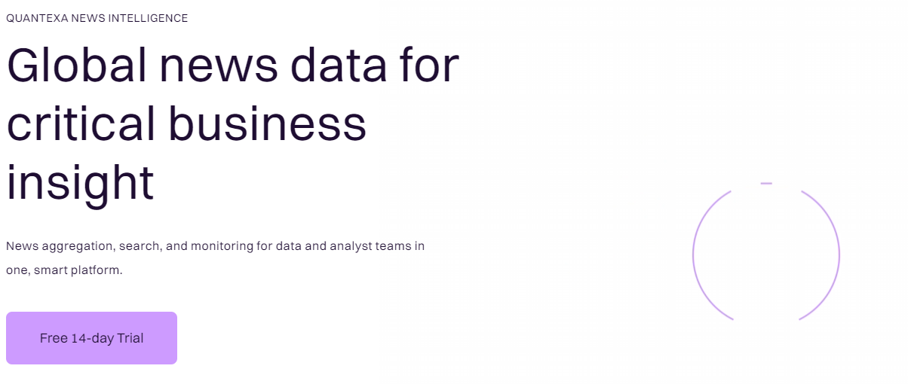
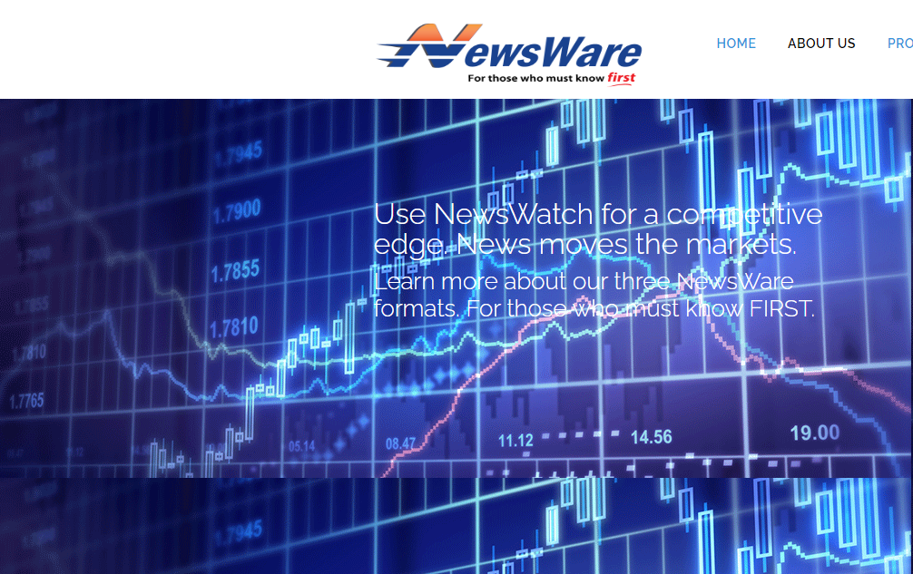

# The 4 Best News Aggregation APIs in 2024

*Source: Unsplash*

## What are News Aggregation APIs?

News Integration APIs provide access to articles, headlines, and other pieces of content from a variety of sources. While the New York Times provides access to their own content via API, news aggregators will provide access  to many sources of news from the New York Times to the Washington Post to Bloomberg via a single API connection. 

## Why are Universal Brokerage Integration APIs useful?

Being able to receive and parse through information is useful to both individuals and businesses. From a business perspective, news aggregation APIs help for the following functions:
 - **Business & Risk intelligence:** Companies are able to stay up to date with current events in their industry, regulatory changes, competitor launches and other risk factors 
 - **Sales Intelligence:** Companies can stay up to date with what potential customers are doing, helping them decide when might be the right time to approach the prospect and what the right message might be

On the consumer side, news aggregation APIs can also be useful for apps who are looking to provide news updates as part of a broader offering of services. Robinhood is a good example of this where they show financial news relevant to a company on that company’s stock page. 

Finally, while news aggregation APIs are generally useful in the same way that [other universal APIs are useful](https://konfigthis.com/blog/asset-management-integrations/) (TL; DR: they save developer time writing integration code with multiple sources and data formats), they are also easier to use and more reliable than scraping thousands of news websites yourself.

## The Best News Aggregation APIs of 2024

### [Newscatcher](https://www.newscatcherapi.com/)

Newscatchers’ API allows companies to access articles from a variety of sources and build customized newsfeed based on 15 filters to help screen out noise. Newscatchers’ scrapers also uses multiple extraction techniques to make sure critical updates aren’t missed, de-duplicate data so you aren’t getting multiple hits for the same article, and allow you to filter results via multiple methods such as entity linking, clustering, and semantic search. Newscatcher also allows you to enrich metadata for each article, which will allow you to better find what you’re looking for when you search via filters or keywords.

### [Quantexa](https://aylien.com/)

Quantexa’s news API offers a similar offering to Newscatcher, offering access to 90,000 news outlets and 1.3M daily news articles. Quantexa will also translate articles in different languages to a language of your choice. Quantexa’s also uses AI to both enrich the metadata for each article but also to help you search through articles. Quantexa also has a data visualization feature where you can track mentions or articles about a certain topic over time. Finally, Quantexa has a custom report builder that helps business intelligence analysts creating custom reports with commentary, visualization, and more to send to key stakeholders.

### [Opoint](https://opoint.com/)

Opoint’s API offers a similar offering to Newscatcher with access to articles from over 230,000 global news outlets. Opoint also offers a service to content writers to create a similarity score with other published articles so you can see how unique your content is.

### [NewsWare](https://newsware.com/)

NewsWare is focused on providing news feeds for investment professionals, especially algorithmic traders. NewsWare specializes in breaking news events that can affect investments, earnings news, broker ratings, SEC filings, economic indicators, FDA announcements, and more. Because of its focus on investment professionals where timing matters, NewsWare focuses on speed and zero-latency.

## Final Thoughts

If you’re looking to introduce news or news analysis into your workflow, then it’s important to choose a provider that serves your needs. Some important things to consider are:

- What coverage of news articles do I need?
- What latency do I need in receiving news?
- What other ancillary products and services do I need for my workflow and do I want them from the same provider?

If I missed a favorite news aggregation API or you have
any request for other API categories / use cases, please let me know at
founders@konfigthis.com and I will add it to the list! If you want to start
integrating one of these APIs, you can check out our database of [SDKs for
Public APIs](https://konfigthis.com/sdk/category/all) to help you get started
and reduce development time!
