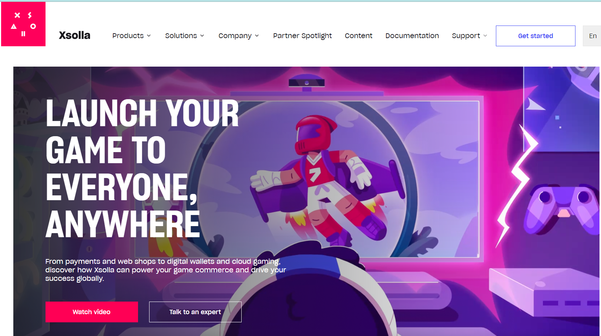
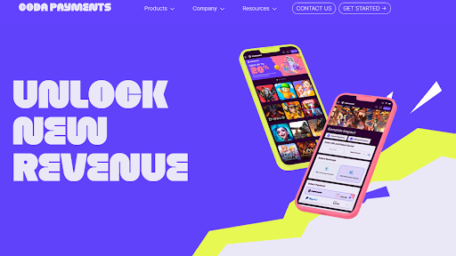
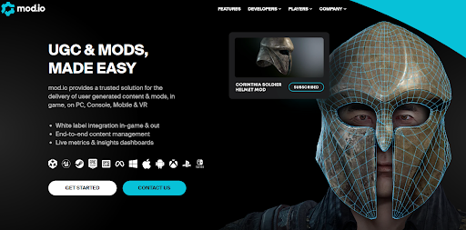
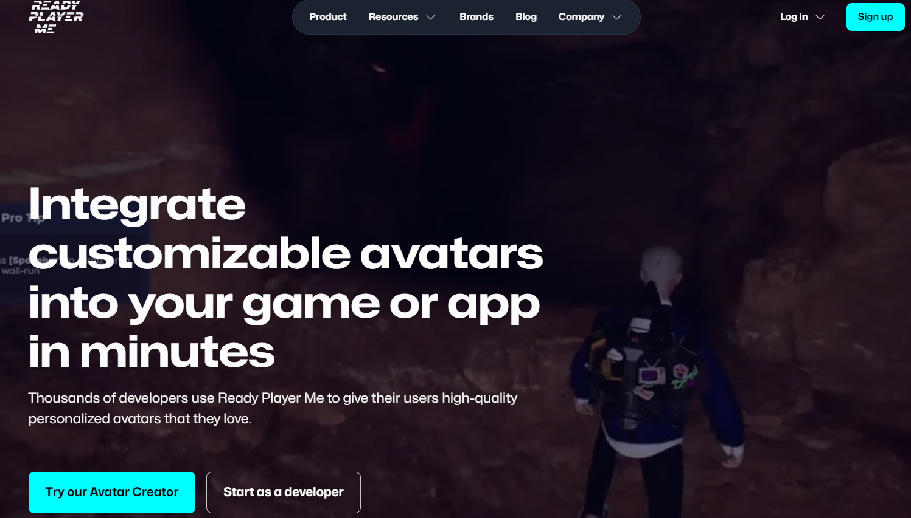
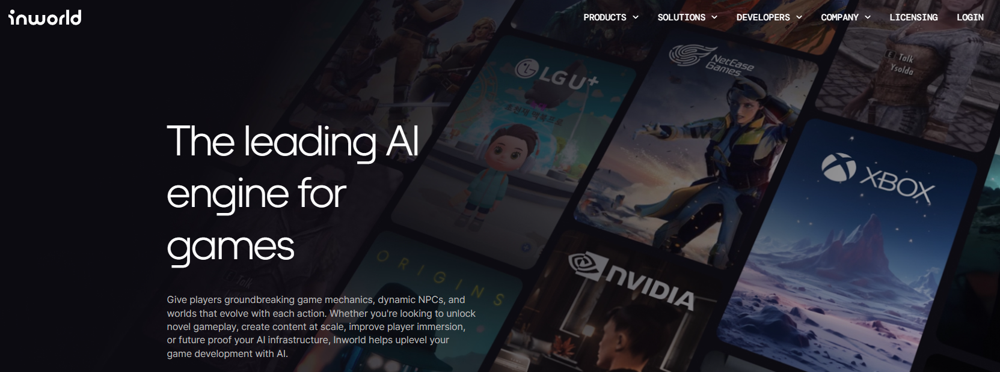
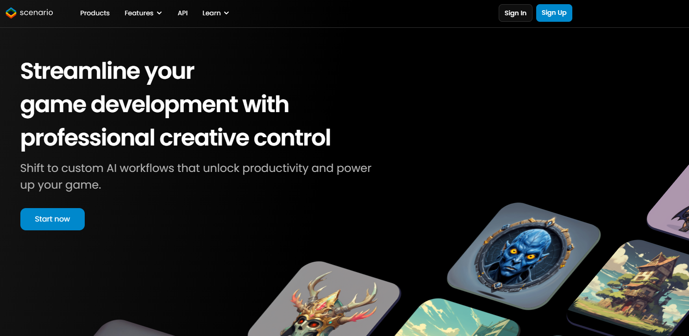
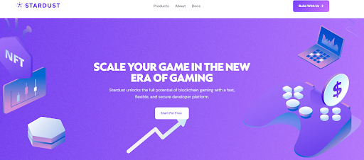
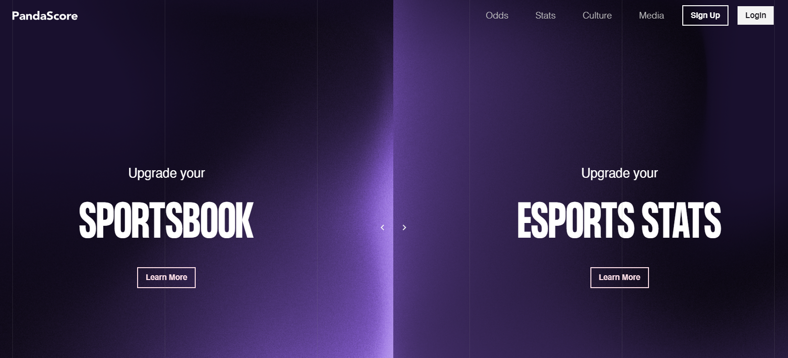
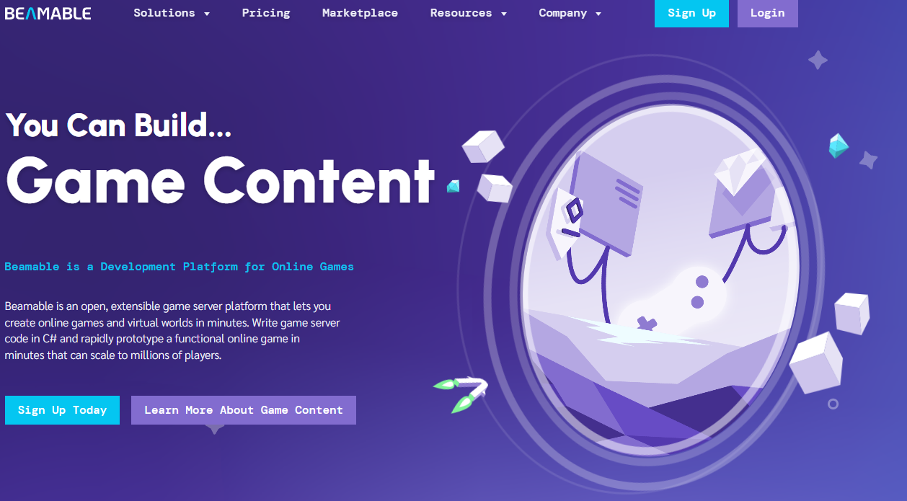

# The 10 Best Video Games APIs in 2024

Gaming is the fastest growing and largest industry within media, and it’s not hard to see why. While the cost of creating a movie or TV show has gone up, making a game has never been easier thanks to wide distribution through Steam and the iOS / Play stores and a variety of APIs that allow game makers to offload non-core functionality to third party providers and focus on making fun and engaging games. 

On a side note, gaming is one of my passions and Konfig’s first iteration was as a [B2B gaming company](https://konfigthis.com/blog/pivoting-from-b2b-gaming/) that delivered our product via API, so  I’m pretty familiar with this space!

## What are Gaming APIs?

Gaming APIs help gaming companies create some aspects of their game. Some functionality that gaming APIs can do include:
- Payments
- Live Operations
- Infrastructure
- Analytics
- Crypto and NFT functionality

## Why are Gaming APIs useful?

Modern video games, especially mobile and PC games, have a complicated tech stack due to the nature of their microtransactions, live operated, and massive multiplayer business model. For example, in a traditional single player console game (take for example the first Mario game), Nintendo developed just the game play and then shipped it in a box and sold it at a retailer. Compare that to a modern PC game like League of Legends where even after Riot develops the game, they have to monetize in-game through selling skins and other microtransactions, support thousands of concurrent players in multiplayer mode, and continually support the game through limited time events and new game modes.

Fortunately for game developers, they don’t have to build all of this functionality in-house and can use gaming APIs instead. This brings down the cost of developing a complex video game and also allows developers to spend more time on making a fun and innovative core loop that can draw in users in this highly competitive market.

## The Best Gaming APIs of 2024

### [Playfab](https://playfab.com/)

Playfab (acquired by Microsoft) provides various backend services for games including multiplayer, live operations, and data and analytics services all through APIs. On the multiplayer side, Playfab offers dynamically scaling multiplayer servers (useful for massive multiplayer online games), matchmaking, and chatting. On the live operations side, Playfab offers a content management system, microtransactions / sales, player inventory and currency management, and A/B testing. On the data side, Playfab offers real-time analytics, raw data hosting, and data management. 

### [Xsolla](https://xsolla.com/)

Xsolla offers payment solutions for PC gaming companies (think of it like Stripe for games) through a customizable multi-platform (including Roblox, Steam, etc) UI connected to an API. Xsolla acts as the merchant of record and helps games receive payments from over 200 geographies with instant compliant access to 700+ payment methods and 130+ currencies. Xsolla also helps companies prevent fraudulent transactions, which unfortunately is a common problem in gaming. While mobile gaming companies are forced to use Apple and Google payment rails today, the courts could eventually break this up and make a third party payment solution like Xsolla viable for mobile as well (we used Xsolla at Scopely for the web version of one of our mobile games).

### [Coda Payments](https://www.codapayments.com/)

Coda Payments offers payment solutions for gaming companies across multiple PC platforms and geographies, similar to Xsolla. Coda Payments does have a slightly different geographic focus than Xsolla, focusing more on large emerging markets. Coda Payments supports 300+ payment methods.

### [Mod.io](https://mod.io/)

Mod.io allows games to offer user-generated content (UGC) on PC, console, mobile, and VR via an API. After users upload an accepted mod, Mod.io allows games to host these mods on their website and link it to an in-game UI that allows players to easily and natively access the mods. Mod.io also offers moderation tools to make the mod approval process faster and also analytics tools so game companies can measure the impact of the mods.

### [Ready Player Me](https://readyplayer.me/)

Ready Player Me allows players to create a high quality, 3D, customizable avatar starting from a selfie that they can use in your game. Ready Player Me offers thousands of customizable options like hair style and body shape, free assets including clothing and weapons, and hundreds of movements and gestures to bring the avatar to life in your game. By using Ready Player Me, a game developer can easily create custom characters and skins that they can sell or give to players.

### [Inworld](https://inworld.ai/)

Inworld offers a variety of AI-powered services for gaming companies. These include dynamic non-playable characters (NPCs) with advanced cognition, perception, and behavior allowing for more in-depth interactions and an AI-enabled narrative graph that helps game designers write and plot out interactive narratives, character arcs, and decision points. Inworld also offers AI infrastructure to help gaming companies build with AI. 

### [Scenario](https://www.scenario.com/)

Scenario allows companies to make gaming assets (like a weapon in a game) through generative AI. Scenario takes training data from characters to props to background art and creates custom models based on prompts. After prompting, game designers can manually adjust the output without having to reprompt. Finally, Scenario allows designers to connect these assets to other workflows like their Unity game engine via API.

### [Stardust](https://www.stardust.gg/)

Stardust focuses on web 3 / crypto gaming companies and allows them to create and manage user custodial wallets and NFTs via an API. Stardust can connect to many of the major blockchains including Ethereum, Polygon, and Binance. Through Stardust, web 3 games can easily onboard users by connecting their existing wallet or creating a new one for them and mint and sell NFTs.

### [PandaScore](https://pandascore.co/)

PandaScore offers esports data from games including League of Legends and Overwatch. By using PandaScore, a developer can build any esport project that requires historical or live data, such as betting on esports. PandaScore has data on 13 games and over 105,000 matches over 6 years.

### [Beamable](https://beamable.com/)

Beamable offers cloud-based serverless backend services for gaming companies. By using Beamable, game developers can build a game server without needing to run a game server by using simple C# scripting and a Mongo cloud datastore. This saves developer time as they no longer need to deal with building secure networks, load balancers, or CI/CD pipelines. Like Playfab, Beamable also offers tools for managing live operations. 

## Final Thoughts

If you’re looking to create a video game, there are a lot of different third party services that can directly integrate into your game via API and massively reduce your development time. If I missed a favorite gaming API or you have  any request for other API categories / use cases, please let me know at
founders@konfigthis.com and I will add it to the list! If you want to start
integrating one of these APIs, you can check out our database of [SDKs for
Public APIs](https://konfigthis.com/sdk/category/all) to help you get started
and reduce development time!
