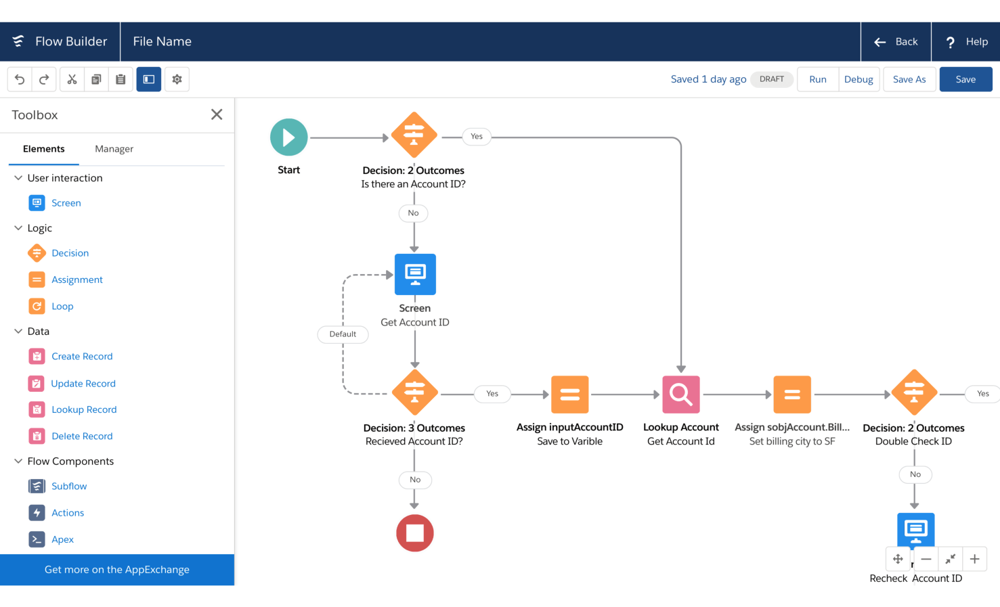
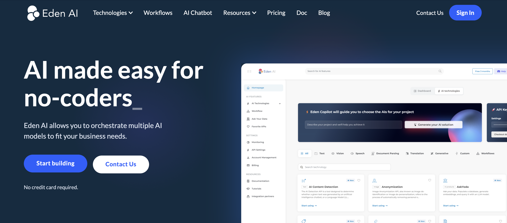
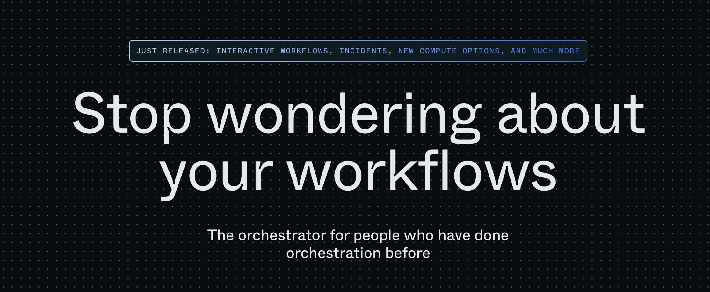
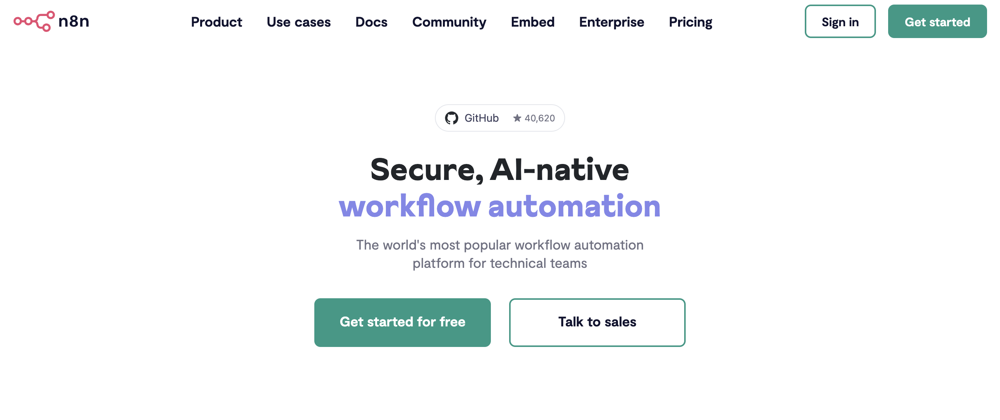
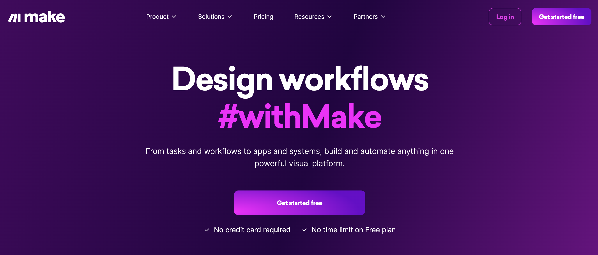
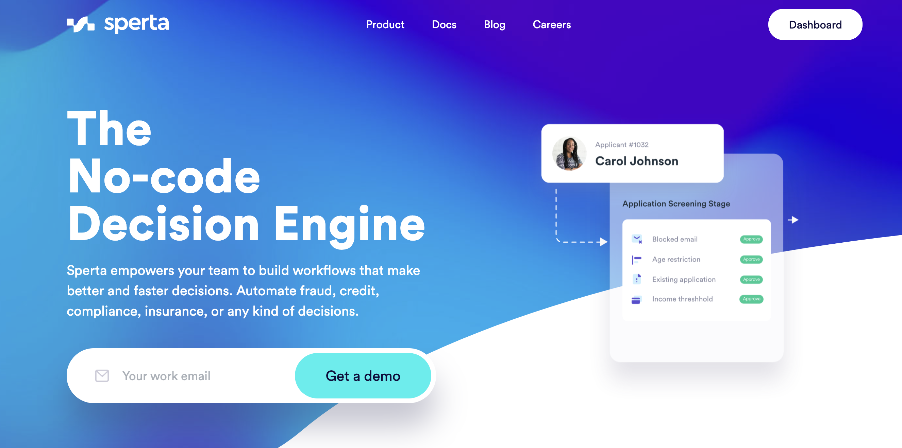
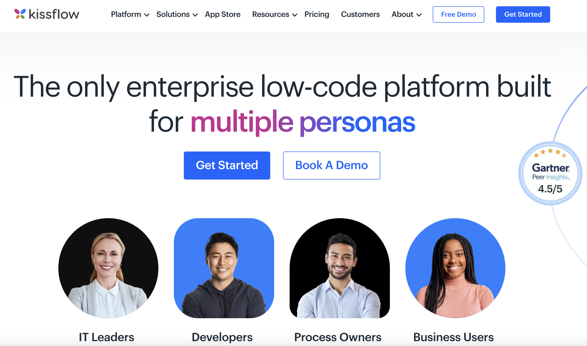
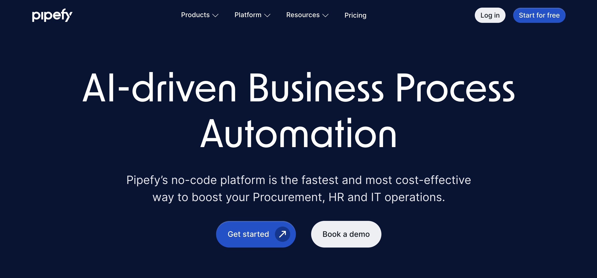

# The 8 Best Workflow Builder APIs in 2024

Business process automation is crucial in today’s fast-paced digital world. Increasingly, businesses need custom products tailored to their specific needs, as well as integrations with their own internal systems or third-party applications. This demand accounts for the rise of workflow builder companies, which allow their customers to automate custom processes to increase efficiency, speed, cost, and reduce human error. In this article, we’ll explore the best workflow builder companies and what they offer.

## What are Workflow APIs?

A workflow builder is a SaaS product which (usually) offers a drag and drop interface that allows for automation of business processes. Users can define a sequence of steps, connected in a graph, which are performed by the software when the workflow is triggered. Workflows can be triggered by any event from the opening of a GitHub pull request, to the arrival of an email, or even just at a certain time every day. Workflow builders typically offer an API which can interact with defined workflows, such as triggering runs, checking their status, or retrieving results.

## Why are Workflow APIs useful?

Workflows allow a variety of different custom business processes to be automated by software, which improves speed, efficiency, and reduces the potential for human error. The drag and drop interfaces of workflow builders allow automation processes to be created with little to no code, giving non-engineers accessibility to create and operate them, and making the processes observable, understandable, and reproducible. Many workflows also offer integration with other systems and applications, allowing any customer to build bespoke applications tailored to their needs. 

## The Top 8 Workflow Builder APIs of 2024

### [Leap AI](https://www.tryleap.ai/)

Leap places its emphasis on customizable and adaptive AI-driven workflows. By using Leap AI, customers can create original, engaging SEO-optimized content and personalize outbound messages. With a conventional no-code drag and drop interface, Leap allows for the creation of bespoke AI workflows tailored to your business’ needs. They also offer a large number of app integrations, including Slack, Google search, Twitter, Linkedin, and much more. 

### [Eden AI](https://www.edenai.co/)

Like Leap, Eden offers workflow authoring focused on AI use cases - in particular, Eden workflows provide the ability to orchestrate multiple AI models in a single workflow. Their tools let users build, deploy, and scale AI workflows, integrating cutting-edge AI Models and LLMs into their automation processes. Eden’s service also includes monitoring and unified billing for all your AI models, and is targeted towards both developers and non-coders alike.

### [Prefect](https://www.prefect.io/)

Prefect is marketed towards automation experts - ML and data engineers who want advanced capabilities and tooling to author and deploy workflows. Instead of taking the no-code approach, Prefect workflows are largely authored in Python. Prefect’s advanced features include a control panel software which offers full observability into your workflows, the ability to easily develop locally before bringing workflows to production, custom retry behavior, and sophisticated caching mechanisms. Prefect gives the developer full control over their workflows, boasting freedom from the restriction of DAG (directed acyclic graph) workflows.

### [n8n](https://n8n.io/)

n8n workflow automation is a source-available self-hostable workflow builder that allows users to build autonomous, multi-step agents. These workflows can integrate with their users’ internal systems as well as 400+ other third-party apps. n8n has advanced AI features, such as an internal chat assistant which can help author and answer questions about workflows. Their workflows can connect with any LLM, including self-hosted models, and the UI is the best of both worlds, letting users switch between a GUI and JavaScript/python code to fit their needs. Because n8n's platform is highly customizable and offers extensive integration capabilities, it is ideal for developers, technical teams, and data engineers looking to automate tasks.

### [Make](https://www.make.com/en)

Make is a platform which provides intuitive visual tools for creating workflows with a drag and drop interface which allows anyone to automate complex tasks without relying on developer resources. In addition, they furnish their platform with thousands of free workflow automation templates, allowing you to jumpstart your workflow creation process. Make has a free tier with no time limit, allowing you to experiment with some of their features for no commitment. Combined with their flexible pricing plans, this makes them ideal for individual users, startups, and small businesses who are looking to optimize quickly without a heavy investment.

### [Sperta](https://www.sperta.com/)

Sperta is a workflow automation authoring platform focused on businesses in the fintech and ecommerce space, allowing for the automation of decisions on fraud, credit, compliance, insurance, and more. Sperta has the standard no-code drag and drop interface, plus a custom expression language, autocomplete, data vendor integration, and much more.  

### [Kissflow](https://kissflow.com/)

Kissflow is a workflow automation platform marketed towards multiple personas: IT leaders, developers, process owners, and business users. They offer low-code and no-code workflow authoring, pre-built workflow templates, and countless application integrations. The Kissflow platform is designed to be user-friendly and accessible to individuals without extensive technical knowledge, making it appealing to business managers, process owners, team leaders, and HR professionals who want to streamline their processes and automate workflows without relying on IT support or coding expertise.

### [Pipefy](https://www.pipefy.com/)

Pipefy is a no-code platform for workflow automation focusing on Procurement, HR and IT operations. Pipefy specializes in providing solutions for compliance and governance processes, such as regulatory compliance, quality management, and audit tracking.  Like n8n, Pipefy offers advanced AI features - Pipefy AI can generate optimized workflows based on inputs in a chat-style interface. Pipefy also boasts enterprise-grade security, as well as 300 native connectors to ERPs, databases, and more. 

## Final Thoughts

If you’re looking to automate processes in your business pipeline, workflow builders offer the ability to author custom flows to increase your business’ efficiency. If I missed a favorite Workflow API or you have any request for other API categories / use cases, please let me know at founders@konfigthis.com and I will add it to the list! If you want to start integrating one of these APIs, you can check out our database of [SDKs for Public APIs](https://konfigthis.com/sdk/category/all) to help you get started and reduce development time!