import Head from '@docusaurus/Head';

<Head>
  <title>I Reviewed 1,000s of Opinions on HTMX</title>
  <meta property="og:title" content="I Reviewed 1,000s of Opinions on HTMX"/>
</Head>

[HTMX](https://htmx.org/) is a trending JavaScript library that enables the construction of modern user interfaces using [hypermedia as the engine of application state](https://htmx.org/essays/hateoas/).

In a nutshell, you can implement a button that replaces the entire button with an HTTP response using HTML attributes:

<Figure caption={<a href="https://htmx.org/docs/#introduction">See the HTMX docs for a more in-depth introduction</a>}>
```html index.html focus=3
<script src="https://unpkg.com/htmx.org@1.9.12"></script>
<!-- have a button POST a click via AJAX -->
<button hx-post="/clicked" hx-swap="outerHTML">
  Click Me
</button>
```
</Figure>

If you follow popular web development trends or are a fan of popular
developer-focused content creators, you have probably heard about it through
[Fireship](https://www.youtube.com/watch?v=r-GSGH2RxJs) or
[ThePrimeagen](https://www.youtube.com/watch?v=zjHHIqI9lUY). However, HTMX has
brought an absolute whirlwind of controversy with its radically different
approach to building user interfaces. Some folks are skeptical, others are
excited, and others are just curious.

<Carousel.Wrapper>
  <Carousel.Slide>
      <Figure caption={<a href="https://www.youtube.com/watch?v=L2QNCTCIRfc">YouTube</a>}>
        
      </Figure>
  </Carousel.Slide>
  <Carousel.Slide>
      <Figure caption={<a href="https://www.reddit.com/r/htmx/comments/191kiku/htmx_is_probably_the_most_exciting_frontend_tech/?utm_source=share&utm_medium=web3x&utm_name=web3xcss&utm_term=1&utm_content=share_button">Reddit</a>}>
        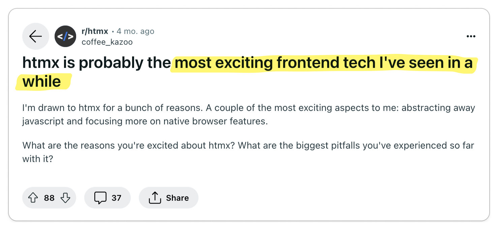
      </Figure>
  </Carousel.Slide>
  <Carousel.Slide>
      <Figure caption={<a href="https://www.reddit.com/r/ExperiencedDevs/comments/1bomixd/to_those_that_use_htmx_in_production_how_is_it/?utm_source=share&utm_medium=web3x&utm_name=web3xcss&utm_term=1&utm_content=share_button">Reddit</a>}>
        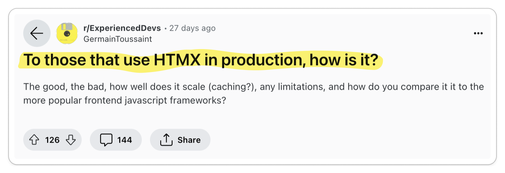
      </Figure>
  </Carousel.Slide>
</Carousel.Wrapper>

To analyze how developers truly feel about HTMX, I went to where developers
live: Reddit, Twitter, Hacker News, and YouTube. I parsed 1,000s of discussions
and synthesized my findings in this article, striving to present only
thought-provoking opinions.

<Figure caption='Funnel for gathering through-provoking opinions'>

</Figure>

{/* TRUNCATE */}

Next, I transcribed these discussions onto a whiteboard, organizing them into
"Pro-HTMX" (👍), "Anti-HTMX" (👎), or "Neutral" (🧐) categories, and then
clustering them into distinct opinions. Each section in this post showcases an
opinion while referencing pertinent discussions.

<Figure caption='Whiteboard of opinions'>
  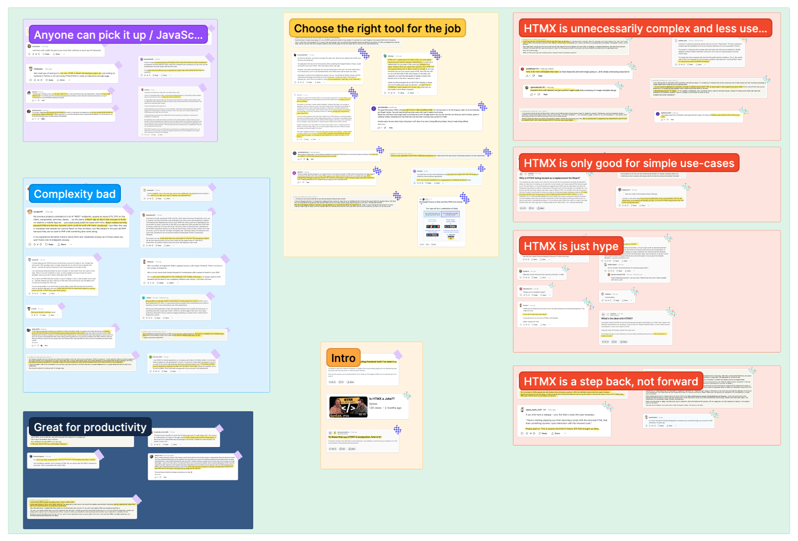
</Figure>

To start, i'll go over the Anti-HTMX (👎) opinions since they are spicy.

## 👎 HTMX is just hype

After Fireship released a [video about
HTMX](https://www.youtube.com/watch?v=r-GSGH2RxJs), HTMX started to gain a lot
of attention for its radical approach to building user interfaces. Carson Gross,
the author of HTMX, is also adept at generating buzz on his
[Twitter](https://twitter.com/htmx_org). And since HTMX is new, its unlikely
that you will find a lot of examples of sufficiently complex applications using
HTMX. Therefore, some developers are of the opinion that HTMX is merely
capitalizing on hype rather than offering a genuine solution to the challenges
of building user interfaces.


<Carousel.Wrapper>
  <Carousel.Slide>
      <Figure caption={<a href="https://www.reddit.com/r/webdev/comments/14z8asc/comment/jrwx7kd/?utm_source=share&utm_medium=web3x&utm_name=web3xcss&utm_term=1&utm_content=share_button">Reddit</a>}>
        
      </Figure>
  </Carousel.Slide>
  <Carousel.Slide>
      <Figure caption={<a href="https://www.reddit.com/r/webdev/comments/14z8asc/comment/jrwmyjy/?utm_source=share&utm_medium=web3x&utm_name=web3xcss&utm_term=1&utm_content=share_button">Reddit</a>}>
        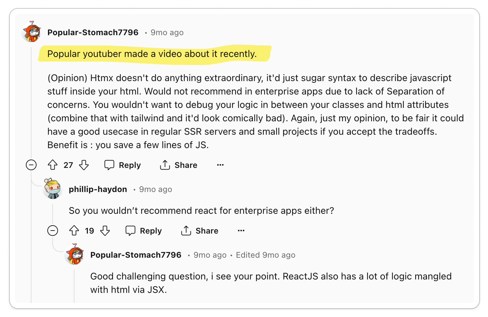
      </Figure>
  </Carousel.Slide>
  <Carousel.Slide>
      <Figure caption={<a href="https://www.reddit.com/r/webdev/comments/14z8asc/comment/jrzm44v/?utm_source=share&utm_medium=web3x&utm_name=web3xcss&utm_term=1&utm_content=share_button">Reddit</a>}>
        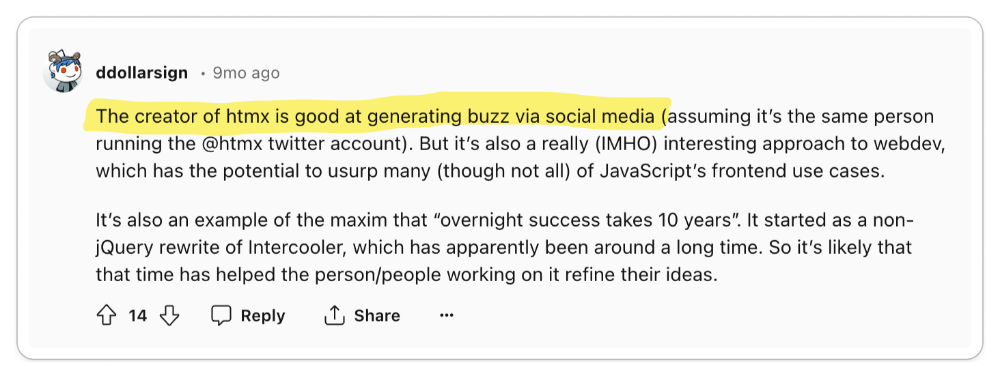
      </Figure>
  </Carousel.Slide>
  <Carousel.Slide>
      <Figure caption={<a href="https://www.reddit.com/r/webdev/comments/17e9dyz/comment/k61uz45/?utm_source=share&utm_medium=web3x&utm_name=web3xcss&utm_term=1&utm_content=share_button">Reddit</a>}>
        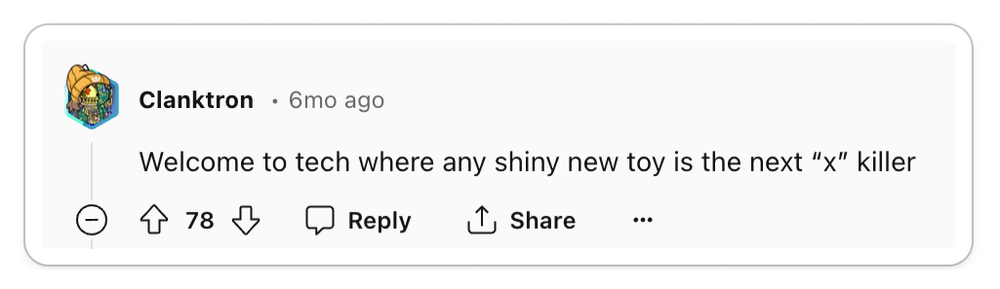
      </Figure>
  </Carousel.Slide>
  <Carousel.Slide>
      <Figure caption={<a href="https://www.reddit.com/r/webdev/comments/14z8asc/whats_the_deal_with_htmx/?utm_source=share&utm_medium=web3x&utm_name=web3xcss&utm_term=1&utm_content=share_button">Reddit</a>}>
        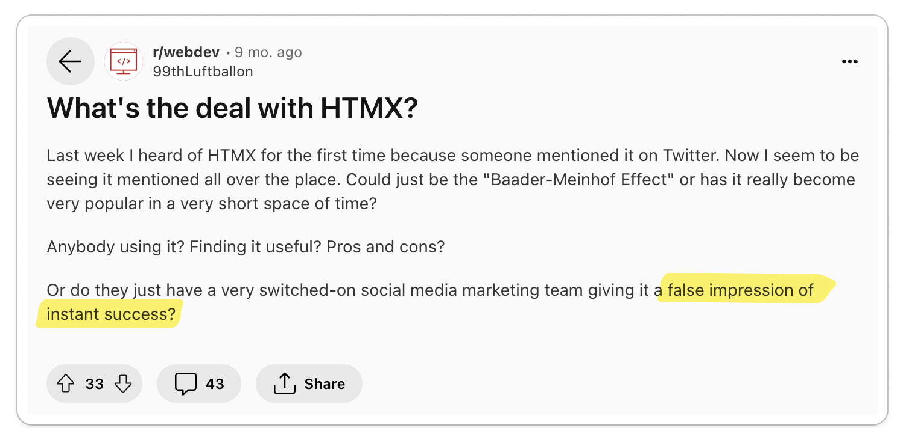
      </Figure>
  </Carousel.Slide>
  <Carousel.Slide>
      <Figure caption={<a href="https://www.reddit.com/r/ExperiencedDevs/comments/1bomixd/comment/kwq4ctp/?utm_source=share&utm_medium=web3x&utm_name=web3xcss&utm_term=1&utm_content=share_button">Reddit</a>}>
        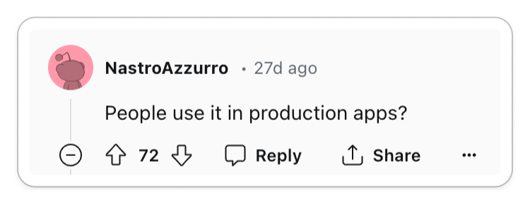
      </Figure>
  </Carousel.Slide>
  <Carousel.Slide>
      <Figure caption={<a href="https://www.reddit.com/r/htmx/comments/19eiylj/comment/kjcvlcf/?utm_source=share&utm_medium=web3x&utm_name=web3xcss&utm_term=1&utm_content=share_button">Reddit</a>}>
        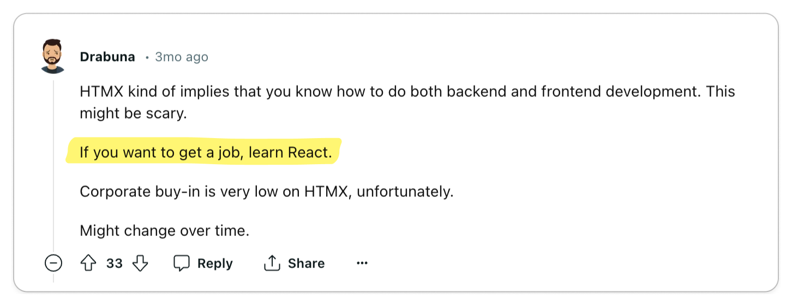
      </Figure>
  </Carousel.Slide>
</Carousel.Wrapper>

#### Takeaway

Like all technologies, there is typically a cycle of hype, adoption, and
dispersion. HTMX is no different. This cycle is beginning to unfold, and it's
time to see what the future holds. It is fair to criticize HTMX for riding a
wave of hype. However, if developers feel HTMX is solving a real problem
and adopting it accordingly, then adoption will naturally occur. But only time
will tell...

## 👎 HTMX is a step back, not forward

If you squint at HTMX, it looks like a relic of the past where MPA (Multi-page
Applications) were the norm. Some developers see HTMX as a step back, not
forward.  There is a good reason why modern web applications are built using
technologies like React, Next.js, and Vue.js. To ignore this, and use HTMX, you
might be ignoring the modern best practices of building web applications.

<Carousel.Wrapper>
  <Carousel.Slide>
      <Figure caption={<a href="https://www.reddit.com/r/programming/comments/y4wz7w/comment/ish0ihl/?utm_source=share&utm_medium=web3x&utm_name=web3xcss&utm_term=1&utm_content=share_button">Reddit</a>}>
        
      </Figure>
  </Carousel.Slide>
  <Carousel.Slide>
      <Figure caption={<a href="https://news.ycombinator.com/item?id=35831520">Hacker News</a>}>
        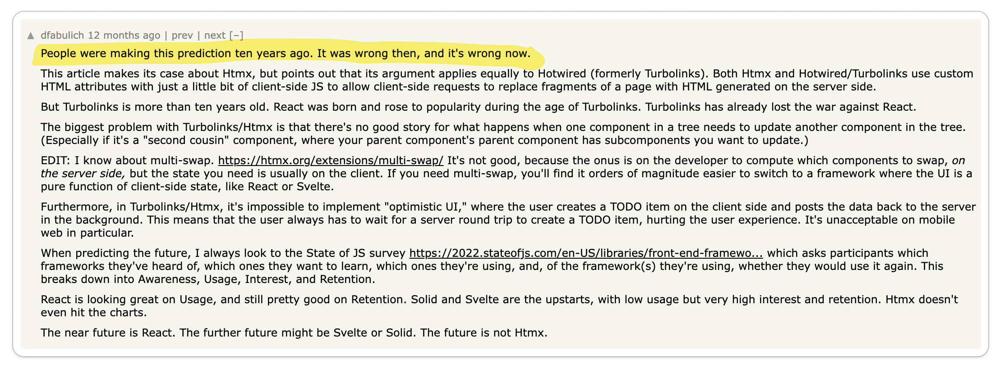
      </Figure>
  </Carousel.Slide>
  <Carousel.Slide>
      <Figure caption={<a href="https://www.reddit.com/r/htmx/comments/1993fkx/comment/kibrma4/?utm_source=share&utm_medium=web3x&utm_name=web3xcss&utm_term=1&utm_content=share_button">Reddit</a>}>
        
      </Figure>
  </Carousel.Slide>
  <Carousel.Slide>
      <Figure caption={<a href="https://news.ycombinator.com/item?id=35830823">Hacker News</a>}>
        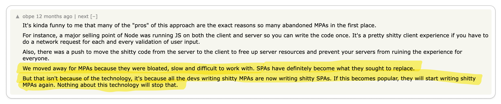
      </Figure>
  </Carousel.Slide>
</Carousel.Wrapper>

#### Takeaway

Depending on your level of expertise in building with modern web technologies,
you may feel that HTMX is a step back, not forward—especially if you have
previously built MPAs with jQuery. For those who see HTMX as a step back, they
want nothing to do with it.

If you are already familiar with modern web technologies, your teammates are as
well, and current applications are using the latest web technologies, it's
really hard to see why you would use HTMX in future applications. But for those
starting new applications, HTMX is simply a different approach to building interfaces.
Whether it is worth considering depends on the complexity of your application's
interface and the expertise of your team. But it definitely doesn't hurt to
entertain new ideas like HTMX. Who knows, it could ultimately improve your
skills as an engineer.

## 👎 HTMX is unnecessarily complex and less user-friendly

In practice, some developers feel that HTMX is actually *more complex* than the
current best practices. They specifically dislike the use of HTML attributes,
magic strings, and magic behavior. Moreover, some developers feel this make
engineerings teams less productive and codebases more complex.

<Carousel.Wrapper>
  <Carousel.Slide>
      <Figure caption={<a href="https://www.youtube.com/watch?v=QBGJZ3h3n4c&lc=Ugzl7I8fxnCQoDg3M-x4AaABAg.A27Pn013W__A27ZdGf2ZKt">YouTube</a>}>
        
      </Figure>
  </Carousel.Slide>
  <Carousel.Slide>
      <Figure caption={<a href="https://news.ycombinator.com/item?id=33989546">Hacker News</a>}>
        
      </Figure>
  </Carousel.Slide>
  <Carousel.Slide>
      <Figure caption={<a href="https://www.youtube.com/watch?v=QBGJZ3h3n4c&lc=Ugzl7I8fxnCQoDg3M-x4AaABAg.A27Pn013W__A27rkIST4lL">YouTube</a>}>
        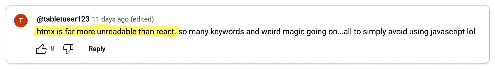
      </Figure>
  </Carousel.Slide>
  <Carousel.Slide>
      <Figure caption={<a href="https://news.ycombinator.com/item?id=37154187">Hacker News</a>}>
        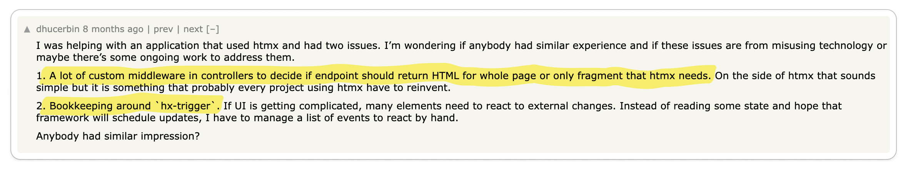
      </Figure>
  </Carousel.Slide>
  <Carousel.Slide>
      <Figure caption={<a href="https://www.reddit.com/r/ExperiencedDevs/comments/1bomixd/comment/kwqamlq/?utm_source=share&utm_medium=web3x&utm_name=web3xcss&utm_term=1&utm_content=share_button">Reddit</a>}>
        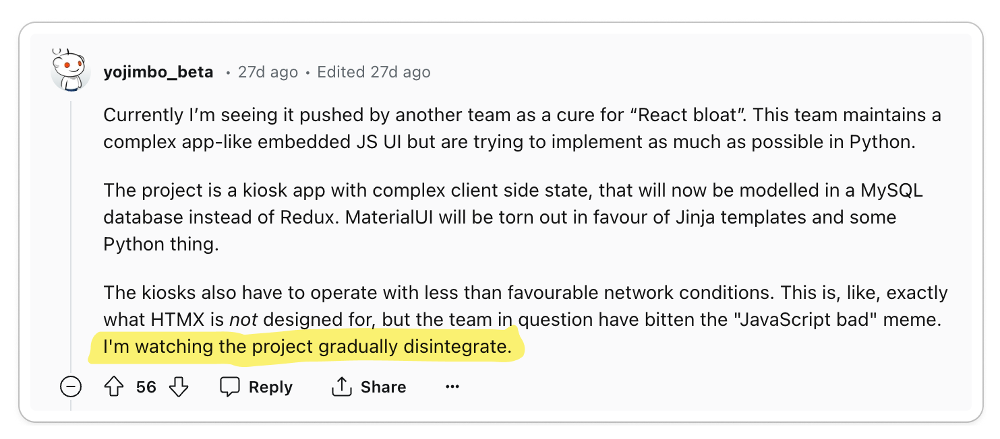
      </Figure>
  </Carousel.Slide>
  <Carousel.Slide>
      <Figure caption={<a href="https://news.ycombinator.com/item?id=37157489">Hacker News</a>}>
        
      </Figure>
  </Carousel.Slide>
</Carousel.Wrapper>

#### Takeaway

People will always have a natural aversion to unfamiliar technologies, and HTMX is
no exception. Those who adopt HTMX in their projects will likely encounter some
friction, which could be a source of frustration and negative discourse. HTMX
also uses more declarative paradigms, which can be harder to read for developers
who are just beginning to learn HTMX. This makes HTMX more complex and less
user-friendly for those sorts of developers.

React involves more in-memory state management on the client, while HTMX, on the
other hand, embeds state in HTML itself. This is a fundamentally new approach to
interface design, which developers would need to learn and adopt before feeling
comfortable reading and programming with HTMX.

## 👎 HTMX is only good for simple use-cases

Users expect modern interfaces which require more complex DOM manipulations and
UX design. To implement such interfaces, using HTMX is not enough. Therefore,
HTMX is only good for simple use-cases.

<Carousel.Wrapper>
  <Carousel.Slide>
      <Figure caption={<a href="https://www.youtube.com/watch?v=r-GSGH2RxJs&lc=Ugy9xOMhH9r7eGaZtjl4AaABAg">YouTube</a>}>
        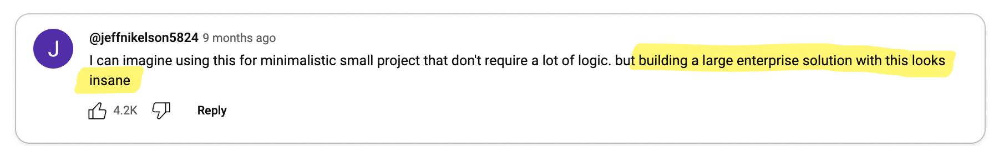
      </Figure>
  </Carousel.Slide>
  <Carousel.Slide>
      <Figure caption={<a href="https://www.youtube.com/watch?v=r-GSGH2RxJs&lc=Ugy9xOMhH9r7eGaZtjl4AaABAg">YouTube</a>}>
        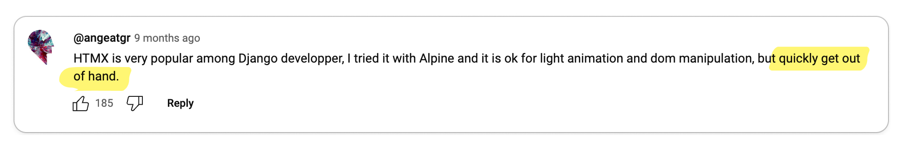
      </Figure>
  </Carousel.Slide>
  <Carousel.Slide>
      <Figure caption={<a href="https://news.ycombinator.com/item?id=37146135">Hacker News</a>}>
        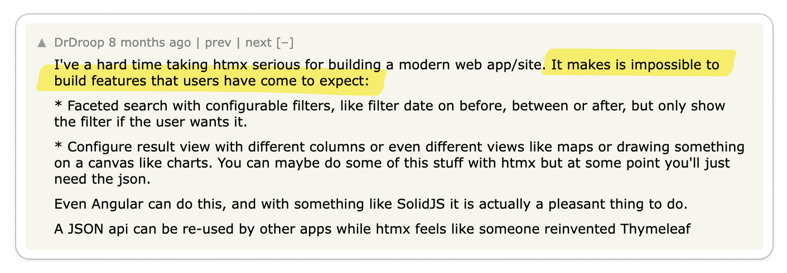
      </Figure>
  </Carousel.Slide>
  <Carousel.Slide>
      <Figure caption={<a href="https://www.reddit.com/r/webdev/comments/17e9dyz/comment/k620cdv/?utm_source=share&utm_medium=web3x&utm_name=web3xcss&utm_term=1&utm_content=share_button">Reddit</a>}>
        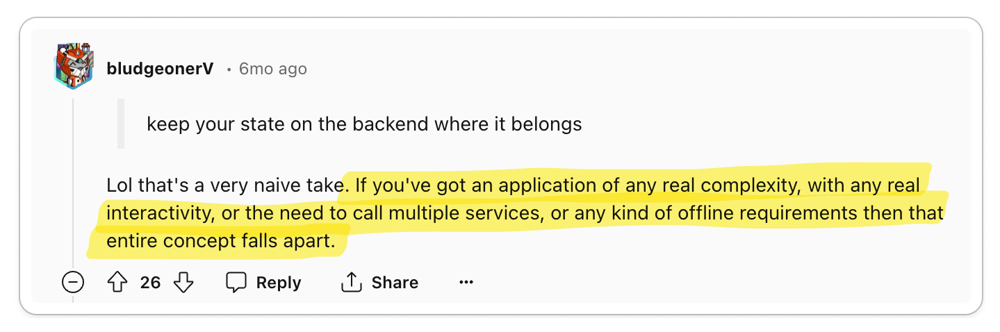
      </Figure>
  </Carousel.Slide>
  <Carousel.Slide>
      <Figure caption={<a href="https://www.reddit.com/r/webdev/comments/17e9dyz/why_is_htmx_being_touted_as_a_replacement_for/?utm_source=share&utm_medium=web3x&utm_name=web3xcss&utm_term=1&utm_content=share_button">Reddit</a>}>
        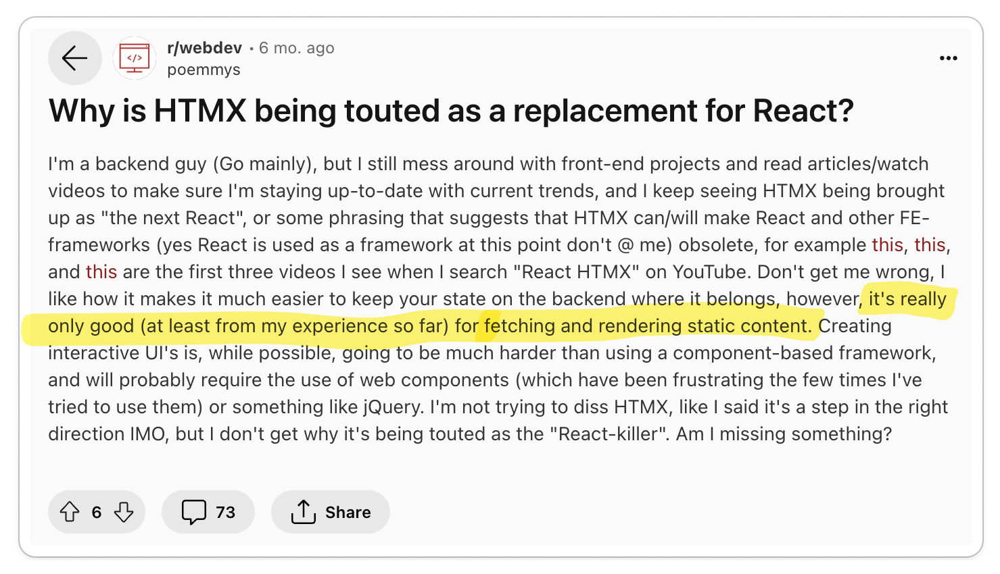
      </Figure>
  </Carousel.Slide>
</Carousel.Wrapper>

#### Takeaway

For developers that are working on more complex use-cases, HTMX is not enough.
And since HTMX has sort of compared itself to React, it is fair to point out
that HTMX is not a solution for building complex web applications.

Before deciding to use HTMX, developers should first consider the complexity of
the use-case. If HTMX is not the right tool for the job, then look elsewhere for
libraries that will allow you to solve the problem. It may well be the case that
your use-case will require a ["thick client"](https://htmx.org/essays/when-to-use-hypermedia/#if-you-require-offline-functionality).

## 👍 HTMX is simple

Developers are witnessing a reduction in codebase complexity and a decrease in
overall development time. As [grug](https://grugbrain.dev/) puts it, "complexity
is bad". Developers who embrace this mindset are highly enthusiastic about HTMX.
With HTMX handling the DOM manipulations, developers can deduplicate logic from
the browser to the server. This marks a significant improvement over the current
best practices for building web applications, where a lot of logic needs to be
duplicated in the server and client. For backends that are not written in
JavaScript, the current standard UI libraries can be a significant burden on the
developers of the application.

<Carousel.Wrapper>
  <Carousel.Slide>
      <Figure caption={<a href="https://x.com/ThePrimeagen/status/1752703307435626665">x.com</a>}>
        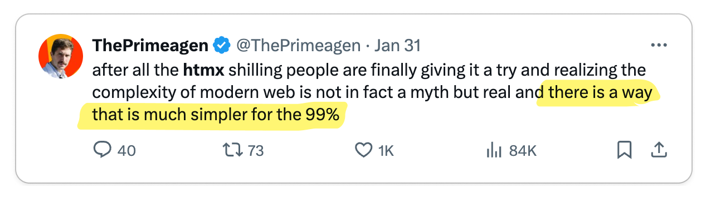
      </Figure>
  </Carousel.Slide>
  <Carousel.Slide>
      <Figure caption={<a href="https://www.reddit.com/r/webdev/comments/17e9dyz/comment/k62awec/?utm_source=share&utm_medium=web3x&utm_name=web3xcss&utm_term=1&utm_content=share_button">Reddit</a>}>
        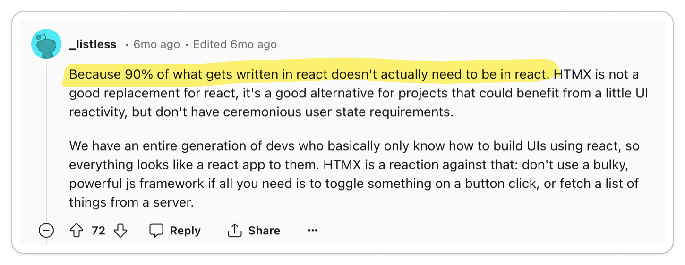
      </Figure>
  </Carousel.Slide>
  <Carousel.Slide>
      <Figure caption={<a href="https://www.reddit.com/r/htmx/comments/1993fkx/comment/kibk93j/?utm_source=share&utm_medium=web3x&utm_name=web3xcss&utm_term=1&utm_content=share_button">Reddit</a>}>
        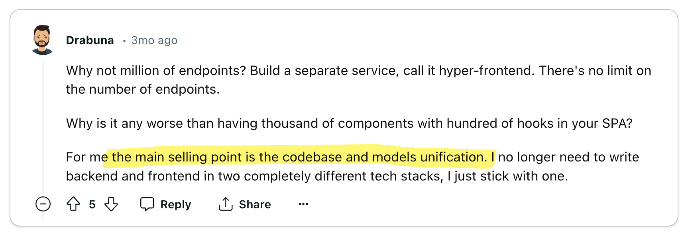
      </Figure>
  </Carousel.Slide>
  <Carousel.Slide>
      <Figure caption={<a href="https://news.ycombinator.com/item?id=33989791">Hacker News</a>}>
        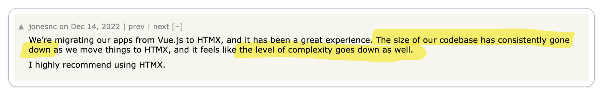
      </Figure>
  </Carousel.Slide>
  <Carousel.Slide>
      <Figure caption={<a href="https://www.reddit.com/r/htmx/comments/191kiku/comment/kgwdcpo/?utm_source=share&utm_medium=web3x&utm_name=web3xcss&utm_term=1&utm_content=share_button">Reddit</a>}>
        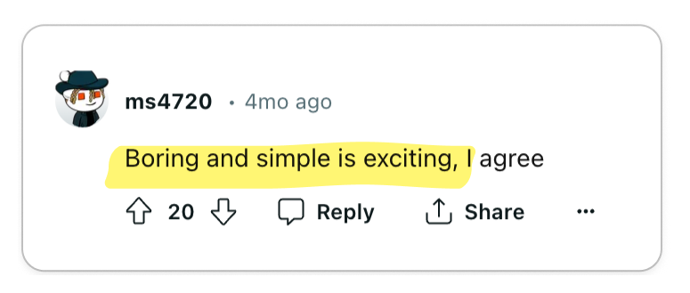
      </Figure>
  </Carousel.Slide>
  <Carousel.Slide>
      <Figure caption={<a href="https://www.youtube.com/watch?v=NA5Fcgs_viU&lc=Ugw7gOjzAdcSc7qaxSt4AaABAg&t=2s">YouTube</a>}>
        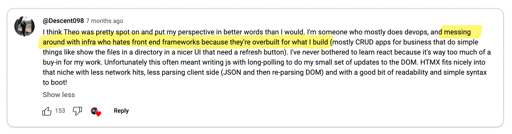
      </Figure>
  </Carousel.Slide>
  <Carousel.Slide>
      <Figure caption={<a href="https://www.reddit.com/r/htmx/comments/191kiku/comment/kgxthwk/?utm_source=share&utm_medium=web3x&utm_name=web3xcss&utm_term=1&utm_content=share_button">Reddit</a>}>
        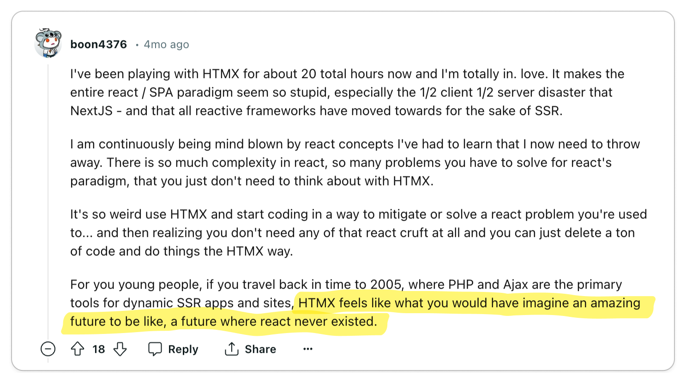
      </Figure>
  </Carousel.Slide>
  <Carousel.Slide>
      <Figure caption={<a href="https://www.reddit.com/r/ExperiencedDevs/comments/1bomixd/comment/kwsc599/?utm_source=share&utm_medium=web3x&utm_name=web3xcss&utm_term=1&utm_content=share_button">Reddit</a>}>
        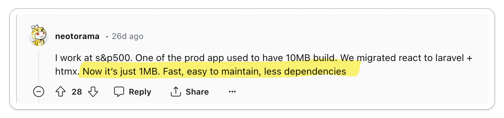
      </Figure>
  </Carousel.Slide>
  <Carousel.Slide>
      <Figure caption={<a href="https://news.ycombinator.com/item?id=38953334">Hacker News</a>}>
        
      </Figure>
  </Carousel.Slide>
  <Carousel.Slide>
      <Figure caption={<a href="https://www.reddit.com/r/ExperiencedDevs/comments/1bomixd/comment/kwrapyn/?utm_source=share&utm_medium=web3x&utm_name=web3xcss&utm_term=1&utm_content=share_button">Reddit</a>}>
        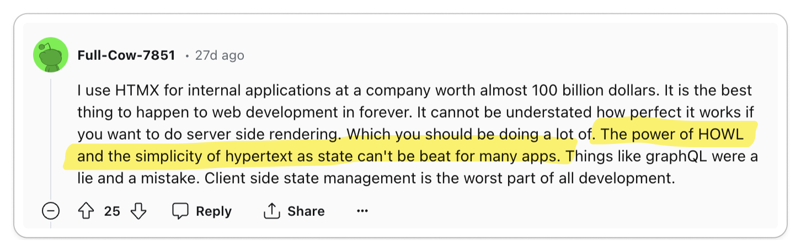
      </Figure>
  </Carousel.Slide>
  <Carousel.Slide>
      <Figure caption={<a href="https://www.reddit.com/r/htmx/comments/1993fkx/comment/kic3ab3/?utm_source=share&utm_medium=web3x&utm_name=web3xcss&utm_term=1&utm_content=share_button">Reddit</a>}>
        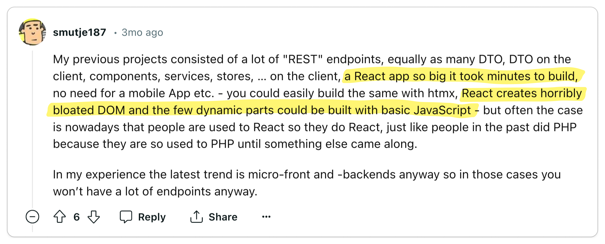
      </Figure>
  </Carousel.Slide>
  <Carousel.Slide>
      <Figure caption={<a href="https://www.reddit.com/r/ExperiencedDevs/comments/1bomixd/comment/kwqff6z/?utm_source=share&utm_medium=web3x&utm_name=web3xcss&utm_term=1&utm_content=share_button">Reddit</a>}>
        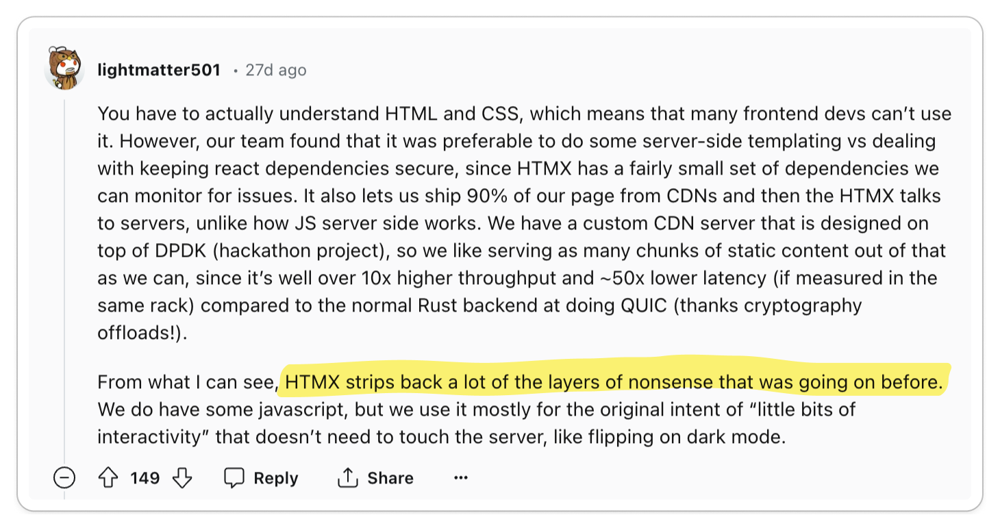
      </Figure>
  </Carousel.Slide>
</Carousel.Wrapper>

#### Takeaway

Simplicity is a subjective concept. It highly depends on your application, team,
and use-cases. For those who have spent a lot of time with JavaScript, HTMX
stands out for its simplicity. If you feel that the current best practices are
overbuilt, bloated, and overly complex—HTMX might be worth considering.

In many use-cases where the primary value of the application lies in the
backend, React may not be essential but could still be the optimal choice for
your team, depending on their expertise.

## 👍 HTMX does not require you to know JavaScript

If you are a backend developer, it's unlikely that you know React, JavaScript,
or meta frameworks like Next.js. Full-stack developers, on the other hand, may
find HTMX to be a breath of fresh air in the form of a simple way to build
interfaces.  The fact that pretty much any developer can pick up HTMX is a huge
benefit, especially for teams that are not as comfortable with JavaScript.

<Carousel.Wrapper>
  <Carousel.Slide>
      <Figure caption={<a href="https://news.ycombinator.com/item?id=36079666">Hacker News</a>}>
        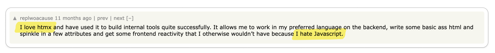
      </Figure>
  </Carousel.Slide>
  <Carousel.Slide>
      <Figure caption={<a href="https://www.youtube.com/watch?v=L2QNCTCIRfc&lc=Ugx28VHafu7cwcZTksR4AaABAg">YouTube</a>}>
        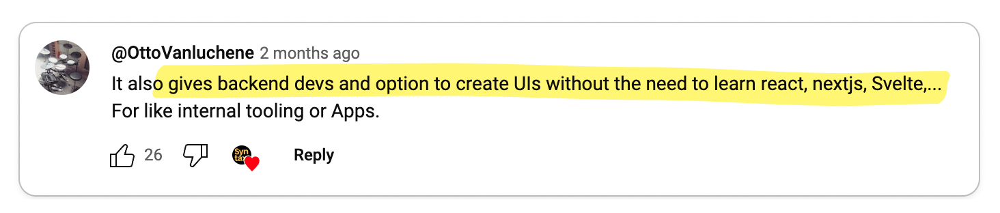
      </Figure>
  </Carousel.Slide>
  <Carousel.Slide>
      <Figure caption={<a href="https://www.reddit.com/r/htmx/comments/1axyqbc/comment/krraxvk/?utm_source=share&utm_medium=web3x&utm_name=web3xcss&utm_term=1&utm_content=share_button">Reddit</a>}>
        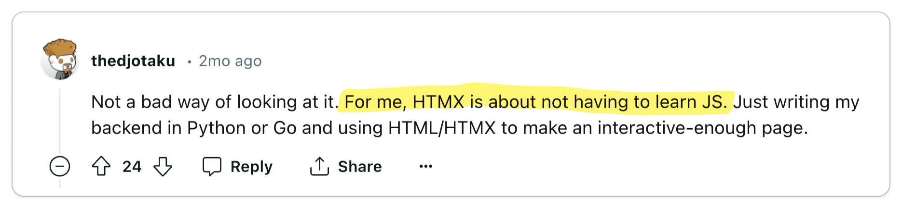
      </Figure>
  </Carousel.Slide>
  <Carousel.Slide>
      <Figure caption={<a href="https://www.reddit.com/r/ExperiencedDevs/comments/1bomixd/comment/kwr664u/?utm_source=share&utm_medium=web3x&utm_name=web3xcss&utm_term=1&utm_content=share_button">Reddit</a>}>
        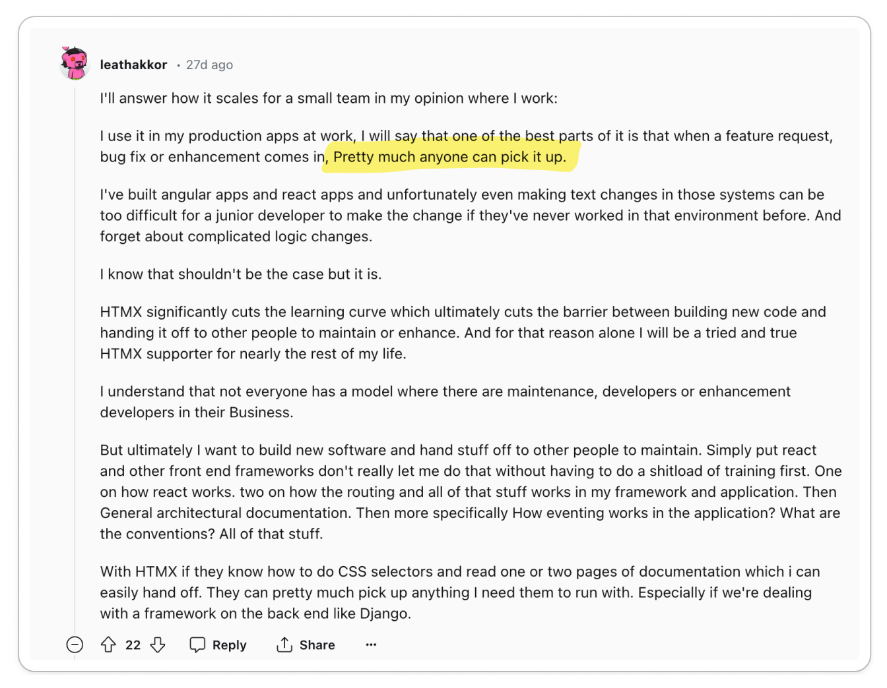
      </Figure>
  </Carousel.Slide>
  <Carousel.Slide>
      <Figure caption={<a href="https://www.youtube.com/watch?v=NA5Fcgs_viU&lc=UgyMbbYtacgmuksXWOh4AaABAg&t=2s">YouTube</a>}>
        
      </Figure>
  </Carousel.Slide>
  <Carousel.Slide>
      <Figure caption={<a href="https://www.reddit.com/r/htmx/comments/1axyqbc/comment/krrg2m9/?utm_source=share&utm_medium=web3x&utm_name=web3xcss&utm_term=1&utm_content=share_button">Reddit</a>}>
        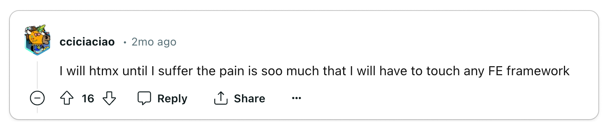
      </Figure>
  </Carousel.Slide>
  <Carousel.Slide>
      <Figure caption={<a href="https://www.reddit.com/r/ExperiencedDevs/comments/1bomixd/comment/kwqosu6/?utm_source=share&utm_medium=web3x&utm_name=web3xcss&utm_term=1&utm_content=share_button">Reddit</a>}>
        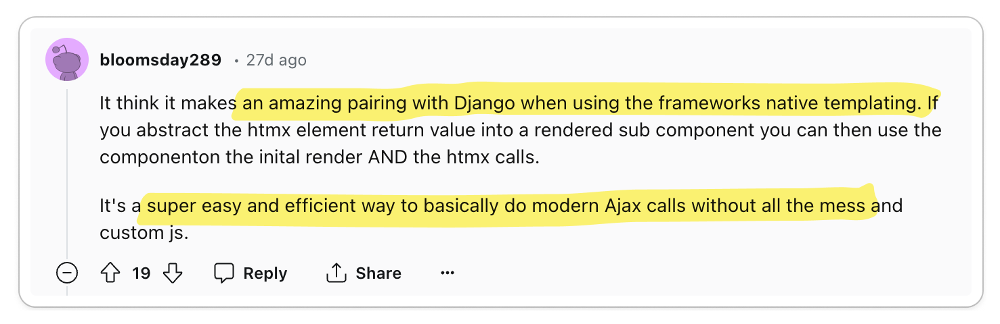
      </Figure>
  </Carousel.Slide>
  <Carousel.Slide>
      <Figure caption={<a href="https://www.reddit.com/r/htmx/comments/191kiku/comment/kgwakeb/?utm_source=share&utm_medium=web3x&utm_name=web3xcss&utm_term=1&utm_content=share_button">Reddit</a>}>
        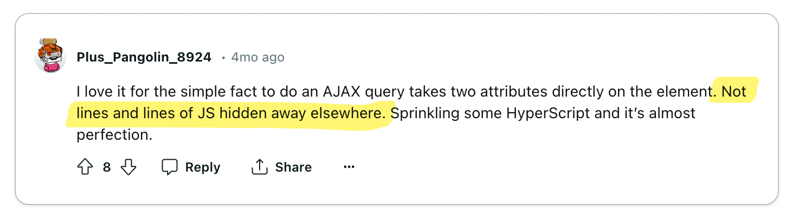
      </Figure>
  </Carousel.Slide>
  <Carousel.Slide>
      <Figure caption={<a href="https://www.reddit.com/r/htmx/comments/1axyqbc/comment/krraxvk/?utm_source=share&utm_medium=web3x&utm_name=web3xcss&utm_term=1&utm_content=share_button">Reddit</a>}>
        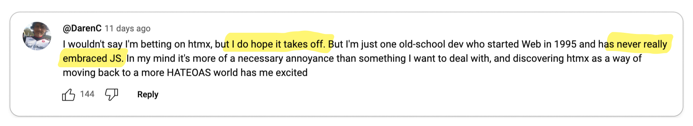
      </Figure>
  </Carousel.Slide>
</Carousel.Wrapper>


#### Takeaway

I personally love this perspective and it's actually one of the reasons I've spent
some time experimenting with HTMX. My company is a small team and not all of us
have used React or Next.js, so HTMX as a solution for teams that are not as
comfortable with JavaScript is an extremely compelling narrative for me.

I believe this is true for many other teams as well, especially since full-stack
developers are hard to come by. Some developers are finding that this unlocks
new opportunities for them to work on interesting projects.

## 👍 HTMX makes you productive

HTMX, when combined with battle-tested templating libraries like Django's
template language or Go's templ library, boosts productivity. By not having to
spend time writing a client-layer for the UI, developers can focus on where the
application is providing most of the value, which is the business logic. This is
especially effective when paired with

<Carousel.Wrapper>
  <Carousel.Slide>
      <Figure caption={<a href="https://www.reddit.com/r/webdev/comments/14z8asc/comment/jrzuli0/?utm_source=share&utm_medium=web3x&utm_name=web3xcss&utm_term=1&utm_content=share_button">Reddit</a>}>
        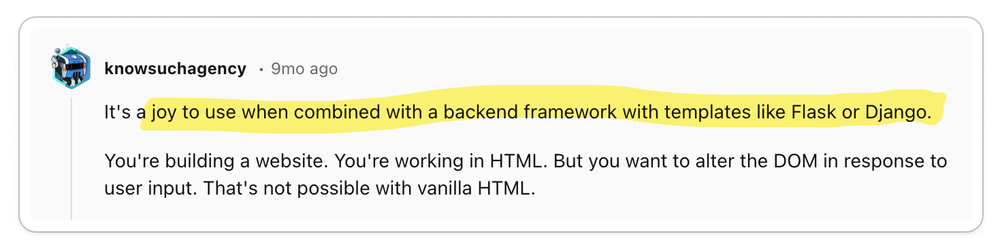
      </Figure>
  </Carousel.Slide>
  <Carousel.Slide>
      <Figure caption={<a href="https://www.reddit.com/r/ExperiencedDevs/comments/1bomixd/comment/kwr52qy/?utm_source=share&utm_medium=web3x&utm_name=web3xcss&utm_term=1&utm_content=share_button">Reddit</a>}>
        
      </Figure>
  </Carousel.Slide>
  <Carousel.Slide>
      <Figure caption={<a href="https://news.ycombinator.com/item?id=37148208">Hacker News</a>}>
        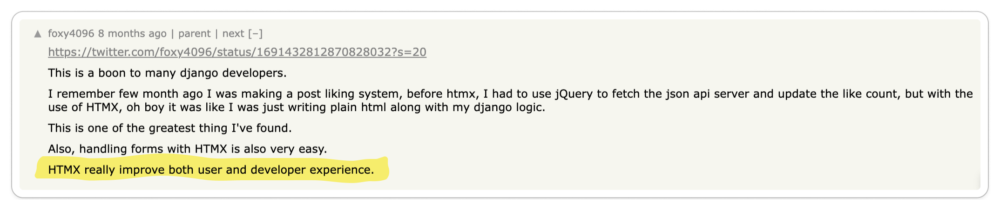
      </Figure>
  </Carousel.Slide>
  <Carousel.Slide>
      <Figure caption={<a href="https://www.youtube.com/watch?v=LriHRa9t1fQ&lc=UgzVfDHWveVTMg2FV-p4AaABAg">YouTube</a>}>
        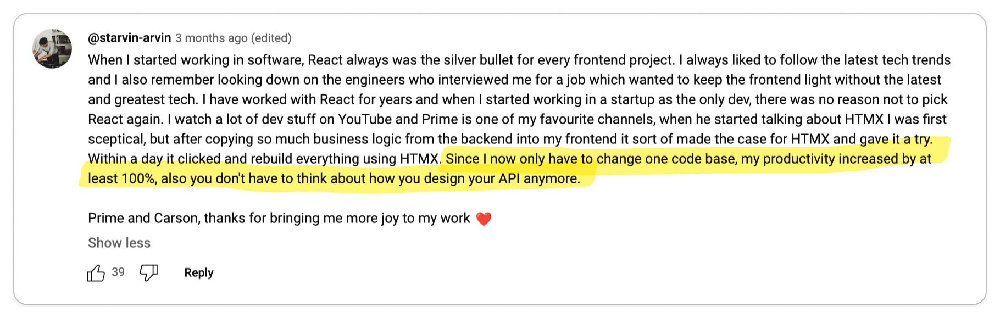
      </Figure>
  </Carousel.Slide>
  <Carousel.Slide>
      <Figure caption={<a href="https://news.ycombinator.com/item?id=35831051">Hacker News</a>}>
        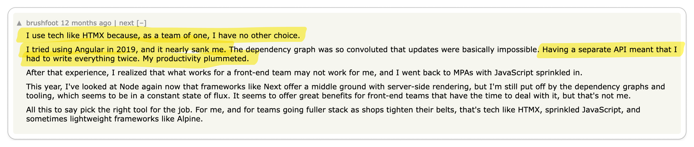
      </Figure>
  </Carousel.Slide>
</Carousel.Wrapper>

#### Takeaway

By reducing the amount of redundant business logic in the client-layer,
developers are finding that they can focus on the actual product and not the UI.
And since you can get up and running with HTMX with a simple `<script>` tag, it's
easy to bootstrap a project with HTMX.

These two factors leave a positive impression on the developer experience for
some.

## 🧐 HTMX is not a silver bullet

Like any problem, you must choose the right tool for the job. For developers who
see HTMX for its pros and cons, they believe that it's just another tool to
solve a specific problem.  And since HTMX can also be progressively adopted,
developers can adopt it in small portions of their codebase. But as always,
certain use-cases will require more complex client logic which would require you
to reach for more advanced tooling like React.

<Carousel.Wrapper>
  <Carousel.Slide>
      <Figure caption={<a href="https://www.youtube.com/watch?v=NA5Fcgs_viU&lc=Ugwai3jKXfDyULs3YM54AaABAg&t=2s">YouTube</a>}>
        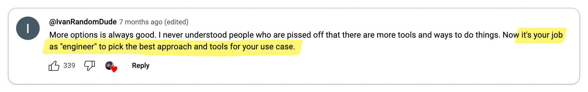
      </Figure>
  </Carousel.Slide>
  <Carousel.Slide>
      <Figure caption={<a href="https://news.ycombinator.com/item?id=33219157">Hacker News</a>}>
        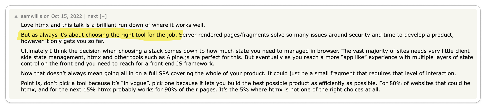
      </Figure>
  </Carousel.Slide>
  <Carousel.Slide>
      <Figure caption={<a href="https://www.reddit.com/r/htmx/comments/1axyqbc/my_thought_process_on_when_and_why_htmx_is_the/?utm_source=share&utm_medium=web3x&utm_name=web3xcss&utm_term=1&utm_content=share_button">Reddit</a>}>
        
      </Figure>
  </Carousel.Slide>
  <Carousel.Slide>
      <Figure caption={<a href="https://www.reddit.com/r/htmx/comments/1993fkx/comment/kibc8lw/?utm_source=share&utm_medium=web3x&utm_name=web3xcss&utm_term=1&utm_content=share_button">Reddit</a>}>
        
      </Figure>
  </Carousel.Slide>
  <Carousel.Slide>
      <Figure caption={<a href="https://www.youtube.com/watch?v=QBGJZ3h3n4c&lc=Ugwan5R_fW-BUsc4lXd4AaABAg&t=504s">YouTube</a>}>
        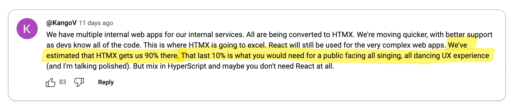
      </Figure>
  </Carousel.Slide>
  <Carousel.Slide>
      <Figure caption={<a href="https://www.reddit.com/r/htmx/comments/1993fkx/comment/kie81if/?utm_source=share&utm_medium=web3x&utm_name=web3xcss&utm_term=1&utm_content=share_button">Reddit</a>}>
        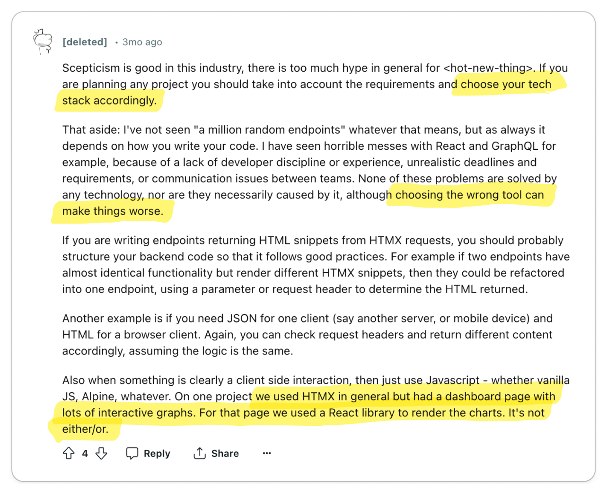
      </Figure>
  </Carousel.Slide>
  <Carousel.Slide>
      <Figure caption={<a href=""></a>}>
        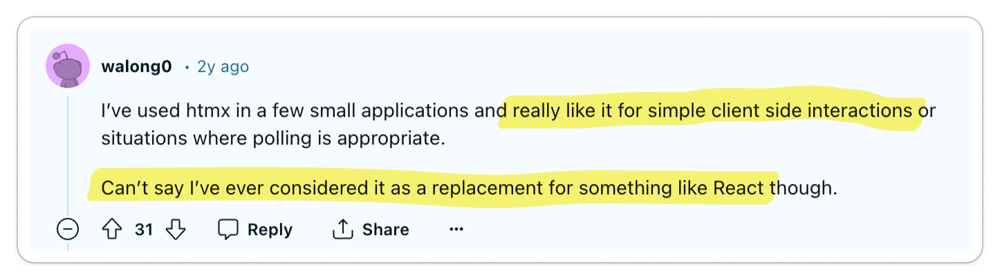
      </Figure>
  </Carousel.Slide>
  <Carousel.Slide>
      <Figure caption={<a href="https://news.ycombinator.com/item?id=37146215">Hacker News</a>}>
        
      </Figure>
  </Carousel.Slide>
  <Carousel.Slide>
      <Figure caption={<a href=""></a>}>
        
      </Figure>
  </Carousel.Slide>
  <Carousel.Slide>
      <Figure caption={<a href="https://news.ycombinator.com/item?id=37146510">Hacker News</a>}>
        
      </Figure>
  </Carousel.Slide>
  <Carousel.Slide>
      <Figure caption={<a href="https://www.reddit.com/r/htmx/comments/16rp3kj/comment/k24zdv9/?utm_source=share&utm_medium=web3x&utm_name=web3xcss&utm_term=1&utm_content=share_button">Reddit</a>}>
        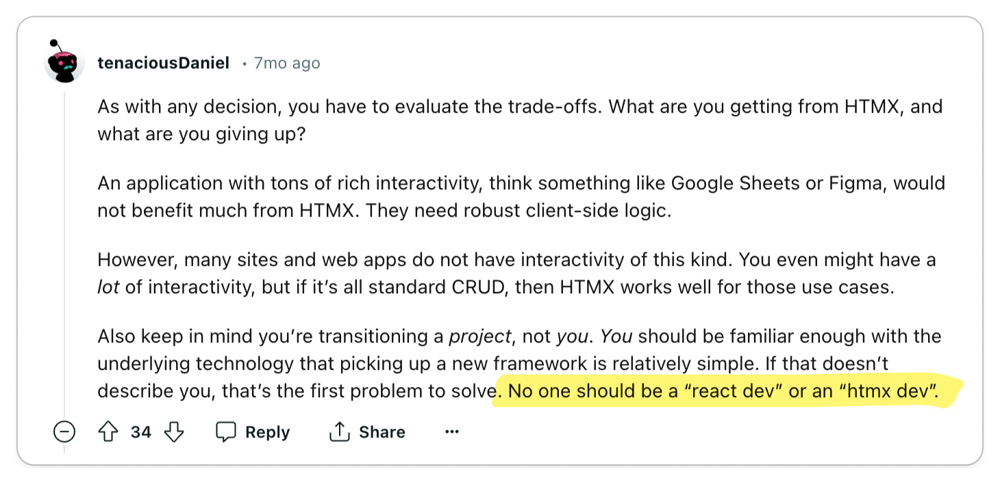
      </Figure>
  </Carousel.Slide>
</Carousel.Wrapper>

#### Takeaway

Like everything else in software, choose the right tool for the job. It's not
much of a takeaway, but consider it your responsibility as an engineer to make
critical decisions, such as whether or not to adopt HTMX.

## Conclusion

Competition is good. HTMX is thought-provoking, but I think its great because it
forces developers to entertain new and novel ideas. Developers can often be wary
and cautious of new technologies, since it might not be solving a personal
problem they are already facing. But for the developers that are resonating with
HTMX, there is an enthusiastic group of developers who are starting to use it in
production.

I have not personally deployed a production application using HTMX, but I am
really excited to try it. It would solve a personal problem with my engineering
team and also allow me to simplify the build process of deploying applications.
Those two things are important to me, and HTMX seems like a great fit.

#### Similar Articles

If you are interested in reading articles like this one, checkout these:

- [I Reviewed 1,000s of Opinions on gRPC](/blog/grpc)
- [I Reviewed 1,000s of Opinions on GitHub Copilot](/blog/github-copilot)
- [I Reviewed 1,000s of Opinions on Serverless](/blog/serverless)
- [I Reviewed 1,000s of Opinions on GraphQL vs. REST](/blog/graphql-vs-rest)

<Admonition type="info" title="Looking to onboard customers to your API?"> This
article focuses a lot on HTMX, but if you are building an external REST API and
need docs and SDKs for it, consider using [Konfig](https://konfigthis.com). We
make it effortless to generate docs and SDKs for your API, so external
developers can easily integrate with your API.  </Admonition>
