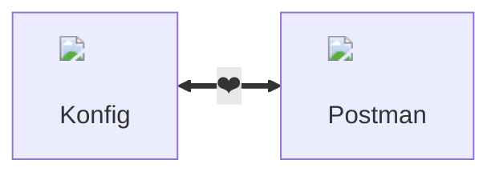
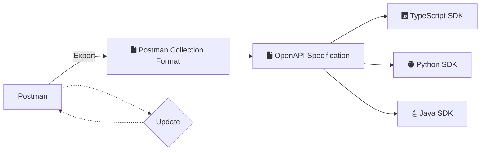

import { DotsButton } from "@site/blog/2023/07/assets/DotsButton"

# Getting Started with Postman Collections



Postman is a great way to document and save example requests for your API.
Konfig supports generating SDKs from Postman Collections through the [Postman
Collection
Format](https://learning.postman.com/collection-format/getting-started/overview/#:~:text=The%20Collection%20Format%20is%20open,environments%20without%20any%20information%20loss.).
In this tutorial, we will walk through the steps for you to generate a
TypeScript, Java, and Python SDK from a Postman Collection.

## How does it work?

Konfig infers the interface of your API from request and response examples in
your Postman Collection. Konfig then intelligently creates a high-quality
<Tooltip tip="OpenAPI Specification" text="OAS"/> which is then used to generate
SDKs.

<Figure caption="Generating SDKs from Postman Collections with Konfig">

</Figure>

## Install CLI

To install Konfig's CLI run the following command:

<CH.Code>
```shell npm
npm install -g konfig-cli
```
```shell yarn
yarn global add konfig-cli
```
</CH.Code>

<Admonition type="info" title="System Requirement">
  Konfig's CLI requires [Node 14+](https://nodejs.org/en/blog/release/v14.17.3)
  to be setup on your machine.
</Admonition>

## Create a directory for SDKs

```shell CLI
mkdir postman-sdks
cd postman-sdks
```

## Prepare your Postman Collection

Every operation in your Collection should have more example responses saved
before exporting for better SDKs.

### Send Request

Click `Send` to retrieve an example response. You can repeat these steps for
different inputs to save multiple example responses. The more requests and
responses saved in the Collection, the better your SDKs will be.


### Click "Save as example"

Save the retrieved response as an example in your collection.


### Example should be shown in the menu

You should see a list of examples saved in the left-side menu. Repeat this
process for all your operations with as many examples as possible.


### Add `[required]` to description of required parameters

For any required parameters, add `[required]` to the description. This will
ensure that the SDKs will throw an error if the required parameter is not
provided.


## Export Postman Collection

Click the <DotsButton/> button on your Postman Collection and click "export":


Choose `Collection v2.1` and click `Export`.


## Initialize SDK directory

### Move the exported Postman Collection to the SDK directory

<CH.Section>
Copy your [exported Postman Collection](focus://CLI#1[4:48]) to your [SDK directory](focus://CLI#1[49:63]).

<CH.Code>
```shell CLI
cp ~/Downloads/Requests.postman_collection.json ~/postman-sdks
```
</CH.Code>
</CH.Section>

### Convert your Postman Collection to an OpenAPI Specification

<CH.Section>
Use Konfig's [`p2o`](https://www.npmjs.com/package/konfig-cli#konfig-p2o)
command to convert [your Postman Collection](focus://CLI#1[15:47]) to an OpenAPI
Specification `.yaml` file.

<CH.Code>
```shell CLI
konfig p2o -p Requests.postman_collection.json -o api.yaml
```
</CH.Code>
</CH.Section>

### Run `konfig init`

Use Konfig's [`init`](https://www.npmjs.com/package/konfig-cli#konfig-init)
command to create your `konfig.yaml` file.

```shell
konfig init
```

<CH.Section>
Konfig will download the necessary setup files and ask a series of questions to
fill in your `konfig.yaml` file. When [asked what languages to generate](focus://CLI#5), select
`Java`, `Python`, and `TypeScript` for this tutorial.

<CH.Code>
```shell CLI
Downloaded version 1.1.123 of https://www.npmjs.com/package/konfig-spectral-ruleset
Downloading Konfig's lint rules... done
Setting up Spectral... done
Setting up VScode settings.json... done
? Select languages to generate SDKs for: Java, Python, TypeScript
? What is your domain? (ex. acme.com) konfigthis.com
? What is the SDK package name? Use hyphens to separate words (ex. acme-web) konfig
? What is your Git user ID? konfig-dev
? What is your Git repository name? postman-getting-started-sdks
? What is the relative path to your spec? (ie. "<CURRENT_DIRECTORY>/path/to/api.yaml") api.yaml
```
</CH.Code>

</CH.Section>

Once finished, you will see a bunch of files automatically added to your
directory.

```shell
tree -a
.
├── .konfig
│   ├── ruleset-version
│   └── ruleset.js
├── .spectral.yaml
├── .vscode
│   ├── extensions.json
│   └── settings.json
├── Requests.postman_collection.json
├── api.yaml
└── konfig.yaml

2 directories, 8 files
```

The `konfig.yaml` file includes all the necessary configurations to generate SDKs for your Postman Collection. You can read more about the schema of `konfig.yaml` [here](/docs/konfig-yaml).

```yaml konfig.yaml
# yaml-language-server: $schema=https://unpkg.com/konfig-lib@latest/konfig-yaml.schema.json

outputDirectory: /tmp/konfig-sdks-out
specPath: api.yaml
generators:
  java:
    version: 1.0.0
    groupId: com.konfigthis
    artifactId: konfig-java-sdk
    clientName: Konfig
    outputDirectory: java
    git:
      userId: konfig-dev
      repoId: postman-getting-started-sdks/tree/main/java
  python:
    version: 1.0.0
    packageName: konfig_client
    projectName: konfig-python-sdk
    outputDirectory: python
    clientName: Konfig
    git:
      userId: konfig-dev
      repoId: postman-getting-started-sdks/tree/main/python
  typescript:
    version: 1.0.0
    npmName: konfig-typescript-sdk
    outputDirectory: typescript
    clientName: Konfig
    git:
      userId: konfig-dev
      repoId: postman-getting-started-sdks/tree/main/typescript
```

## Create high-quality OAS

Use the [`fix`](https://www.npmjs.com/package/konfig-cli#konfig-fix) command to
create a high-quality OAS. This will override your OAS with a new version that
is prepared for generating high-quality SDKs.

```shell CLI
konfig fix
```

You will be asked a series of questions regarding what to name particular operations and how to group them.

<CH.Code rows={25}>
```shell CLI
# from ./assets/konfig-fix.sh
```
</CH.Code>

## Generate SDKs

Run `konfig generate` to generate SDKs.

```shell
konfig generate
```

You will see the following output when generating SDKs.

<Admonition type="note">
It can take a few minutes to finish generating SDKs.
</Admonition>

```shell
Output directory set to: /tmp/konfig-sdks-out
Generating java, python, typescript SDKs... done
Downloading 3 SDKs... done
Deleting output directory... done
Creating output directory... done
Extracting SDKs... done
Deleting contents of existing directory "java"... done
Copying Java SDK to "java"... done
Deleting contents of existing directory "python"... done
Copying Python SDK to "python"... done
Deleting contents of existing directory "typescript"... done
Copying Typescript SDK to "typescript"... done
Generating top-level README.md... done
Writing top-level LICENSE... done
```

Once finished, you should see three SDKs added to your directory.

```shell CLI
❯ tree -L 2
.
├── LICENSE
├── README.md
├── Requests.postman_collection.json
├── api.yaml
├── flows
│   ├── java
│   ├── python
│   └── typescript
├── java
│   ├── README.md
│   ├── api
│   ├── build.gradle
│   ├── build.sbt
│   ├── docs
│   ├── gradle
│   ├── gradle.properties
│   ├── gradlew
│   ├── gradlew.bat
│   ├── pom.xml
│   ├── settings.gradle
│   └── src
├── konfig.yaml
├── python
│   ├── LICENSE
│   ├── README.md
│   ├── docs
│   ├── konfig_client
│   ├── poetry.lock
│   ├── pyproject.toml
│   ├── setup.cfg
│   ├── setup.py
│   └── test
└── typescript
    ├── README.md
    ├── api
    ├── api.ts
    ├── base.ts
    ├── client-custom.ts
    ├── client.ts
    ├── common.ts
    ├── configuration.ts
    ├── docs
    ├── index.ts
    ├── jest.config.ts
    ├── models
    ├── package.json
    ├── pagination
    ├── requestAfterHook.ts
    ├── requestBeforeHook.ts
    ├── tsconfig.json
    ├── tsconfig.test.json
    └── yarn.lock

18 directories, 34 files
```

## Example Output

You can explore the example output of this tutorial here:
https://github.com/konfig-dev/postman-getting-started-sdks.

## Next Steps

To update your SDKs simply repeat the steps from export to generation.

Konfig's SDKs are [highly customizable](/docs/custom-sdks) in case you need to
add to your SDKs. Once you are finished developing your SDKs, you can also test,
publish, and automate your entire SDK workflow with Konfig.
