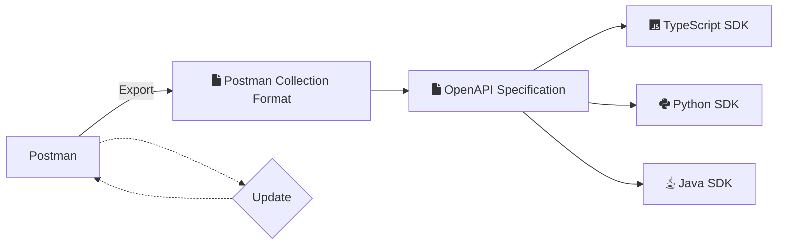

import { DotsButton } from "@site/blog/2023/07/assets/DotsButton"

# Getting Started with Postman Collections

Postman is a great way to document and save example requests for your API.
Konfig supports generating SDKs from Postman Collections through the [Postman
Collection
Format](https://learning.postman.com/collection-format/getting-started/overview/#:~:text=The%20Collection%20Format%20is%20open,environments%20without%20any%20information%20loss.).
In this tutorial, we will walk through the steps for you to generate a
TypeScript, Java, and Python SDK from a Postman Collection.

## Workflow

To generate SDKs with Konfig from a Postman Collection, we first export your
Postman Collection and convert it to an OpenAPI Specification. Then we will use
[`konfig fix`](https://www.npmjs.com/package/konfig-cli#konfig-fix) to to create
a high-quality <Tooltip tip="OpenAPI Specification" text="OAS"/>. Finally, we
will initialize our repo using [`konfig
init`](https://www.npmjs.com/package/konfig-cli#konfig-init) and generate SDKs
using [`konfig
generate`](https://www.npmjs.com/package/konfig-cli#konfig-generate). Repeat the
workflow from start to finish to update your SDKs.

<Figure caption="Workflow for generating SDKs from Postman Collections with Konfig">

</Figure>


## Install CLI

To install Konfig's CLI run the following command:

<CH.Code>
```shell npm
npm install -g konfig-cli
```
```shell yarn
yarn global add konfig-cli
```
</CH.Code>

<Admonition type="info" title="System Requirement">
  Konfig's CLI requires [Node 14+](https://nodejs.org/en/blog/release/v14.17.3)
  to be setup on your machine.
</Admonition>

## Create a directory for SDKs

```bash shell
mkdir postman-sdks
cd postman-sdks
```

## Save Example Responses

Every operation in your Collection should have more example responses saved
before exporting for better SDKs.

### Send Request

Click `Send` to retrieve an example response. You can repeat these steps for
different inputs to save multiple example responses.


### Click "Save as example"

Save the retrieved response as an example in your collection.


### Example should be shown in the menu

You should see a list of examples saved in the left-side menu.


## Export Postman Collection

Click the <DotsButton/> button on your Postman Collection and click "export":


Choose `Collection v2.1` and click `Export`.


## Initialize SDK directory

### Move the exported Postman Collection to the SDK directory

```shell
cp ~/Downloads/Requests.postman_collection.json ~/postman-sdks
```

### Initialize the SDK repo with [`konfig.yaml`](/docs/konfig-yaml)


