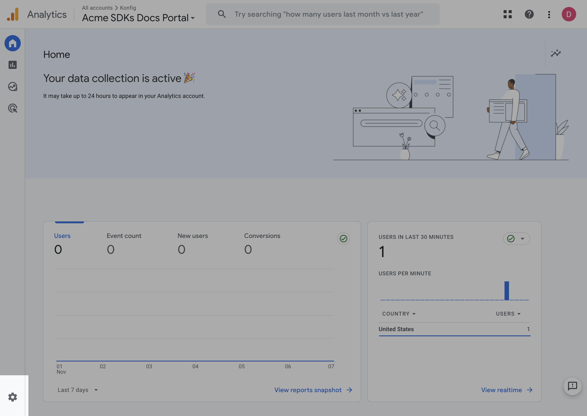
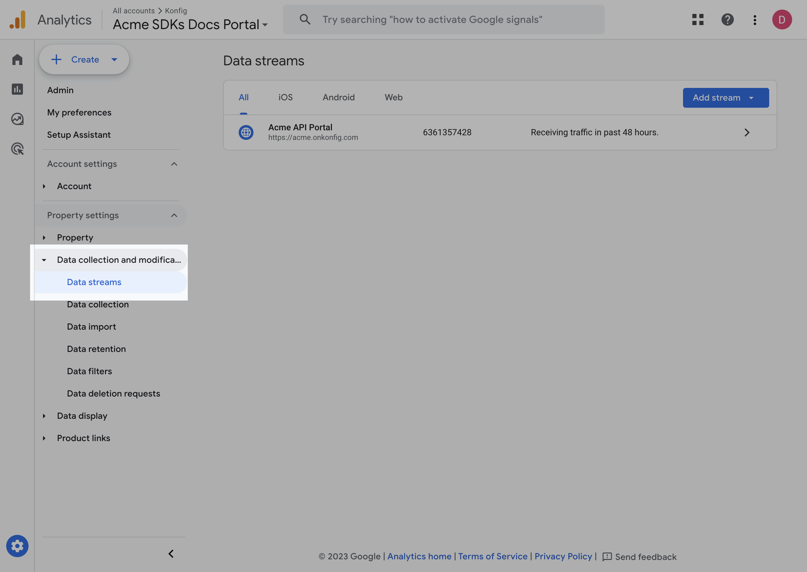
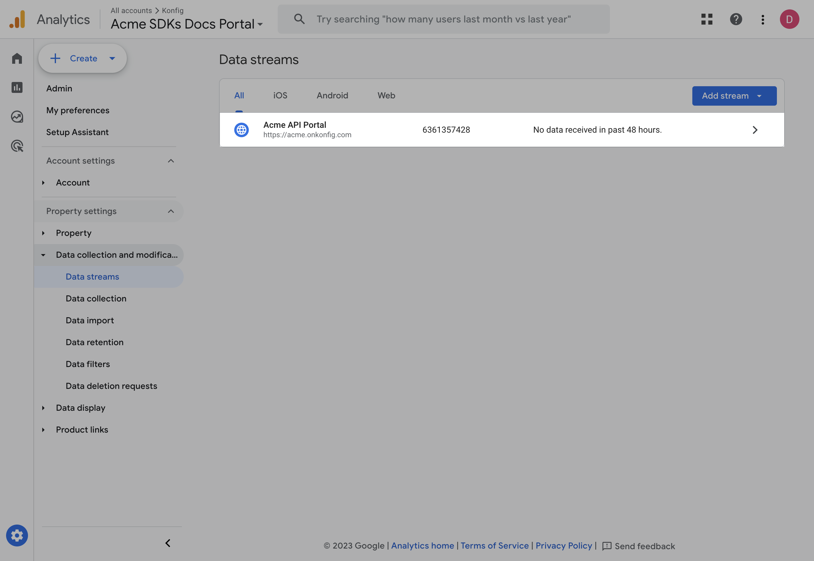
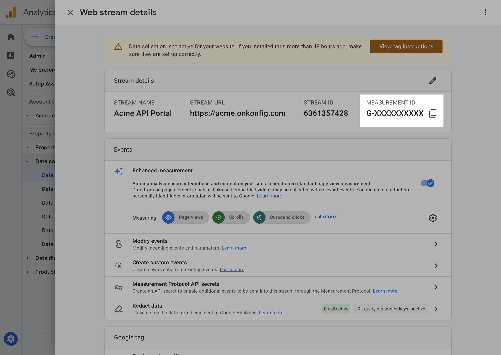

# Configuring Google Analytics

To configure Google Analytics, simply add the `googleAnalyticsId` property to your portal configuration.

<CH.Code rows={20}>
```yaml konfig.yaml focus=16,22
outputDirectory: /tmp/acme-sdks-out
specInputPath: api.yaml
specPath: api-fixed.yaml
portal:
  title: Acme
  primaryColor: "#1f334e"
  logo:
    light: portal-logo-light.png
    dark: portal-logo-dark.png
  googleAnalyticsId: G-XXXXXXXXXX
  documentation:
    sidebar:
      sections:
        - label: Guides
          links:
            - id: getting-started
              path: docs/getting-started.md
            - id: client-side-direct-api-usage
              path: docs/client-side-direct-api-usage.md
  demos:
    - id: getting-started
      path: demos/getting-started.md
generators:
  python:
    version: 1.0.0
    packageName: acme_client
    projectName: acme-python-sdk
    outputDirectory: python
    clientName: Acme
    git:
      userId: konfig-dev
      repoId: acme-sdks/tree/main/python
```
</CH.Code>

## How to get your Google Analytics ID

1. Navigate your [Google Analytics dashboard](https://analytics.google.com/analytics) and login.
1. Click on the gear icon in the bottom left.




2. Click on the `Data Streams` tab.



3. Click on your data stream.



4. Copy the `Measurement ID` value.

