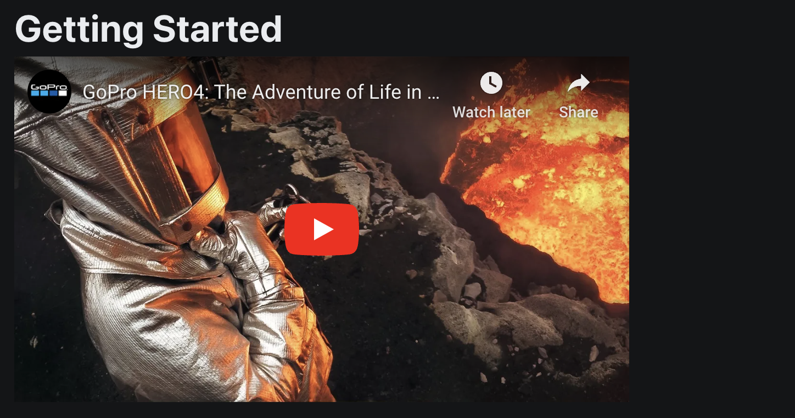

# Creating Markdown Pages

This is a collection of tutorials for creating markdown pages in Konfig.

## Creating a Page

To add a page, simply create a new markdown file in your repository. For
example, `docs/new-page.md`.


<CH.Scrollycoding>

Then edit your `konfig.yaml` file's `documentation.sidebar.sections` to include
the new page.

```yaml konfig.yaml
portal:
  title: Acme
  primaryColor: '#9fc1be'
  socials:
    website: https://acme.com
  documentation:
    sidebar:
      sections:
        - label: Guides
          links:
            - id: existing-page
              path: docs/existing-page.md
```

---

Add to the list of pages under your desired section.

```yaml konfig.yaml focus=13:14
portal:
  title: Acme
  primaryColor: '#9fc1be'
  socials:
    website: https://acme.com
  documentation:
    sidebar:
      sections:
        - label: Guides
          links:
            - id: existing-page
              path: docs/existing-page.md
            - id: new-page
              path: docs/new-page.md
```

---

The `id` property is used to uniquely identify the page. It is also used to
determine the URL of the page. For example, if the `id` is `new-page` then the
URL will have a subpath of `/new-page`. This is important so that the URL of the
page is stable and does not change if the path of the markdown file changes.

```yaml konfig.yaml focus=13
```

---

The `path` property is the path to the markdown file relative to the repository
root (e.g. where `konfig.yaml` lives).

```yaml konfig.yaml focus=14
```


</CH.Scrollycoding>

Commit both `new-page.md` and the updated `konfig.yaml` to your repository and
the documentation portal will automatically update.

<Admonition title="Configuring the link label" type="note">

The label of the link in the sidebar will be taken directly from the first
heading in the markdown file. For example, if the first heading is `# New Page`
then the label will be `New Page`. This ensures the link labels match the
heading of the page.

<Figure caption="Example matching link and page title">

</Figure>

</Admonition>

## Creating a Section


<CH.Scrollycoding>

To add a section, simply add a new section to your `konfig.yaml` file's
`documentation.sidebar.sections` list.

```yaml konfig.yaml
portal:
  title: Acme
  primaryColor: '#9fc1be'
  socials:
    website: https://acme.com
  documentation:
    sidebar:
      sections:
        - label: Guides
          links:
            - id: existing-page
              path: docs/existing-page.md
```

---

Here is an example adding a "New Section" to the sidebar.

```yaml konfig.yaml focus=13:16
portal:
  title: Acme
  primaryColor: '#9fc1be'
  socials:
    website: https://acme.com
  documentation:
    sidebar:
      sections:
        - label: Guides
          links:
            - id: existing-page
              path: docs/existing-page.md
        - label: New Section
          links:
            - id: new-page
              path: docs/new-page.md
```

---

The `label` is used as the section title in the sidebar.

```yaml konfig.yaml focus=13
```

---

The `links` property is a list of links to pages in the section.

```yaml konfig.yaml focus=14
```

---

The `id` is used to uniquely identify the page. It is also used to determine the
URL of the page. For example, if the `id` is `new-page` then the URL will have a
subpath of `/new-page`. This is important so that the URL of the page is stable
and does not change if the path of the markdown file changes.

```yaml konfig.yaml focus=15
```

---

The `path` property is the path to the markdown file relative to the repository
root (e.g. where `konfig.yaml` lives).

```yaml konfig.yaml focus=16
```

</CH.Scrollycoding>

## Writing Markdown

Konfig supports writing documentation in markdown. All the standard markdown
features are supported. For more information on markdown, see [this
guide](https://www.markdownguide.org/basic-syntax/).

## Adding Videos

You can embed iframes in your markdown to embed videos.

For example, to embed a YouTube video simply copy the embed code from YouTube like so:

```markdown doc.md
# Getting Started

<iframe width="560" height="315" src="https://www.youtube.com/embed/wTcNtgA6gHs?si=AL2bgKaSF9nxIuPm" title="YouTube video player" frameborder="0" allow="accelerometer; autoplay; clipboard-write; encrypted-media; gyroscope; picture-in-picture; web-share" allowfullscreen></iframe>
```

Your documentation will then have the video embedded in it.

<Figure caption="Screenshot of embedded YouTube video">

</Figure>

## Adding Images

To add images, simply add them to your repository and reference them in your markdown.

For example if `doc.md` lives in the same directory as `image.png` you can
reference it with a **relative path** like so:

```markdown doc.md

```

If you wanted to refer to images in a subfolder, you could do so like this:

```markdown doc.md

```

If you wanted to refer to images in a parent folder, you could do so like this:

```markdown doc.md

```

<Admonition type="warning">

Image paths are not relative to the repository root or `konfig.yaml` file. They are
relative to the markdown file they are referenced in.

</Admonition>

## Markdown Extensions

Konfig supports a few extensions to markdown to make it easier to write better documentation.

### API Endpoint Links

Konfig easily allows you to link to API endpoints.

<Figure caption="API Endpoint Link Example">

</Figure>

#### Syntax

To do this, use the `:api[OPERATION_ID]` directive. For example if I have an
operation with an `operationId` of `Authentication_login` I can reference it
like so:

```markdown doc.md
:api[Authentication_login]
```

### Callouts

Konfig supports callouts for grabbing the reader's attention.

<Figure caption="Callout Examples">

</Figure>

#### Syntax

To use them, simply use the `callout` directive for the respective callout.

```markdown doc.md

:::info{title="Optional Title"}
This is an informational callout
:::

:::info
Without a title
:::

:::note{title="With a title"}
This is an noteworthy callout
:::

:::note
Without a title
:::

:::warn{title="With a title"}
This is an warning callout
:::

:::warn
Without a title
:::

```

### Code Tabs

Konfig supports code tabs for neatly displaying code snippets in multiple languages.

<Figure caption="Code Tabs Example">

</Figure>

#### Syntax

To use them, simply use the `code` directive and add snippets in adjacent code blocks.

````markdown doc.md
:::code

```python
print("Hello, World!")
```

```typescript
console.log("Hello, World!");
```

:::
````

#### Gotchas

<Admonition type="warning" title="Do not use ::: in replacement of ```">

The following is incorrect ❌:

````markdown doc.md
:::python
print("Hello, World!")
:::
````

Instead use the following ✅:

````markdown doc.md
```python
```
````

</Admonition>


<Admonition type="warning" title="Do not use if you only have one code block">
Do not use `:::code` if you only have one code block. Using a single code block like so is correct:

````markdown doc.md
```python
print("Hello, World!")
```
````

While using `:::code` with a single code block is incorrect:

````markdown doc.md
:::code

```python
print("Hello, World!")
```
:::
````

</Admonition>

