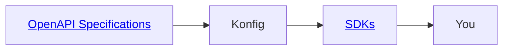

**Introducing Konfig SDKs**, a one-of-a-kind service for developers that want to
write and maintain less API integration code. We do this by providing consistent
and well-documented SDKs for your API integrations, reducing code in your
codebase and ensuring it stays up-to-date.

## Why?

External API integrations are a pain to develop. Writing and maintaining your
own SDKs is a time-consuming and boring task. To make matters worse, API
documentation widely varies in quality and consistency. We make sure that you
don't have to deal with this.

## How does it work?

1. Konfig maintains an [open and MIT licensed repository](https://github.com/konfig-sdks/openapi-examples) of OpenAPI specifications for public APIs.
2. We generate <a href="/sdk/category/all" target="_blank">SDKs</a> for every API in TypeScript, Python, Java, C#, PHP, Ruby, Go, Swift, and Dart
3. We distribute access to these SDKs for a monthly subscription
4. We notify you when an API you are using is updated

<Figure caption="Click the above links to checkout the OpenAPI Specifications we use and the SDKs we offer">

</Figure>

## Pricing

We charge based on the number of SDKs you use.

| 0-5 SDKs | 5-15 SDKs | Unlimited SDKs |
| --- | --- | --- |
| $10/mo | $20/mo | $50/mo |

:::info[Limited offer!]

☝ The first 100 signups will receive Unlimited SDKs for a year at our cheapest plan of $20/mo

:::

## Interested?

Checkout the growing list of [SDKs](/sdk/category/all) we offer and email us for access at founders@konfigthis.com

