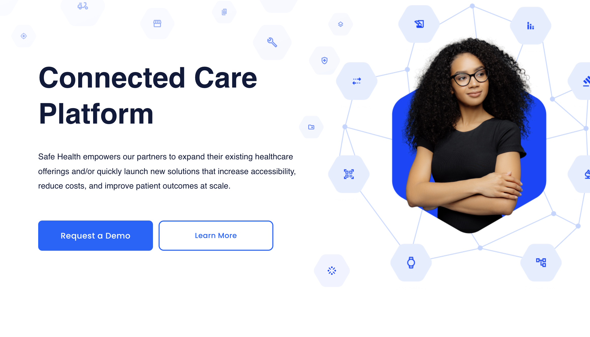

<div align="left">

[](https://www.safehealthsystems.com)

# [Safe Health](https://www.safehealthsystems.com)<a id="safe-health"></a>

Send push notifications to a user's device

[Health Check UI](http://localhost:8012/healthchecks-ui)

[](https://cocoapods.org/pods/SafehealthPush)

</div>

## Table of Contents<a id="table-of-contents"></a>

<!-- toc -->

- [Installation](#installation)
  * [Swift Package Manager](#swift-package-manager)
  * [Carthage](#carthage)
  * [CocoaPods](#cocoapods)
- [Getting Started](#getting-started)
- [Reference](#reference)
  * [`safehealthpush.device.delete`](#safehealthpushdevicedelete)
  * [`safehealthpush.device.list`](#safehealthpushdevicelist)
  * [`safehealthpush.device.store`](#safehealthpushdevicestore)
  * [`safehealthpush.userDevice.create`](#safehealthpushuserdevicecreate)
  * [`safehealthpush.userDevice.delete`](#safehealthpushuserdevicedelete)

<!-- tocstop -->

## Installation<a id="installation"></a>


### Swift Package Manager<a id="swift-package-manager"></a>

1. In Xcode, select *File > Add Packages…* and enter `https://github.com/konfig-dev/safehealth-push-swift-sdk` as the repository URL.
1. Select the latest version number from our [tags page](https://github.com/konfig-dev/safehealth-push-swift-sdk/tags).
1. Add the *SafehealthPush* product to the [target of your app](https://developer.apple.com/documentation/swift_packages/adding_package_dependencies_to_your_app).

### Carthage<a id="carthage"></a>

1. Add this line to your `Cartfile`:
```shell
github "konfig-dev/safehealth-push-swift-sdk"
```
2. Follow the [Carthage installation instructions](https://github.com/Carthage/Carthage#if-youre-building-for-ios-tvos-or-watchos).
3. In the future, to update to the latest version of the SDK, run the following command: `carthage update safehealth-push-swift-sdk`

### CocoaPods<a id="cocoapods"></a>

1. Add `source 'https://github.com/CocoaPods/Specs.git'` to your `Podfile`
2. Add `pod 'SafehealthPush', '~> 0.1.5'` to your `Podfile`

Your `Podfile` should look like:
```ruby
# Podfile
source 'https://github.com/CocoaPods/Specs.git'

target 'Example' do
  pod 'SafehealthPush', '~> 0.1.5'
end
```
3. Run `pod install`

```shell
❯ pod install
Analyzing dependencies
Downloading dependencies
Installing SafehealthPush 0.1.5
Generating Pods project
Integrating client project
Pod installation complete! There is 1 dependency from the Podfile and 2 total pods installed.
```

4. In the future, to update to the latest version of the SDK, run: `pod update SafehealthPush`

## Getting Started<a id="getting-started"></a>

```swift
import SafehealthPush

let safehealthpush = SafehealthPushClient(
    identityAccessToken: "AUTHORIZATION",
    safeAccount: "X_SF_ACCOUNT",
    safeTenant: "X_SF_TENANT"
    // Defining the base path is optional and defaults to https://api.dev-1.sf.safecdx.io/v1beta/notification-push
    // basePath: "https://api.dev-1.sf.safecdx.io/v1beta/notification-push"
)

let userId = UUID().uuidString
let deviceId = UUID().uuidString
let deleteResponse = try await safehealthpush.device.delete(
    userId: userId,
    deviceId: deviceId
)
```

## Reference<a id="reference"></a>


### `safehealthpush.device.delete`<a id="safehealthpushdevicedelete"></a>

Deletes the identified device from the specified user's devices.

#### 🛠️ Usage<a id="🛠️-usage"></a>

```swift
let userId = UUID().uuidString
let deviceId = UUID().uuidString
let deleteResponse = try await safehealthpush.device.delete(
    userId: userId,
    deviceId: deviceId
)
```

#### ⚙️ Parameters<a id="⚙️-parameters"></a>

##### userId: `String`<a id="userid-string"></a>

Identifies the user to whom the device is associated.


##### deviceId: `String`<a id="deviceid-string"></a>

Identifies the device to be deleted.


#### 🌐 Endpoint<a id="🌐-endpoint"></a>

`/users/{userId}/devices/{deviceId}` `DELETE`

[🔙 **Back to Table of Contents**](#table-of-contents)

---


### `safehealthpush.device.list`<a id="safehealthpushdevicelist"></a>

Retrieves a pageable list of devices associated with the specified user.

#### 🛠️ Usage<a id="🛠️-usage"></a>

```swift
let userId = UUID().uuidString
let page = 987
let limit = 987
let listResponse = try await safehealthpush.device.list(
    userId: userId,
    page: page,
    limit: limit
)
```

#### ⚙️ Parameters<a id="⚙️-parameters"></a>

##### userId: `String`<a id="userid-string"></a>

Identifies the user for whom to retrieve devices.


##### page: `Int`<a id="page-int"></a>


##### limit: `Int`<a id="limit-int"></a>


#### 🔄 Return<a id="🔄-return"></a>

[DeviceListResponse](./SafehealthPush/Models/DeviceListResponse.swift)

#### 🌐 Endpoint<a id="🌐-endpoint"></a>

`/users/{userId}/devices` `GET`

[🔙 **Back to Table of Contents**](#table-of-contents)

---


### `safehealthpush.device.store`<a id="safehealthpushdevicestore"></a>

Stores a new device associated with the specified user. If a device with any matching token(s) already exists for that user, it will be removed.

#### 🛠️ Usage<a id="🛠️-usage"></a>

```swift
let userId = UUID().uuidString
let device = Device(
    id: "id_example",
    createdAt: Date(),
    updatedAt: Date(),
    platform: Platform.unknown,
    web: Web(
        operatingSystem: OperatingSystem.unknown,
        browserName: BrowserName.unknown,
        hostname: "hostname_example",
        defaults: WebPushDefaults(
            channels: WebChannels(
                firebaseCloudMessaging: WebFirebaseCloudMessaging(
                    projectId: "projectId_example",
                    appId: "appId_example",
                    token: "token_example"
                )
            )
        )
    ),
    mobile: Mobile(
        os: MobileOperatingSystem.appleIos,
        ios: AppleIos(
            bundleId: "bundleId_example",
            teamId: "teamId_example",
            signingCertificateType: SigningCertificate.development,
            channels: AppleIosChannels(
                simpleNotificationService: AppleSimpleNotificationService(
                    apnsVoip: ApplePushNotificationServiceVoIp(
                        applicationArn: "applicationArn_example",
                        token: "token_example"
                    )
                ),
                firebaseCloudMessaging: AppleFirebaseCloudMessaging(
                    projectId: "projectId_example",
                    applicationId: "applicationId_example",
                    token: "token_example"
                )
            )
        ),
        android: Android(
            channels: AndroidChannels(
                firebaseCloudMessaging: AndroidFirebaseCloudMessaging(
                    projectId: "projectId_example",
                    applicationId: "applicationId_example",
                    token: "token_example"
                )
            )
        )
    )
)
let storeResponse = try await safehealthpush.device.store(
    userId: userId,
    device: device
)
```

#### ⚙️ Parameters<a id="⚙️-parameters"></a>

##### userId: `String`<a id="userid-string"></a>

Identifies the user to whom this device will be associated.


##### device: [`Device`](./SafehealthPush/Models/Device.swift)<a id="device-devicesafehealthpushmodelsdeviceswift"></a>


#### 🔄 Return<a id="🔄-return"></a>

[DeviceCreateResponse](./SafehealthPush/Models/DeviceCreateResponse.swift)

#### 🌐 Endpoint<a id="🌐-endpoint"></a>

`/users/{userId}/devices` `POST`

[🔙 **Back to Table of Contents**](#table-of-contents)

---


### `safehealthpush.userDevice.create`<a id="safehealthpushuserdevicecreate"></a>

Creates a UserDevice entity.

#### 🛠️ Usage<a id="🛠️-usage"></a>

```swift
let id = "id_example"
let createdAt = Date()
let updatedAt = Date()
let deviceId = "deviceId_example"
let appVersion = "appVersion_example"
let deviceModel = "deviceModel_example"
let deviceToken = "deviceToken_example"
let deviceType = "deviceType_example"
let idfaId = "idfaId_example"
let isLoggedIn = true
let osVersion = "osVersion_example"
let voipToken = "voipToken_example"
let userId = "userId_example"
let tenantId = "tenantId_example"
let userUUID = "userUUID_example"
let nationalHealthId = "nationalHealthId_example"
let language = "language_example"
let createResponse = try await safehealthpush.userDevice.create(
    id: id,
    createdAt: createdAt,
    updatedAt: updatedAt,
    deviceId: deviceId,
    appVersion: appVersion,
    deviceModel: deviceModel,
    deviceToken: deviceToken,
    deviceType: deviceType,
    idfaId: idfaId,
    isLoggedIn: isLoggedIn,
    osVersion: osVersion,
    voipToken: voipToken,
    userId: userId,
    tenantId: tenantId,
    userUUID: userUUID,
    nationalHealthId: nationalHealthId,
    language: language
)
```

#### ⚙️ Parameters<a id="⚙️-parameters"></a>

##### id: `String`<a id="id-string"></a>


##### createdAt: `Date`<a id="createdat-date"></a>


##### updatedAt: `Date`<a id="updatedat-date"></a>


##### deviceId: `String`<a id="deviceid-string"></a>


##### appVersion: `String`<a id="appversion-string"></a>


##### deviceModel: `String`<a id="devicemodel-string"></a>


##### deviceToken: `String`<a id="devicetoken-string"></a>


##### deviceType: `String`<a id="devicetype-string"></a>


##### idfaId: `String`<a id="idfaid-string"></a>


##### isLoggedIn: `Bool`<a id="isloggedin-bool"></a>


##### osVersion: `String`<a id="osversion-string"></a>


##### voipToken: `String`<a id="voiptoken-string"></a>


##### userId: `String`<a id="userid-string"></a>


##### tenantId: `String`<a id="tenantid-string"></a>


##### userUUID: `String`<a id="useruuid-string"></a>


##### nationalHealthId: `String`<a id="nationalhealthid-string"></a>


##### language: `String`<a id="language-string"></a>


#### 🔄 Return<a id="🔄-return"></a>

[UserDevice](./SafehealthPush/Models/UserDevice.swift)

#### 🌐 Endpoint<a id="🌐-endpoint"></a>

`/device` `POST`

[🔙 **Back to Table of Contents**](#table-of-contents)

---


### `safehealthpush.userDevice.delete`<a id="safehealthpushuserdevicedelete"></a>

Deletes UserDevice entity by device token.

#### 🛠️ Usage<a id="🛠️-usage"></a>

```swift
let deviceToken = "deviceToken_example"
let deleteResponse = try await safehealthpush.userDevice.delete(
    deviceToken: deviceToken
)
```

#### ⚙️ Parameters<a id="⚙️-parameters"></a>

##### deviceToken: `String`<a id="devicetoken-string"></a>

Identifying token passed when creating UserDevice.


#### 🔄 Return<a id="🔄-return"></a>

[UserDevice](./SafehealthPush/Models/UserDevice.swift)

#### 🌐 Endpoint<a id="🌐-endpoint"></a>

`/device` `DELETE`

[🔙 **Back to Table of Contents**](#table-of-contents)

---


## Author<a id="author"></a>
This TypeScript package is automatically generated by [Konfig](https://konfigthis.com)
