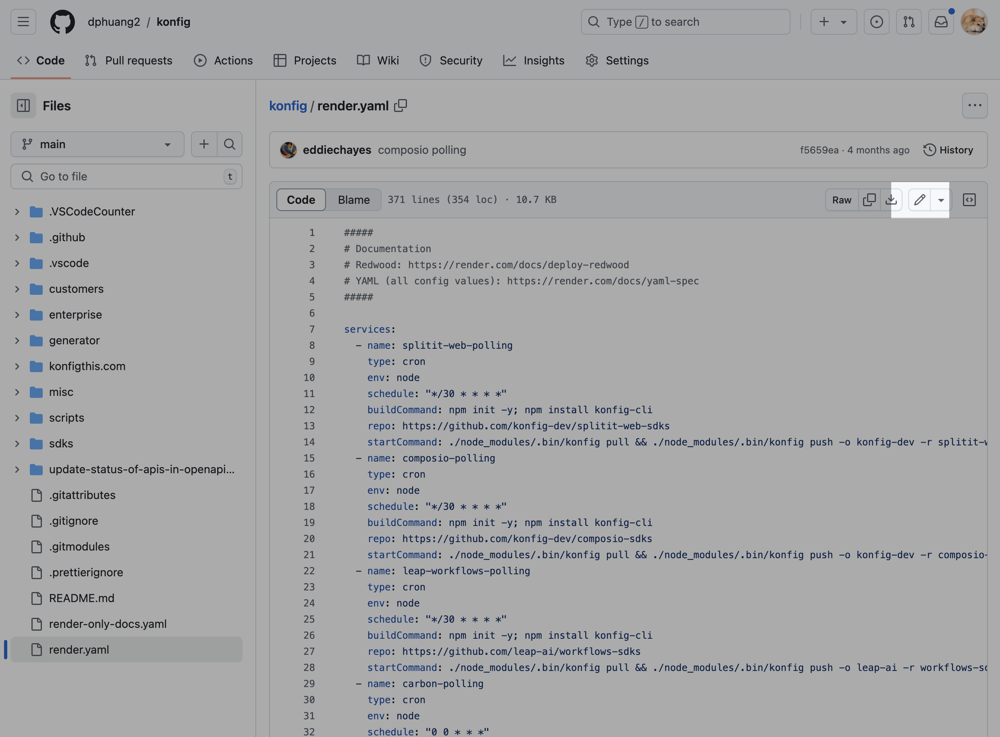
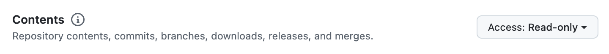
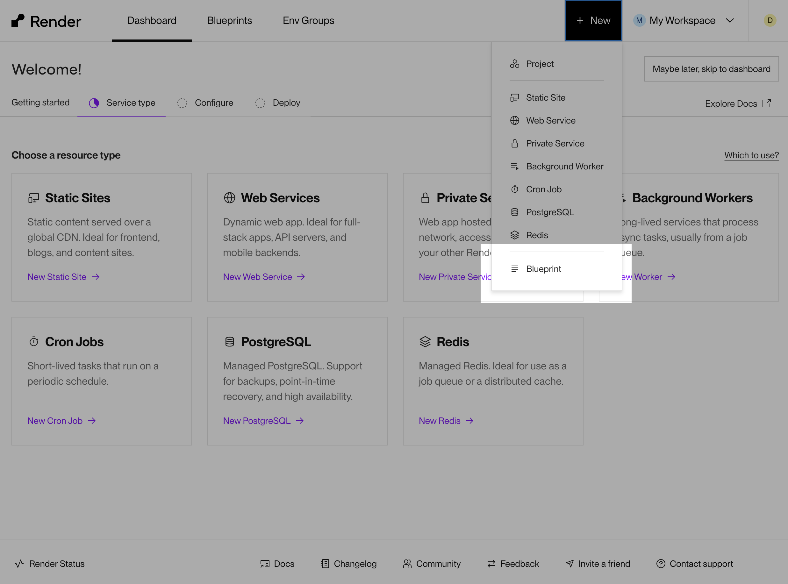
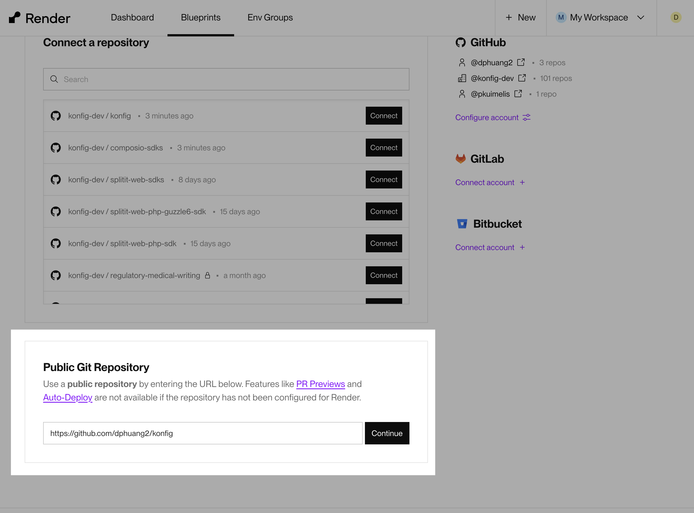
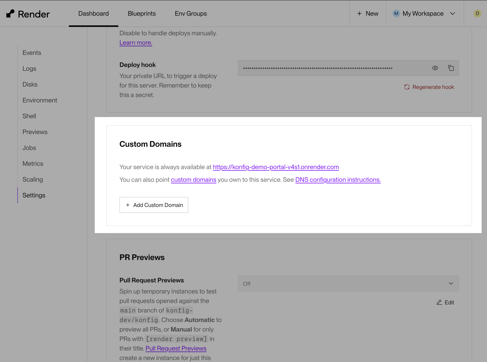
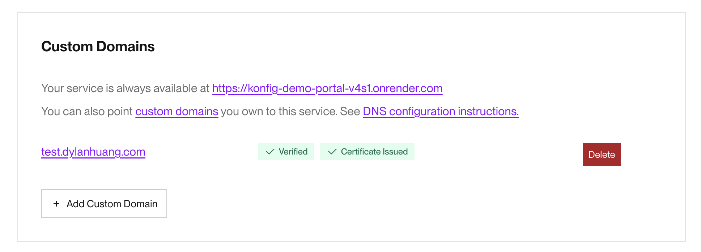
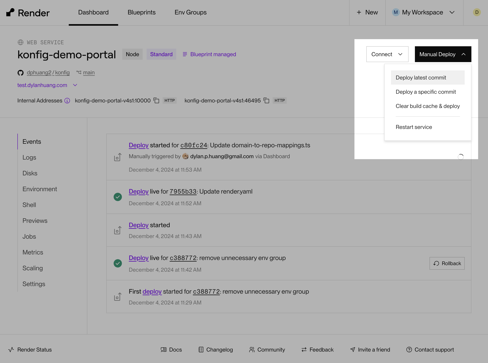

# How To Deploy Konfig's Docs Product On render.com

1. Create an account at https://render.com
1. Fork Konfig: https://github.com/konfig-dev/konfig
1. Replace root `render.yaml` file with `render-only-docs.yaml` at the root of the repo. Render uses repos to deploy services and only picks up `render.yaml` at the root of the repo. You can use the GitHub UI to make this change by copying the content from [`render-only-docs.yaml`](https://github.com/dphuang2/konfig/blob/main/render-only-docs.yaml) and using the edit button to change the root `render.yaml` file. Cloning the entire repo might take a long time. For context, here is some documentation on `render.yaml` if you are curious: https://render.com/docs/infrastructure-as-code.
   
1. Find and replace `[REPLACE_ME]` in the copy-pasted `render.yaml` with the GitHub organization you forked the repo to.
1. Register a GitHub App (https://docs.github.com/en/apps/creating-github-apps/registering-a-github-app/registering-a-github-app#registering-a-github-app). Fill in whatever values for homepage, webhook URL, and others. But ensure that it has Repo read access. We just want this app to be installed so we can use the GitHub API to query content from the repo.
   
1. Install the GitHub app to your organization/account and give it access to the repo where you are going to host your docs (e.g. [org]/[org-docs] or whatever its called). If the repo is public, I think it only needs access to the organization, but not too sure about this.
1. Generate a private key from the GitHub app (https://docs.github.com/en/apps/creating-github-apps/authenticating-with-a-github-app/managing-private-keys-for-github-apps)
1. Get an OpenAI API Key (https://platform.openai.com/docs/quickstart). OpenAI is used to automatically generate meta descriptions for every page in the documentation. So when you send a link to your docs, it includes a helpful description of the content in the page.
1. Create a Cloudflare account and generate a Cloudflare API Token (https://developers.cloudflare.com/fundamentals/api/get-started/create-token/). Choose the template for `Read and write to Cloudflare Stream and Images`. Cloudflare is used to serve images from the docs.
1. Sync a blueprint (render.yaml) to render.com. Click "New" and "Blueprint"
   
1. Select a Git Repository. In this case its a public GitHub repository so I can just provide a public link. Otherwise you might have to give specific permission to render.
   
1. Enter `konfig` as name of blueprint.
1. You'll be asked to provide environment variables for OpenAI, Cloudflare Images, and a GitHub App when creating the blueprint. Take the values from previous steps and copy-paste them here.
1. Then in render.com, you also have to ensure that the `konfig-demo-portal` service has your domain added. Go to `konfig-demo-portal` service and go to `Settings` and add a custom domain. They have documentation referenced in that section to check as well. You will need to make any relevant changes in your DNS provider for this to work.
   
   Once its complete, you should see the domain show as `Verified` and `Certificate Issued`.
   
1. You need to ensure that the codebase includes a mapping of your domain to the github repo. Go to [generator/konfig-next-app/src/utils/domain-to-repo-mappings.ts](../src/utils/domain-to-repo-mappings.ts) and add your domain as a key and owner/repo as the value. Look at existing entries for examples.
1. The GitHub App ID also needs to be updated to the ID of the GitHub App you created earlier. Go to [octokit.ts](../src/utils/octokit.ts) and edit `APP_ID` at the top of the file with your app's ID. Again, you can use the GitHub edit UI to do this.
1. Deploy `konfig-demo-portal` off latest commit. If you want, you can also enable auto-deploys if you don't want to manually click deploy anymore: https://render.com/docs/deploys#automatic-git-deploys.
   
1. Once your services are deployed correctly, which can take 30 minutes or more because its building the entire Konfig monorepo, you should be able to go to your custom domain and the docs should show.
